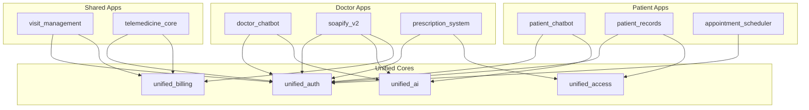

# 🌳 نمودار درختی کامل سیستم ایجنت‌های هلسا

## 📊 ساختار کلی پروژه

```bash
unified_agent/
├── 📁 docs/                          # مستندات کامل سیستم
│   ├── 01-system-overview.md         # نمای کلی سیستم
│   ├── 02-centralized-architecture.md # معماری متمرکز
│   ├── 03-project-tree.md            # نمودار درختی
│   ├── 04-technology-stack.md        # پشته تکنولوژی
│   ├── 05-authentication.md          # احراز هویت
│   ├── 06-ai-systems.md              # سیستم‌های AI
│   ├── 07-billing-system.md          # سیستم مالی
│   ├── 08-visits-encounters.md       # ویزیت‌ها
│   ├── 09-doctor-access.md           # دسترسی پزشکان
│   ├── 10-chatbot-system.md          # سیستم چت‌بات
│   ├── 11-audio-processing.md        # پردازش صوت
│   ├── 12-output-generation.md       # تولید خروجی
│   ├── 13-infrastructure.md          # زیرساخت
│   ├── 14-api-reference.md           # مرجع API
│   ├── 15-security-compliance.md     # امنیت و انطباق
│   ├── 16-deployment-guide.md        # راهنمای استقرار
│   ├── 17-quick-start.md             # شروع سریع
│   └── 18-examples.md                # نمونه‌ها
│
├── 📁 instructions/                  # دستورالعمل‌های ایجنت‌ها
│   ├── AGENT_INSTRUCTIONS.md         # دستورالعمل اصلی ایجنت‌ها
│   ├── QA_AGENT_INSTRUCTIONS.md      # دستورالعمل QA
│   ├── CORE_ARCHITECTURE.md          # معماری چهار هسته‌ای
│   ├── SECURITY_POLICIES.md          # سیاست‌های امنیتی
│   └── ARCHITECTURE_CONVENTIONS.md   # قراردادهای معماری
│
├── 📁 templates/                     # قالب‌های استاندارد
│   ├── PLAN.md.template              # قالب برنامه‌ریزی
│   ├── CHECKLIST.json.template       # قالب چک‌لیست
│   ├── PROGRESS.json.template        # قالب گزارش پیشرفت
│   ├── LOG.md.template               # قالب لاگ تصمیمات
│   └── README.md.template            # قالب مستندات اپ
│
├── 📁 app_standards/                 # استانداردهای اپلیکیشن‌ها
│   ├── four_cores/                   # الگوهای چهار هسته
│   │   ├── api_ingress.py            # الگوی هسته API
│   │   ├── text_processor.py         # الگوی پردازش متن
│   │   ├── speech_processor.py       # الگوی پردازش صوت
│   │   └── orchestrator.py           # الگوی هماهنگ‌کننده
│   ├── models/                       # الگوهای مدل
│   │   ├── base_models.py            # مدل‌های پایه
│   │   └── unified_models.py         # مدل‌های یکپارچه
│   ├── views/                        # الگوهای view
│   │   ├── api_views.py              # الگوی API views
│   │   └── permissions.py            # الگوی permissions
│   ├── serializers/                  # الگوهای serializer
│   │   └── base_serializers.py       # serializer پایه
│   └── tests/                        # الگوهای تست
│       ├── test_models.py            # تست مدل‌ها
│       ├── test_views.py             # تست views
│       └── test_integration.py       # تست یکپارچگی
│
├── 📁 apps/                          # اپلیکیشن‌های سیستم
│   ├── 📱 patient_chatbot/           # چت‌بات بیمار
│   ├── 👨‍⚕️ doctor_chatbot/            # چت‌بات پزشک
│   ├── 📝 soapify_v2/                # تولید گزارش SOAP
│   ├── 🏥 visit_management/          # مدیریت ویزیت
│   ├── 💊 prescription_system/       # سیستم نسخه‌نویسی
│   ├── 📹 telemedicine_core/         # طب از راه دور
│   ├── 📋 patient_apps/              # پرونده بیمار
│   ├── 📅 visit_extensions/          # زمان‌بندی قرارها
│   └── 📋 doctor_apps/               # پزشک
│                
│
├── 📁 unified_cores/                 # هسته‌های یکپارچه
│   ├── unified_auth/                 # احراز هویت یکپارچه
│   ├── unified_billing/              # سیستم مالی یکپارچه
│   ├── unified_ai/                   # AI یکپارچه
│   └── unified_access/               # کنترل دسترسی یکپارچه
│
├── 📁 agent_tools/                   # ابزارهای ایجنت‌ها
│   ├── code_generator.py             # تولیدکننده کد
│   ├── structure_validator.py        # اعتبارسنج ساختار
│   ├── progress_tracker.py           # ردیاب پیشرفت
│   └── chart_generator.py            # تولیدکننده نمودار
│
├── 📁 sample_codes/                  # نمونه کدهای استاندارد
│   ├── view_examples.py              # نمونه views
│   ├── model_examples.py             # نمونه models
│   ├── serializer_examples.py        # نمونه serializers
│   ├── test_examples.py              # نمونه tests
│   └── integration_examples.py       # نمونه integrations
│
├── 📄 AGENT_PROMPT.md                # پرامپت اصلی ایجنت‌ها
├── 📄 PROJECT_TREE.md                # این فایل
├── 📄 FINAL_CHECKLIST.json           # چک‌لیست نهایی
├── 📄 README.md                      # مستندات اصلی
└── 📄 INDEX.md                       # فهرست کامل
```

## 🔍 جزئیات هر اپلیکیشن

### 1️⃣ patient_chatbot - چت‌بات بیمار

```bash
apps/patient_chatbot/
├── PLAN.md                           # برنامه اجرایی
├── CHECKLIST.json                    # چک‌لیست
├── PROGRESS.json                     # پیشرفت
├── LOG.md                            # لاگ تصمیمات
├── README.md                         # مستندات
├── charts/
│   └── progress_doughnut.svg         # نمودار پیشرفت
├── app_code/
│   ├── __init__.py
│   ├── apps.py                       # Django app config
│   ├── models.py                     # ChatSession, ChatMessage
│   ├── serializers.py                # Chat serializers
│   ├── views.py                      # Chat API endpoints
│   ├── urls.py                       # URL patterns
│   ├── permissions.py                # Patient permissions
│   ├── cores/                        # چهار هسته
│   │   ├── __init__.py
│   │   ├── api_ingress.py            # مدیریت API
│   │   ├── text_processor.py         # پردازش متن پزشکی
│   │   ├── speech_processor.py       # پردازش صوت (اختیاری)
│   │   └── orchestrator.py           # هماهنگی فرآیندها
│   ├── services/
│   │   ├── chat_service.py           # منطق چت
│   │   ├── medical_ai_service.py     # AI پزشکی
│   │   └── summary_service.py        # خلاصه‌سازی
│   ├── migrations/
│   └── tests/
│       ├── test_models.py
│       ├── test_views.py
│       ├── test_services.py
│       └── test_integration.py
├── deployment/
│   ├── settings_additions.py
│   ├── urls_additions.py
│   └── requirements_additions.txt
└── docs/
    ├── api_spec.yaml                 # OpenAPI spec
    ├── user_manual.md
    └── admin_guide.md
```

#### API Endpoints

```yaml
/api/patient_chatbot/:
  - POST   /chat/start/              # شروع گفتگو جدید
  - POST   /chat/{id}/message/       # ارسال پیام
  - GET    /chat/{id}/history/       # تاریخچه گفتگو
  - POST   /chat/{id}/end/           # پایان گفتگو
  - GET    /chat/list/               # لیست گفتگوها
  - POST   /chat/{id}/share/         # اشتراک با پزشک
  - GET    /chat/{id}/summary/       # خلاصه گفتگو
```

### 2️⃣ doctor_chatbot - چت‌بات پزشک

```bash
apps/doctor_chatbot/
├── (ساختار مشابه patient_chatbot)
└── app_code/
    ├── models.py                     # DoctorChat, MedicalKnowledge
    ├── services/
    │   ├── diagnosis_helper.py       # کمک تشخیص
    │   ├── medical_db_service.py     # پایگاه دانش پزشکی
    │   └── prescription_ai.py        # AI نسخه‌نویسی
    └── ...
```

#### API Endpoints2

```yaml
/api/doctor_chatbot/:
  - POST   /consult/start/           # شروع مشاوره
  - POST   /consult/{id}/query/      # پرسش پزشکی
  - GET    /consult/{id}/suggest/    # پیشنهادات تشخیصی
  - POST   /consult/{id}/prescribe/  # کمک نسخه‌نویسی
  - GET    /knowledge/search/         # جستجو در دانش پزشکی
```

### 3️⃣ soapify_v2 - تولید گزارش SOAP

```bash
apps/soapify_v2/
├── (ساختار استاندارد)
└── app_code/
    ├── models.py                     # Encounter, AudioChunk, SOAPReport
    ├── cores/
    │   └── (هر چهار هسته فعال)
    ├── services/
    │   ├── audio_processor.py        # پردازش فایل صوتی
    │   ├── stt_service.py            # تبدیل گفتار به متن
    │   ├── soap_generator.py         # تولید SOAP
    │   └── medical_nlp.py            # NLP پزشکی
    └── ...
```

#### API Endpoints3

```yaml
/api/soapify_v2/:
  - POST   /encounter/create/        # ایجاد ملاقات
  - POST   /encounter/{id}/audio/    # آپلود صوت
  - GET    /encounter/{id}/status/   # وضعیت پردازش
  - GET    /encounter/{id}/soap/     # دریافت گزارش SOAP
  - PUT    /encounter/{id}/edit/     # ویرایش گزارش
  - POST   /encounter/{id}/export/   # خروجی PDF/Word
```

### 4️⃣ visit_management - مدیریت ویزیت

```bash
/api/visit_management/:
  - POST   /visit/book/              # رزرو ویزیت
  - GET    /visit/available-times/   # زمان‌های خالی
  - PUT    /visit/{id}/reschedule/   # تغییر زمان
  - DELETE /visit/{id}/cancel/       # لغو ویزیت
  - POST   /visit/{id}/start/        # شروع ویزیت آنلاین
  - POST   /visit/{id}/end/          # پایان ویزیت
```

### 5️⃣ prescription_system - سیستم نسخه‌نویسی

```bash
/api/prescription_system/:
  - POST   /prescription/create/     # ایجاد نسخه
  - GET    /prescription/{id}/       # مشاهده نسخه
  - POST   /prescription/{id}/send/  # ارسال به داروخانه
  - GET    /drug/search/             # جستجوی دارو
  - POST   /drug/interaction-check/  # بررسی تداخل دارویی
```

### 6️⃣ telemedicine_core - طب از راه دور

```bash
/api/telemedicine_core/:
  - POST   /session/create/          # ایجاد جلسه ویدئویی
  - POST   /session/{id}/join/       # پیوستن به جلسه
  - POST   /session/{id}/end/        # پایان جلسه
  - GET    /session/{id}/recording/  # دریافت ضبط جلسه
```

### 7️⃣ patient_records - پرونده بیمار

```bash
/api/patient_records/:
  - GET    /record/                  # مشاهده پرونده
  - POST   /record/document/         # افزودن مدرک
  - GET    /record/history/          # تاریخچه پزشکی
  - POST   /record/share/            # اشتراک با پزشک
```

### 8️⃣ appointment_scheduler - زمان‌بندی قرارها

```bash
/api/appointment_scheduler/:
  - GET    /doctor/schedule/         # برنامه پزشک
  - POST   /appointment/book/        # رزرو نوبت
  - GET    /appointment/upcoming/    # نوبت‌های آینده
  - POST   /appointment/reminder/    # تنظیم یادآوری
```

## 🔧 هسته‌های یکپارچه (Unified Cores)

### unified_auth - احراز هویت یکپارچه

```bash
Features:
  - JWT Authentication (Access: 5min, Refresh: 7days)
  - OTP via Kavenegar SMS
  - Role-based access (patient, doctor, admin)
  - Session management
  - Two-factor authentication
```

### unified_billing - سیستم مالی یکپارچه

```bash
Features:
  - Wallet management
  - Payment gateways (BitPay, ZarinPal, Stripe)
  - Subscription handling
  - Transaction history
  - Invoice generation
```

### unified_ai - AI یکپارچه

```bash
Features:
  - OpenAI/GapGPT integration
  - Medical prompt templates
  - Rate limiting per user
  - Usage tracking
  - Model switching
```

### unified_access - کنترل دسترسی یکپارچه

```bash
Features:
  - RBAC (Role-Based Access Control)
  - Resource permissions
  - API throttling
  - Audit logging
  - IP whitelisting
```

## 🛠️ ابزارهای استاندارد ایجنت‌ها

### کد ژنراتور (code_generator.py)

- تولید خودکار ساختار اپ
- ایجاد فایل‌های پایه
- تولید کد بر اساس الگوها

### اعتبارسنج ساختار (structure_validator.py)

- بررسی رعایت معماری چهار هسته‌ای
- کنترل استانداردها
- گزارش انحرافات

### ردیاب پیشرفت (progress_tracker.py)

- محاسبه درصد پیشرفت
- تولید گزارش‌های JSON
- به‌روزرسانی خودکار

### تولیدکننده نمودار (chart_generator.py)

- نمودارهای دونات پیشرفت
- نمودارهای Gantt
- گزارش‌های تصویری

## 📊 نمودار ارتباط اپلیکیشن‌ها



## 🚀 نحوه استفاده برای ایجنت‌ها

1. **مطالعه مستندات**: ابتدا `docs/` و `instructions/` را بخوانید
2. **انتخاب اپ**: یکی از اپ‌های `apps/` را انتخاب کنید
3. **کپی قالب‌ها**: از `templates/` استفاده کنید
4. **پیروی از الگوها**: کدهای `app_standards/` را دنبال کنید
5. **استفاده از نمونه‌ها**: به `sample_codes/` مراجعه کنید
6. **اجرای چک‌لیست**: `FINAL_CHECKLIST.json` را کامل کنید

---

تولید شده توسط سیستم مدیریت ایجنت‌های هلسا
