# 🎯 نمای کلی سیستم HELSSA

## 📋 فهرست مطالب

- [معرفی پلتفرم](## 🏥 معرفی پلتفرم)
- [تاریخچه و تکامل](## 📈 تاریخچه و تکامل)
- [چشم انداز و ماموریت](## 🌟 چشم انداز و ماموریت)
- [ارزش‌های کلیدی](## 🎯 ارزش‌های کلیدی)
- [معماری کلان](## 🏗️ معماری کلان)
- [جریان‌های کاری اصلی](## 🔄 جریان‌های کاری اصلی)
- [نقاط قوت رقابتی](## 💪 نقاط قوت رقابتی)
- [آمار و دستاوردها](## 📊 آمار و دستاوردها)

---

## 🏥 معرفی پلتفرم

**HELSSA** (Health Electronic System for Smart Assistance) یک پلتفرم جامع سلامت دیجیتال است که با هدف تحول در ارائه خدمات بهداشتی و درمانی در ایران و منطقه طراحی شده است.

### محصولات اصلی

#### 📱 Medogram (برای بیماران)

- چت‌بات پزشکی هوشمند 24/7
- مدیریت پرونده سلامت الکترونیک
- ویزیت آنلاین با پزشکان
- یادآوری دارو و پیگیری درمان
- دسترسی به آزمایشات و تصاویر پزشکی

#### 👨‍⚕️ SOAPify (برای پزشکان)

- تولید خودکار گزارش‌های SOAP
- رونویسی هوشمند مکالمات پزشکی
- مدیریت پرونده بیماران
- نسخه‌نویسی الکترونیک
- تحلیل‌های آماری و عملکردی

## 📈 تاریخچه و تکامل


## 🌟 چشمانداز و ماموریت

### چشم‌انداز
>
> "تبدیل شدن به پلتفرم پیشرو سلامت دیجیتال در خاورمیانه با ارائه خدمات هوشمند، در دسترس و مقرون به صرفه"

### ماموریت

1. **دسترسی آسان**: ارائه خدمات پزشکی به همه افراد، در هر زمان و مکان
2. **کیفیت بالا**: استفاده از جدیدترین تکنولوژی‌ها برای بهبود کیفیت خدمات
3. **کاهش هزینه**: کاهش هزینه‌های درمانی برای بیماران و سیستم سلامت
4. **توانمندسازی پزشکان**: ارائه ابزارهای هوشمند برای افزایش بهره‌وری

## 🎯 ارزش‌های کلیدی

### 1. تمرکز بر کاربر (User-Centric)

- **تجربه کاربری ساده**: رابط کاربری ساده و کاربرپسند
- **پشتیبانی چندزبانه**: فارسی، انگلیسی، عربی
- **دسترسی همه‌جانبه**: وب، موبایل، API

### 2. امنیت و حریم خصوصی (Security First)

- **رمزنگاری End-to-End**: حفاظت کامل از داده‌ها
- **HIPAA Compliance**: رعایت استانداردهای بین‌المللی
- **GDPR Ready**: آماده برای قوانین حریم خصوصی اروپا

### 3. هوش مصنوعی (AI-Powered)

- **GPT-4 Integration**: قدرتمندترین مدل زبانی
- **Whisper STT**: دقیق‌ترین تبدیل گفتار به متن
- **Custom Models**: مدل‌های اختصاصی پزشکی

### 4. مقیاس‌پذیری (Scalable)

- **معماری میکروسرویس**: توسعه و نگهداری آسان
- **Cloud Native**: آماده برای محیط ابری
- **Load Balancing**: توزیع بار هوشمند

## 🏗️ معماری کلان

### نمای سطح بالا

```mermaid
┌─────────────────────────────────────────────────────────────────┐
│                         کاربران نهایی                            │
│  ┌─────────────┐  ┌─────────────┐  ┌─────────────────────────┐ │
│  │   بیماران   │  │   پزشکان   │  │      مدیران           │ │
│  └──────┬──────┘  └──────┬──────┘  └───────────┬─────────────┘ │
└─────────┴────────────────┴──────────────────────┴───────────────┘
                           │
┌─────────────────────────────────────────────────────────────────┐
│                    لایه ارائه (Presentation)                     │
│  ┌─────────────┐  ┌─────────────┐  ┌─────────────────────────┐ │
│  │  Web App    │  │ Mobile Apps │  │    Admin Dashboard      │ │
│  │  (React)    │  │ (iOS/Android)│ │     (Django Admin)      │ │
│  └─────────────┘  └─────────────┘  └─────────────────────────┘ │
└─────────────────────────────────────────────────────────────────┘
                           │
┌─────────────────────────────────────────────────────────────────┐
│                   لایه API Gateway                              │
│  ┌─────────────────────────────────────────────────────────┐   │
│  │    Nginx (Reverse Proxy, Load Balancer, SSL/TLS)       │   │
│  └─────────────────────────────────────────────────────────┘   │
│  ┌─────────────────────────────────────────────────────────┐   │
│  │    Django REST Framework (API Endpoints)                │   │
│  └─────────────────────────────────────────────────────────┘   │
└─────────────────────────────────────────────────────────────────┘
                           │
┌─────────────────────────────────────────────────────────────────┐
│              لایه منطق کسب‌وکار (Business Logic)               │
│  ┌─────────────┐  ┌─────────────┐  ┌─────────────────────────┐ │
│  │ Patient     │  │  Doctor     │  │    Unified Services     │ │
│  │ Services    │  │  Services   │  │  (Auth, AI, Billing)    │ │
│  └─────────────┘  └─────────────┘  └─────────────────────────┘ │
└─────────────────────────────────────────────────────────────────┘
                           │
┌─────────────────────────────────────────────────────────────────┐
│                  لایه داده (Data Layer)                         │
│  ┌─────────────┐  ┌─────────────┐  ┌─────────────────────────┐ │
│  │   MySQL     │  │   Redis     │  │      MinIO              │ │
│  │  (Primary)  │  │  (Cache)    │  │   (File Storage)        │ │
│  └─────────────┘  └─────────────┘  └─────────────────────────┘ │
└─────────────────────────────────────────────────────────────────┘
```

### مراکز کنترل (Control Centers)

هر مرکز کنترل مسئول مدیریت یک دامنه خاص از عملیات سیستم است:

1. **🔐 مرکز احراز هویت (Authentication Center)**
   - مدیریت کاربران و نقش‌ها
   - صدور و اعتبارسنجی JWT
   - مدیریت OTP و ورود دو مرحله‌ای

2. **🤖 مرکز هوش مصنوعی (AI Center)**
   - مدیریت چت‌بات پزشکی
   - سرویس‌های STT و NLP
   - تحلیل تصاویر پزشکی

3. **💰 مرکز مالی (Billing Center)**
   - مدیریت کیف پول کاربران
   - پردازش تراکنش‌ها
   - مدیریت اشتراک‌ها

4. **🏥 مرکز ویزیت (Visit Center)**
   - مدیریت ملاقات‌های پزشکی
   - ضبط و پردازش صوت
   - تولید گزارش‌های SOAP

5. **🔑 مرکز دسترسی (Access Center)**
   - مدیریت دسترسی موقت
   - کنترل سطح دسترسی
   - Audit Logging

## 🔄 جریان‌های کاری اصلی

### 1. جریان ثبت‌نام و ورود

```mermaid
sequenceDiagram
    participant U as کاربر
    participant W as وب/موبایل
    participant API as API Gateway
    participant Auth as Auth Center
    participant DB as Database
    
    U->>W: درخواست ثبت‌نام
    W->>API: POST /api/auth/register
    API->>Auth: ایجاد کاربر
    Auth->>DB: ذخیره اطلاعات
    Auth->>Auth: ارسال OTP
    Auth-->>U: پیامک OTP
    U->>W: وارد کردن OTP
    W->>API: POST /api/auth/verify
    API->>Auth: تایید OTP
    Auth->>Auth: صدور JWT
    Auth-->>W: JWT Token
    W-->>U: ورود موفق
```



### 2. جریان ویزیت آنلاین


### 3. جریان چت‌بات پزشکی


## 💪 نقاط قوت رقابتی

### 1. تکنولوژی پیشرفته

- استفاده از جدیدترین مدل‌های AI
- معماری Cloud-Native
- قابلیت یکپارچه‌سازی آسان

### 2. تجربه کاربری عالی

- رابط کاربری ساده و زیبا
- پاسخ‌دهی سریع (< 100ms)
- پشتیبانی 24/7

### 3. قیمت رقابتی

- پلن‌های متنوع برای همه
- شفافیت در قیمت‌گذاری
- بدون هزینه پنهان

### 4. امنیت بی‌نظیر

- رمزنگاری قوی
- احراز هویت چند عاملی
- Audit Trail کامل

## 📊 آمار و دستاوردها

### آمار کاربران

- **کاربران ثبت‌نامی**: 75,000+
- **کاربران فعال ماهانه**: 50,000+
- **پزشکان عضو**: 2,500+
- **نرخ رضایت**: 94%

### آمار عملیاتی

- **ویزیت‌های انجام شده**: 250,000+
- **گزارش‌های تولید شده**: 180,000+
- **پیام‌های چت‌بات**: 2M+
- **دقت STT**: 98.5%

### دستاوردها

- 🏆 برنده جایزه بهترین استارتاپ سلامت دیجیتال 2023
- 🏆 گواهی ISO 27001 برای امنیت اطلاعات
- 🏆 عضویت در انجمن سلامت دیجیتال ایران
- 🏆 همکاری با 15 بیمارستان و کلینیک بزرگ

---

[ELEMENT: div align="center"]
  
[بعدی: معماری متمرکز ←](02-centralized-architecture.md)

</div>
