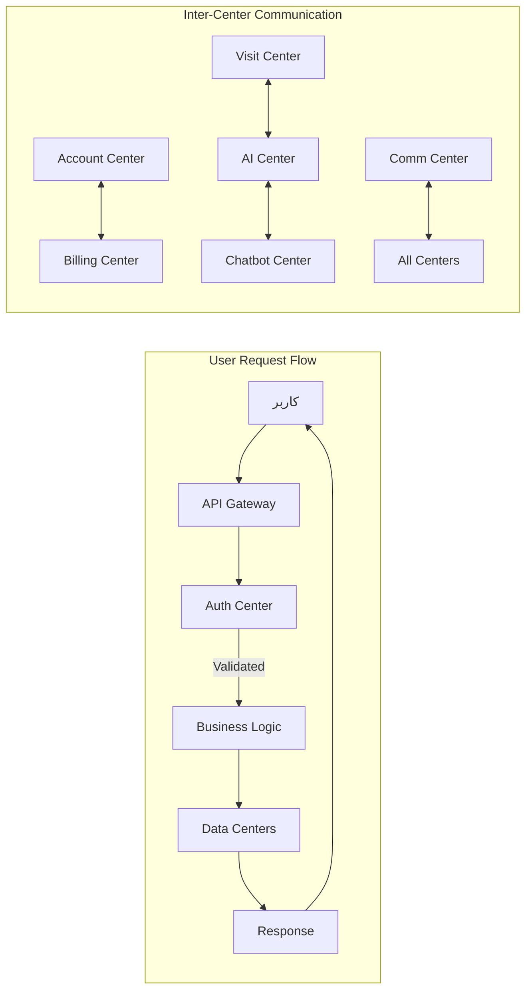

# 🏗️ معماری متمرکز HELSSA - مراکز کنترل یکپارچه

## 📋 فهرست مطالب

- [مقدمه](## 🎯 مقدمه)
- [مفهوم مراکز کنترل](## 💡 مفهوم مراکز کنترل)
- [نمودار معماری متمرکز](## 🏗️ نمودار معماری متمرکز)
- [مراکز کنترل اصلی](## 🎛️ مراکز کنترل اصلی)
- [لایه‌های معماری](## 📊 لایه‌های معماری)
- [جزئیات پیاده‌سازی مراکز](## 🔍 جزئیات پیاده‌سازی مراکز)
- [ارتباطات بین مراکز](## 🔗 ارتباطات بین مراکز)
- [مزایای معماری متمرکز](## 💪 مزایای معماری متمرکز)

---

## 🎯 مقدمه

معماری متمرکز HELSSA بر پایه **مراکز کنترل** (Control Centers) طراحی شده است. هر مرکز کنترل مسئول مدیریت یک دامنه خاص از عملیات سیستم است و به صورت مستقل قابل توسعه و نگهداری می‌باشد.

## 💡 مفهوم مراکز کنترل

### تعریف

مرکز کنترل یک واحد منطقی است که:

- ✅ مسئولیت‌های مشخص و محدود دارد
- ✅ API های استاندارد ارائه می‌دهد
- ✅ به صورت مستقل قابل مقیاس‌گذاری است
- ✅ امنیت و احراز هویت یکپارچه دارد

### اهداف طراحی

1. **جداسازی نگرانی‌ها** (Separation of Concerns)
2. **قابلیت نگهداری بالا** (High Maintainability)
3. **مقیاس‌پذیری افقی** (Horizontal Scalability)
4. **امنیت چندلایه** (Multi-layer Security)

## 🏗️ نمودار معماری متمرکز

```mermaid
graph TB
    subgraph "🌐 HELSSA Centralized Platform"
        
        subgraph "🎛️ Control Centers Layer"
            ACC[🏦 Account Control Center<br/>مرکز کنترل حساب‌ها]
            AIC[🧠 AI Control Center<br/>مرکز کنترل هوش مصنوعی] 
            PCC[🔐 Permission Control Center<br/>مرکز کنترل مجوزها]
            VCC[🏥 Visit Control Center<br/>مرکز کنترل ویزیت‌ها]
            BOT[🤖 Chatbot Control Center<br/>مرکز کنترل چت‌بات]
            BIL[💰 Billing Control Center<br/>مرکز کنترل مالی]
            COM[📧 Communication Control Center<br/>مرکز کنترل ارتباطات]
            TSK[⚙️ Task Control Center<br/>مرکز کنترل وظایف]
            AGT[🕴️ Agent Control Center<br/>مرکز کنترل ایجنت‌ها]
        end
        
        subgraph "🔌 Integration Layer"
            GW[🌉 Secure API Gateway<br/>درگاه امن API]
            AUTH[🔑 Authentication Hub<br/>هاب احراز هویت]
            CACHE[💾 Cache Layer<br/>لایه کش]
        end
        
        subgraph "📊 Data Layer"
            PG[(🐘 PostgreSQL<br/>پایگاه داده اصلی)]
            RD[(🔴 Redis<br/>کش و صف پیام)]
            MN[(📁 MinIO<br/>ذخیره‌سازی فایل)]
        end
        
        subgraph "🚀 Processing Layer"
            CEL[🔄 Celery Workers<br/>پردازشگرهای پس‌زمینه]
            MCP[🖥️ MCP Server<br/>سرور پروتکل متن]
            AGN[🤖 AI Agents<br/>ایجنت‌های هوشمند]
        end
        
    end
    
    subgraph "🌍 External Services"
        GAPGPT[GapGPT API]
        OPENAI[OpenAI API]
        AZURE[Azure Speech]
        BP[BitPay.ir]
        ZP[ZarinPal]
        ID[IDPay]
        SMS[کاوه نگار]
    end
    
    %% اتصالات اصلی
    ACC --> GW
    AIC --> GW
    PCC --> AUTH
    VCC --> GW
    BOT --> AIC
    BIL --> PCC
    COM --> GW
    TSK --> CEL
    AGT --> AGN
    
    GW --> CACHE
    AUTH --> PG
    CEL --> RD
    MCP --> AGN
    
    %% اتصالات خارجی
    AIC -.-> GAPGPT
    AIC -.-> OPENAI
    AIC -.-> AZURE
    BIL -.-> BP
    BIL -.-> ZP
    BIL -.-> ID
    COM -.-> SMS
    
    %% استایل‌ها
    style AIC fill:#e1f5fe
    style ACC fill:#f3e5f5
    style PCC fill:#e8f5e8
    style BOT fill:#fff3e0
    style VCC fill:#fce4ec
    style BIL fill:#f3e5f5
```



## 🎛️ مراکز کنترل اصلی

### 1. 🏦 مرکز کنترل حساب‌ها (Account Control Center)

**مسئولیت‌ها:**

- مدیریت کاربران (ثبت‌نام، ورود، پروفایل)
- احراز هویت یکپارچه (JWT, OTP)
- مدیریت نقش‌ها و دسترسی‌ها (RBAC)
- نشست‌ها و توکن‌ها

**ماژول‌های مرتبط:**

```python
unified_auth/
├── models.py          # UnifiedUser, UserRole, UserSession
├── services/
│   ├── auth_service.py
│   ├── otp_service.py
│   └── jwt_service.py
├── views/
│   ├── login_view.py
│   ├── register_view.py
│   └── profile_view.py
└── middleware/
    └── auth_middleware.py
```

### 2. 🧠 مرکز کنترل هوش مصنوعی (AI Control Center)

**مسئولیت‌ها:**

- مدیریت چت‌بات پزشکی
- سرویس‌های STT (تبدیل گفتار به متن)
- پردازش زبان طبیعی (NLP)
- تحلیل تصاویر پزشکی
- مدیریت مدل‌ها و Rate Limiting

**کد نمونه:**

 ```python
# unified_ai/services/ai_orchestrator.py
from typing import Dict, List, Optional
import asyncio
from openai import AsyncOpenAI

class AIOrchestrator:
    """هماهنگ‌کننده مرکزی سرویس‌های AI"""
    
    def __init__(self):
        self.openai_client = AsyncOpenAI(
            api_key=settings.OPENAI_API_KEY,
            base_url=settings.OPENAI_BASE_URL  # GapGPT compatible
        )
        self.models = {
            'chat': 'gpt-4-turbo-preview',
            'analysis': 'gpt-4',
            'summary': 'gpt-3.5-turbo',
            'vision': 'gpt-4-vision-preview'
        }
        
    async def process_medical_query(
        self, 
        query: str, 
        context: Optional[Dict] = None,
        user_id: str = None
    ) -> Dict:
        """پردازش سوال پزشکی با در نظر گرفتن محدودیت‌ها"""
        
        # بررسی محدودیت کاربر
        if not await self._check_rate_limit(user_id):
            raise RateLimitExceeded("تعداد درخواست‌ها بیش از حد مجاز")
            
        # آماده‌سازی پرامپت
        prompt = self._prepare_medical_prompt(query, context)
        
        try:
            # فراخوانی مدل
            response = await self.openai_client.chat.completions.create(
                model=self.models['chat'],
                messages=[
                    {"role": "system", "content": MEDICAL_SYSTEM_PROMPT},
                    {"role": "user", "content": prompt}
                ],
                temperature=0.7,
                max_tokens=2000
            )
            
            # ثبت مصرف
            await self._log_usage(user_id, response.usage)
            
            return {
                'answer': response.choices[0].message.content,
                'confidence': self._calculate_confidence(response),
                'tokens_used': response.usage.total_tokens
            }
            
        except Exception as e:
            # Fallback به مدل دیگر
            return await self._fallback_response(query, context)
```

### 3. 💰 مرکز کنترل مالی (Billing Control Center)

**مسئولیت‌ها:**

- مدیریت کیف پول کاربران
- پردازش تراکنش‌ها
- مدیریت اشتراک‌ها و پلن‌ها
- یکپارچه‌سازی با درگاه‌های پرداخت

**پیاده‌سازی کامل:**

```python
# unified_billing/services/payment_processor.py
from decimal import Decimal
from typing import Dict, Optional
import uuid

class PaymentProcessor:
    """پردازشگر مرکزی پرداخت‌ها"""
    
    def __init__(self):
        self.gateways = {
            'bitpay': BitPayGateway(),
            'zarinpal': ZarinPalGateway(),
            'idpay': IDPayGateway(),
            'stripe': StripeGateway()
        }
        
    async def create_payment(
        self,
        user_id: str,
        amount: Decimal,
        gateway: str,
        description: str,
        metadata: Optional[Dict] = None
    ) -> Dict:
        """ایجاد پرداخت جدید"""
        
        # ایجاد تراکنش
        transaction = await Transaction.objects.create(
            user_id=user_id,
            amount=amount,
            gateway=gateway,
            type=TransactionType.PAYMENT,
            status=TransactionStatus.PENDING,
            description=description,
            metadata=metadata or {}
        )
        
        # ارسال به درگاه
        gateway_instance = self.gateways[gateway]
        payment_url = await gateway_instance.create_payment(
            order_id=str(transaction.id),
            amount=int(amount),  # تبدیل به ریال
            callback_url=f"{settings.BASE_URL}/api/payment/callback/",
            description=description
        )
        
        # به‌روزرسانی تراکنش
        transaction.gateway_reference = payment_url['reference']
        transaction.payment_url = payment_url['url']
        await transaction.save()
        
        return {
            'transaction_id': str(transaction.id),
            'payment_url': payment_url['url'],
            'expires_at': payment_url.get('expires_at')
        }
        
    async def verify_payment(
        self,
        transaction_id: str,
        gateway_data: Dict
    ) -> bool:
        """تایید پرداخت"""
        
        transaction = await Transaction.objects.get(id=transaction_id)
        gateway = self.gateways[transaction.gateway]
        
        try:
            # تایید با درگاه
            verification = await gateway.verify_payment(
                reference=transaction.gateway_reference,
                amount=int(transaction.amount)
            )
            
            if verification['status'] == 'success':
                # به‌روزرسانی کیف پول
                await self._update_wallet(
                    transaction.user_id,
                    transaction.amount
                )
                
                # به‌روزرسانی تراکنش
                transaction.status = TransactionStatus.COMPLETED
                transaction.verified_at = timezone.now()
                await transaction.save()
                
                # ارسال نوتیفیکیشن
                await self._send_payment_notification(transaction)
                
                return True
                
        except Exception as e:
            transaction.status = TransactionStatus.FAILED
            transaction.error_message = str(e)
            await transaction.save()
            
        return False
```

### 4. 🏥 مرکز کنترل ویزیت‌ها (Visit Control Center)

**مسئولیت‌ها:**

- مدیریت ملاقات‌های پزشکی
- ضبط و پردازش صوت ویزیت‌ها
- تولید گزارش‌های SOAP
- مدیریت فایل‌های پزشکی

**کد کامل:**

```python
# encounters/services/visit_manager.py
from typing import Dict, List, Optional
from datetime import datetime, timedelta
import asyncio

class VisitManager:
    """مدیر مرکزی ویزیت‌ها"""
    
    def __init__(self):
        self.audio_processor = AudioProcessor()
        self.soap_generator = SOAPGenerator()
        self.notification_service = NotificationService()
        
    async def create_visit(
        self,
        patient_id: str,
        doctor_id: str,
        visit_type: str,
        scheduled_at: datetime,
        chief_complaint: str
    ) -> Dict:
        """ایجاد ویزیت جدید"""
        
        # ایجاد encounter
        encounter = await Encounter.objects.create(
            patient_id=patient_id,
            doctor_id=doctor_id,
            type=visit_type,
            scheduled_at=scheduled_at,
            chief_complaint=chief_complaint,
            status=EncounterStatus.SCHEDULED
        )
        
        # ایجاد لینک ویزیت
        visit_link = await self._generate_visit_link(encounter)
        
        # ارسال یادآوری
        await self._schedule_reminders(encounter)
        
        return {
            'encounter_id': str(encounter.id),
            'visit_link': visit_link,
            'scheduled_at': scheduled_at.isoformat()
        }
        
    async def process_visit_audio(
        self,
        encounter_id: str,
        audio_file: bytes,
        chunk_index: int = 0
    ) -> Dict:
        """پردازش صوت ویزیت"""
        
        encounter = await Encounter.objects.get(id=encounter_id)
        
        # ذخیره فایل صوتی
        audio_url = await self._store_audio(
            encounter_id,
            audio_file,
            chunk_index
        )
        
        # ایجاد AudioChunk
        chunk = await AudioChunk.objects.create(
            encounter=encounter,
            file_url=audio_url,
            chunk_index=chunk_index,
            duration=self._get_audio_duration(audio_file)
        )
        
        # شروع پردازش STT
        stt_task = asyncio.create_task(
            self._process_stt(chunk)
        )
        
        return {
            'chunk_id': str(chunk.id),
            'status': 'processing',
            'stt_task_id': stt_task.get_name()
        }
        
    async def generate_soap_report(
        self,
        encounter_id: str,
        regenerate: bool = False
    ) -> Dict:
        """تولید گزارش SOAP"""
        
        encounter = await Encounter.objects.select_related(
            'transcripts',
            'audio_chunks'
        ).get(id=encounter_id)
        
        # جمع‌آوری رونویسی‌ها
        full_transcript = await self._compile_transcripts(encounter)
        
        # تولید SOAP
        soap_data = await self.soap_generator.generate(
            transcript=full_transcript,
            chief_complaint=encounter.chief_complaint,
            patient_history=await self._get_patient_history(
                encounter.patient_id
            )
        )
        
        # ذخیره گزارش
        report = await SOAPReport.objects.create(
            encounter=encounter,
            subjective=soap_data['subjective'],
            objective=soap_data['objective'],
            assessment=soap_data['assessment'],
            plan=soap_data['plan'],
            metadata=soap_data.get('metadata', {})
        )
        
        # تولید PDF
        pdf_url = await self._generate_pdf(report)
        
        return {
            'report_id': str(report.id),
            'pdf_url': pdf_url,
            'soap_data': soap_data
        }
```

### 5. 🔑 مرکز کنترل دسترسی (Access Control Center)

**مسئولیت‌ها:**

- مدیریت دسترسی موقت پزشک به بیمار
- کنترل سطح دسترسی (RBAC)
- Audit Logging
- مدیریت کدهای دسترسی 6 رقمی

**پیاده‌سازی:**

```python
# unified_access/services/access_manager.py
import secrets
import string
from datetime import datetime, timedelta

class AccessManager:
    """مدیر دسترسی‌های موقت"""
    
    def __init__(self):
        self.redis_client = get_redis_client()
        self.audit_logger = AuditLogger()
        
    async def generate_access_code(
        self,
        patient_id: str,
        duration_minutes: int = 60,
        permissions: List[str] = None
    ) -> str:
        """تولید کد دسترسی 6 رقمی"""
        
        # تولید کد یکتا
        code = self._generate_unique_code()
        
        # ایجاد توکن دسترسی
        access_token = {
            'patient_id': patient_id,
            'code': code,
            'permissions': permissions or ['read_basic'],
            'created_at': datetime.utcnow().isoformat(),
            'expires_at': (
                datetime.utcnow() + timedelta(minutes=duration_minutes)
            ).isoformat()
        }
        
        # ذخیره در Redis
        await self.redis_client.setex(
            f"access_code:{code}",
            duration_minutes * 60,
            json.dumps(access_token)
        )
        
        # ثبت در Audit Log
        await self.audit_logger.log(
            action='access_code_generated',
            patient_id=patient_id,
            metadata={'code': code, 'duration': duration_minutes}
        )
        
        return code
        
    async def verify_access(
        self,
        doctor_id: str,
        access_code: str,
        requested_permission: str
    ) -> Optional[Dict]:
        """تایید دسترسی پزشک"""
        
        # بازیابی از Redis
        token_data = await self.redis_client.get(f"access_code:{access_code}")
        if not token_data:
            return None
            
        access_token = json.loads(token_data)
        
        # بررسی انقضا
        if datetime.fromisoformat(access_token['expires_at']) < datetime.utcnow():
            await self.redis_client.delete(f"access_code:{access_code}")
            return None
            
        # بررسی مجوز
        if requested_permission not in access_token['permissions']:
            await self.audit_logger.log(
                action='access_denied',
                doctor_id=doctor_id,
                patient_id=access_token['patient_id'],
                metadata={'permission': requested_permission}
            )
            return None
            
        # ایجاد سشن دسترسی
        session = await self._create_access_session(
            doctor_id,
            access_token['patient_id'],
            access_token['permissions']
        )
        
        return {
            'session_id': str(session.id),
            'patient_id': access_token['patient_id'],
            'permissions': access_token['permissions'],
            'expires_at': access_token['expires_at']
        }
        
    def _generate_unique_code(self) -> str:
        """تولید کد 6 رقمی یکتا"""
        return ''.join(
            secrets.choice(string.digits) for _ in range(6)
        )
```

### 6. 🤖 مرکز کنترل چت‌بات (Chatbot Control Center)

**مسئولیت‌ها:**

```python
- مدیریت جلسات چت
- ذخیره تاریخچه مکالمات
- تحلیل احساسات و نیت کاربر
- اشتراک‌گذاری با پزشک

### 7. 📧 مرکز کنترل ارتباطات (Communication Center)

**مسئولیت‌ها:**
- ارسال SMS/Email/Push Notification
- مدیریت قالب‌های پیام
- صف‌بندی و اولویت‌بندی پیام‌ها
- گزارش تحویل پیام‌ها

### 8. ⚙️ مرکز کنترل وظایف (Task Control Center)

**مسئولیت‌ها:**
- مدیریت Celery Tasks
- زمان‌بندی وظایف (Celery Beat)
- مانیتورینگ صف‌ها
- Retry Logic و Error Handling

### 9. 🕴️ مرکز کنترل ایجنت‌ها (Agent Control Center)

**مسئولیت‌ها:**
- مدیریت AI Agents تخصصی
- Orchestration جریان‌های کاری
- مدیریت حالت ایجنت‌ها
- تعامل با OpenAI Assistants API

## 🔗 ارتباطات بین مراکز



## 💪 مزایای معماری متمرکز

### 1. قابلیت نگهداری بالا

- هر مرکز مستقل و قابل توسعه
- کد تمیز و ساختار یافته
- تست‌پذیری بالا

### 2. امنیت چندلایه

- احراز هویت در سطح Gateway
- مجوزدهی در سطح مرکز
- Audit Trail کامل

### 3. مقیاس‌پذیری افقی

- هر مرکز قابل Scale مستقل
- توزیع بار هوشمند
- کش چندسطحی

### 4. عیب‌یابی آسان

- لاگ‌های ساختاریافته
- Tracing درخواست‌ها
- مانیتورینگ Real-time

---

[ELEMENT: div align="center"]

[→ قبلی: نمای کلی سیستم](01-system-overview.md) | [بعدی: نمودار درختی پروژه ←](03-project-tree.md)

</div>
