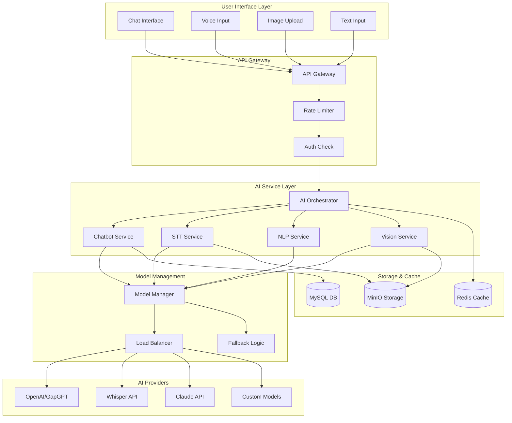

# 🤖 سیستم‌های هوش مصنوعی HELSSA

## 📋 فهرست مطالب

- [معرفی سیستم AI](## 🎯 معرفی سیستم AI)
- [معماری سیستم هوش مصنوعی](## 🏗️ معماری سیستم هوش مصنوعی)
- [چت‌بات پزشکی](## 💬 چت‌بات پزشکی)
- [پردازش صوت (STT)](## 🎙️ پردازش صوت (STT))
- [پردازش زبان طبیعی (NLP)](## 📝 پردازش زبان طبیعی (NLP))
- [تحلیل تصاویر پزشکی](## 🖼️ تحلیل تصاویر پزشکی)
- [مدیریت محدودیت‌ها](## 🔒 مدیریت محدودیت‌ها)
- [بهینه‌سازی و کش](## 🔒 بهینه‌سازی و کش)

---

## 🎯 معرفی سیستم AI

سیستم هوش مصنوعی HELSSA یک پلتفرم جامع است که از جدیدترین مدل‌های AI برای ارائه خدمات پزشکی هوشمند استفاده می‌کند.

### قابلیت‌های کلیدی

- 💬 **چت‌بات پزشکی 24/7** با GPT-4
- 🎙️ **تبدیل گفتار به متن** با Whisper
- 📝 **تولید گزارش SOAP** هوشمند
- 🖼️ **تحلیل تصاویر پزشکی** با Vision Models
- 🧠 **پردازش زبان طبیعی** پیشرفته
- 📊 **تحلیل احساسات** بیماران

## 🏗️ معماری سیستم هوش مصنوعی



### ساختار پروژه AI

```python
unified_ai/
├── __init__.py
├── apps.py                      # Django app config
├── models.py                    # مدل‌های AI
├── serializers.py               # سریالایزرها
├── views/
│   ├── chat_views.py           # Chat API endpoints
│   ├── stt_views.py            # STT endpoints
│   ├── nlp_views.py            # NLP endpoints
│   └── vision_views.py         # Vision endpoints
├── services/
│   ├── ai_orchestrator.py      # هماهنگ‌کننده مرکزی
│   ├── chatbot_service.py      # سرویس چت‌بات
│   ├── stt_service.py          # سرویس STT
│   ├── nlp_service.py          # سرویس NLP
│   ├── vision_service.py       # سرویس تصویر
│   └── model_manager.py        # مدیریت مدل‌ها
├── providers/
│   ├── openai_provider.py      # OpenAI/GapGPT
│   ├── whisper_provider.py     # Whisper
│   ├── claude_provider.py      # Claude
│   └── custom_provider.py      # Custom models
├── prompts/
│   ├── medical_prompts.py      # پرامپت‌های پزشکی
│   ├── soap_prompts.py         # پرامپت‌های SOAP
│   └── chat_prompts.py         # پرامپت‌های چت
├── utils/
│   ├── token_counter.py        # شمارش توکن
│   ├── validators.py           # اعتبارسنجی
│   └── formatters.py           # فرمت‌کننده‌ها
├── middleware/
│   ├── rate_limiter.py         # محدودیت نرخ
│   └── usage_tracker.py        # ردیابی مصرف
└── tasks.py                     # Celery tasks
```

## 💬 چت‌بات پزشکی

### Medical Chatbot Service

```python
# unified_ai/services/chatbot_service.py
from typing import Dict, List, Optional, AsyncGenerator
import asyncio
from openai import AsyncOpenAI
from langchain.memory import ConversationSummaryBufferMemory
from langchain.schema import BaseMessage, HumanMessage, AIMessage

class MedicalChatbotService:
    """سرویس چت‌بات پزشکی هوشمند"""
    
    def __init__(self):
        self.client = AsyncOpenAI(
            api_key=settings.OPENAI_API_KEY,
            base_url=settings.OPENAI_BASE_URL  # قابل تنظیم برای GapGPT
        )
        self.model = "gpt-4-turbo-preview"
        self.memory_manager = ConversationMemoryManager()
        self.medical_validator = MedicalContentValidator()
        
    async def process_message(
        self,
        user_id: str,
        message: str,
        conversation_id: Optional[str] = None,
        context: Optional[Dict] = None
    ) -> Dict:
        """پردازش پیام کاربر"""
        
        # بازیابی یا ایجاد مکالمه
        conversation = await self._get_or_create_conversation(
            user_id, conversation_id
        )
        
        # اعتبارسنجی محتوای پزشکی
        validation = await self.medical_validator.validate(message)
        if validation['contains_emergency']:
            return await self._handle_emergency(message, validation)
            
        # بازیابی تاریخچه
        history = await self.memory_manager.get_conversation_history(
            conversation.id
        )
        
        # آماده‌سازی پرامپت
        messages = self._prepare_messages(message, history, context)
        
        try:
            # فراخوانی مدل
            response = await self.client.chat.completions.create(
                model=self.model,
                messages=messages,
                temperature=0.7,
                max_tokens=2000,
                stream=False
            )
            
            ai_response = response.choices[0].message.content
            
            # ذخیره در تاریخچه
            await self._save_to_history(
                conversation.id,
                message,
                ai_response
            )
            
            # تحلیل پاسخ
            analysis = await self._analyze_response(ai_response)
            
            return {
                'conversation_id': str(conversation.id),
                'response': ai_response,
                'analysis': analysis,
                'suggestions': await self._get_suggestions(analysis),
                'tokens_used': response.usage.total_tokens
            }
            
        except Exception as e:
            # Fallback strategy
            return await self._fallback_response(message, str(e))
            
    async def stream_response(
        self,
        user_id: str,
        message: str,
        conversation_id: str
    ) -> AsyncGenerator[str, None]:
        """پاسخ استریمینگ برای تجربه بهتر"""
        
        conversation = await self._get_conversation(conversation_id)
        history = await self.memory_manager.get_conversation_history(
            conversation.id
        )
        
        messages = self._prepare_messages(message, history)
        
        stream = await self.client.chat.completions.create(
            model=self.model,
            messages=messages,
            temperature=0.7,
            max_tokens=2000,
            stream=True
        )
        
        full_response = ""
        async for chunk in stream:
            if chunk.choices[0].delta.content:
                content = chunk.choices[0].delta.content
                full_response += content
                yield content
                
        # ذخیره پاسخ کامل
        await self._save_to_history(
            conversation.id,
            message,
            full_response
        )
        
    def _prepare_messages(
        self,
        message: str,
        history: List[BaseMessage],
        context: Optional[Dict] = None
    ) -> List[Dict]:
        """آماده‌سازی پیام‌ها برای ارسال به مدل"""
        
        messages = [{
            "role": "system",
            "content": self._get_system_prompt(context)
        }]
        
        # افزودن تاریخچه (حداکثر 10 پیام اخیر)
        for msg in history[-10:]:
            if isinstance(msg, HumanMessage):
                messages.append({"role": "user", "content": msg.content})
            elif isinstance(msg, AIMessage):
                messages.append({"role": "assistant", "content": msg.content})
                
        # پیام جدید
        messages.append({"role": "user", "content": message})
        
        return messages
        
    def _get_system_prompt(self, context: Optional[Dict] = None) -> str:
        """پرامپت سیستم برای چت‌بات پزشکی"""
        
        base_prompt = """شما یک دستیار پزشکی هوشمند در پلتفرم HELSSA هستید. وظایف شما:

1. پاسخ به سوالات پزشکی با دقت و احتیاط
2. ارائه اطلاعات قابل فهم و مفید
3. تاکید بر اینکه این مشاوره جایگزین ویزیت حضوری نیست
4. شناسایی موارد اورژانسی و ارجاع فوری
5. حفظ حریم خصوصی و رازداری پزشکی

محدودیت‌ها:
- تجویز دارو ممنوع است
- تشخیص قطعی ممنوع است
- همیشه توصیه به مشاوره حضوری در موارد جدی

زبان: فارسی (مگر اینکه کاربر به زبان دیگری صحبت کند)"""
        
        if context:
            if context.get('patient_age'):
                base_prompt += f"\n\nسن بیمار: {context['patient_age']} سال"
            if context.get('medical_history'):
                base_prompt += f"\n\nسابقه پزشکی: {context['medical_history']}"
                
        return base_prompt
```

### Conversation Management

```python
# unified_ai/services/conversation_manager.py

class ConversationMemoryManager:
    """مدیریت حافظه مکالمات"""
    
    def __init__(self):
        self.redis_client = get_redis_client()
        self.summary_threshold = 20  # تعداد پیام برای خلاصه‌سازی
        
    async def get_conversation_history(
        self,
        conversation_id: str
    ) -> List[BaseMessage]:
        """بازیابی تاریخچه مکالمه"""
        
        # بازیابی از دیتابیس
        messages = await ChatMessage.objects.filter(
            conversation_id=conversation_id
        ).order_by('created_at').all()
        
        history = []
        for msg in messages:
            if msg.role == 'user':
                history.append(HumanMessage(content=msg.content))
            else:
                history.append(AIMessage(content=msg.content))
                
        # اگر تعداد پیام‌ها زیاد است، خلاصه‌سازی
        if len(history) > self.summary_threshold:
            history = await self._summarize_history(history)
            
        return history
        
    async def _summarize_history(
        self,
        history: List[BaseMessage]
    ) -> List[BaseMessage]:
        """خلاصه‌سازی تاریخچه طولانی"""
        
        # پیام‌های اولیه را خلاصه می‌کنیم
        to_summarize = history[:-10]  # 10 پیام آخر را نگه می‌داریم
        recent = history[-10:]
        
        # تبدیل به متن
        conversation_text = "\n".join([
            f"{'Human' if isinstance(msg, HumanMessage) else 'AI'}: {msg.content}"
            for msg in to_summarize
        ])
        
        # خلاصه‌سازی با AI
        summary = await self._generate_summary(conversation_text)
        
        # ترکیب خلاصه با پیام‌های اخیر
        return [
            AIMessage(content=f"خلاصه مکالمه قبلی:\n{summary}")
        ] + recent
```

## 🎙️ پردازش صوت (STT)

### Whisper STT Service

```python
# unified_ai/services/stt_service.py
import io
import asyncio
from pydub import AudioSegment
from typing import Dict, List, Optional

class WhisperSTTService:
    """سرویس تبدیل گفتار به متن با Whisper"""
    
    def __init__(self):
        self.client = AsyncOpenAI(api_key=settings.OPENAI_API_KEY)
        self.supported_formats = ['mp3', 'mp4', 'mpeg', 'mpga', 'm4a', 'wav', 'webm']
        self.max_file_size = 25 * 1024 * 1024  # 25MB
        self.chunk_duration = 60  # seconds
        
    async def transcribe_audio(
        self,
        audio_file: bytes,
        filename: str,
        language: str = 'fa',  # فارسی
        prompt: Optional[str] = None
    ) -> Dict:
        """تبدیل فایل صوتی به متن"""
        
        # اعتبارسنجی فایل
        self._validate_audio_file(audio_file, filename)
        
        # تبدیل فرمت در صورت نیاز
        audio_file, format = await self._prepare_audio(audio_file, filename)
        
        # اگر فایل بزرگ است، تکه‌تکه کن
        if len(audio_file) > self.max_file_size:
            return await self._transcribe_large_file(
                audio_file, language, prompt
            )
            
        try:
            # ارسال به Whisper API
            response = await self.client.audio.transcriptions.create(
                model="whisper-1",
                file=("audio.mp3", audio_file, "audio/mpeg"),
                language=language,
                prompt=prompt or self._get_medical_prompt(),
                response_format="verbose_json"
            )
            
            # پردازش پاسخ
            return {
                'text': response.text,
                'language': response.language,
                'duration': response.duration,
                'segments': self._process_segments(response.segments),
                'confidence': self._calculate_confidence(response)
            }
            
        except Exception as e:
            # Fallback به سرویس دیگر
            return await self._fallback_transcription(audio_file, language)
            
    async def _transcribe_large_file(
        self,
        audio_file: bytes,
        language: str,
        prompt: Optional[str]
    ) -> Dict:
        """پردازش فایل‌های بزرگ با تکه‌بندی"""
        
        # تبدیل به AudioSegment
        audio = AudioSegment.from_file(io.BytesIO(audio_file))
        
        # تکه‌بندی
        chunks = self._split_audio(audio, self.chunk_duration)
        
        # پردازش موازی تکه‌ها
        tasks = []
        for i, chunk in enumerate(chunks):
            chunk_bytes = chunk.export(format="mp3").read()
            task = self._transcribe_chunk(
                chunk_bytes, i, language, prompt
            )
            tasks.append(task)
            
        # جمع‌آوری نتایج
        results = await asyncio.gather(*tasks)
        
        # ادغام رونویسی‌ها
        return self._merge_transcriptions(results)
        
    def _split_audio(
        self,
        audio: AudioSegment,
        chunk_duration: int
    ) -> List[AudioSegment]:
        """تقسیم فایل صوتی به تکه‌های کوچکتر"""
        
        chunks = []
        duration_ms = chunk_duration * 1000
        
        for i in range(0, len(audio), duration_ms):
            chunk = audio[i:i + duration_ms]
            chunks.append(chunk)
            
        return chunks
        
    async def _transcribe_chunk(
        self,
        chunk_bytes: bytes,
        chunk_index: int,
        language: str,
        prompt: Optional[str]
    ) -> Dict:
        """رونویسی یک تکه صوتی"""
        
        try:
            response = await self.client.audio.transcriptions.create(
                model="whisper-1",
                file=(f"chunk_{chunk_index}.mp3", chunk_bytes, "audio/mpeg"),
                language=language,
                prompt=prompt
            )
            
            return {
                'index': chunk_index,
                'text': response.text,
                'success': True
            }
        except Exception as e:
            return {
                'index': chunk_index,
                'text': '',
                'success': False,
                'error': str(e)
            }
            
    def _merge_transcriptions(self, results: List[Dict]) -> Dict:
        """ادغام رونویسی تکه‌ها"""
        
        # مرتب‌سازی بر اساس index
        results.sort(key=lambda x: x['index'])
        
        # ادغام متن‌ها
        full_text = " ".join([
            r['text'] for r in results if r['success']
        ])
        
        # محاسبه آمار
        success_count = sum(1 for r in results if r['success'])
        total_count = len(results)
        
        return {
            'text': full_text,
            'chunks_processed': total_count,
            'chunks_successful': success_count,
            'success_rate': success_count / total_count if total_count > 0 else 0
        }
        
    def _get_medical_prompt(self) -> str:
        """پرامپت تخصصی پزشکی برای بهبود دقت"""
        
        return """این یک مکالمه پزشکی بین پزشک و بیمار است.
        اصطلاحات پزشکی رایج: قرص، آمپول، آزمایش، معاینه، تشخیص، درمان، نسخه
        داروهای رایج: استامینوفن، آموکسی‌سیلین، متفورمین، لوزارتان
        بیماری‌های رایج: دیابت، فشار خون، سرماخوردگی، آنفولانزا"""
```

### Audio Processing Pipeline

```python
# unified_ai/tasks.py
from celery import shared_task, chain, group
from typing import List, Dict

@shared_task(queue='stt')
def process_encounter_audio(encounter_id: str) -> Dict:
    """پردازش کامل صوت یک ملاقات"""
    
    # بازیابی encounter و فایل‌های صوتی
    encounter = Encounter.objects.get(id=encounter_id)
    audio_chunks = AudioChunk.objects.filter(
        encounter=encounter
    ).order_by('chunk_index')
    
    # ایجاد زنجیره وظایف
    workflow = chain(
        # 1. رونویسی همه chunk ها
        group([
            transcribe_audio_chunk.s(chunk.id)
            for chunk in audio_chunks
        ]),
        
        # 2. ادغام رونویسی‌ها
        merge_transcriptions.s(encounter_id),
        
        # 3. پردازش NLP
        extract_medical_entities.s(),
        
        # 4. تولید گزارش SOAP
        generate_soap_report.s(encounter_id),
        
        # 5. ارسال نوتیفیکیشن
        notify_doctor_report_ready.s()
    )
    
    # اجرای workflow
    result = workflow.apply_async()
    
    return {
        'encounter_id': encounter_id,
        'workflow_id': result.id,
        'status': 'processing'
    }

@shared_task
def transcribe_audio_chunk(chunk_id: str) -> Dict:
    """رونویسی یک chunk صوتی"""
    
    chunk = AudioChunk.objects.get(id=chunk_id)
    
    # دانلود از MinIO
    audio_data = download_from_minio(chunk.file_url)
    
    # رونویسی
    stt_service = WhisperSTTService()
    result = asyncio.run(
        stt_service.transcribe_audio(
            audio_data,
            f"chunk_{chunk.chunk_index}.mp3"
        )
    )
    
    # ذخیره نتیجه
    Transcript.objects.create(
        audio_chunk=chunk,
        text=result['text'],
        language=result.get('language', 'fa'),
        confidence=result.get('confidence', 0.0),
        metadata=result
    )
    
    return {
        'chunk_id': chunk_id,
        'text_length': len(result['text']),
        'success': True
    }
```

## 📝 پردازش زبان طبیعی (NLP)

### Medical NLP Service

```python
# unified_ai/services/nlp_service.py
import re
from typing import Dict, List, Optional
import spacy
from hazm import Normalizer, SentenceTokenizer

class MedicalNLPService:
    """سرویس پردازش زبان طبیعی پزشکی"""
    
    def __init__(self):
        self.normalizer = Normalizer()
        self.sentence_tokenizer = SentenceTokenizer()
        self.entity_extractor = MedicalEntityExtractor()
        self.soap_generator = SOAPGenerator()
        
    async def extract_medical_entities(
        self,
        text: str,
        language: str = 'fa'
    ) -> Dict:
        """استخراج موجودیت‌های پزشکی از متن"""
        
        # نرمال‌سازی متن
        normalized_text = self.normalizer.normalize(text)
        
        # استخراج موجودیت‌ها
        entities = {
            'symptoms': await self._extract_symptoms(normalized_text),
            'medications': await self._extract_medications(normalized_text),
            'diagnoses': await self._extract_diagnoses(normalized_text),
            'lab_tests': await self._extract_lab_tests(normalized_text),
            'vital_signs': await self._extract_vital_signs(normalized_text),
            'allergies': await self._extract_allergies(normalized_text),
            'medical_history': await self._extract_medical_history(normalized_text)
        }
        
        # تحلیل احساسات بیمار
        sentiment = await self._analyze_patient_sentiment(normalized_text)
        
        return {
            'entities': entities,
            'sentiment': sentiment,
            'summary': await self._generate_summary(entities),
            'risk_factors': await self._identify_risk_factors(entities)
        }
        
    async def generate_soap_report(
        self,
        transcript: str,
        chief_complaint: str,
        patient_info: Optional[Dict] = None
    ) -> Dict:
        """تولید گزارش SOAP از رونویسی"""
        
        # استخراج موجودیت‌ها
        entities = await self.extract_medical_entities(transcript)
        
        # آماده‌سازی context
        context = {
            'transcript': transcript,
            'chief_complaint': chief_complaint,
            'entities': entities['entities'],
            'patient_info': patient_info or {}
        }
        
        # تولید بخش‌های SOAP
        soap_sections = await self.soap_generator.generate_all_sections(context)
        
        # اعتبارسنجی و تکمیل
        validated_soap = await self._validate_soap_sections(soap_sections)
        
        return {
            'subjective': validated_soap['subjective'],
            'objective': validated_soap['objective'],
            'assessment': validated_soap['assessment'],
            'plan': validated_soap['plan'],
            'metadata': {
                'generated_at': datetime.utcnow().isoformat(),
                'confidence_score': validated_soap['confidence'],
                'entities_found': len(entities['entities']),
                'warnings': validated_soap.get('warnings', [])
            }
        }
        
    async def _extract_symptoms(self, text: str) -> List[Dict]:
        """استخراج علائم بیماری"""
        
        symptom_patterns = [
            r'درد\s+(\w+)',
            r'(\w+)\s+درد',
            r'احساس\s+(\w+)',
            r'دچار\s+(\w+)',
            r'علائم?\s+(\w+)',
        ]
        
        symptoms = []
        for pattern in symptom_patterns:
            matches = re.findall(pattern, text)
            for match in matches:
                symptom = {
                    'name': match,
                    'severity': self._extract_severity(text, match),
                    'duration': self._extract_duration(text, match),
                    'location': self._extract_location(text, match)
                }
                symptoms.append(symptom)
                
        return self._deduplicate_entities(symptoms)
        
    async def _extract_medications(self, text: str) -> List[Dict]:
        """استخراج داروها"""
        
        # لیست داروهای رایج
        common_drugs = [
            'استامینوفن', 'آموکسی‌سیلین', 'متفورمین', 'لوزارتان',
            'آسپرین', 'ایبوپروفن', 'پردنیزولون', 'آتورواستاتین'
        ]
        
        medications = []
        for drug in common_drugs:
            if drug in text:
                # استخراج دوز و دستور مصرف
                dosage = self._extract_dosage(text, drug)
                frequency = self._extract_frequency(text, drug)
                
                medications.append({
                    'name': drug,
                    'dosage': dosage,
                    'frequency': frequency,
                    'route': self._extract_route(text, drug)
                })
                
        return medications
```

### SOAP Generator

```python
# unified_ai/services/soap_generator.py

class SOAPGenerator:
    """تولیدکننده گزارش SOAP"""
    
    def __init__(self):
        self.client = AsyncOpenAI(api_key=settings.OPENAI_API_KEY)
        self.validator = SOAPValidator()
        
    async def generate_all_sections(self, context: Dict) -> Dict:
        """تولید تمام بخش‌های SOAP"""
        
        tasks = {
            'subjective': self._generate_subjective(context),
            'objective': self._generate_objective(context),
            'assessment': self._generate_assessment(context),
            'plan': self._generate_plan(context)
        }
        
        # اجرای موازی
        results = await asyncio.gather(*tasks.values())
        
        return dict(zip(tasks.keys(), results))
        
    async def _generate_subjective(self, context: Dict) -> str:
        """تولید بخش Subjective"""
        
        prompt = f"""بر اساس رونویسی زیر، بخش Subjective گزارش SOAP را بنویسید.

شکایت اصلی: {context['chief_complaint']}

رونویسی مکالمه:
{context['transcript']}

بخش Subjective باید شامل:
1. شکایت اصلی (CC)
2. تاریخچه بیماری فعلی (HPI)
3. سابقه پزشکی گذشته (PMH)
4. داروهای مصرفی فعلی
5. آلرژی‌ها
6. سابقه اجتماعی مرتبط

فقط بخش Subjective را بنویسید، به فارسی و بصورت حرفه‌ای."""

        response = await self.client.chat.completions.create(
            model="gpt-4",
            messages=[
                {"role": "system", "content": "شما یک پزشک متخصص هستید که گزارش‌های SOAP می‌نویسد."},
                {"role": "user", "content": prompt}
            ],
            temperature=0.3,
            max_tokens=1000
        )
        
        return response.choices[0].message.content
        
    async def _generate_objective(self, context: Dict) -> str:
        """تولید بخش Objective"""
        
        entities = context['entities']
        
        prompt = f"""بخش Objective گزارش SOAP را بر اساس اطلاعات زیر بنویسید:

علائم حیاتی: {entities.get('vital_signs', [])}
یافته‌های معاینه: {self._extract_examination_findings(context['transcript'])}
نتایج آزمایشات: {entities.get('lab_tests', [])}

بخش Objective باید شامل:
1. علائم حیاتی (VS)
2. یافته‌های معاینه فیزیکی
3. نتایج آزمایشات و تصویربرداری
4. مشاهدات عینی

به فارسی و فقط بخش Objective را بنویسید."""

        response = await self.client.chat.completions.create(
            model="gpt-4",
            messages=[
                {"role": "system", "content": "شما یک پزشک متخصص هستید."},
                {"role": "user", "content": prompt}
            ],
            temperature=0.3,
            max_tokens=800
        )
        
        return response.choices[0].message.content
```

## 🖼️ تحلیل تصاویر پزشکی

### Medical Vision Service

```python
# unified_ai/services/vision_service.py
from PIL import Image
import numpy as np
from typing import Dict, List, Optional

class MedicalVisionService:
    """سرویس تحلیل تصاویر پزشکی"""
    
    def __init__(self):
        self.client = AsyncOpenAI(api_key=settings.OPENAI_API_KEY)
        self.supported_types = [
            'xray', 'mri', 'ct_scan', 'ultrasound',
            'ecg', 'lab_report', 'prescription'
        ]
        
    async def analyze_medical_image(
        self,
        image_data: bytes,
        image_type: str,
        additional_context: Optional[str] = None
    ) -> Dict:
        """تحلیل تصویر پزشکی"""
        
        # اعتبارسنجی نوع تصویر
        if image_type not in self.supported_types:
            raise ValueError(f"Unsupported image type: {image_type}")
            
        # پیش‌پردازش تصویر
        processed_image = await self._preprocess_image(image_data, image_type)
        
        # تحلیل با Vision API
        if image_type in ['xray', 'mri', 'ct_scan']:
            return await self._analyze_radiology_image(
                processed_image, image_type, additional_context
            )
        elif image_type == 'lab_report':
            return await self._extract_lab_values(processed_image)
        elif image_type == 'prescription':
            return await self._read_prescription(processed_image)
        elif image_type == 'ecg':
            return await self._analyze_ecg(processed_image)
            
    async def _analyze_radiology_image(
        self,
        image_data: bytes,
        modality: str,
        context: Optional[str]
    ) -> Dict:
        """تحلیل تصاویر رادیولوژی"""
        
        prompt = self._get_radiology_prompt(modality, context)
        
        response = await self.client.chat.completions.create(
            model="gpt-4-vision-preview",
            messages=[
                {
                    "role": "system",
                    "content": "شما یک رادیولوژیست متخصص هستید."
                },
                {
                    "role": "user",
                    "content": [
                        {"type": "text", "text": prompt},
                        {
                            "type": "image_url",
                            "image_url": {
                                "url": f"data:image/jpeg;base64,{self._encode_image(image_data)}"
                            }
                        }
                    ]
                }
            ],
            max_tokens=1500
        )
        
        analysis = response.choices[0].message.content
        
        # استخراج یافته‌های کلیدی
        findings = await self._extract_key_findings(analysis)
        
        return {
            'modality': modality,
            'analysis': analysis,
            'key_findings': findings,
            'recommendations': await self._generate_recommendations(findings),
            'confidence': self._calculate_confidence(analysis)
        }
        
    async def _extract_lab_values(self, image_data: bytes) -> Dict:
        """استخراج مقادیر آزمایشگاهی از تصویر"""
        
        # OCR برای استخراج متن
        text = await self._perform_ocr(image_data)
        
        # تحلیل با GPT-4
        prompt = f"""متن زیر از یک برگه آزمایش استخراج شده است.
لطفاً مقادیر آزمایشگاهی را استخراج و دسته‌بندی کنید:

{text}

خروجی را به صورت JSON با این ساختار ارائه دهید:
{{
    "test_name": "نام آزمایش",
    "value": "مقدار",
    "unit": "واحد",
    "reference_range": "محدوده نرمال",
    "status": "normal/high/low"
}}"""

        response = await self.client.chat.completions.create(
            model="gpt-4",
            messages=[
                {"role": "system", "content": "شما در استخراج داده‌های آزمایشگاهی تخصص دارید."},
                {"role": "user", "content": prompt}
            ],
            temperature=0.1,
            response_format={"type": "json_object"}
        )
        
        lab_values = json.loads(response.choices[0].message.content)
        
        # تحلیل مقادیر غیرطبیعی
        abnormal_values = [
            v for v in lab_values
            if v.get('status') in ['high', 'low']
        ]
        
        return {
            'lab_values': lab_values,
            'abnormal_count': len(abnormal_values),
            'abnormal_values': abnormal_values,
            'clinical_significance': await self._assess_clinical_significance(
                abnormal_values
            )
        }
```

## 📊 مدیریت محدودیت‌ها

### Usage Management

```python
# unified_ai/services/usage_manager.py

class AIUsageManager:
    """مدیریت مصرف و محدودیت‌های AI"""
    
    def __init__(self):
        self.redis_client = get_redis_client()
        self.limits = self._load_limits()
        
    async def check_and_consume(
        self,
        user_id: str,
        service: str,
        tokens: int = 0
    ) -> bool:
        """بررسی و مصرف سهمیه"""
        
        # بازیابی پلن کاربر
        user_plan = await self._get_user_plan(user_id)
        
        # بررسی محدودیت‌ها
        daily_limit = self.limits[user_plan][service]['daily']
        monthly_limit = self.limits[user_plan][service]['monthly']
        
        # کلیدهای Redis
        daily_key = f"usage:{user_id}:{service}:daily:{datetime.now().date()}"
        monthly_key = f"usage:{user_id}:{service}:monthly:{datetime.now().strftime('%Y-%m')}"
        
        # بررسی مصرف فعلی
        daily_usage = int(await self.redis_client.get(daily_key) or 0)
        monthly_usage = int(await self.redis_client.get(monthly_key) or 0)
        
        # بررسی محدودیت
        if daily_usage + tokens > daily_limit:
            raise UsageLimitExceeded(
                f"محدودیت روزانه {service} تمام شده است"
            )
            
        if monthly_usage + tokens > monthly_limit:
            raise UsageLimitExceeded(
                f"محدودیت ماهانه {service} تمام شده است"
            )
            
        # ثبت مصرف
        await self.redis_client.incrby(daily_key, tokens)
        await self.redis_client.expire(daily_key, 86400)  # 1 day
        
        await self.redis_client.incrby(monthly_key, tokens)
        await self.redis_client.expire(monthly_key, 2592000)  # 30 days
        
        # ثبت در دیتابیس
        await self._log_usage(user_id, service, tokens)
        
        return True
        
    def _load_limits(self) -> Dict:
        """بارگذاری محدودیت‌های پلن‌ها"""
        
        return {
            'free': {
                'chat': {'daily': 20, 'monthly': 200},
                'stt': {'daily': 10, 'monthly': 100},
                'vision': {'daily': 5, 'monthly': 50}
            },
            'basic': {
                'chat': {'daily': 100, 'monthly': 2000},
                'stt': {'daily': 50, 'monthly': 1000},
                'vision': {'daily': 20, 'monthly': 400}
            },
            'premium': {
                'chat': {'daily': 500, 'monthly': 15000},
                'stt': {'daily': 200, 'monthly': 6000},
                'vision': {'daily': 100, 'monthly': 3000}
            },
            'enterprise': {
                'chat': {'daily': -1, 'monthly': -1},  # نامحدود
                'stt': {'daily': -1, 'monthly': -1},
                'vision': {'daily': -1, 'monthly': -1}
            }
        }
```

## 🚀 بهینه‌سازی و کش

### AI Response Cache

```python
# unified_ai/services/cache_service.py

class AIResponseCache:
    """کش پاسخ‌های AI برای بهینه‌سازی"""
    
    def __init__(self):
        self.redis_client = get_redis_client()
        self.ttl = {
            'chat': 3600,      # 1 hour
            'medical_info': 86400,  # 1 day
            'translation': 604800   # 1 week
        }
        
    async def get_cached_response(
        self,
        query: str,
        service: str,
        context: Optional[Dict] = None
    ) -> Optional[str]:
        """بازیابی پاسخ از کش"""
        
        # تولید کلید یکتا
        cache_key = self._generate_cache_key(query, service, context)
        
        # بازیابی از کش
        cached = await self.redis_client.get(cache_key)
        
        if cached:
            # به‌روزرسانی آمار
            await self._increment_cache_hit(service)
            return json.loads(cached)
            
        return None
        
    async def cache_response(
        self,
        query: str,
        response: str,
        service: str,
        context: Optional[Dict] = None
    ):
        """ذخیره پاسخ در کش"""
        
        # بررسی قابلیت کش
        if not self._is_cacheable(query, service):
            return
            
        cache_key = self._generate_cache_key(query, service, context)
        ttl = self.ttl.get(service, 3600)
        
        await self.redis_client.setex(
            cache_key,
            ttl,
            json.dumps({
                'response': response,
                'cached_at': datetime.utcnow().isoformat(),
                'service': service
            })
        )
        
    def _generate_cache_key(
        self,
        query: str,
        service: str,
        context: Optional[Dict]
    ) -> str:
        """تولید کلید کش یکتا"""
        
        # نرمال‌سازی query
        normalized_query = query.lower().strip()
        
        # هش کردن
        content = f"{service}:{normalized_query}"
        if context:
            content += f":{json.dumps(context, sort_keys=True)}"
            
        return f"ai_cache:{hashlib.md5(content.encode()).hexdigest()}"
        
    def _is_cacheable(self, query: str, service: str) -> bool:
        """بررسی قابلیت کش شدن"""
        
        # سوالات شخصی کش نمی‌شوند
        personal_indicators = [
            'من', 'نتایج آزمایش من', 'پرونده من',
            'سابقه من', 'داروهای من'
        ]
        
        return not any(indicator in query for indicator in personal_indicators)
```

---

[ELEMENT: div align="center"]

[→ قبلی: احراز هویت یکپارچه](05-authentication.md) | [بعدی: سیستم مالی و اشتراک ←](07-billing-system.md)

</div>
