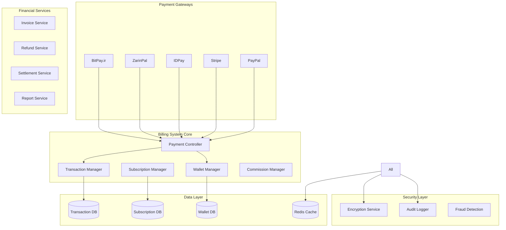

# 💰 سیستم مالی و اشتراک HELSSA

## 📋 فهرست مطالب

- [معرفی سیستم مالی](## 🎯 معرفی سیستم مالی)
- [معماری سیستم مالی](## 🏗️ معماری سیستم مالی)
- [مدیریت کیف پول](## 💳 مدیریت کیف پول)
- [سیستم اشتراک](## 💳 سیستم اشتراک)
- [درگاه‌های پرداخت](## 💳 درگاه‌های پرداخت)
- [مدیریت تراکنش‌ها](## 💳 مدیریت تراکنش‌ها)
- [گزارش‌های مالی](## 💳 گزارش‌های مالی)
- [امنیت مالی](## 🔒 امنیت مالی)

---

## 🎯 معرفی سیستم مالی

سیستم مالی HELSSA یک پلتفرم جامع و یکپارچه برای مدیریت تمام جنبه‌های مالی پلتفرم است که شامل کیف پول دیجیتال، اشتراک‌ها، پرداخت‌ها و تراکنش‌های مالی می‌شود.

### ویژگی‌های کلیدی

- 💳 **کیف پول دیجیتال** برای هر کاربر
- 📊 **پلن‌های اشتراک متنوع** با قابلیت سفارشی‌سازی
- 🏦 **درگاه‌های پرداخت متعدد** (ایرانی و بین‌المللی)
- 💸 **سیستم کمیسیون هوشمند** برای پزشکان
- 📈 **گزارش‌های مالی جامع** و Real-time
- 🔐 **امنیت بالا** با رعایت استانداردهای PCI DSS
- 🔄 **تسویه حساب خودکار** با پزشکان

## 🏗️ معماری سیستم مالی



### ساختار پروژه مالی

```python
unified_billing/
├── models/
│   ├── wallet.py               # مدل کیف پول
│   ├── transaction.py          # مدل تراکنش
│   ├── subscription.py         # مدل اشتراک
│   ├── plan.py                 # مدل پلن‌ها
│   ├── invoice.py              # مدل فاکتور
│   └── commission.py           # مدل کمیسیون
├── services/
│   ├── wallet_service.py       # سرویس کیف پول
│   ├── payment_service.py      # سرویس پرداخت
│   ├── subscription_service.py # سرویس اشتراک
│   ├── commission_service.py   # سرویس کمیسیون
│   └── settlement_service.py   # سرویس تسویه
├── gateways/
│   ├── base_gateway.py         # کلاس پایه
│   ├── bitpay_gateway.py       # BitPay.ir
│   ├── zarinpal_gateway.py     # ZarinPal
│   ├── idpay_gateway.py        # IDPay
│   └── stripe_gateway.py       # Stripe
├── utils/
│   ├── currency_converter.py   # تبدیل ارز
│   ├── invoice_generator.py    # تولید فاکتور
│   └── financial_calculator.py # محاسبات مالی
├── tasks.py                     # Celery tasks
├── webhooks/                    # Webhook handlers
├── api/
│   ├── serializers.py
│   └── views.py
└── migrations/
```

## 💳 مدیریت کیف پول

### Wallet Model

```python
# unified_billing/models/wallet.py
from decimal import Decimal
from django.db import models, transaction
import uuid

class Wallet(models.Model):
    """مدل کیف پول دیجیتال"""
    
    id = models.UUIDField(primary_key=True, default=uuid.uuid4)
    user = models.OneToOneField(
        'unified_auth.UnifiedUser',
        on_delete=models.PROTECT,
        related_name='wallet'
    )
    
    # موجودی‌ها
    balance = models.DecimalField(
        max_digits=12,
        decimal_places=0,
        default=0,
        help_text="موجودی به ریال"
    )
    blocked_balance = models.DecimalField(
        max_digits=12,
        decimal_places=0,
        default=0,
        help_text="موجودی بلوکه شده"
    )
    
    # اعتبار هدیه
    gift_credit = models.DecimalField(
        max_digits=10,
        decimal_places=0,
        default=0,
        help_text="اعتبار هدیه"
    )
    gift_credit_expires_at = models.DateTimeField(null=True, blank=True)
    
    # وضعیت
    is_active = models.BooleanField(default=True)
    is_verified = models.BooleanField(default=False)
    
    # محدودیت‌ها
    daily_withdrawal_limit = models.DecimalField(
        max_digits=10,
        decimal_places=0,
        default=50000000  # 50 میلیون ریال
    )
    monthly_withdrawal_limit = models.DecimalField(
        max_digits=10,
        decimal_places=0,
        default=500000000  # 500 میلیون ریال
    )
    
    # زمان‌ها
    created_at = models.DateTimeField(auto_now_add=True)
    updated_at = models.DateTimeField(auto_now=True)
    last_transaction_at = models.DateTimeField(null=True, blank=True)
    
    class Meta:
        db_table = 'wallets'
        indexes = [
            models.Index(fields=['user', 'is_active']),
        ]
        
    @property
    def available_balance(self) -> Decimal:
        """موجودی قابل استفاده"""
        return self.balance - self.blocked_balance
        
    def has_sufficient_balance(self, amount: Decimal) -> bool:
        """بررسی کفایت موجودی"""
        return self.available_balance >= amount
```

### Wallet Service

```python
# unified_billing/services/wallet_service.py
from decimal import Decimal
from typing import Dict, Optional
from django.db import transaction as db_transaction

class WalletService:
    """سرویس مدیریت کیف پول"""
    
    def __init__(self):
        self.transaction_service = TransactionService()
        self.notification_service = NotificationService()
        
    @db_transaction.atomic
    async def deposit(
        self,
        wallet_id: str,
        amount: Decimal,
        source: str,
        reference: str,
        metadata: Optional[Dict] = None
    ) -> Transaction:
        """واریز به کیف پول"""
        
        # بازیابی کیف پول با قفل
        wallet = await Wallet.objects.select_for_update().get(
            id=wallet_id,
            is_active=True
        )
        
        # ایجاد تراکنش
        transaction = await self.transaction_service.create_transaction(
            wallet=wallet,
            amount=amount,
            type=TransactionType.DEPOSIT,
            source=source,
            reference=reference,
            metadata=metadata
        )
        
        # به‌روزرسانی موجودی
        wallet.balance += amount
        wallet.last_transaction_at = timezone.now()
        await wallet.save()
        
        # ارسال نوتیفیکیشن
        await self.notification_service.send_deposit_notification(
            wallet.user,
            amount,
            wallet.balance
        )
        
        return transaction
        
    @db_transaction.atomic
    async def withdraw(
        self,
        wallet_id: str,
        amount: Decimal,
        destination: str,
        metadata: Optional[Dict] = None
    ) -> Transaction:
        """برداشت از کیف پول"""
        
        # بازیابی کیف پول با قفل
        wallet = await Wallet.objects.select_for_update().get(
            id=wallet_id,
            is_active=True
        )
        
        # بررسی‌های امنیتی
        await self._validate_withdrawal(wallet, amount)
        
        # بررسی موجودی
        if not wallet.has_sufficient_balance(amount):
            raise InsufficientBalanceError(
                f"موجودی کافی نیست. موجودی فعلی: {wallet.available_balance}"
            )
            
        # ایجاد تراکنش
        transaction = await self.transaction_service.create_transaction(
            wallet=wallet,
            amount=-amount,
            type=TransactionType.WITHDRAWAL,
            destination=destination,
            metadata=metadata
        )
        
        # به‌روزرسانی موجودی
        wallet.balance -= amount
        wallet.last_transaction_at = timezone.now()
        await wallet.save()
        
        # ارسال نوتیفیکیشن
        await self.notification_service.send_withdrawal_notification(
            wallet.user,
            amount,
            wallet.balance
        )
        
        return transaction
        
    @db_transaction.atomic
    async def transfer(
        self,
        from_wallet_id: str,
        to_wallet_id: str,
        amount: Decimal,
        description: str = "",
        commission_rate: Decimal = Decimal('0')
    ) -> Dict[str, Transaction]:
        """انتقال بین کیف پول‌ها"""
        
        # قفل هر دو کیف پول
        wallets = await Wallet.objects.select_for_update().filter(
            id__in=[from_wallet_id, to_wallet_id],
            is_active=True
        ).order_by('id')  # جلوگیری از deadlock
        
        if len(wallets) != 2:
            raise WalletNotFoundError("یکی از کیف پول‌ها یافت نشد")
            
        from_wallet = next(w for w in wallets if str(w.id) == from_wallet_id)
        to_wallet = next(w for w in wallets if str(w.id) == to_wallet_id)
        
        # بررسی موجودی
        total_amount = amount + (amount * commission_rate)
        if not from_wallet.has_sufficient_balance(total_amount):
            raise InsufficientBalanceError("موجودی کافی نیست")
            
        # محاسبه کمیسیون
        commission = amount * commission_rate
        net_amount = amount - commission
        
        # تراکنش برداشت
        from_transaction = await self.transaction_service.create_transaction(
            wallet=from_wallet,
            amount=-amount,
            type=TransactionType.TRANSFER_OUT,
            related_wallet=to_wallet,
            description=description
        )
        
        # تراکنش واریز
        to_transaction = await self.transaction_service.create_transaction(
            wallet=to_wallet,
            amount=net_amount,
            type=TransactionType.TRANSFER_IN,
            related_wallet=from_wallet,
            description=description,
            related_transaction=from_transaction
        )
        
        # به‌روزرسانی موجودی‌ها
        from_wallet.balance -= amount
        to_wallet.balance += net_amount
        
        await from_wallet.save()
        await to_wallet.save()
        
        # ثبت کمیسیون در صورت وجود
        commission_transaction = None
        if commission > 0:
            commission_transaction = await self._record_commission(
                amount=commission,
                source_transaction=from_transaction
            )
            
        return {
            'from': from_transaction,
            'to': to_transaction,
            'commission': commission_transaction
        }
        
    async def _validate_withdrawal(
        self,
        wallet: Wallet,
        amount: Decimal
    ):
        """اعتبارسنجی برداشت"""
        
        # بررسی محدودیت روزانه
        daily_total = await self._get_daily_withdrawal_total(wallet)
        if daily_total + amount > wallet.daily_withdrawal_limit:
            raise WithdrawalLimitExceeded(
                f"از محدودیت برداشت روزانه ({wallet.daily_withdrawal_limit} ریال) تجاوز می‌کند"
            )
            
        # بررسی محدودیت ماهانه
        monthly_total = await self._get_monthly_withdrawal_total(wallet)
        if monthly_total + amount > wallet.monthly_withdrawal_limit:
            raise WithdrawalLimitExceeded(
                f"از محدودیت برداشت ماهانه ({wallet.monthly_withdrawal_limit} ریال) تجاوز می‌کند"
            )
            
        # بررسی تایید هویت برای مبالغ بالا
        if amount > 10000000 and not wallet.is_verified:  # 10 میلیون ریال
            raise VerificationRequiredError(
                "برای برداشت مبالغ بالای 10 میلیون ریال، تایید هویت الزامی است"
            )
```

## 📊 سیستم اشتراک

### Subscription Plans

```python
# unified_billing/models/plan.py

class SubscriptionPlan(models.Model):
    """مدل پلن‌های اشتراک"""
    
    PLAN_TYPES = [
        ('patient_free', 'بیمار - رایگان'),
        ('patient_basic', 'بیمار - پایه'),
        ('patient_premium', 'بیمار - طلایی'),
        ('doctor_basic', 'پزشک - پایه'),
        ('doctor_professional', 'پزشک - حرفه‌ای'),
        ('doctor_enterprise', 'پزشک - سازمانی'),
    ]
    
    id = models.UUIDField(primary_key=True, default=uuid.uuid4)
    name = models.CharField(max_length=100)
    type = models.CharField(max_length=30, choices=PLAN_TYPES, unique=True)
    
    # قیمت‌گذاری
    monthly_price = models.DecimalField(max_digits=10, decimal_places=0)
    yearly_price = models.DecimalField(max_digits=10, decimal_places=0)
    
    # محدودیت‌ها
    limits = models.JSONField(default=dict)
    """
    {
        "chat_messages_daily": 20,
        "chat_messages_monthly": 500,
        "stt_minutes_monthly": 120,
        "image_analysis_monthly": 10,
        "video_visits_monthly": 5,
        "soap_reports_monthly": 50,
        "storage_gb": 5
    }
    """
    
    # ویژگی‌ها
    features = models.JSONField(default=list)
    """
    [
        "chat_with_ai",
        "voice_to_text",
        "image_analysis",
        "video_visit",
        "soap_generation",
        "patient_management",
        "appointment_scheduling",
        "sms_reminders",
        "priority_support"
    ]
    """
    
    # کمیسیون (برای پزشکان)
    commission_rate = models.DecimalField(
        max_digits=5,
        decimal_places=2,
        default=0,
        help_text="درصد کمیسیون پلتفرم"
    )
    
    # وضعیت
    is_active = models.BooleanField(default=True)
    is_recommended = models.BooleanField(default=False)
    
    # متا
    display_order = models.IntegerField(default=0)
    created_at = models.DateTimeField(auto_now_add=True)
    updated_at = models.DateTimeField(auto_now=True)
    
    class Meta:
        db_table = 'subscription_plans'
        ordering = ['display_order', 'monthly_price']
```

### Subscription Model

```python
# unified_billing/models/subscription.py

class Subscription(models.Model):
    """مدل اشتراک کاربران"""
    
    STATUS_CHOICES = [
        ('trial', 'دوره آزمایشی'),
        ('active', 'فعال'),
        ('past_due', 'معوق'),
        ('cancelled', 'لغو شده'),
        ('expired', 'منقضی شده'),
    ]
    
    id = models.UUIDField(primary_key=True, default=uuid.uuid4)
    user = models.ForeignKey(
        'unified_auth.UnifiedUser',
        on_delete=models.PROTECT,
        related_name='subscriptions'
    )
    plan = models.ForeignKey(
        SubscriptionPlan,
        on_delete=models.PROTECT
    )
    
    # وضعیت
    status = models.CharField(
        max_length=20,
        choices=STATUS_CHOICES,
        default='trial'
    )
    
    # دوره اشتراک
    billing_cycle = models.CharField(
        max_length=10,
        choices=[('monthly', 'ماهانه'), ('yearly', 'سالانه')],
        default='monthly'
    )
    
    # تاریخ‌ها
    trial_end_date = models.DateTimeField(null=True, blank=True)
    start_date = models.DateTimeField()
    end_date = models.DateTimeField()
    cancelled_at = models.DateTimeField(null=True, blank=True)
    
    # پرداخت
    auto_renew = models.BooleanField(default=True)
    next_billing_date = models.DateTimeField()
    payment_method = models.CharField(
        max_length=20,
        choices=[
            ('wallet', 'کیف پول'),
            ('card', 'کارت بانکی'),
            ('gateway', 'درگاه پرداخت')
        ],
        default='wallet'
    )
    
    # استفاده
    usage_data = models.JSONField(default=dict)
    """
    {
        "chat_messages": 150,
        "stt_minutes": 45.5,
        "image_analysis": 3,
        "video_visits": 2
    }
    """
    
    # متا
    metadata = models.JSONField(default=dict)
    created_at = models.DateTimeField(auto_now_add=True)
    updated_at = models.DateTimeField(auto_now=True)
    
    class Meta:
        db_table = 'subscriptions'
        indexes = [
            models.Index(fields=['user', 'status']),
            models.Index(fields=['next_billing_date']),
        ]
```

### Subscription Service

```python
# unified_billing/services/subscription_service.py

class SubscriptionService:
    """سرویس مدیریت اشتراک‌ها"""
    
    def __init__(self):
        self.wallet_service = WalletService()
        self.payment_service = PaymentService()
        self.usage_tracker = UsageTracker()
        
    async def create_subscription(
        self,
        user_id: str,
        plan_id: str,
        billing_cycle: str = 'monthly',
        payment_method: str = 'wallet',
        start_trial: bool = True
    ) -> Subscription:
        """ایجاد اشتراک جدید"""
        
        user = await UnifiedUser.objects.get(id=user_id)
        plan = await SubscriptionPlan.objects.get(id=plan_id)
        
        # بررسی اشتراک فعال
        active_subscription = await self._get_active_subscription(user)
        if active_subscription:
            raise SubscriptionExistsError(
                "شما در حال حاضر اشتراک فعال دارید"
            )
            
        # محاسبه تاریخ‌ها
        now = timezone.now()
        trial_days = 7 if start_trial and plan.type.startswith('patient') else 0
        
        if trial_days > 0:
            start_date = now
            trial_end_date = now + timedelta(days=trial_days)
            end_date = trial_end_date
            next_billing_date = trial_end_date
            status = 'trial'
        else:
            start_date = now
            trial_end_date = None
            
            if billing_cycle == 'monthly':
                end_date = now + timedelta(days=30)
            else:  # yearly
                end_date = now + timedelta(days=365)
                
            next_billing_date = end_date
            status = 'active'
            
            # پرداخت اولیه
            await self._process_initial_payment(
                user, plan, billing_cycle, payment_method
            )
            
        # ایجاد اشتراک
        subscription = await Subscription.objects.create(
            user=user,
            plan=plan,
            status=status,
            billing_cycle=billing_cycle,
            trial_end_date=trial_end_date,
            start_date=start_date,
            end_date=end_date,
            next_billing_date=next_billing_date,
            payment_method=payment_method
        )
        
        # ارسال ایمیل خوش‌آمد
        await self._send_welcome_email(user, plan, subscription)
        
        return subscription
        
    async def upgrade_subscription(
        self,
        subscription_id: str,
        new_plan_id: str
    ) -> Subscription:
        """ارتقاء اشتراک"""
        
        subscription = await Subscription.objects.select_for_update().get(
            id=subscription_id,
            status__in=['active', 'trial']
        )
        
        new_plan = await SubscriptionPlan.objects.get(id=new_plan_id)
        old_plan = subscription.plan
        
        # محاسبه مابه‌التفاوت
        if subscription.billing_cycle == 'monthly':
            old_price = old_plan.monthly_price
            new_price = new_plan.monthly_price
        else:
            old_price = old_plan.yearly_price
            new_price = new_plan.yearly_price
            
        if new_price <= old_price:
            raise InvalidUpgradeError(
                "پلن انتخابی باید از پلن فعلی بالاتر باشد"
            )
            
        # محاسبه اعتبار باقی‌مانده
        days_remaining = (subscription.end_date - timezone.now()).days
        total_days = 30 if subscription.billing_cycle == 'monthly' else 365
        
        remaining_credit = (old_price * days_remaining) / total_days
        amount_due = new_price - remaining_credit
        
        # پرداخت مابه‌التفاوت
        if amount_due > 0:
            await self._process_payment(
                subscription.user,
                amount_due,
                f"ارتقاء اشتراک از {old_plan.name} به {new_plan.name}"
            )
            
        # به‌روزرسانی اشتراک
        subscription.plan = new_plan
        subscription.updated_at = timezone.now()
        await subscription.save()
        
        # ریست محدودیت‌های استفاده
        await self.usage_tracker.reset_limits(subscription.user.id)
        
        return subscription
        
    async def cancel_subscription(
        self,
        subscription_id: str,
        reason: Optional[str] = None,
        immediate: bool = False
    ) -> Subscription:
        """لغو اشتراک"""
        
        subscription = await Subscription.objects.get(
            id=subscription_id,
            status__in=['active', 'trial']
        )
        
        if immediate:
            # لغو فوری
            subscription.status = 'cancelled'
            subscription.end_date = timezone.now()
        else:
            # لغو در پایان دوره
            subscription.auto_renew = False
            subscription.status = 'active'  # تا پایان دوره فعال می‌ماند
            
        subscription.cancelled_at = timezone.now()
        await subscription.save()
        
        # ثبت دلیل لغو
        if reason:
            await CancellationReason.objects.create(
                subscription=subscription,
                reason=reason
            )
            
        # ارسال ایمیل تایید لغو
        await self._send_cancellation_email(
            subscription.user,
            subscription,
            immediate
        )
        
        return subscription
        
    async def check_usage_limit(
        self,
        user_id: str,
        resource: str,
        amount: int = 1
    ) -> bool:
        """بررسی محدودیت استفاده"""
        
        subscription = await self._get_active_subscription_by_user_id(user_id)
        if not subscription:
            return False
            
        # بازیابی محدودیت‌ها
        limits = subscription.plan.limits
        limit_key = f"{resource}_monthly"
        
        if limit_key not in limits:
            return True  # بدون محدودیت
            
        # بررسی استفاده فعلی
        current_usage = subscription.usage_data.get(resource, 0)
        limit = limits[limit_key]
        
        if limit == -1:  # نامحدود
            return True
            
        return current_usage + amount <= limit
        
    @shared_task
    async def process_recurring_payments(self):
        """پردازش پرداخت‌های دوره‌ای"""
        
        # اشتراک‌هایی که باید تمدید شوند
        due_subscriptions = await Subscription.objects.filter(
            status='active',
            auto_renew=True,
            next_billing_date__lte=timezone.now()
        ).select_related('user', 'plan')
        
        for subscription in due_subscriptions:
            try:
                await self._renew_subscription(subscription)
            except Exception as e:
                await self._handle_payment_failure(subscription, str(e))
```

## 🏦 درگاه‌های پرداخت

### Base Gateway Interface

```python
# unified_billing/gateways/base_gateway.py
from abc import ABC, abstractmethod
from typing import Dict, Optional

class BasePaymentGateway(ABC):
    """اینترفیس پایه برای درگاه‌های پرداخت"""
    
    def __init__(self, config: Dict):
        self.config = config
        self.name = self.__class__.__name__
        
    @abstractmethod
    async def create_payment(
        self,
        amount: int,
        order_id: str,
        callback_url: str,
        description: str = "",
        mobile: Optional[str] = None,
        email: Optional[str] = None
    ) -> Dict:
        """ایجاد پرداخت جدید"""
        pass
        
    @abstractmethod
    async def verify_payment(
        self,
        reference: str,
        amount: Optional[int] = None
    ) -> Dict:
        """تایید پرداخت"""
        pass
        
    @abstractmethod
    async def refund_payment(
        self,
        reference: str,
        amount: Optional[int] = None
    ) -> Dict:
        """بازگشت وجه"""
        pass
        
    def validate_amount(self, amount: int):
        """اعتبارسنجی مبلغ"""
        if amount < 1000:
            raise ValueError("حداقل مبلغ پرداخت 1000 ریال است")
        if amount > 500000000:
            raise ValueError("حداکثر مبلغ پرداخت 500 میلیون ریال است")
```

### BitPay.ir Gateway

```python
# unified_billing/gateways/bitpay_gateway.py
import aiohttp
import hashlib
from typing import Dict, Optional

class BitPayGateway(BasePaymentGateway):
    """درگاه پرداخت BitPay.ir"""
    
    def __init__(self, config: Dict):
        super().__init__(config)
        self.api_key = config['api_key']
        self.base_url = config.get('base_url', 'https://bitpay.ir/payment')
        self.callback_url = config['callback_url']
        
    async def create_payment(
        self,
        amount: int,
        order_id: str,
        callback_url: str,
        description: str = "",
        mobile: Optional[str] = None,
        email: Optional[str] = None
    ) -> Dict:
        """ایجاد پرداخت در BitPay"""
        
        self.validate_amount(amount)
        
        # آماده‌سازی داده‌ها
        data = {
            'api': self.api_key,
            'amount': amount,
            'factorId': order_id,
            'redirect': callback_url or self.callback_url,
            'name': mobile or '',
            'email': email or '',
            'description': description or f'پرداخت سفارش {order_id}'
        }
        
        # ارسال درخواست
        async with aiohttp.ClientSession() as session:
            async with session.post(
                f"{self.base_url}/gateway-send",
                data=data
            ) as response:
                result = await response.json()
                
        # بررسی پاسخ
        if result.get('status') == -1:
            return {
                'success': True,
                'payment_url': f"{self.base_url}/gateway/{result['id_get']}",
                'reference': result['id_get'],
                'gateway': 'bitpay'
            }
        else:
            error_messages = {
                -2: 'transId یافت نشد',
                -3: 'api_key یافت نشد',
                -4: 'amount نامعتبر',
                -5: 'واحد پول نامعتبر',
                -6: 'transId تکراری',
                -7: 'api_key نامعتبر'
            }
            
            raise PaymentGatewayError(
                error_messages.get(result['status'], 'خطای ناشناخته')
            )
            
    async def verify_payment(
        self,
        reference: str,
        amount: Optional[int] = None
    ) -> Dict:
        """تایید پرداخت BitPay"""
        
        # آماده‌سازی داده‌ها
        data = {
            'api': self.api_key,
            'id_get': reference,
            'json': 1
        }
        
        # ارسال درخواست تایید
        async with aiohttp.ClientSession() as session:
            async with session.post(
                f"{self.base_url}/gateway-result-second",
                data=data
            ) as response:
                result = await response.json()
                
        # بررسی نتیجه
        if result.get('status') == 1:
            return {
                'success': True,
                'amount': int(result['amount']),
                'factor_id': result['factorId'],
                'reference': result['id_get'],
                'card_number': result.get('cardNumber', 'نامشخص'),
                'date': result.get('date'),
                'gateway': 'bitpay'
            }
        else:
            error_messages = {
                -1: 'api_key نامعتبر',
                -2: 'transId یافت نشد',
                -3: 'تراکنش قبلاً تایید شده',
                -4: 'amount نامطابق',
                2: 'تراکنش یافت نشد',
                3: 'توکن منقضی شده',
                4: 'مبلغ نادرست',
                7: 'انصراف از پرداخت'
            }
            
            raise PaymentVerificationError(
                error_messages.get(result['status'], 'خطای ناشناخته در تایید')
            )
            
    async def refund_payment(
        self,
        reference: str,
        amount: Optional[int] = None
    ) -> Dict:
        """بازگشت وجه در BitPay"""
        
        # BitPay.ir بازگشت خودکار ندارد
        # باید به صورت دستی انجام شود
        
        return {
            'success': False,
            'message': 'بازگشت وجه باید به صورت دستی انجام شود',
            'manual_refund_required': True
        }
```

### ZarinPal Gateway

```python
# unified_billing/gateways/zarinpal_gateway.py
import aiohttp
from typing import Dict, Optional

class ZarinPalGateway(BasePaymentGateway):
    """درگاه پرداخت زرین‌پال"""
    
    def __init__(self, config: Dict):
        super().__init__(config)
        self.merchant_id = config['merchant_id']
        self.base_url = config.get('base_url', 'https://api.zarinpal.com/pg/v4')
        self.callback_url = config['callback_url']
        
    async def create_payment(
        self,
        amount: int,
        order_id: str,
        callback_url: str,
        description: str = "",
        mobile: Optional[str] = None,
        email: Optional[str] = None
    ) -> Dict:
        """ایجاد پرداخت در زرین‌پال"""
        
        self.validate_amount(amount)
        
        # تبدیل ریال به تومان
        amount_toman = amount // 10
        
        # آماده‌سازی درخواست
        payload = {
            "merchant_id": self.merchant_id,
            "amount": amount_toman,
            "callback_url": callback_url or self.callback_url,
            "description": description or f"پرداخت سفارش {order_id}",
            "metadata": {
                "order_id": order_id,
                "mobile": mobile,
                "email": email
            }
        }
        
        # ارسال درخواست
        async with aiohttp.ClientSession() as session:
            async with session.post(
                f"{self.base_url}/payment/request.json",
                json=payload
            ) as response:
                result = await response.json()
                
        # بررسی پاسخ
        if result['data']['code'] == 100:
            authority = result['data']['authority']
            return {
                'success': True,
                'payment_url': f"https://www.zarinpal.com/pg/StartPay/{authority}",
                'reference': authority,
                'gateway': 'zarinpal'
            }
        else:
            raise PaymentGatewayError(
                f"خطا در ایجاد پرداخت: {result['errors']}"
            )
            
    async def verify_payment(
        self,
        reference: str,
        amount: Optional[int] = None
    ) -> Dict:
        """تایید پرداخت زرین‌پال"""
        
        # آماده‌سازی درخواست
        payload = {
            "merchant_id": self.merchant_id,
            "authority": reference,
            "amount": amount // 10 if amount else None
        }
        
        # ارسال درخواست تایید
        async with aiohttp.ClientSession() as session:
            async with session.post(
                f"{self.base_url}/payment/verify.json",
                json=payload
            ) as response:
                result = await response.json()
                
        # بررسی نتیجه
        if result['data']['code'] in [100, 101]:
            return {
                'success': True,
                'amount': result['data']['amount'] * 10,  # تبدیل به ریال
                'reference': reference,
                'ref_id': result['data']['ref_id'],
                'card_pan': result['data']['card_pan'],
                'gateway': 'zarinpal'
            }
        else:
            error_messages = {
                -9: 'خطای اعتبار سنجی',
                -10: 'ایستگاه پرداخت غیرفعال',
                -11: 'درخواست مورد نظر یافت نشد',
                -12: 'امکان ویرایش درخواست میسر نیست',
                -15: 'ترمینال غیرفعال',
                -16: 'سطح تایید پذیرنده پایین‌تر از سطح نقره‌ای',
                -50: 'مبلغ پرداخت شده با مقدار مبلغ در تایید متفاوت است',
                -51: 'پرداخت ناموفق',
                -52: 'خطای غیر منتظره',
                -53: 'اتوریتی برای این مرچنت کد نیست',
                -54: 'اتوریتی نامعتبر است'
            }
            
            raise PaymentVerificationError(
                error_messages.get(result['data']['code'], 'خطای ناشناخته')
            )
```

## 💸 مدیریت تراکنش‌ها

### Transaction Model

```python
# unified_billing/models/transaction.py

class Transaction(models.Model):
    """مدل تراکنش‌های مالی"""
    
    TRANSACTION_TYPES = [
        ('deposit', 'واریز'),
        ('withdrawal', 'برداشت'),
        ('payment', 'پرداخت'),
        ('refund', 'بازگشت'),
        ('transfer_in', 'انتقال ورودی'),
        ('transfer_out', 'انتقال خروجی'),
        ('commission', 'کمیسیون'),
        ('subscription', 'اشتراک'),
        ('visit_payment', 'پرداخت ویزیت'),
        ('gift_credit', 'اعتبار هدیه'),
    ]
    
    TRANSACTION_STATUS = [
        ('pending', 'در انتظار'),
        ('processing', 'در حال پردازش'),
        ('completed', 'تکمیل شده'),
        ('failed', 'ناموفق'),
        ('cancelled', 'لغو شده'),
        ('refunded', 'بازگشت داده شده'),
    ]
    
    id = models.UUIDField(primary_key=True, default=uuid.uuid4)
    wallet = models.ForeignKey(
        Wallet,
        on_delete=models.PROTECT,
        related_name='transactions'
    )
    
    # مشخصات تراکنش
    amount = models.DecimalField(
        max_digits=12,
        decimal_places=0,
        help_text="مبلغ به ریال (مثبت: واریز، منفی: برداشت)"
    )
    type = models.CharField(max_length=20, choices=TRANSACTION_TYPES)
    status = models.CharField(
        max_length=20,
        choices=TRANSACTION_STATUS,
        default='pending'
    )
    
    # مرجع
    reference_number = models.CharField(
        max_length=100,
        unique=True,
        db_index=True
    )
    gateway_reference = models.CharField(
        max_length=100,
        null=True,
        blank=True,
        db_index=True
    )
    
    # اطلاعات پرداخت
    gateway = models.CharField(
        max_length=20,
        null=True,
        blank=True,
        choices=[
            ('bitpay', 'BitPay.ir'),
            ('zarinpal', 'ZarinPal'),
            ('idpay', 'IDPay'),
            ('stripe', 'Stripe'),
            ('wallet', 'کیف پول'),
        ]
    )
    
    # روابط
    related_transaction = models.ForeignKey(
        'self',
        on_delete=models.SET_NULL,
        null=True,
        blank=True,
        related_name='related_transactions'
    )
    related_wallet = models.ForeignKey(
        Wallet,
        on_delete=models.SET_NULL,
        null=True,
        blank=True,
        related_name='related_transactions'
    )
    
    # توضیحات
    description = models.TextField(null=True, blank=True)
    metadata = models.JSONField(default=dict)
    
    # زمان‌ها
    created_at = models.DateTimeField(auto_now_add=True)
    updated_at = models.DateTimeField(auto_now=True)
    completed_at = models.DateTimeField(null=True, blank=True)
    
    class Meta:
        db_table = 'transactions'
        indexes = [
            models.Index(fields=['wallet', 'status', 'created_at']),
            models.Index(fields=['type', 'status']),
            models.Index(fields=['reference_number']),
            models.Index(fields=['gateway_reference']),
        ]
        ordering = ['-created_at']
```

### Transaction Service

```python
# unified_billing/services/transaction_service.py

class TransactionService:
    """سرویس مدیریت تراکنش‌ها"""
    
    def __init__(self):
        self.audit_logger = AuditLogger()
        self.notification_service = NotificationService()
        
    async def create_transaction(
        self,
        wallet: Wallet,
        amount: Decimal,
        type: str,
        **kwargs
    ) -> Transaction:
        """ایجاد تراکنش جدید"""
        
        # تولید شماره مرجع یکتا
        reference_number = self._generate_reference_number()
        
        # ایجاد تراکنش
        transaction = await Transaction.objects.create(
            wallet=wallet,
            amount=amount,
            type=type,
            reference_number=reference_number,
            status='pending',
            **kwargs
        )
        
        # ثبت در audit log
        await self.audit_logger.log_transaction_created(transaction)
        
        return transaction
        
    async def complete_transaction(
        self,
        transaction_id: str,
        gateway_reference: Optional[str] = None
    ) -> Transaction:
        """تکمیل تراکنش"""
        
        transaction = await Transaction.objects.select_for_update().get(
            id=transaction_id,
            status='pending'
        )
        
        # به‌روزرسانی وضعیت
        transaction.status = 'completed'
        transaction.completed_at = timezone.now()
        if gateway_reference:
            transaction.gateway_reference = gateway_reference
            
        await transaction.save()
        
        # ارسال نوتیفیکیشن
        await self.notification_service.send_transaction_notification(
            transaction
        )
        
        # ثبت در audit log
        await self.audit_logger.log_transaction_completed(transaction)
        
        return transaction
        
    async def fail_transaction(
        self,
        transaction_id: str,
        reason: str
    ) -> Transaction:
        """ثبت شکست تراکنش"""
        
        transaction = await Transaction.objects.get(id=transaction_id)
        
        transaction.status = 'failed'
        transaction.metadata['failure_reason'] = reason
        await transaction.save()
        
        # بازگشت تغییرات کیف پول در صورت نیاز
        if transaction.type in ['withdrawal', 'transfer_out']:
            await self._reverse_wallet_changes(transaction)
            
        return transaction
        
    async def get_transaction_report(
        self,
        wallet_id: str,
        start_date: datetime,
        end_date: datetime,
        type: Optional[str] = None
    ) -> Dict:
        """گزارش تراکنش‌ها"""
        
        # Query builder
        query = Transaction.objects.filter(
            wallet_id=wallet_id,
            created_at__gte=start_date,
            created_at__lte=end_date,
            status='completed'
        )
        
        if type:
            query = query.filter(type=type)
            
        # آمار کلی
        summary = await query.aggregate(
            total_count=Count('id'),
            total_deposit=Sum('amount', filter=Q(amount__gt=0)),
            total_withdrawal=Sum('amount', filter=Q(amount__lt=0)),
            net_amount=Sum('amount')
        )
        
        # گروه‌بندی بر اساس نوع
        by_type = await query.values('type').annotate(
            count=Count('id'),
            total=Sum('amount')
        ).order_by('-total')
        
        # تراکنش‌های اخیر
        recent_transactions = await query.order_by('-created_at')[:20]
        
        return {
            'summary': summary,
            'by_type': list(by_type),
            'recent_transactions': [
                self._serialize_transaction(t) for t in recent_transactions
            ],
            'period': {
                'start': start_date.isoformat(),
                'end': end_date.isoformat()
            }
        }
        
    def _generate_reference_number(self) -> str:
        """تولید شماره مرجع یکتا"""
        
        timestamp = datetime.now().strftime('%Y%m%d%H%M%S')
        random_part = ''.join(random.choices(string.digits, k=6))
        return f"TRX{timestamp}{random_part}"
```

## 📈 گزارش‌های مالی

### Financial Report Service

```python
# unified_billing/services/report_service.py

class FinancialReportService:
    """سرویس گزارش‌های مالی"""
    
    def __init__(self):
        self.cache = get_redis_client()
        
    async def generate_revenue_report(
        self,
        start_date: datetime,
        end_date: datetime,
        group_by: str = 'day'
    ) -> Dict:
        """گزارش درآمد"""
        
        # گروه‌بندی queries
        date_trunc = {
            'day': TruncDay,
            'week': TruncWeek,
            'month': TruncMonth,
            'year': TruncYear
        }
        
        trunc_func = date_trunc.get(group_by, TruncDay)
        
        # درآمد از اشتراک‌ها
        subscription_revenue = await Transaction.objects.filter(
            type='subscription',
            status='completed',
            created_at__gte=start_date,
            created_at__lte=end_date
        ).annotate(
            period=trunc_func('created_at')
        ).values('period').annotate(
            revenue=Sum('amount'),
            count=Count('id')
        ).order_by('period')
        
        # درآمد از ویزیت‌ها (کمیسیون)
        visit_commission = await Transaction.objects.filter(
            type='commission',
            status='completed',
            created_at__gte=start_date,
            created_at__lte=end_date
        ).annotate(
            period=trunc_func('created_at')
        ).values('period').annotate(
            revenue=Sum('amount'),
            count=Count('id')
        ).order_by('period')
        
        # درآمد کل
        total_revenue = await Transaction.objects.filter(
            type__in=['subscription', 'commission'],
            status='completed',
            created_at__gte=start_date,
            created_at__lte=end_date
        ).aggregate(
            total=Sum('amount'),
            count=Count('id')
        )
        
        return {
            'subscription_revenue': list(subscription_revenue),
            'visit_commission': list(visit_commission),
            'total_revenue': total_revenue,
            'period': {
                'start': start_date.isoformat(),
                'end': end_date.isoformat(),
                'group_by': group_by
            }
        }
        
    async def generate_user_growth_report(
        self,
        start_date: datetime,
        end_date: datetime
    ) -> Dict:
        """گزارش رشد کاربران"""
        
        # کاربران جدید
        new_users = await UnifiedUser.objects.filter(
            created_at__gte=start_date,
            created_at__lte=end_date
        ).values('user_type').annotate(
            count=Count('id')
        )
        
        # اشتراک‌های جدید
        new_subscriptions = await Subscription.objects.filter(
            created_at__gte=start_date,
            created_at__lte=end_date
        ).values('plan__type').annotate(
            count=Count('id')
        )
        
        # نرخ تبدیل
        trial_to_paid = await self._calculate_conversion_rate(
            start_date, end_date
        )
        
        return {
            'new_users': list(new_users),
            'new_subscriptions': list(new_subscriptions),
            'conversion_rate': trial_to_paid,
            'period': {
                'start': start_date.isoformat(),
                'end': end_date.isoformat()
            }
        }
        
    async def generate_payment_gateway_report(
        self,
        start_date: datetime,
        end_date: datetime
    ) -> Dict:
        """گزارش عملکرد درگاه‌های پرداخت"""
        
        gateway_stats = await Transaction.objects.filter(
            type='payment',
            created_at__gte=start_date,
            created_at__lte=end_date
        ).values('gateway', 'status').annotate(
            count=Count('id'),
            total_amount=Sum('amount')
        ).order_by('gateway', 'status')
        
        # محاسبه نرخ موفقیت
        gateway_success_rate = {}
        for gateway in ['bitpay', 'zarinpal', 'idpay']:
            total = sum(
                s['count'] for s in gateway_stats
                if s['gateway'] == gateway
            )
            successful = sum(
                s['count'] for s in gateway_stats
                if s['gateway'] == gateway and s['status'] == 'completed'
            )
            
            if total > 0:
                gateway_success_rate[gateway] = {
                    'total': total,
                    'successful': successful,
                    'rate': (successful / total) * 100
                }
                
        return {
            'gateway_stats': list(gateway_stats),
            'success_rates': gateway_success_rate,
            'period': {
                'start': start_date.isoformat(),
                'end': end_date.isoformat()
            }
        }
```

### Dashboard Service

```python
# unified_billing/services/dashboard_service.py

class FinancialDashboardService:
    """سرویس داشبورد مالی"""
    
    async def get_admin_dashboard_data(self) -> Dict:
        """داده‌های داشبورد ادمین"""
        
        now = timezone.now()
        today_start = now.replace(hour=0, minute=0, second=0, microsecond=0)
        month_start = now.replace(day=1, hour=0, minute=0, second=0, microsecond=0)
        
        # درآمد امروز
        today_revenue = await Transaction.objects.filter(
            type__in=['subscription', 'commission'],
            status='completed',
            created_at__gte=today_start
        ).aggregate(total=Sum('amount'))['total'] or 0
        
        # درآمد ماه
        month_revenue = await Transaction.objects.filter(
            type__in=['subscription', 'commission'],
            status='completed',
            created_at__gte=month_start
        ).aggregate(total=Sum('amount'))['total'] or 0
        
        # کاربران فعال
        active_subscriptions = await Subscription.objects.filter(
            status='active'
        ).count()
        
        # تراکنش‌های امروز
        today_transactions = await Transaction.objects.filter(
            created_at__gte=today_start
        ).count()
        
        # نمودار درآمد 30 روز اخیر
        revenue_chart = await self._get_revenue_chart_data(30)
        
        # توزیع پلن‌ها
        plan_distribution = await Subscription.objects.filter(
            status='active'
        ).values('plan__name').annotate(
            count=Count('id')
        ).order_by('-count')
        
        return {
            'summary': {
                'today_revenue': today_revenue,
                'month_revenue': month_revenue,
                'active_subscriptions': active_subscriptions,
                'today_transactions': today_transactions
            },
            'charts': {
                'revenue_trend': revenue_chart,
                'plan_distribution': list(plan_distribution)
            }
        }
        
    async def get_doctor_financial_summary(
        self,
        doctor_id: str
    ) -> Dict:
        """خلاصه مالی پزشک"""
        
        now = timezone.now()
        month_start = now.replace(day=1, hour=0, minute=0, second=0, microsecond=0)
        
        # کیف پول پزشک
        wallet = await Wallet.objects.get(user_id=doctor_id)
        
        # درآمد ماه جاری
        month_income = await Transaction.objects.filter(
            wallet=wallet,
            type='visit_payment',
            status='completed',
            created_at__gte=month_start
        ).aggregate(total=Sum('amount'))['total'] or 0
        
        # تعداد ویزیت‌های ماه
        visit_count = await Transaction.objects.filter(
            wallet=wallet,
            type='visit_payment',
            status='completed',
            created_at__gte=month_start
        ).count()
        
        # میانگین درآمد هر ویزیت
        avg_visit_income = month_income / visit_count if visit_count > 0 else 0
        
        # تراکنش‌های اخیر
        recent_transactions = await Transaction.objects.filter(
            wallet=wallet
        ).order_by('-created_at')[:10]
        
        return {
            'wallet': {
                'balance': wallet.balance,
                'available': wallet.available_balance
            },
            'current_month': {
                'income': month_income,
                'visits': visit_count,
                'average': avg_visit_income
            },
            'recent_transactions': [
                self._serialize_transaction(t) for t in recent_transactions
            ]
        }
```

## 🔐 امنیت مالی

### Payment Security Service

```python
# unified_billing/services/security_service.py

class PaymentSecurityService:
    """سرویس امنیت پرداخت‌ها"""
    
    def __init__(self):
        self.fraud_detector = FraudDetector()
        self.encryptor = PaymentEncryptor()
        self.audit_logger = AuditLogger()
        
    async def validate_payment_request(
        self,
        user_id: str,
        amount: Decimal,
        payment_method: str,
        ip_address: str
    ) -> Dict:
        """اعتبارسنجی درخواست پرداخت"""
        
        # بررسی محدودیت‌های کاربر
        user = await UnifiedUser.objects.get(id=user_id)
        
        # بررسی فعال بودن حساب
        if not user.is_active:
            raise PaymentSecurityError("حساب کاربری غیرفعال است")
            
        # بررسی تایید هویت برای مبالغ بالا
        if amount > 10000000 and not user.is_verified:
            raise PaymentSecurityError(
                "برای پرداخت مبالغ بالای 10 میلیون ریال، تایید هویت الزامی است"
            )
            
        # تشخیص تقلب
        fraud_check = await self.fraud_detector.check_payment(
            user_id=user_id,
            amount=amount,
            ip_address=ip_address,
            payment_method=payment_method
        )
        
        if fraud_check['risk_level'] == 'high':
            # ثبت در لاگ
            await self.audit_logger.log_suspicious_payment(
                user_id, amount, fraud_check['reasons']
            )
            
            # بلوکه کردن پرداخت
            raise PaymentSecurityError(
                "پرداخت به دلایل امنیتی مسدود شد. لطفاً با پشتیبانی تماس بگیرید"
            )
            
        return {
            'validated': True,
            'risk_level': fraud_check['risk_level'],
            'require_2fa': fraud_check['risk_level'] == 'medium'
        }
        
    async def encrypt_sensitive_data(
        self,
        data: Dict
    ) -> Dict:
        """رمزنگاری داده‌های حساس"""
        
        sensitive_fields = ['card_number', 'cvv', 'account_number']
        encrypted_data = data.copy()
        
        for field in sensitive_fields:
            if field in data:
                encrypted_data[field] = await self.encryptor.encrypt(
                    data[field]
                )
                
        return encrypted_data
```

### Fraud Detection

```python
# unified_billing/services/fraud_detector.py

class FraudDetector:
    """سیستم تشخیص تقلب"""
    
    def __init__(self):
        self.rules = self._load_fraud_rules()
        self.ml_model = self._load_ml_model()
        
    async def check_payment(
        self,
        user_id: str,
        amount: Decimal,
        ip_address: str,
        payment_method: str
    ) -> Dict:
        """بررسی احتمال تقلب"""
        
        risk_factors = []
        risk_score = 0
        
        # بررسی الگوی پرداخت
        pattern_check = await self._check_payment_pattern(
            user_id, amount
        )
        if pattern_check['suspicious']:
            risk_factors.append(pattern_check['reason'])
            risk_score += pattern_check['score']
            
        # بررسی IP
        ip_check = await self._check_ip_reputation(ip_address)
        if ip_check['suspicious']:
            risk_factors.append(ip_check['reason'])
            risk_score += ip_check['score']
            
        # بررسی velocity
        velocity_check = await self._check_velocity(user_id)
        if velocity_check['suspicious']:
            risk_factors.append(velocity_check['reason'])
            risk_score += velocity_check['score']
            
        # تحلیل ML
        if self.ml_model:
            ml_score = await self._ml_analysis(
                user_id, amount, ip_address, payment_method
            )
            risk_score += ml_score
            
        # تعیین سطح ریسک
        risk_level = self._determine_risk_level(risk_score)
        
        return {
            'risk_level': risk_level,
            'risk_score': risk_score,
            'reasons': risk_factors,
            'timestamp': datetime.utcnow().isoformat()
        }
        
    async def _check_payment_pattern(
        self,
        user_id: str,
        amount: Decimal
    ) -> Dict:
        """بررسی الگوی پرداخت کاربر"""
        
        # میانگین پرداخت‌های قبلی
        avg_payment = await Transaction.objects.filter(
            wallet__user_id=user_id,
            type='payment',
            status='completed'
        ).aggregate(avg=Avg('amount'))['avg'] or 0
        
        # اگر مبلغ بیش از 3 برابر میانگین باشد
        if avg_payment > 0 and amount > avg_payment * 3:
            return {
                'suspicious': True,
                'reason': f'مبلغ پرداخت {amount/avg_payment:.1f} برابر میانگین',
                'score': 30
            }
            
        return {'suspicious': False, 'score': 0}
```

---

[ELEMENT: div align="center"]

[→ قبلی: سیستم‌های هوش مصنوعی](06-ai-systems.md) | [بعدی: ویزیت و ملاقات‌ها ←](08-visits-encounters.md)

</div>
