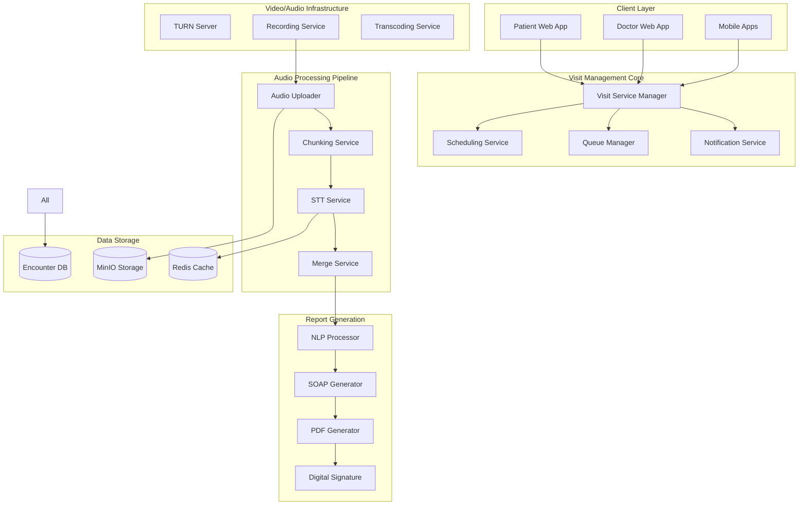

# 🏥 ویزیت و ملاقات‌های پزشکی HELSSA

## 📋 فهرست مطالب

- [معرفی سیستم ویزیت](## 🎯 معرفی سیستم ویزیت)
- [معماری سیستم ملاقات](## 🏗️ معماری سیستم ملاقات)
- [مدل‌های داده](## 📊 مدل‌های داده)
- [جریان ویزیت آنلاین](## 🔄 جریان ویزیت آنلاین)
- [پردازش صوت ویزیت](## 🎙️ پردازش صوت ویزیت)
- [تولید گزارش SOAP](## 📝 تولید گزارش SOAP)
- [مدیریت فایل‌ها](## 📂 مدیریت فایل‌ها)
- [امنیت و حریم خصوصی](## 🔒 امنیت و حریم خصوصی)

---

## 🎯 معرفی سیستم ویزیت

سیستم ویزیت HELSSA یک پلتفرم جامع برای مدیریت ملاقات‌های پزشکی است که امکان ویزیت حضوری، آنلاین، ضبط صوت، رونویسی خودکار و تولید گزارش‌های SOAP را فراهم می‌کند.

### ویژگی‌های کلیدی

- 🎥 **ویزیت ویدیویی** با کیفیت HD
- 🎙️ **ضبط خودکار صوت** ملاقات‌ها
- 📝 **رونویسی هوشمند** با Whisper
- 📊 **تولید گزارش SOAP** خودکار
- 📁 **مدیریت پرونده** بیماران
- ⏰ **زمان‌بندی هوشمند** ویزیت‌ها
- 💊 **نسخه‌نویسی الکترونیک**

## 🏗️ معماری سیستم ملاقات



### ساختار پروژه Encounters

```python
encounters/
├── models/
│   ├── encounter.py            # مدل ملاقات
│   ├── audio_chunk.py          # مدل قطعات صوتی
│   ├── transcript.py           # مدل رونویسی
│   ├── soap_report.py          # مدل گزارش SOAP
│   └── prescription.py         # مدل نسخه
├── services/
│   ├── visit_manager.py        # مدیریت ویزیت
│   ├── scheduling_service.py   # زمان‌بندی
│   ├── audio_processor.py      # پردازش صوت
│   ├── soap_generator.py       # تولید SOAP
│   └── video_service.py        # سرویس ویدیو
├── api/
│   ├── serializers.py
│   ├── views/
│   │   ├── encounter_views.py
│   │   ├── audio_views.py
│   │   └── report_views.py
│   └── permissions.py
├── tasks.py                     # Celery tasks
├── utils/
│   ├── audio_utils.py
│   ├── encryption.py
│   └── validators.py
└── migrations/
```

## 📊 مدل‌های داده

### Encounter Model

```python
# encounters/models/encounter.py
from django.db import models
import uuid
from datetime import timedelta

class Encounter(models.Model):
    """مدل ملاقات پزشکی"""
    
    ENCOUNTER_TYPES = [
        ('in_person', 'حضوری'),
        ('video', 'ویدیویی'),
        ('audio', 'صوتی'),
        ('chat', 'چت'),
        ('follow_up', 'پیگیری'),
    ]
    
    ENCOUNTER_STATUS = [
        ('scheduled', 'زمان‌بندی شده'),
        ('confirmed', 'تایید شده'),
        ('in_progress', 'در حال انجام'),
        ('completed', 'تکمیل شده'),
        ('cancelled', 'لغو شده'),
        ('no_show', 'عدم حضور'),
    ]
    
    id = models.UUIDField(primary_key=True, default=uuid.uuid4)
    
    # شرکت‌کنندگان
    patient = models.ForeignKey(
        'unified_auth.UnifiedUser',
        on_delete=models.PROTECT,
        related_name='patient_encounters'
    )
    doctor = models.ForeignKey(
        'unified_auth.UnifiedUser',
        on_delete=models.PROTECT,
        related_name='doctor_encounters'
    )
    
    # مشخصات ویزیت
    type = models.CharField(max_length=20, choices=ENCOUNTER_TYPES)
    status = models.CharField(
        max_length=20,
        choices=ENCOUNTER_STATUS,
        default='scheduled'
    )
    chief_complaint = models.TextField(
        help_text="شکایت اصلی بیمار"
    )
    
    # زمان‌بندی
    scheduled_at = models.DateTimeField()
    duration_minutes = models.IntegerField(default=30)
    started_at = models.DateTimeField(null=True, blank=True)
    ended_at = models.DateTimeField(null=True, blank=True)
    
    # لینک‌ها و دسترسی
    video_room_id = models.CharField(
        max_length=100,
        null=True,
        blank=True,
        help_text="ID اتاق ویدیو"
    )
    patient_join_url = models.URLField(null=True, blank=True)
    doctor_join_url = models.URLField(null=True, blank=True)
    
    # ضبط
    is_recording_enabled = models.BooleanField(default=True)
    recording_consent = models.BooleanField(default=False)
    recording_url = models.URLField(null=True, blank=True)
    
    # پرداخت
    fee_amount = models.DecimalField(
        max_digits=10,
        decimal_places=0,
        help_text="هزینه ویزیت به ریال"
    )
    is_paid = models.BooleanField(default=False)
    payment_transaction = models.ForeignKey(
        'unified_billing.Transaction',
        on_delete=models.SET_NULL,
        null=True,
        blank=True
    )
    
    # یادداشت‌ها
    patient_notes = models.TextField(
        null=True,
        blank=True,
        help_text="یادداشت‌های بیمار قبل از ویزیت"
    )
    doctor_notes = models.TextField(
        null=True,
        blank=True,
        help_text="یادداشت‌های پزشک"
    )
    
    # امنیت
    access_code = models.CharField(
        max_length=6,
        null=True,
        blank=True,
        help_text="کد دسترسی برای بیمار"
    )
    encryption_key = models.CharField(
        max_length=255,
        help_text="کلید رمزنگاری فایل‌ها"
    )
    
    # metadata
    metadata = models.JSONField(default=dict)
    created_at = models.DateTimeField(auto_now_add=True)
    updated_at = models.DateTimeField(auto_now=True)
    
    class Meta:
        db_table = 'encounters'
        indexes = [
            models.Index(fields=['patient', 'status', 'scheduled_at']),
            models.Index(fields=['doctor', 'status', 'scheduled_at']),
            models.Index(fields=['scheduled_at']),
            models.Index(fields=['video_room_id']),
        ]
        ordering = ['-scheduled_at']
        
    @property
    def actual_duration(self) -> timedelta:
        """مدت زمان واقعی ویزیت"""
        if self.started_at and self.ended_at:
            return self.ended_at - self.started_at
        return timedelta(minutes=self.duration_minutes)
        
    @property
    def is_upcoming(self) -> bool:
        """آیا ویزیت در آینده است"""
        return self.scheduled_at > timezone.now() and self.status == 'scheduled'
```

### AudioChunk Model

```python
# encounters/models/audio_chunk.py

class AudioChunk(models.Model):
    """مدل قطعات صوتی ضبط شده"""
    
    id = models.UUIDField(primary_key=True, default=uuid.uuid4)
    encounter = models.ForeignKey(
        Encounter,
        on_delete=models.CASCADE,
        related_name='audio_chunks'
    )
    
    # مشخصات فایل
    chunk_index = models.IntegerField(
        help_text="شماره ترتیبی قطعه"
    )
    file_url = models.URLField(
        help_text="آدرس فایل در MinIO"
    )
    file_size = models.IntegerField(
        help_text="حجم فایل به بایت"
    )
    duration_seconds = models.FloatField(
        help_text="مدت زمان قطعه به ثانیه"
    )
    
    # فرمت و کیفیت
    format = models.CharField(
        max_length=10,
        default='webm',
        choices=[
            ('webm', 'WebM'),
            ('mp3', 'MP3'),
            ('wav', 'WAV'),
            ('ogg', 'OGG'),
        ]
    )
    sample_rate = models.IntegerField(default=48000)
    bit_rate = models.IntegerField(null=True, blank=True)
    
    # وضعیت پردازش
    is_processed = models.BooleanField(default=False)
    transcription_status = models.CharField(
        max_length=20,
        choices=[
            ('pending', 'در انتظار'),
            ('processing', 'در حال پردازش'),
            ('completed', 'تکمیل شده'),
            ('failed', 'ناموفق'),
        ],
        default='pending'
    )
    
    # رمزنگاری
    is_encrypted = models.BooleanField(default=True)
    encryption_metadata = models.JSONField(
        default=dict,
        help_text="اطلاعات رمزنگاری"
    )
    
    # زمان‌ها
    recorded_at = models.DateTimeField(auto_now_add=True)
    processed_at = models.DateTimeField(null=True, blank=True)
    
    class Meta:
        db_table = 'audio_chunks'
        unique_together = [['encounter', 'chunk_index']]
        ordering = ['encounter', 'chunk_index']
```

### Transcript Model

```python
# encounters/models/transcript.py

class Transcript(models.Model):
    """مدل رونویسی صوت"""
    
    id = models.UUIDField(primary_key=True, default=uuid.uuid4)
    audio_chunk = models.OneToOneField(
        AudioChunk,
        on_delete=models.CASCADE,
        related_name='transcript'
    )
    
    # متن رونویسی
    text = models.TextField(
        help_text="متن رونویسی شده"
    )
    language = models.CharField(
        max_length=5,
        default='fa',
        help_text="زبان تشخیص داده شده"
    )
    
    # کیفیت و دقت
    confidence_score = models.FloatField(
        default=0.0,
        help_text="امتیاز اطمینان (0-1)"
    )
    word_timestamps = models.JSONField(
        default=list,
        help_text="زمان‌بندی کلمات"
    )
    
    # Speaker Diarization
    speakers = models.JSONField(
        default=dict,
        help_text="تشخیص گوینده‌ها"
    )
    
    # پردازش‌های اضافی
    medical_entities = models.JSONField(
        default=dict,
        help_text="موجودیت‌های پزشکی استخراج شده"
    )
    corrections = models.JSONField(
        default=list,
        help_text="اصلاحات دستی"
    )
    
    # metadata
    stt_model = models.CharField(
        max_length=50,
        default='whisper-1'
    )
    processing_time = models.FloatField(
        null=True,
        blank=True,
        help_text="زمان پردازش به ثانیه"
    )
    
    created_at = models.DateTimeField(auto_now_add=True)
    updated_at = models.DateTimeField(auto_now=True)
    
    class Meta:
        db_table = 'transcripts'
        indexes = [
            models.Index(fields=['audio_chunk', 'language']),
        ]
```

### SOAPReport Model

```python
# encounters/models/soap_report.py

class SOAPReport(models.Model):
    """مدل گزارش SOAP"""
    
    id = models.UUIDField(primary_key=True, default=uuid.uuid4)
    encounter = models.OneToOneField(
        Encounter,
        on_delete=models.CASCADE,
        related_name='soap_report'
    )
    
    # بخش‌های SOAP
    subjective = models.TextField(
        help_text="Subjective - شرح حال و علائم بیمار"
    )
    objective = models.TextField(
        help_text="Objective - یافته‌های معاینه و آزمایشات"
    )
    assessment = models.TextField(
        help_text="Assessment - ارزیابی و تشخیص"
    )
    plan = models.TextField(
        help_text="Plan - برنامه درمان"
    )
    
    # داده‌های ساختاریافته
    diagnoses = models.JSONField(
        default=list,
        help_text="لیست تشخیص‌ها با کد ICD"
    )
    medications = models.JSONField(
        default=list,
        help_text="داروهای تجویز شده"
    )
    lab_orders = models.JSONField(
        default=list,
        help_text="درخواست‌های آزمایش"
    )
    follow_up = models.JSONField(
        default=dict,
        help_text="برنامه پیگیری"
    )
    
    # تاییدیه‌ها
    is_draft = models.BooleanField(default=True)
    doctor_approved = models.BooleanField(default=False)
    doctor_approved_at = models.DateTimeField(null=True, blank=True)
    patient_shared = models.BooleanField(default=False)
    patient_shared_at = models.DateTimeField(null=True, blank=True)
    
    # امضای دیجیتال
    doctor_signature = models.TextField(
        null=True,
        blank=True,
        help_text="امضای دیجیتال پزشک"
    )
    signature_timestamp = models.DateTimeField(null=True, blank=True)
    
    # خروجی‌ها
    pdf_url = models.URLField(
        null=True,
        blank=True,
        help_text="آدرس فایل PDF"
    )
    markdown_content = models.TextField(
        null=True,
        blank=True,
        help_text="محتوای Markdown"
    )
    
    # metadata
    generation_method = models.CharField(
        max_length=20,
        choices=[
            ('ai', 'تولید با AI'),
            ('manual', 'دستی'),
            ('hybrid', 'ترکیبی'),
        ],
        default='ai'
    )
    ai_confidence = models.FloatField(
        null=True,
        blank=True,
        help_text="امتیاز اطمینان AI"
    )
    
    created_at = models.DateTimeField(auto_now_add=True)
    updated_at = models.DateTimeField(auto_now=True)
    
    class Meta:
        db_table = 'soap_reports'
```

## 🔄 جریان ویزیت آنلاین

### Visit Scheduling Service

```python
# encounters/services/scheduling_service.py
from datetime import datetime, timedelta
from typing import Dict, List, Optional

class VisitSchedulingService:
    """سرویس زمان‌بندی ویزیت‌ها"""
    
    def __init__(self):
        self.notification_service = NotificationService()
        self.payment_service = PaymentService()
        self.video_service = VideoConferenceService()
        
    async def schedule_visit(
        self,
        patient_id: str,
        doctor_id: str,
        visit_type: str,
        scheduled_at: datetime,
        duration_minutes: int = 30,
        chief_complaint: str = "",
        notes: Optional[str] = None
    ) -> Encounter:
        """زمان‌بندی ویزیت جدید"""
        
        # بررسی در دسترس بودن پزشک
        if not await self._check_doctor_availability(
            doctor_id, scheduled_at, duration_minutes
        ):
            raise SchedulingConflictError(
                "پزشک در این زمان در دسترس نیست"
            )
            
        # بررسی تداخل با ویزیت‌های بیمار
        if await self._has_patient_conflict(
            patient_id, scheduled_at, duration_minutes
        ):
            raise SchedulingConflictError(
                "شما در این زمان ویزیت دیگری دارید"
            )
            
        # محاسبه هزینه ویزیت
        doctor = await UnifiedUser.objects.get(id=doctor_id)
        fee_amount = await self._calculate_visit_fee(
            doctor, visit_type, duration_minutes
        )
        
        # ایجاد encounter
        encounter = await Encounter.objects.create(
            patient_id=patient_id,
            doctor_id=doctor_id,
            type=visit_type,
            scheduled_at=scheduled_at,
            duration_minutes=duration_minutes,
            chief_complaint=chief_complaint,
            patient_notes=notes,
            fee_amount=fee_amount,
            encryption_key=self._generate_encryption_key()
        )
        
        # ایجاد اتاق ویدیو برای ویزیت‌های آنلاین
        if visit_type in ['video', 'audio']:
            video_room = await self.video_service.create_room(
                encounter_id=str(encounter.id),
                scheduled_at=scheduled_at,
                duration_minutes=duration_minutes
            )
            
            encounter.video_room_id = video_room['room_id']
            encounter.patient_join_url = video_room['patient_url']
            encounter.doctor_join_url = video_room['doctor_url']
            await encounter.save()
            
        # ارسال نوتیفیکیشن
        await self._send_scheduling_notifications(encounter)
        
        # تنظیم یادآوری‌ها
        await self._schedule_reminders(encounter)
        
        return encounter
        
    async def confirm_visit(
        self,
        encounter_id: str,
        confirmed_by: str
    ) -> Encounter:
        """تایید ویزیت"""
        
        encounter = await Encounter.objects.get(
            id=encounter_id,
            status='scheduled'
        )
        
        # پردازش پرداخت
        if not encounter.is_paid:
            payment = await self.payment_service.process_visit_payment(
                encounter.patient,
                encounter.fee_amount,
                encounter_id
            )
            
            encounter.is_paid = True
            encounter.payment_transaction = payment
            
        # به‌روزرسانی وضعیت
        encounter.status = 'confirmed'
        encounter.metadata['confirmed_by'] = confirmed_by
        encounter.metadata['confirmed_at'] = datetime.utcnow().isoformat()
        await encounter.save()
        
        # ارسال تاییدیه
        await self._send_confirmation_notifications(encounter)
        
        return encounter
        
    async def start_visit(
        self,
        encounter_id: str,
        started_by: str
    ) -> Dict:
        """شروع ویزیت"""
        
        encounter = await Encounter.objects.get(
            id=encounter_id,
            status='confirmed'
        )
        
        # بررسی زمان
        now = timezone.now()
        scheduled_time = encounter.scheduled_at
        
        # اجازه شروع از 10 دقیقه قبل
        if now < scheduled_time - timedelta(minutes=10):
            raise EarlyStartError(
                f"ویزیت از {scheduled_time} قابل شروع است"
            )
            
        # به‌روزرسانی وضعیت
        encounter.status = 'in_progress'
        encounter.started_at = now
        await encounter.save()
        
        # شروع ضبط در صورت رضایت
        if encounter.recording_consent:
            await self._start_recording(encounter)
            
        # بازگشت اطلاعات اتصال
        return {
            'encounter_id': str(encounter.id),
            'video_room_id': encounter.video_room_id,
            'join_url': (
                encounter.doctor_join_url 
                if started_by == str(encounter.doctor_id)
                else encounter.patient_join_url
            ),
            'recording_enabled': encounter.is_recording_enabled,
            'estimated_end_time': now + timedelta(
                minutes=encounter.duration_minutes
            )
        }
        
    async def end_visit(
        self,
        encounter_id: str,
        ended_by: str
    ) -> Encounter:
        """پایان ویزیت"""
        
        encounter = await Encounter.objects.get(
            id=encounter_id,
            status='in_progress'
        )
        
        # به‌روزرسانی وضعیت
        encounter.status = 'completed'
        encounter.ended_at = timezone.now()
        await encounter.save()
        
        # توقف ضبط
        if encounter.is_recording_enabled:
            recording_url = await self._stop_recording(encounter)
            encounter.recording_url = recording_url
            await encounter.save()
            
        # شروع پردازش‌های پس از ویزیت
        await self._post_visit_processing(encounter)
        
        return encounter
        
    async def _check_doctor_availability(
        self,
        doctor_id: str,
        scheduled_at: datetime,
        duration_minutes: int
    ) -> bool:
        """بررسی در دسترس بودن پزشک"""
        
        # بررسی ساعات کاری
        doctor_profile = await DoctorProfile.objects.get(user_id=doctor_id)
        working_hours = doctor_profile.working_hours
        
        day_of_week = scheduled_at.strftime('%A').lower()
        if day_of_week not in working_hours:
            return False
            
        time_str = scheduled_at.strftime('%H:%M')
        day_hours = working_hours[day_of_week]
        
        if not (day_hours['start'] <= time_str <= day_hours['end']):
            return False
            
        # بررسی تداخل با ویزیت‌های دیگر
        end_time = scheduled_at + timedelta(minutes=duration_minutes)
        
        conflicts = await Encounter.objects.filter(
            doctor_id=doctor_id,
            status__in=['scheduled', 'confirmed'],
            scheduled_at__lt=end_time,
            scheduled_at__gte=scheduled_at - timedelta(
                minutes=F('duration_minutes')
            )
        ).exists()
        
        return not conflicts
```

### Video Conference Service

```python
# encounters/services/video_service.py
import jwt
from typing import Dict
import aiohttp

class VideoConferenceService:
    """سرویس کنفرانس ویدیویی"""
    
    def __init__(self):
        self.jitsi_domain = settings.JITSI_DOMAIN
        self.jwt_secret = settings.JITSI_JWT_SECRET
        self.turn_servers = settings.TURN_SERVERS
        
    async def create_room(
        self,
        encounter_id: str,
        scheduled_at: datetime,
        duration_minutes: int
    ) -> Dict:
        """ایجاد اتاق ویدیو"""
        
        room_id = f"helssa-{encounter_id[:8]}"
        
        # تولید JWT برای محدودسازی دسترسی
        patient_jwt = self._generate_room_jwt(
            room_id,
            'patient',
            duration_minutes
        )
        doctor_jwt = self._generate_room_jwt(
            room_id,
            'doctor',
            duration_minutes,
            is_moderator=True
        )
        
        # URL های اتصال
        base_url = f"https://{self.jitsi_domain}/{room_id}"
        
        return {
            'room_id': room_id,
            'patient_url': f"{base_url}?jwt={patient_jwt}",
            'doctor_url': f"{base_url}?jwt={doctor_jwt}",
            'turn_servers': self.turn_servers,
            'expires_at': scheduled_at + timedelta(
                minutes=duration_minutes + 30
            )
        }
        
    def _generate_room_jwt(
        self,
        room_id: str,
        user_type: str,
        duration_minutes: int,
        is_moderator: bool = False
    ) -> str:
        """تولید JWT برای دسترسی به اتاق"""
        
        now = datetime.utcnow()
        exp = now + timedelta(minutes=duration_minutes + 30)
        
        payload = {
            'aud': 'jitsi',
            'iss': 'helssa',
            'sub': self.jitsi_domain,
            'room': room_id,
            'exp': int(exp.timestamp()),
            'moderator': is_moderator,
            'context': {
                'user': {
                    'name': f"HELSSA {user_type.title()}",
                    'avatar': '',
                    'id': user_type
                },
                'features': {
                    'recording': is_moderator,
                    'livestreaming': False,
                    'transcription': False,
                    'outbound-call': False
                }
            }
        }
        
        return jwt.encode(payload, self.jwt_secret, algorithm='HS256')
        
    async def start_recording(
        self,
        room_id: str,
        encounter_id: str
    ) -> bool:
        """شروع ضبط ویدیو"""
        
        # ارسال درخواست به Jibri
        async with aiohttp.ClientSession() as session:
            async with session.post(
                f"{settings.JIBRI_URL}/api/record/start",
                json={
                    'room_id': room_id,
                    'session_id': encounter_id,
                    'stream_key': self._generate_stream_key(encounter_id)
                },
                headers={'Authorization': f'Bearer {settings.JIBRI_TOKEN}'}
            ) as response:
                return response.status == 200
                
    async def stop_recording(
        self,
        room_id: str,
        encounter_id: str
    ) -> str:
        """توقف ضبط و دریافت URL"""
        
        async with aiohttp.ClientSession() as session:
            async with session.post(
                f"{settings.JIBRI_URL}/api/record/stop",
                json={'room_id': room_id},
                headers={'Authorization': f'Bearer {settings.JIBRI_TOKEN}'}
            ) as response:
                if response.status == 200:
                    data = await response.json()
                    
                    # آپلود به MinIO
                    file_url = await self._upload_recording(
                        data['file_path'],
                        encounter_id
                    )
                    
                    return file_url
                    
        return None
```

## 🎙️ پردازش صوت ویزیت

### Audio Processing Service

```python
# encounters/services/audio_processor.py
from pydub import AudioSegment
import asyncio
from typing import List, Dict

class AudioProcessingService:
    """سرویس پردازش صوت ویزیت‌ها"""
    
    def __init__(self):
        self.storage_service = MinIOStorageService()
        self.encryption_service = EncryptionService()
        self.chunk_size_mb = 10  # حجم هر قطعه
        self.overlap_seconds = 2  # همپوشانی بین قطعات
        
    async def process_visit_audio(
        self,
        encounter_id: str,
        audio_stream: bytes,
        chunk_index: int
    ) -> AudioChunk:
        """پردازش یک قطعه صوتی"""
        
        encounter = await Encounter.objects.get(id=encounter_id)
        
        # رمزنگاری صوت
        encrypted_audio = await self.encryption_service.encrypt(
            audio_stream,
            encounter.encryption_key
        )
        
        # آپلود به MinIO
        file_name = f"encounters/{encounter_id}/chunk_{chunk_index:04d}.webm"
        file_url = await self.storage_service.upload(
            file_name,
            encrypted_audio,
            content_type='audio/webm'
        )
        
        # تحلیل صوت
        audio_info = await self._analyze_audio(audio_stream)
        
        # ایجاد رکورد AudioChunk
        audio_chunk = await AudioChunk.objects.create(
            encounter=encounter,
            chunk_index=chunk_index,
            file_url=file_url,
            file_size=len(encrypted_audio),
            duration_seconds=audio_info['duration'],
            format='webm',
            sample_rate=audio_info['sample_rate'],
            bit_rate=audio_info['bit_rate'],
            is_encrypted=True,
            encryption_metadata={
                'algorithm': 'AES-256-GCM',
                'key_id': encounter.encryption_key[:8]
            }
        )
        
        # شروع پردازش STT در پس‌زمینه
        asyncio.create_task(
            self._process_stt_async(audio_chunk.id)
        )
        
        return audio_chunk
        
    async def merge_audio_chunks(
        self,
        encounter_id: str
    ) -> str:
        """ادغام قطعات صوتی"""
        
        # بازیابی همه قطعات
        chunks = await AudioChunk.objects.filter(
            encounter_id=encounter_id
        ).order_by('chunk_index')
        
        # دانلود و رمزگشایی
        audio_segments = []
        for chunk in chunks:
            encrypted_data = await self.storage_service.download(
                chunk.file_url
            )
            
            decrypted_data = await self.encryption_service.decrypt(
                encrypted_data,
                chunk.encounter.encryption_key
            )
            
            segment = AudioSegment.from_file(
                io.BytesIO(decrypted_data),
                format=chunk.format
            )
            audio_segments.append(segment)
            
        # ادغام با حذف همپوشانی‌ها
        merged_audio = self._merge_with_overlap_removal(
            audio_segments,
            self.overlap_seconds
        )
        
        # تبدیل به فرمت نهایی
        output_format = 'mp3'
        output_buffer = io.BytesIO()
        merged_audio.export(
            output_buffer,
            format=output_format,
            bitrate='192k'
        )
        
        # رمزنگاری و آپلود
        encounter = await Encounter.objects.get(id=encounter_id)
        encrypted_final = await self.encryption_service.encrypt(
            output_buffer.getvalue(),
            encounter.encryption_key
        )
        
        final_url = await self.storage_service.upload(
            f"encounters/{encounter_id}/full_recording.{output_format}",
            encrypted_final,
            content_type=f'audio/{output_format}'
        )
        
        return final_url
        
    def _merge_with_overlap_removal(
        self,
        segments: List[AudioSegment],
        overlap_seconds: int
    ) -> AudioSegment:
        """ادغام با حذف همپوشانی"""
        
        if not segments:
            return AudioSegment.empty()
            
        merged = segments[0]
        overlap_ms = overlap_seconds * 1000
        
        for i in range(1, len(segments)):
            current = segments[i]
            
            # پیدا کردن نقطه اتصال با cross-correlation
            overlap_start = len(merged) - overlap_ms
            if overlap_start > 0:
                # حذف بخش همپوشان
                merged = merged[:overlap_start] + current[overlap_ms:]
            else:
                merged += current
                
        return merged
        
    async def _analyze_audio(self, audio_data: bytes) -> Dict:
        """تحلیل مشخصات صوت"""
        
        audio = AudioSegment.from_file(io.BytesIO(audio_data))
        
        return {
            'duration': len(audio) / 1000.0,  # به ثانیه
            'sample_rate': audio.frame_rate,
            'channels': audio.channels,
            'bit_rate': audio.frame_rate * audio.sample_width * 8,
            'format': audio.format
        }
```

### STT Processing Pipeline

```python
# encounters/tasks.py
from celery import shared_task, chain, group
from typing import List

@shared_task(queue='stt')
def process_audio_chunk_stt(chunk_id: str) -> Dict:
    """پردازش STT یک قطعه صوتی"""
    
    chunk = AudioChunk.objects.get(id=chunk_id)
    
    # به‌روزرسانی وضعیت
    chunk.transcription_status = 'processing'
    chunk.save()
    
    try:
        # دانلود و رمزگشایی
        encrypted_audio = download_from_minio(chunk.file_url)
        decrypted_audio = decrypt_audio(
            encrypted_audio,
            chunk.encounter.encryption_key
        )
        
        # تبدیل فرمت در صورت نیاز
        if chunk.format != 'mp3':
            converted_audio = convert_audio_format(
                decrypted_audio,
                chunk.format,
                'mp3'
            )
        else:
            converted_audio = decrypted_audio
            
        # ارسال به Whisper
        stt_service = WhisperSTTService()
        result = asyncio.run(
            stt_service.transcribe_audio(
                converted_audio,
                f"chunk_{chunk.chunk_index}.mp3",
                language='fa'
            )
        )
        
        # ذخیره رونویسی
        transcript = Transcript.objects.create(
            audio_chunk=chunk,
            text=result['text'],
            language=result['language'],
            confidence_score=result.get('confidence', 0.8),
            word_timestamps=result.get('segments', []),
            stt_model='whisper-1',
            processing_time=result.get('duration', 0)
        )
        
        # استخراج موجودیت‌های پزشکی
        medical_entities = extract_medical_entities.delay(
            transcript.id
        )
        
        # به‌روزرسانی وضعیت
        chunk.transcription_status = 'completed'
        chunk.is_processed = True
        chunk.processed_at = timezone.now()
        chunk.save()
        
        return {
            'chunk_id': str(chunk.id),
            'transcript_id': str(transcript.id),
            'text_length': len(result['text']),
            'confidence': result.get('confidence', 0)
        }
        
    except Exception as e:
        chunk.transcription_status = 'failed'
        chunk.save()
        
        raise STTProcessingError(f"خطا در پردازش STT: {str(e)}")

@shared_task
def merge_encounter_transcripts(encounter_id: str) -> str:
    """ادغام رونویسی‌های یک ملاقات"""
    
    # بازیابی تمام رونویسی‌ها
    transcripts = Transcript.objects.filter(
        audio_chunk__encounter_id=encounter_id
    ).order_by('audio_chunk__chunk_index')
    
    # ادغام متن‌ها
    full_text = ""
    for transcript in transcripts:
        full_text += transcript.text + " "
        
    # حذف تکرارها در نقاط اتصال
    cleaned_text = remove_overlap_duplicates(full_text)
    
    # ذخیره متن کامل
    encounter = Encounter.objects.get(id=encounter_id)
    encounter.metadata['full_transcript'] = cleaned_text
    encounter.metadata['transcript_word_count'] = len(cleaned_text.split())
    encounter.save()
    
    # شروع تولید SOAP
    generate_soap_report.delay(encounter_id)
    
    return cleaned_text

@shared_task(queue='nlp')
def extract_medical_entities(transcript_id: str) -> Dict:
    """استخراج موجودیت‌های پزشکی"""
    
    transcript = Transcript.objects.get(id=transcript_id)
    
    nlp_service = MedicalNLPService()
    entities = asyncio.run(
        nlp_service.extract_medical_entities(transcript.text)
    )
    
    # به‌روزرسانی transcript
    transcript.medical_entities = entities['entities']
    transcript.save()
    
    return entities
```

## 📝 تولید گزارش SOAP

### SOAP Generation Service

```python
# encounters/services/soap_generator.py
from typing import Dict, List, Optional
import asyncio

class SOAPGenerationService:
    """سرویس تولید گزارش SOAP"""
    
    def __init__(self):
        self.ai_service = UnifiedAIService()
        self.template_engine = SOAPTemplateEngine()
        self.validator = SOAPValidator()
        
    async def generate_soap_report(
        self,
        encounter_id: str,
        regenerate: bool = False
    ) -> SOAPReport:
        """تولید گزارش SOAP از ملاقات"""
        
        encounter = await Encounter.objects.select_related(
            'patient', 'doctor'
        ).get(id=encounter_id)
        
        # بررسی وجود گزارش قبلی
        if not regenerate:
            existing_report = await SOAPReport.objects.filter(
                encounter=encounter,
                doctor_approved=True
            ).first()
            
            if existing_report:
                return existing_report
                
        # جمع‌آوری داده‌ها
        context = await self._prepare_context(encounter)
        
        # تولید بخش‌های SOAP
        soap_sections = await asyncio.gather(
            self._generate_subjective(context),
            self._generate_objective(context),
            self._generate_assessment(context),
            self._generate_plan(context)
        )
        
        # ترکیب و اعتبارسنجی
        soap_data = {
            'subjective': soap_sections[0],
            'objective': soap_sections[1],
            'assessment': soap_sections[2],
            'plan': soap_sections[3]
        }
        
        # اعتبارسنجی
        validation_result = await self.validator.validate_soap(soap_data)
        if not validation_result['is_valid']:
            # تلاش برای اصلاح خودکار
            soap_data = await self._auto_correct_soap(
                soap_data,
                validation_result['issues']
            )
            
        # استخراج داده‌های ساختاریافته
        structured_data = await self._extract_structured_data(soap_data)
        
        # ایجاد یا به‌روزرسانی گزارش
        report, created = await SOAPReport.objects.update_or_create(
            encounter=encounter,
            defaults={
                **soap_data,
                **structured_data,
                'generation_method': 'ai',
                'ai_confidence': validation_result.get('confidence', 0.85)
            }
        )
        
        # تولید خروجی‌ها
        await self._generate_outputs(report)
        
        return report
        
    async def _prepare_context(self, encounter: Encounter) -> Dict:
        """آماده‌سازی context برای تولید SOAP"""
        
        # رونویسی کامل
        full_transcript = encounter.metadata.get('full_transcript', '')
        
        # تاریخچه پزشکی بیمار
        patient_history = await self._get_patient_history(
            encounter.patient_id
        )
        
        # داروهای فعلی
        current_medications = await self._get_current_medications(
            encounter.patient_id
        )
        
        # نتایج آزمایشات اخیر
        recent_labs = await self._get_recent_lab_results(
            encounter.patient_id
        )
        
        return {
            'encounter': encounter,
            'transcript': full_transcript,
            'chief_complaint': encounter.chief_complaint,
            'patient': {
                'age': self._calculate_age(encounter.patient.birth_date),
                'gender': encounter.patient.gender,
                'history': patient_history,
                'medications': current_medications,
                'labs': recent_labs
            },
            'visit_type': encounter.type,
            'duration': encounter.actual_duration.total_seconds() / 60
        }
        
    async def _generate_subjective(self, context: Dict) -> str:
        """تولید بخش Subjective"""
        
        prompt = f"""بر اساس رونویسی ملاقات پزشکی زیر، بخش Subjective گزارش SOAP را تولید کنید.

اطلاعات بیمار:
- سن: {context['patient']['age']} سال
- جنسیت: {context['patient']['gender']}
- شکایت اصلی: {context['chief_complaint']}

رونویسی ملاقات:
{context['transcript'][:3000]}  # محدود به 3000 کاراکتر اول

بخش Subjective باید شامل موارد زیر باشد:
1. شکایت اصلی (Chief Complaint - CC)
2. تاریخچه بیماری فعلی (History of Present Illness - HPI) با جزئیات OLDCARTS
3. سابقه پزشکی (Past Medical History - PMH)
4. داروهای مصرفی (Medications)
5. آلرژی‌ها (Allergies)
6. سابقه اجتماعی (Social History) در صورت ارتباط
7. سابقه خانوادگی (Family History) در صورت ذکر

فقط بخش Subjective را به فارسی و با فرمت حرفه‌ای پزشکی بنویسید."""

        response = await self.ai_service.generate_text(
            prompt,
            model='gpt-4',
            temperature=0.3,
            max_tokens=1500
        )
        
        return response['text']
        
    async def _generate_objective(self, context: Dict) -> str:
        """تولید بخش Objective"""
        
        # جمع‌آوری داده‌های عینی
        vital_signs = await self._extract_vital_signs(context['transcript'])
        exam_findings = await self._extract_exam_findings(context['transcript'])
        
        prompt = f"""بخش Objective گزارش SOAP را بر اساس اطلاعات زیر تولید کنید:

علائم حیاتی یافت شده:
{vital_signs}

یافته‌های معاینه:
{exam_findings}

نتایج آزمایشات اخیر:
{context['patient']['labs']}

بخش Objective باید شامل:
1. علائم حیاتی (Vital Signs)
2. ظاهر عمومی (General Appearance)
3. یافته‌های معاینه فیزیکی سیستمیک
4. نتایج آزمایشات و تصویربرداری

فقط یافته‌های عینی و قابل اندازه‌گیری را ذکر کنید."""

        response = await self.ai_service.generate_text(
            prompt,
            model='gpt-4',
            temperature=0.2,
            max_tokens=1000
        )
        
        return response['text']
        
    async def _generate_assessment(self, context: Dict) -> str:
        """تولید بخش Assessment"""
        
        # استخراج تشخیص‌های احتمالی
        possible_diagnoses = await self._extract_diagnoses(
            context['transcript']
        )
        
        prompt = f"""بخش Assessment گزارش SOAP را تولید کنید.

بر اساس:
- شکایت اصلی: {context['chief_complaint']}
- یافته‌های subjective و objective
- تشخیص‌های احتمالی مطرح شده: {possible_diagnoses}

Assessment باید شامل:
1. خلاصه‌ای از وضعیت بیمار
2. تشخیص‌های احتمالی به ترتیب احتمال
3. تشخیص‌های افتراقی مهم
4. ارزیابی شدت و پیش‌آگهی

از اصطلاحات پزشکی استاندارد و کدهای ICD-10 استفاده کنید."""

        response = await self.ai_service.generate_text(
            prompt,
            model='gpt-4',
            temperature=0.3,
            max_tokens=800
        )
        
        return response['text']
        
    async def _generate_plan(self, context: Dict) -> str:
        """تولید بخش Plan"""
        
        prompt = f"""بخش Plan گزارش SOAP را تولید کنید.

Plan باید شامل موارد زیر به صورت شماره‌گذاری شده باشد:
1. درمان دارویی (با ذکر دوز، روش مصرف و مدت)
2. درمان‌های غیردارویی
3. آزمایشات و تصویربرداری‌های درخواستی
4. ارجاعات تخصصی در صورت نیاز
5. آموزش بیمار
6. زمان پیگیری بعدی
7. علائم هشداردهنده که بیمار باید مراجعه فوری کند

برای داروها از نام ژنریک و دوز دقیق استفاده کنید."""

        response = await self.ai_service.generate_text(
            prompt,
            model='gpt-4',
            temperature=0.3,
            max_tokens=1000
        )
        
        return response['text']
        
    async def _extract_structured_data(self, soap_data: Dict) -> Dict:
        """استخراج داده‌های ساختاریافته از SOAP"""
        
        # استخراج تشخیص‌ها با کد ICD
        diagnoses = await self._extract_icd_codes(soap_data['assessment'])
        
        # استخراج داروها
        medications = await self._parse_medications(soap_data['plan'])
        
        # استخراج آزمایشات
        lab_orders = await self._parse_lab_orders(soap_data['plan'])
        
        # استخراج برنامه پیگیری
        follow_up = await self._parse_follow_up(soap_data['plan'])
        
        return {
            'diagnoses': diagnoses,
            'medications': medications,
            'lab_orders': lab_orders,
            'follow_up': follow_up
        }
```

### SOAP Output Generator

```python
# encounters/services/output_generator.py
from reportlab.lib import colors
from reportlab.lib.pagesizes import A4
from reportlab.platypus import SimpleDocTemplate, Table, TableStyle, Paragraph
from reportlab.lib.styles import getSampleStyleSheet, ParagraphStyle
from reportlab.lib.units import inch
import markdown2
from typing import Dict

class SOAPOutputGenerator:
    """تولیدکننده خروجی‌های گزارش SOAP"""
    
    def __init__(self):
        self.storage_service = MinIOStorageService()
        self.pdf_styles = self._setup_pdf_styles()
        
    async def generate_pdf(self, report: SOAPReport) -> str:
        """تولید PDF از گزارش SOAP"""
        
        # ایجاد buffer
        buffer = io.BytesIO()
        
        # ایجاد document
        doc = SimpleDocTemplate(
            buffer,
            pagesize=A4,
            rightMargin=72,
            leftMargin=72,
            topMargin=72,
            bottomMargin=18,
        )
        
        # محتوای PDF
        story = []
        
        # هدر
        story.extend(self._create_header(report))
        
        # اطلاعات بیمار و ویزیت
        story.extend(self._create_visit_info(report))
        
        # بخش‌های SOAP
        story.extend(self._create_soap_sections(report))
        
        # نسخه و دستورات
        if report.medications:
            story.extend(self._create_prescription(report))
            
        # امضا
        story.extend(self._create_signature_section(report))
        
        # ساخت PDF
        doc.build(story)
        
        # آپلود به storage
        pdf_bytes = buffer.getvalue()
        buffer.close()
        
        file_name = f"reports/{report.encounter_id}/soap_report.pdf"
        pdf_url = await self.storage_service.upload(
            file_name,
            pdf_bytes,
            content_type='application/pdf'
        )
        
        return pdf_url
        
    async def generate_markdown(self, report: SOAPReport) -> str:
        """تولید Markdown از گزارش SOAP"""
        
        encounter = report.encounter
        patient = encounter.patient
        doctor = encounter.doctor
        
        markdown_content = f"""# گزارش ملاقات پزشکی

## اطلاعات ویزیت
- **تاریخ**: {encounter.scheduled_at.strftime('%Y/%m/%d')}
- **ساعت**: {encounter.scheduled_at.strftime('%H:%M')}
- **نوع ویزیت**: {encounter.get_type_display()}
- **مدت زمان**: {encounter.actual_duration.total_seconds() / 60:.0f} دقیقه

## اطلاعات بیمار
- **نام**: {patient.first_name} {patient.last_name}
- **سن**: {self._calculate_age(patient.birth_date)} سال
- **جنسیت**: {patient.get_gender_display()}
- **شماره پرونده**: {patient.patient_profile.medical_record_number}

## اطلاعات پزشک
- **نام**: دکتر {doctor.first_name} {doctor.last_name}
- **تخصص**: {doctor.doctor_profile.specialty}
- **شماره نظام پزشکی**: {doctor.doctor_profile.medical_council_number}

## شکایت اصلی
{encounter.chief_complaint}

## گزارش SOAP

### Subjective (شرح حال)
{report.subjective}

### Objective (معاینه)
{report.objective}

### Assessment (ارزیابی)
{report.assessment}

### Plan (برنامه درمان)
{report.plan}

"""

        # افزودن نسخه در صورت وجود
        if report.medications:
            markdown_content += "\n## نسخه پزشکی\n\n"
            for i, med in enumerate(report.medications, 1):
                markdown_content += f"{i}. **{med['name']}**\n"
                markdown_content += f"   - دوز: {med['dosage']}\n"
                markdown_content += f"   - روش مصرف: {med['route']}\n"
                markdown_content += f"   - تعداد/مدت: {med['duration']}\n\n"
                
        # افزودن آزمایشات در صورت وجود
        if report.lab_orders:
            markdown_content += "\n## آزمایشات درخواستی\n\n"
            for lab in report.lab_orders:
                markdown_content += f"- {lab['name']}\n"
                
        # افزودن برنامه پیگیری
        if report.follow_up:
            markdown_content += f"\n## پیگیری\n"
            markdown_content += f"- **زمان**: {report.follow_up.get('date', 'به زودی')}\n"
            markdown_content += f"- **دلیل**: {report.follow_up.get('reason', 'کنترل درمان')}\n"
            
        # امضا
        if report.doctor_approved:
            markdown_content += f"\n---\n"
            markdown_content += f"**تایید شده توسط**: دکتر {doctor.first_name} {doctor.last_name}\n"
            markdown_content += f"**تاریخ تایید**: {report.doctor_approved_at.strftime('%Y/%m/%d %H:%M')}\n"
            
        return markdown_content
        
    def _create_header(self, report: SOAPReport) -> List:
        """ایجاد هدر PDF"""
        
        styles = self.pdf_styles
        story = []
        
        # لوگو و عنوان
        header_data = [
            [
                Paragraph("HELSSA", styles['Title']),
                Paragraph("گزارش ملاقات پزشکی", styles['Title'])
            ]
        ]
        
        header_table = Table(header_data, colWidths=[3*inch, 3*inch])
        header_table.setStyle(TableStyle([
            ('ALIGN', (0, 0), (-1, -1), 'CENTER'),
            ('VALIGN', (0, 0), (-1, -1), 'MIDDLE'),
            ('FONTSIZE', (0, 0), (-1, -1), 16),
            ('BOTTOMPADDING', (0, 0), (-1, -1), 12),
        ]))
        
        story.append(header_table)
        story.append(Spacer(1, 0.25*inch))
        
        return story
```

## 📁 مدیریت فایل‌ها

### File Management Service

```python
# encounters/services/file_manager.py
from typing import List, Dict, Optional
import hashlib
import magic

class EncounterFileManager:
    """مدیریت فایل‌های ملاقات"""
    
    def __init__(self):
        self.storage = MinIOStorageService()
        self.encryption = EncryptionService()
        self.allowed_types = {
            'audio': ['audio/mpeg', 'audio/wav', 'audio/webm', 'audio/ogg'],
            'image': ['image/jpeg', 'image/png', 'image/gif'],
            'document': ['application/pdf', 'application/msword'],
            'video': ['video/mp4', 'video/webm']
        }
        
    async def upload_encounter_file(
        self,
        encounter_id: str,
        file_data: bytes,
        file_name: str,
        file_type: str,
        uploaded_by: str
    ) -> EncounterFile:
        """آپلود فایل مرتبط با ملاقات"""
        
        encounter = await Encounter.objects.get(id=encounter_id)
        
        # بررسی نوع فایل
        mime_type = magic.from_buffer(file_data, mime=True)
        if not self._is_allowed_file_type(mime_type, file_type):
            raise InvalidFileTypeError(
                f"نوع فایل {mime_type} مجاز نیست"
            )
            
        # اسکن امنیتی
        if not await self._scan_file_security(file_data):
            raise SecurityError("فایل از نظر امنیتی مشکل دارد")
            
        # رمزنگاری
        encrypted_data = await self.encryption.encrypt(
            file_data,
            encounter.encryption_key
        )
        
        # تولید hash برای تشخیص تکراری
        file_hash = hashlib.sha256(file_data).hexdigest()
        
        # بررسی تکراری بودن
        existing = await EncounterFile.objects.filter(
            encounter=encounter,
            file_hash=file_hash
        ).first()
        
        if existing:
            return existing
            
        # آپلود به storage
        storage_path = f"encounters/{encounter_id}/files/{file_type}/{file_name}"
        file_url = await self.storage.upload(
            storage_path,
            encrypted_data,
            content_type=mime_type
        )
        
        # ایجاد رکورد
        encounter_file = await EncounterFile.objects.create(
            encounter=encounter,
            file_name=file_name,
            file_type=file_type,
            mime_type=mime_type,
            file_url=file_url,
            file_size=len(file_data),
            file_hash=file_hash,
            uploaded_by_id=uploaded_by,
            is_encrypted=True,
            metadata={
                'original_name': file_name,
                'upload_ip': self._get_client_ip(),
                'user_agent': self._get_user_agent()
            }
        )
        
        return encounter_file
        
    async def get_encounter_files(
        self,
        encounter_id: str,
        file_type: Optional[str] = None,
        user_id: str = None
    ) -> List[Dict]:
        """دریافت فایل‌های ملاقات"""
        
        encounter = await Encounter.objects.get(id=encounter_id)
        
        # بررسی دسترسی
        if user_id:
            has_access = await self._check_file_access(
                encounter, user_id
            )
            if not has_access:
                raise PermissionDenied("شما دسترسی به این فایل‌ها ندارید")
                
        # Query files
        query = EncounterFile.objects.filter(encounter=encounter)
        if file_type:
            query = query.filter(file_type=file_type)
            
        files = await query.order_by('-created_at')
        
        # آماده‌سازی برای نمایش
        result = []
        for file in files:
            # تولید لینک موقت دانلود
            download_url = await self._generate_download_url(
                file, user_id
            )
            
            result.append({
                'id': str(file.id),
                'name': file.file_name,
                'type': file.file_type,
                'mime_type': file.mime_type,
                'size': file.file_size,
                'download_url': download_url,
                'uploaded_at': file.created_at.isoformat(),
                'uploaded_by': file.uploaded_by.get_full_name()
            })
            
        return result
        
    async def _generate_download_url(
        self,
        file: EncounterFile,
        user_id: str
    ) -> str:
        """تولید لینک دانلود موقت"""
        
        # تولید توکن دانلود
        token_data = {
            'file_id': str(file.id),
            'user_id': user_id,
            'expires': (datetime.utcnow() + timedelta(hours=1)).isoformat()
        }
        
        token = jwt.encode(
            token_data,
            settings.SECRET_KEY,
            algorithm='HS256'
        )
        
        return f"{settings.BASE_URL}/api/encounters/files/download/?token={token}"
```

## 🔐 امنیت و حریم خصوصی

### Encounter Security Service

```python
# encounters/services/security_service.py
from cryptography.fernet import Fernet
from cryptography.hazmat.primitives import hashes
from cryptography.hazmat.primitives.kdf.pbkdf2 import PBKDF2HMAC
import base64

class EncounterSecurityService:
    """سرویس امنیت ملاقات‌ها"""
    
    def __init__(self):
        self.access_manager = AccessManager()
        self.audit_logger = AuditLogger()
        
    async def check_encounter_access(
        self,
        user_id: str,
        encounter_id: str,
        action: str = 'view'
    ) -> bool:
        """بررسی دسترسی به ملاقات"""
        
        encounter = await Encounter.objects.get(id=encounter_id)
        user = await UnifiedUser.objects.get(id=user_id)
        
        # دسترسی‌های پایه
        # بیمار و پزشک همیشه دسترسی دارند
        if str(encounter.patient_id) == user_id:
            allowed_actions = ['view', 'download']
            return action in allowed_actions
            
        if str(encounter.doctor_id) == user_id:
            return True  # پزشک دسترسی کامل دارد
            
        # بررسی دسترسی موقت
        temp_access = await self.access_manager.check_temporary_access(
            doctor_id=user_id,
            patient_id=str(encounter.patient_id),
            resource='encounter',
            action=action
        )
        
        if temp_access:
            # ثبت در audit log
            await self.audit_logger.log_access(
                user_id=user_id,
                resource_type='encounter',
                resource_id=encounter_id,
                action=action,
                granted=True,
                reason='temporary_access'
            )
            return True
            
        # بررسی نقش‌های سیستمی
        if user.user_type == 'admin':
            return action in ['view', 'audit']
            
        return False
        
    def generate_encryption_key(self) -> str:
        """تولید کلید رمزنگاری برای ملاقات"""
        
        # تولید کلید تصادفی
        key = Fernet.generate_key()
        return base64.urlsafe_b64encode(key).decode()
        
    async def encrypt_sensitive_data(
        self,
        data: str,
        encryption_key: str
    ) -> str:
        """رمزنگاری داده‌های حساس"""
        
        # ایجاد Fernet cipher
        key = base64.urlsafe_b64decode(encryption_key.encode())
        cipher = Fernet(key)
        
        # رمزنگاری
        encrypted = cipher.encrypt(data.encode())
        return base64.urlsafe_b64encode(encrypted).decode()
        
    async def decrypt_sensitive_data(
        self,
        encrypted_data: str,
        encryption_key: str
    ) -> str:
        """رمزگشایی داده‌های حساس"""
        
        # ایجاد Fernet cipher
        key = base64.urlsafe_b64decode(encryption_key.encode())
        cipher = Fernet(key)
        
        # رمزگشایی
        encrypted_bytes = base64.urlsafe_b64decode(encrypted_data.encode())
        decrypted = cipher.decrypt(encrypted_bytes)
        return decrypted.decode()
        
    async def anonymize_encounter_data(
        self,
        encounter_id: str
    ) -> Dict:
        """ناشناس‌سازی داده‌های ملاقات برای تحقیقات"""
        
        encounter = await Encounter.objects.get(id=encounter_id)
        
        # داده‌های ناشناس شده
        anonymized = {
            'id': hashlib.sha256(str(encounter.id).encode()).hexdigest()[:16],
            'patient_age': self._calculate_age(encounter.patient.birth_date),
            'patient_gender': encounter.patient.gender,
            'visit_type': encounter.type,
            'duration_minutes': encounter.duration_minutes,
            'chief_complaint_category': self._categorize_complaint(
                encounter.chief_complaint
            )
        }
        
        # گزارش SOAP ناشناس
        if hasattr(encounter, 'soap_report'):
            report = encounter.soap_report
            anonymized['diagnoses'] = [
                d['icd_code'] for d in report.diagnoses
            ]
            anonymized['medication_count'] = len(report.medications)
            anonymized['lab_order_count'] = len(report.lab_orders)
            
        return anonymized
        
    async def audit_encounter_access(
        self,
        encounter_id: str,
        start_date: Optional[datetime] = None,
        end_date: Optional[datetime] = None
    ) -> List[Dict]:
        """گزارش دسترسی‌ها به ملاقات"""
        
        query = AuditLog.objects.filter(
            resource_type='encounter',
            resource_id=encounter_id
        )
        
        if start_date:
            query = query.filter(created_at__gte=start_date)
        if end_date:
            query = query.filter(created_at__lte=end_date)
            
        logs = await query.order_by('-created_at')
        
        return [
            {
                'user': log.user.get_full_name(),
                'action': log.action,
                'timestamp': log.created_at.isoformat(),
                'ip_address': log.ip_address,
                'user_agent': log.user_agent,
                'granted': log.granted
            }
            for log in logs
        ]
```

---

[ELEMENT: div align="center"]

[→ قبلی: سیستم مالی و اشتراک](07-billing-system.md) | [بعدی: دسترسی پزشک به بیمار ←](09-doctor-access.md)

</div>
