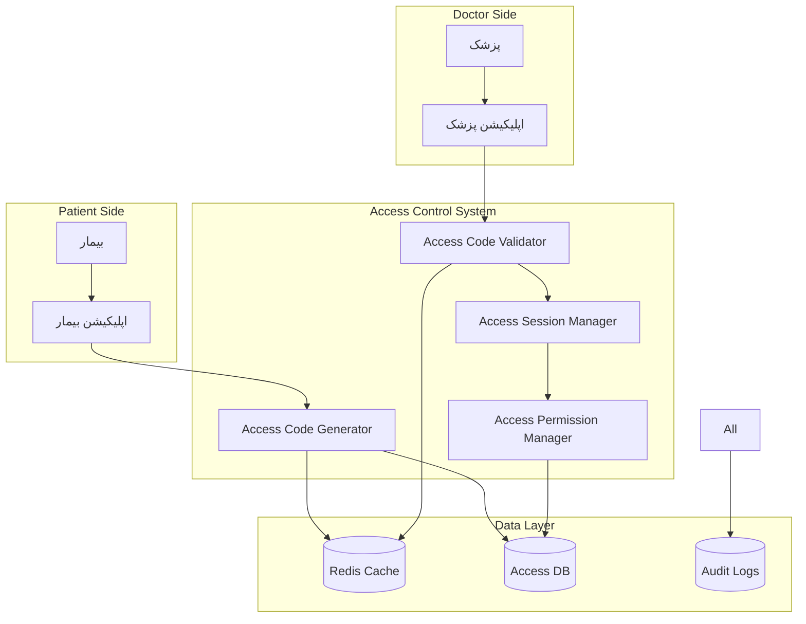

# 🔑 دسترسی پزشک به بیمار HELSSA

## 📋 فهرست مطالب

- [معرفی سیستم دسترسی](## 🎯 معرفی سیستم دسترسی)
- [معماری دسترسی موقت](## 🏗️ معماری دسترسی موقت)
- [کد دسترسی 6 رقمی](## 🔢 کد دسترسی 6 رقمی)
- [مدیریت جلسات دسترسی](## 🔢 مدیریت جلسات دسترسی)
- [سطوح دسترسی](## 🔢 سطوح دسترسی)
- [Audit و گزارش‌دهی](## 🔢 Audit و گزارش‌دهی)
- [رابط کاربری](## 🔢 رابط کاربری)
- [امنیت و محدودیت‌ها](## 🔢 امنیت و محدودیت‌ها)

---

## 🎯 معرفی سیستم دسترسی

سیستم دسترسی پزشک به بیمار در HELSSA یک مکانیزم امن و موقت برای اشتراک‌گذاری اطلاعات پزشکی است که به بیماران کنترل کامل بر داده‌های خود را می‌دهد.

### ویژگی‌های کلیدی

- 🔢 **کد دسترسی 6 رقمی** ساده و امن
- ⏱️ **دسترسی موقت** با زمان انقضا
- 🎚️ **سطوح دسترسی** قابل تنظیم
- 📝 **Audit Trail** کامل
- 🔐 **رمزنگاری End-to-End**
- 📱 **رابط کاربری ساده** برای بیمار و پزشک
- 🚫 **قابلیت لغو فوری** توسط بیمار

## 🏗️ معماری دسترسی موقت



### ساختار پروژه

```python
unified_access/
├── models/
│   ├── access_code.py          # مدل کد دسترسی
│   ├── access_session.py       # مدل جلسه دسترسی
│   ├── access_permission.py    # مدل مجوزها
│   └── access_log.py           # مدل لاگ دسترسی
├── services/
│   ├── code_generator.py       # تولید کد
│   ├── code_validator.py       # اعتبارسنجی کد
│   ├── session_manager.py      # مدیریت جلسات
│   ├── permission_checker.py   # بررسی مجوزها
│   └── audit_service.py        # ثبت audit
├── api/
│   ├── serializers.py
│   ├── views/
│   │   ├── patient_views.py    # API بیمار
│   │   └── doctor_views.py     # API پزشک
│   └── permissions.py
├── utils/
│   ├── code_utils.py           # ابزارهای کد
│   ├── security.py             # امنیت
│   └── notifications.py        # اطلاع‌رسانی
└── tasks.py                     # Celery tasks
```

## 🔢 کد دسترسی 6 رقمی

### Access Code Model

```python
# unified_access/models/access_code.py
from django.db import models
import uuid
from datetime import timedelta

class AccessCode(models.Model):
    """مدل کد دسترسی موقت"""
    
    id = models.UUIDField(primary_key=True, default=uuid.uuid4)
    
    # کد دسترسی
    code = models.CharField(
        max_length=6,
        unique=True,
        db_index=True,
        help_text="کد دسترسی 6 رقمی"
    )
    
    # مالک و مقصد
    patient = models.ForeignKey(
        'unified_auth.UnifiedUser',
        on_delete=models.CASCADE,
        related_name='generated_access_codes'
    )
    doctor = models.ForeignKey(
        'unified_auth.UnifiedUser',
        on_delete=models.CASCADE,
        null=True,
        blank=True,
        related_name='received_access_codes',
        help_text="پزشک مشخص (اختیاری)"
    )
    
    # محدودیت‌ها
    permissions = models.JSONField(
        default=list,
        help_text="لیست مجوزهای داده شده"
    )
    """
    [
        "view_basic_info",
        "view_medical_history",
        "view_lab_results",
        "view_prescriptions",
        "view_encounters",
        "add_notes",
        "prescribe_medication"
    ]
    """
    
    # زمان‌بندی
    created_at = models.DateTimeField(auto_now_add=True)
    expires_at = models.DateTimeField()
    duration_hours = models.IntegerField(
        default=24,
        help_text="مدت اعتبار به ساعت"
    )
    
    # وضعیت
    is_active = models.BooleanField(default=True)
    is_used = models.BooleanField(default=False)
    used_at = models.DateTimeField(null=True, blank=True)
    used_by = models.ForeignKey(
        'unified_auth.UnifiedUser',
        on_delete=models.SET_NULL,
        null=True,
        blank=True,
        related_name='used_access_codes'
    )
    
    # محدودیت استفاده
    max_uses = models.IntegerField(
        default=1,
        help_text="حداکثر تعداد استفاده"
    )
    use_count = models.IntegerField(default=0)
    
    # metadata
    purpose = models.CharField(
        max_length=100,
        null=True,
        blank=True,
        help_text="هدف از ایجاد کد"
    )
    metadata = models.JSONField(default=dict)
    
    class Meta:
        db_table = 'access_codes'
        indexes = [
            models.Index(fields=['code', 'is_active']),
            models.Index(fields=['patient', 'is_active']),
            models.Index(fields=['expires_at']),
        ]
        
    def is_valid(self) -> bool:
        """بررسی اعتبار کد"""
        now = timezone.now()
        return (
            self.is_active and
            not self.is_used and
            self.expires_at > now and
            self.use_count < self.max_uses
        )
```

### Code Generator Service

```python
# unified_access/services/code_generator.py
import secrets
import string
from typing import List, Optional, Dict
from datetime import datetime, timedelta

class AccessCodeGenerator:
    """سرویس تولید کد دسترسی"""
    
    def __init__(self):
        self.redis_client = get_redis_client()
        self.notification_service = NotificationService()
        
    async def generate_access_code(
        self,
        patient_id: str,
        permissions: List[str],
        duration_hours: int = 24,
        doctor_id: Optional[str] = None,
        purpose: Optional[str] = None
    ) -> AccessCode:
        """تولید کد دسترسی جدید"""
        
        # اعتبارسنجی
        patient = await UnifiedUser.objects.get(id=patient_id)
        if patient.user_type != 'patient':
            raise ValueError("فقط بیماران می‌توانند کد دسترسی ایجاد کنند")
            
        # بررسی محدودیت تعداد کدهای فعال
        active_codes = await AccessCode.objects.filter(
            patient=patient,
            is_active=True,
            expires_at__gt=timezone.now()
        ).count()
        
        if active_codes >= 5:
            raise LimitExceeded("حداکثر 5 کد فعال مجاز است")
            
        # تولید کد یکتا
        code = await self._generate_unique_code()
        
        # محاسبه زمان انقضا
        expires_at = timezone.now() + timedelta(hours=duration_hours)
        
        # ایجاد رکورد
        access_code = await AccessCode.objects.create(
            code=code,
            patient=patient,
            doctor_id=doctor_id,
            permissions=permissions,
            duration_hours=duration_hours,
            expires_at=expires_at,
            purpose=purpose,
            metadata={
                'created_ip': self._get_client_ip(),
                'created_device': self._get_device_info()
            }
        )
        
        # ذخیره در کش برای دسترسی سریع
        await self._cache_access_code(access_code)
        
        # ارسال نوتیفیکیشن
        await self._send_code_notification(patient, code, expires_at)
        
        # Audit log
        await self._log_code_generation(access_code)
        
        return access_code
        
    async def _generate_unique_code(self) -> str:
        """تولید کد 6 رقمی یکتا"""
        
        max_attempts = 10
        for _ in range(max_attempts):
            # تولید کد تصادفی
            code = ''.join(secrets.choice(string.digits) for _ in range(6))
            
            # بررسی یکتا بودن
            exists = await AccessCode.objects.filter(
                code=code,
                is_active=True
            ).exists()
            
            if not exists:
                return code
                
        raise RuntimeError("امکان تولید کد یکتا وجود ندارد")
        
    async def _cache_access_code(self, access_code: AccessCode):
        """ذخیره کد در کش"""
        
        cache_key = f"access_code:{access_code.code}"
        cache_data = {
            'id': str(access_code.id),
            'patient_id': str(access_code.patient_id),
            'doctor_id': str(access_code.doctor_id) if access_code.doctor_id else None,
            'permissions': access_code.permissions,
            'expires_at': access_code.expires_at.isoformat(),
            'use_count': access_code.use_count,
            'max_uses': access_code.max_uses
        }
        
        ttl = int((access_code.expires_at - timezone.now()).total_seconds())
        await self.redis_client.setex(
            cache_key,
            ttl,
            json.dumps(cache_data)
        )
        
    async def revoke_access_code(
        self,
        code_id: str,
        revoked_by: str,
        reason: Optional[str] = None
    ) -> bool:
        """لغو کد دسترسی"""
        
        access_code = await AccessCode.objects.get(id=code_id)
        
        # بررسی مجوز لغو
        if str(access_code.patient_id) != revoked_by:
            raise PermissionDenied("فقط صاحب کد می‌تواند آن را لغو کند")
            
        # لغو کد
        access_code.is_active = False
        access_code.metadata['revoked_at'] = timezone.now().isoformat()
        access_code.metadata['revoked_by'] = revoked_by
        access_code.metadata['revoke_reason'] = reason
        await access_code.save()
        
        # حذف از کش
        await self.redis_client.delete(f"access_code:{access_code.code}")
        
        # لغو جلسات مرتبط
        await self._revoke_related_sessions(access_code)
        
        # Audit log
        await self._log_code_revocation(access_code, reason)
        
        return True
```

### Code Validator Service

```python
# unified_access/services/code_validator.py

class AccessCodeValidator:
    """سرویس اعتبارسنجی کد دسترسی"""
    
    def __init__(self):
        self.redis_client = get_redis_client()
        self.session_manager = AccessSessionManager()
        self.audit_service = AuditService()
        
    async def validate_access_code(
        self,
        code: str,
        doctor_id: str,
        device_info: Dict
    ) -> Dict:
        """اعتبارسنجی و استفاده از کد"""
        
        # بررسی در کش
        cache_key = f"access_code:{code}"
        cached_data = await self.redis_client.get(cache_key)
        
        if cached_data:
            code_data = json.loads(cached_data)
            access_code_id = code_data['id']
        else:
            # بازیابی از دیتابیس
            try:
                access_code = await AccessCode.objects.get(
                    code=code,
                    is_active=True
                )
                access_code_id = str(access_code.id)
            except AccessCode.DoesNotExist:
                # ثبت تلاش ناموفق
                await self._log_failed_attempt(code, doctor_id)
                raise InvalidAccessCode("کد دسترسی نامعتبر است")
                
        # بازیابی کامل از دیتابیس
        access_code = await AccessCode.objects.select_for_update().get(
            id=access_code_id
        )
        
        # بررسی‌های اعتبار
        validation_errors = await self._validate_code_constraints(
            access_code, doctor_id
        )
        
        if validation_errors:
            await self._log_validation_failure(
                access_code, doctor_id, validation_errors
            )
            raise InvalidAccessCode(validation_errors[0])
            
        # ایجاد جلسه دسترسی
        session = await self.session_manager.create_session(
            access_code=access_code,
            doctor_id=doctor_id,
            device_info=device_info
        )
        
        # به‌روزرسانی استفاده
        access_code.use_count += 1
        if access_code.use_count >= access_code.max_uses:
            access_code.is_used = True
            access_code.used_at = timezone.now()
            access_code.used_by_id = doctor_id
            
        await access_code.save()
        
        # به‌روزرسانی کش
        await self._update_cache(access_code)
        
        # ارسال نوتیفیکیشن به بیمار
        await self._notify_access_granted(access_code, doctor_id)
        
        # Audit log
        await self.audit_service.log_access_granted(
            access_code, doctor_id, session
        )
        
        return {
            'session_id': str(session.id),
            'patient_id': str(access_code.patient_id),
            'permissions': access_code.permissions,
            'expires_at': session.expires_at.isoformat(),
            'patient_name': access_code.patient.get_full_name()
        }
        
    async def _validate_code_constraints(
        self,
        access_code: AccessCode,
        doctor_id: str
    ) -> List[str]:
        """بررسی محدودیت‌های کد"""
        
        errors = []
        
        # بررسی انقضا
        if timezone.now() > access_code.expires_at:
            errors.append("کد دسترسی منقضی شده است")
            
        # بررسی فعال بودن
        if not access_code.is_active:
            errors.append("کد دسترسی غیرفعال است")
            
        # بررسی تعداد استفاده
        if access_code.use_count >= access_code.max_uses:
            errors.append("کد دسترسی قبلاً استفاده شده است")
            
        # بررسی پزشک مشخص
        if access_code.doctor_id and str(access_code.doctor_id) != doctor_id:
            errors.append("این کد برای پزشک دیگری صادر شده است")
            
        # بررسی محدودیت زمانی (مثلاً در ساعات اداری)
        if access_code.metadata.get('office_hours_only'):
            if not self._is_office_hours():
                errors.append("کد فقط در ساعات اداری قابل استفاده است")
                
        return errors
        
    async def _log_failed_attempt(self, code: str, doctor_id: str):
        """ثبت تلاش ناموفق"""
        
        # ثبت در دیتابیس
        await AccessAttempt.objects.create(
            attempted_code=code[:3] + '***',  # فقط 3 رقم اول
            doctor_id=doctor_id,
            success=False,
            ip_address=self._get_client_ip(),
            user_agent=self._get_user_agent()
        )
        
        # بررسی تعداد تلاش‌های ناموفق
        recent_attempts = await AccessAttempt.objects.filter(
            doctor_id=doctor_id,
            success=False,
            created_at__gte=timezone.now() - timedelta(minutes=10)
        ).count()
        
        if recent_attempts >= 5:
            # مسدود کردن موقت
            await self._block_doctor_temporarily(doctor_id)
```

## 🔐 مدیریت جلسات دسترسی

### Access Session Model

```python
# unified_access/models/access_session.py

class AccessSession(models.Model):
    """مدل جلسه دسترسی پزشک به اطلاعات بیمار"""
    
    id = models.UUIDField(primary_key=True, default=uuid.uuid4)
    
    # ارتباطات
    access_code = models.ForeignKey(
        AccessCode,
        on_delete=models.CASCADE,
        related_name='sessions'
    )
    doctor = models.ForeignKey(
        'unified_auth.UnifiedUser',
        on_delete=models.CASCADE,
        related_name='access_sessions'
    )
    patient = models.ForeignKey(
        'unified_auth.UnifiedUser',
        on_delete=models.CASCADE,
        related_name='granted_sessions'
    )
    
    # توکن جلسه
    session_token = models.CharField(
        max_length=255,
        unique=True,
        db_index=True
    )
    
    # زمان‌بندی
    created_at = models.DateTimeField(auto_now_add=True)
    expires_at = models.DateTimeField()
    last_activity = models.DateTimeField(auto_now=True)
    
    # وضعیت
    is_active = models.BooleanField(default=True)
    terminated_at = models.DateTimeField(null=True, blank=True)
    termination_reason = models.CharField(
        max_length=50,
        null=True,
        blank=True,
        choices=[
            ('expired', 'منقضی شده'),
            ('revoked', 'لغو شده'),
            ('logout', 'خروج'),
            ('timeout', 'عدم فعالیت'),
        ]
    )
    
    # مجوزهای جلسه
    permissions = models.JSONField(
        help_text="مجوزهای این جلسه"
    )
    
    # اطلاعات دستگاه
    ip_address = models.GenericIPAddressField()
    user_agent = models.TextField()
    device_id = models.CharField(max_length=100, null=True, blank=True)
    
    # آمار استفاده
    access_count = models.IntegerField(
        default=0,
        help_text="تعداد دسترسی‌ها در این جلسه"
    )
    last_accessed_resource = models.CharField(
        max_length=100,
        null=True,
        blank=True
    )
    
    class Meta:
        db_table = 'access_sessions'
        indexes = [
            models.Index(fields=['session_token']),
            models.Index(fields=['doctor', 'is_active']),
            models.Index(fields=['patient', 'is_active']),
            models.Index(fields=['expires_at']),
        ]
```

### Session Manager Service

```python
# unified_access/services/session_manager.py
import jwt
from typing import Dict, Optional, List

class AccessSessionManager:
    """مدیریت جلسات دسترسی"""
    
    def __init__(self):
        self.redis_client = get_redis_client()
        self.notification_service = NotificationService()
        
    async def create_session(
        self,
        access_code: AccessCode,
        doctor_id: str,
        device_info: Dict
    ) -> AccessSession:
        """ایجاد جلسه دسترسی جدید"""
        
        # تولید توکن جلسه
        session_token = self._generate_session_token(
            access_code, doctor_id
        )
        
        # محاسبه زمان انقضا
        expires_at = min(
            access_code.expires_at,
            timezone.now() + timedelta(hours=8)  # حداکثر 8 ساعت
        )
        
        # ایجاد جلسه
        session = await AccessSession.objects.create(
            access_code=access_code,
            doctor_id=doctor_id,
            patient=access_code.patient,
            session_token=session_token,
            expires_at=expires_at,
            permissions=access_code.permissions,
            ip_address=device_info['ip_address'],
            user_agent=device_info['user_agent'],
            device_id=device_info.get('device_id')
        )
        
        # ذخیره در کش
        await self._cache_session(session)
        
        # ارسال نوتیفیکیشن به بیمار
        await self.notification_service.notify_session_created(
            session.patient,
            session.doctor,
            session
        )
        
        return session
        
    async def validate_session(
        self,
        session_token: str,
        requested_permission: Optional[str] = None
    ) -> Dict:
        """اعتبارسنجی جلسه"""
        
        # بررسی در کش
        cached_session = await self._get_cached_session(session_token)
        
        if cached_session:
            session_data = cached_session
        else:
            # بازیابی از دیتابیس
            try:
                session = await AccessSession.objects.select_related(
                    'doctor', 'patient'
                ).get(
                    session_token=session_token,
                    is_active=True
                )
                session_data = self._serialize_session(session)
                
                # ذخیره در کش
                await self._cache_session_data(session_token, session_data)
                
            except AccessSession.DoesNotExist:
                raise InvalidSession("جلسه نامعتبر است")
                
        # بررسی انقضا
        if datetime.fromisoformat(session_data['expires_at']) < timezone.now():
            await self.terminate_session(
                session_token, 'expired'
            )
            raise SessionExpired("جلسه منقضی شده است")
            
        # بررسی مجوز درخواستی
        if requested_permission:
            if requested_permission not in session_data['permissions']:
                raise PermissionDenied(
                    f"مجوز {requested_permission} در این جلسه وجود ندارد"
                )
                
        # به‌روزرسانی فعالیت
        await self._update_session_activity(session_data['id'])
        
        return session_data
        
    async def terminate_session(
        self,
        session_token: str,
        reason: str = 'logout'
    ) -> bool:
        """خاتمه جلسه"""
        
        session = await AccessSession.objects.get(
            session_token=session_token
        )
        
        # به‌روزرسانی وضعیت
        session.is_active = False
        session.terminated_at = timezone.now()
        session.termination_reason = reason
        await session.save()
        
        # حذف از کش
        await self.redis_client.delete(f"session:{session_token}")
        
        # نوتیفیکیشن
        if reason == 'revoked':
            await self.notification_service.notify_session_revoked(
                session.patient,
                session.doctor,
                session
            )
            
        return True
        
    async def get_active_sessions(
        self,
        patient_id: str
    ) -> List[Dict]:
        """دریافت جلسات فعال بیمار"""
        
        sessions = await AccessSession.objects.filter(
            patient_id=patient_id,
            is_active=True,
            expires_at__gt=timezone.now()
        ).select_related('doctor').order_by('-created_at')
        
        return [
            {
                'id': str(session.id),
                'doctor': {
                    'id': str(session.doctor.id),
                    'name': session.doctor.get_full_name(),
                    'specialty': session.doctor.doctor_profile.specialty
                },
                'permissions': session.permissions,
                'created_at': session.created_at.isoformat(),
                'expires_at': session.expires_at.isoformat(),
                'last_activity': session.last_activity.isoformat(),
                'access_count': session.access_count,
                'can_revoke': True
            }
            for session in sessions
        ]
        
    def _generate_session_token(
        self,
        access_code: AccessCode,
        doctor_id: str
    ) -> str:
        """تولید توکن جلسه"""
        
        payload = {
            'access_code_id': str(access_code.id),
            'doctor_id': doctor_id,
            'patient_id': str(access_code.patient_id),
            'permissions': access_code.permissions,
            'iat': datetime.utcnow(),
            'jti': str(uuid.uuid4())  # شناسه یکتا
        }
        
        return jwt.encode(
            payload,
            settings.SECRET_KEY,
            algorithm='HS256'
        )
```

## 🎚️ سطوح دسترسی

### Permission Types

```python
# unified_access/models/permissions.py

class AccessPermission:
    """تعریف انواع مجوزهای دسترسی"""
    
    # مجوزهای مشاهده
    VIEW_BASIC_INFO = 'view_basic_info'           # اطلاعات پایه
    VIEW_MEDICAL_HISTORY = 'view_medical_history' # سابقه پزشکی
    VIEW_LAB_RESULTS = 'view_lab_results'         # نتایج آزمایش
    VIEW_IMAGING = 'view_imaging'                 # تصاویر پزشکی
    VIEW_PRESCRIPTIONS = 'view_prescriptions'     # نسخه‌ها
    VIEW_ENCOUNTERS = 'view_encounters'           # ملاقات‌ها
    VIEW_VITALS = 'view_vitals'                   # علائم حیاتی
    VIEW_ALLERGIES = 'view_allergies'             # آلرژی‌ها
    
    # مجوزهای ویرایش
    ADD_NOTES = 'add_notes'                       # افزودن یادداشت
    PRESCRIBE_MEDICATION = 'prescribe_medication' # تجویز دارو
    ORDER_LAB_TESTS = 'order_lab_tests'          # درخواست آزمایش
    UPDATE_DIAGNOSIS = 'update_diagnosis'         # به‌روزرسانی تشخیص
    
    # مجوزهای ویژه
    DOWNLOAD_FILES = 'download_files'             # دانلود فایل‌ها
    SHARE_WITH_OTHERS = 'share_with_others'       # اشتراک با دیگران
    FULL_ACCESS = 'full_access'                   # دسترسی کامل
    
    # گروه‌بندی مجوزها
    PERMISSION_GROUPS = {
        'basic': [VIEW_BASIC_INFO, VIEW_VITALS, VIEW_ALLERGIES],
        'medical_history': [VIEW_MEDICAL_HISTORY, VIEW_ENCOUNTERS],
        'diagnostic': [VIEW_LAB_RESULTS, VIEW_IMAGING],
        'treatment': [VIEW_PRESCRIPTIONS, ADD_NOTES],
        'full_read': [
            VIEW_BASIC_INFO, VIEW_MEDICAL_HISTORY, VIEW_LAB_RESULTS,
            VIEW_IMAGING, VIEW_PRESCRIPTIONS, VIEW_ENCOUNTERS,
            VIEW_VITALS, VIEW_ALLERGIES
        ],
        'full_write': [
            ADD_NOTES, PRESCRIBE_MEDICATION, ORDER_LAB_TESTS,
            UPDATE_DIAGNOSIS
        ]
    }
```

### Permission Checker Service

```python
# unified_access/services/permission_checker.py

class PermissionChecker:
    """بررسی مجوزهای دسترسی"""
    
    def __init__(self):
        self.cache = get_redis_client()
        self.audit_service = AuditService()
        
    async def check_permission(
        self,
        session_token: str,
        resource_type: str,
        resource_id: str,
        action: str
    ) -> bool:
        """بررسی مجوز دسترسی به منبع"""
        
        # اعتبارسنجی جلسه
        session_manager = AccessSessionManager()
        session_data = await session_manager.validate_session(
            session_token
        )
        
        # تبدیل action به permission
        required_permission = self._map_action_to_permission(
            resource_type, action
        )
        
        # بررسی مجوز
        has_permission = (
            required_permission in session_data['permissions'] or
            AccessPermission.FULL_ACCESS in session_data['permissions']
        )
        
        # ثبت audit log
        await self.audit_service.log_access_attempt(
            session_id=session_data['id'],
            resource_type=resource_type,
            resource_id=resource_id,
            action=action,
            granted=has_permission
        )
        
        if not has_permission:
            raise PermissionDenied(
                f"شما مجوز {action} برای {resource_type} را ندارید"
            )
            
        return True
        
    async def get_accessible_resources(
        self,
        session_token: str,
        resource_type: str
    ) -> List[str]:
        """دریافت منابع قابل دسترسی"""
        
        session_data = await AccessSessionManager().validate_session(
            session_token
        )
        
        patient_id = session_data['patient_id']
        permissions = session_data['permissions']
        
        accessible_ids = []
        
        if resource_type == 'encounter':
            if AccessPermission.VIEW_ENCOUNTERS in permissions:
                encounters = await Encounter.objects.filter(
                    patient_id=patient_id
                ).values_list('id', flat=True)
                accessible_ids = [str(id) for id in encounters]
                
        elif resource_type == 'lab_result':
            if AccessPermission.VIEW_LAB_RESULTS in permissions:
                lab_results = await LabResult.objects.filter(
                    patient_id=patient_id
                ).values_list('id', flat=True)
                accessible_ids = [str(id) for id in lab_results]
                
        # و غیره برای سایر منابع...
        
        return accessible_ids
        
    def _map_action_to_permission(
        self,
        resource_type: str,
        action: str
    ) -> str:
        """تبدیل action به permission"""
        
        mapping = {
            'encounter': {
                'view': AccessPermission.VIEW_ENCOUNTERS,
                'download': AccessPermission.DOWNLOAD_FILES,
            },
            'lab_result': {
                'view': AccessPermission.VIEW_LAB_RESULTS,
                'download': AccessPermission.DOWNLOAD_FILES,
            },
            'prescription': {
                'view': AccessPermission.VIEW_PRESCRIPTIONS,
                'create': AccessPermission.PRESCRIBE_MEDICATION,
            },
            'medical_history': {
                'view': AccessPermission.VIEW_MEDICAL_HISTORY,
                'update': AccessPermission.ADD_NOTES,
            }
        }
        
        return mapping.get(resource_type, {}).get(
            action,
            AccessPermission.FULL_ACCESS
        )
```

## 📝 Audit و گزارش‌دهی

### Access Log Model

```python
# unified_access/models/access_log.py

class AccessLog(models.Model):
    """لاگ دسترسی‌ها"""
    
    id = models.UUIDField(primary_key=True, default=uuid.uuid4)
    
    # جلسه و کاربران
    session = models.ForeignKey(
        AccessSession,
        on_delete=models.CASCADE,
        related_name='access_logs'
    )
    doctor = models.ForeignKey(
        'unified_auth.UnifiedUser',
        on_delete=models.CASCADE,
        related_name='doctor_access_logs'
    )
    patient = models.ForeignKey(
        'unified_auth.UnifiedUser',
        on_delete=models.CASCADE,
        related_name='patient_access_logs'
    )
    
    # جزئیات دسترسی
    resource_type = models.CharField(
        max_length=50,
        choices=[
            ('patient_info', 'اطلاعات بیمار'),
            ('encounter', 'ملاقات'),
            ('lab_result', 'نتیجه آزمایش'),
            ('prescription', 'نسخه'),
            ('medical_image', 'تصویر پزشکی'),
            ('report', 'گزارش'),
        ]
    )
    resource_id = models.CharField(max_length=100)
    action = models.CharField(
        max_length=20,
        choices=[
            ('view', 'مشاهده'),
            ('download', 'دانلود'),
            ('create', 'ایجاد'),
            ('update', 'به‌روزرسانی'),
            ('delete', 'حذف'),
        ]
    )
    
    # نتیجه
    granted = models.BooleanField(
        help_text="آیا دسترسی داده شد"
    )
    denial_reason = models.CharField(
        max_length=100,
        null=True,
        blank=True
    )
    
    # اطلاعات فنی
    ip_address = models.GenericIPAddressField()
    user_agent = models.TextField()
    
    # زمان
    accessed_at = models.DateTimeField(auto_now_add=True)
    
    # محتوای دسترسی (برای مواردی که نیاز به ردیابی دقیق است)
    accessed_fields = models.JSONField(
        null=True,
        blank=True,
        help_text="فیلدهایی که مشاهده شدند"
    )
    
    class Meta:
        db_table = 'access_logs'
        indexes = [
            models.Index(fields=['session', 'accessed_at']),
            models.Index(fields=['patient', 'accessed_at']),
            models.Index(fields=['doctor', 'accessed_at']),
            models.Index(fields=['resource_type', 'resource_id']),
        ]
        ordering = ['-accessed_at']
```

### Audit Service

```python
# unified_access/services/audit_service.py

class AccessAuditService:
    """سرویس ثبت و گزارش audit"""
    
    def __init__(self):
        self.notification_service = NotificationService()
        
    async def log_access_attempt(
        self,
        session_id: str,
        resource_type: str,
        resource_id: str,
        action: str,
        granted: bool,
        denial_reason: Optional[str] = None,
        accessed_fields: Optional[List[str]] = None
    ) -> AccessLog:
        """ثبت یک تلاش دسترسی"""
        
        session = await AccessSession.objects.select_related(
            'doctor', 'patient'
        ).get(id=session_id)
        
        # ایجاد لاگ
        log = await AccessLog.objects.create(
            session=session,
            doctor=session.doctor,
            patient=session.patient,
            resource_type=resource_type,
            resource_id=resource_id,
            action=action,
            granted=granted,
            denial_reason=denial_reason,
            ip_address=session.ip_address,
            user_agent=session.user_agent,
            accessed_fields=accessed_fields
        )
        
        # به‌روزرسانی آمار جلسه
        if granted:
            session.access_count += 1
            session.last_accessed_resource = f"{resource_type}:{resource_id}"
            await session.save()
            
        # اطلاع‌رسانی برای دسترسی‌های حساس
        if resource_type in ['medical_image', 'prescription'] and granted:
            await self.notification_service.notify_sensitive_access(
                session.patient,
                session.doctor,
                resource_type,
                action
            )
            
        return log
        
    async def get_access_report(
        self,
        patient_id: str,
        start_date: Optional[datetime] = None,
        end_date: Optional[datetime] = None,
        doctor_id: Optional[str] = None
    ) -> Dict:
        """گزارش دسترسی‌ها"""
        
        # Query builder
        query = AccessLog.objects.filter(patient_id=patient_id)
        
        if start_date:
            query = query.filter(accessed_at__gte=start_date)
        if end_date:
            query = query.filter(accessed_at__lte=end_date)
        if doctor_id:
            query = query.filter(doctor_id=doctor_id)
            
        # آمار کلی
        summary = await query.aggregate(
            total_accesses=Count('id'),
            unique_doctors=Count('doctor', distinct=True),
            unique_resources=Count('resource_id', distinct=True),
            granted_count=Count('id', filter=Q(granted=True)),
            denied_count=Count('id', filter=Q(granted=False))
        )
        
        # دسترسی‌ها بر اساس نوع منبع
        by_resource_type = await query.values('resource_type').annotate(
            count=Count('id'),
            granted=Count('id', filter=Q(granted=True))
        ).order_by('-count')
        
        # دسترسی‌ها بر اساس پزشک
        by_doctor = await query.values(
            'doctor__first_name',
            'doctor__last_name',
            'doctor__doctor_profile__specialty'
        ).annotate(
            count=Count('id'),
            last_access=Max('accessed_at')
        ).order_by('-count')
        
        # دسترسی‌های اخیر
        recent_accesses = await query.select_related(
            'doctor', 'session'
        ).order_by('-accessed_at')[:20]
        
        return {
            'summary': summary,
            'by_resource_type': list(by_resource_type),
            'by_doctor': list(by_doctor),
            'recent_accesses': [
                self._serialize_access_log(log)
                for log in recent_accesses
            ],
            'report_period': {
                'start': start_date.isoformat() if start_date else None,
                'end': end_date.isoformat() if end_date else None
            }
        }
        
    async def get_suspicious_activities(
        self,
        patient_id: str
    ) -> List[Dict]:
        """شناسایی فعالیت‌های مشکوک"""
        
        suspicious = []
        
        # دسترسی‌های خارج از ساعت اداری
        after_hours = await AccessLog.objects.filter(
            patient_id=patient_id,
            accessed_at__hour__in=[0,1,2,3,4,5,22,23]
        ).select_related('doctor').order_by('-accessed_at')[:10]
        
        if after_hours:
            suspicious.append({
                'type': 'after_hours_access',
                'description': 'دسترسی در ساعات غیراداری',
                'logs': [self._serialize_access_log(log) for log in after_hours]
            })
            
        # دسترسی‌های متعدد در زمان کوتاه
        rapid_access = await self._detect_rapid_access(patient_id)
        if rapid_access:
            suspicious.append({
                'type': 'rapid_access',
                'description': 'دسترسی‌های متعدد در زمان کوتاه',
                'logs': rapid_access
            })
            
        # دانلود حجم بالای فایل
        bulk_downloads = await self._detect_bulk_downloads(patient_id)
        if bulk_downloads:
            suspicious.append({
                'type': 'bulk_download',
                'description': 'دانلود حجم بالای اطلاعات',
                'logs': bulk_downloads
            })
            
        return suspicious
```

## 🖥️ رابط کاربری

### Patient Access Management UI

```python
# unified_access/api/views/patient_views.py
from rest_framework import viewsets, status
from rest_framework.decorators import action
from rest_framework.response import Response

class PatientAccessViewSet(viewsets.ModelViewSet):
    """API مدیریت دسترسی برای بیماران"""
    
    serializer_class = AccessCodeSerializer
    permission_classes = [IsAuthenticated, IsPatient]
    
    def get_queryset(self):
        return AccessCode.objects.filter(
            patient=self.request.user,
            is_active=True
        ).order_by('-created_at')
        
    @action(detail=False, methods=['post'])
    async def generate_code(self, request):
        """تولید کد دسترسی جدید"""
        
        serializer = GenerateAccessCodeSerializer(data=request.data)
        serializer.is_valid(raise_exception=True)
        
        generator = AccessCodeGenerator()
        access_code = await generator.generate_access_code(
            patient_id=str(request.user.id),
            permissions=serializer.validated_data['permissions'],
            duration_hours=serializer.validated_data.get('duration_hours', 24),
            doctor_id=serializer.validated_data.get('doctor_id'),
            purpose=serializer.validated_data.get('purpose')
        )
        
        return Response({
            'code': access_code.code,
            'expires_at': access_code.expires_at.isoformat(),
            'permissions': access_code.permissions,
            'qr_code': self._generate_qr_code(access_code.code)
        }, status=status.HTTP_201_CREATED)
        
    @action(detail=True, methods=['post'])
    async def revoke(self, request, pk=None):
        """لغو کد دسترسی"""
        
        access_code = self.get_object()
        
        generator = AccessCodeGenerator()
        await generator.revoke_access_code(
            code_id=str(access_code.id),
            revoked_by=str(request.user.id),
            reason=request.data.get('reason')
        )
        
        return Response({
            'message': 'کد دسترسی با موفقیت لغو شد'
        })
        
    @action(detail=False, methods=['get'])
    async def active_sessions(self, request):
        """دریافت جلسات فعال"""
        
        session_manager = AccessSessionManager()
        sessions = await session_manager.get_active_sessions(
            patient_id=str(request.user.id)
        )
        
        return Response({
            'sessions': sessions,
            'count': len(sessions)
        })
        
    @action(detail=False, methods=['post'])
    async def terminate_session(self, request):
        """خاتمه جلسه دسترسی"""
        
        session_id = request.data.get('session_id')
        
        session = await AccessSession.objects.get(
            id=session_id,
            patient=request.user
        )
        
        session_manager = AccessSessionManager()
        await session_manager.terminate_session(
            session.session_token,
            'revoked'
        )
        
        return Response({
            'message': 'جلسه با موفقیت خاتمه یافت'
        })
        
    @action(detail=False, methods=['get'])
    async def access_report(self, request):
        """گزارش دسترسی‌ها"""
        
        audit_service = AccessAuditService()
        
        # پارامترهای فیلتر
        start_date = request.query_params.get('start_date')
        end_date = request.query_params.get('end_date')
        doctor_id = request.query_params.get('doctor_id')
        
        report = await audit_service.get_access_report(
            patient_id=str(request.user.id),
            start_date=start_date,
            end_date=end_date,
            doctor_id=doctor_id
        )
        
        return Response(report)
        
    def _generate_qr_code(self, code: str) -> str:
        """تولید QR Code"""
        
        import qrcode
        from io import BytesIO
        import base64
        
        qr = qrcode.QRCode(
            version=1,
            error_correction=qrcode.constants.ERROR_CORRECT_L,
            box_size=10,
            border=4,
        )
        
        qr.add_data(f"HELSSA:{code}")
        qr.make(fit=True)
        
        img = qr.make_image(fill_color="black", back_color="white")
        
        buffer = BytesIO()
        img.save(buffer, format='PNG')
        
        return base64.b64encode(buffer.getvalue()).decode()
```

### Doctor Access UI

```python
# unified_access/api/views/doctor_views.py

class DoctorAccessViewSet(viewsets.ViewSet):
    """API دسترسی برای پزشکان"""
    
    permission_classes = [IsAuthenticated, IsDoctor]
    
    @action(detail=False, methods=['post'])
    async def verify_code(self, request):
        """اعتبارسنجی کد دسترسی"""
        
        code = request.data.get('code')
        
        if not code or len(code) != 6:
            return Response({
                'error': 'کد دسترسی باید 6 رقم باشد'
            }, status=status.HTTP_400_BAD_REQUEST)
            
        validator = AccessCodeValidator()
        
        try:
            result = await validator.validate_access_code(
                code=code,
                doctor_id=str(request.user.id),
                device_info={
                    'ip_address': request.META.get('REMOTE_ADDR'),
                    'user_agent': request.META.get('HTTP_USER_AGENT'),
                    'device_id': request.data.get('device_id')
                }
            )
            
            return Response({
                'success': True,
                'session': result,
                'patient': {
                    'id': result['patient_id'],
                    'name': result['patient_name']
                },
                'permissions': result['permissions'],
                'expires_at': result['expires_at']
            })
            
        except InvalidAccessCode as e:
            return Response({
                'error': str(e)
            }, status=status.HTTP_400_BAD_REQUEST)
            
    @action(detail=False, methods=['get'])
    async def patient_data(self, request):
        """دریافت داده‌های بیمار"""
        
        session_token = request.headers.get('X-Access-Token')
        
        if not session_token:
            return Response({
                'error': 'توکن جلسه الزامی است'
            }, status=status.HTTP_401_UNAUTHORIZED)
            
        # اعتبارسنجی جلسه
        session_manager = AccessSessionManager()
        session_data = await session_manager.validate_session(
            session_token
        )
        
        # بررسی مجوزها و بازگشت داده‌ها
        patient_id = session_data['patient_id']
        permissions = session_data['permissions']
        
        response_data = {}
        
        # اطلاعات پایه
        if AccessPermission.VIEW_BASIC_INFO in permissions:
            patient = await UnifiedUser.objects.get(id=patient_id)
            response_data['basic_info'] = {
                'name': patient.get_full_name(),
                'age': calculate_age(patient.birth_date),
                'gender': patient.get_gender_display(),
                'phone': patient.phone_number[:7] + '****'
            }
            
        # سابقه پزشکی
        if AccessPermission.VIEW_MEDICAL_HISTORY in permissions:
            # ... کد دریافت سابقه
            pass
            
        # و سایر بخش‌ها بر اساس مجوزها...
        
        return Response(response_data)
```

## 🔒 امنیت و محدودیت‌ها

### Security Measures

```python
# unified_access/utils/security.py

class AccessSecurityManager:
    """مدیریت امنیت دسترسی‌ها"""
    
    def __init__(self):
        self.rate_limiter = RateLimiter()
        self.geo_checker = GeoLocationChecker()
        
    async def validate_access_request(
        self,
        doctor_id: str,
        ip_address: str,
        user_agent: str
    ) -> Dict:
        """اعتبارسنجی امنیتی درخواست"""
        
        validations = []
        
        # بررسی rate limit
        rate_check = await self.rate_limiter.check_rate(
            f"access_code_verify:{doctor_id}",
            limit=10,
            window=300  # 10 تلاش در 5 دقیقه
        )
        
        if not rate_check['allowed']:
            validations.append({
                'type': 'rate_limit',
                'message': f"تعداد تلاش‌ها بیش از حد مجاز. {rate_check['retry_after']} ثانیه صبر کنید"
            })
            
        # بررسی IP مشکوک
        ip_check = await self._check_suspicious_ip(ip_address)
        if ip_check['suspicious']:
            validations.append({
                'type': 'suspicious_ip',
                'message': 'آدرس IP مشکوک تشخیص داده شد'
            })
            
        # بررسی user agent
        if self._is_bot_user_agent(user_agent):
            validations.append({
                'type': 'bot_detected',
                'message': 'دسترسی از طریق bot مجاز نیست'
            })
            
        # بررسی موقعیت جغرافیایی
        geo_check = await self.geo_checker.check_location(ip_address)
        if geo_check['blocked']:
            validations.append({
                'type': 'geo_blocked',
                'message': f"دسترسی از {geo_check['country']} مجاز نیست"
            })
            
        return {
            'valid': len(validations) == 0,
            'validations': validations
        }
        
    async def encrypt_session_data(
        self,
        session_data: Dict
    ) -> str:
        """رمزنگاری داده‌های جلسه"""
        
        # تبدیل به JSON
        json_data = json.dumps(session_data)
        
        # رمزنگاری AES
        cipher = Cipher(
            algorithms.AES(settings.SESSION_ENCRYPTION_KEY),
            modes.GCM(os.urandom(12))
        )
        
        encryptor = cipher.encryptor()
        ciphertext = encryptor.update(json_data.encode()) + encryptor.finalize()
        
        # بازگشت به صورت base64
        return base64.b64encode(
            encryptor.tag + ciphertext
        ).decode()
```

### Access Restrictions

```python
# unified_access/middleware/access_middleware.py

class AccessControlMiddleware:
    """Middleware کنترل دسترسی"""
    
    def __init__(self, get_response):
        self.get_response = get_response
        self.permission_checker = PermissionChecker()
        
    async def __call__(self, request):
        # مسیرهای نیازمند بررسی دسترسی
        protected_patterns = [
            r'^/api/patients/(\w+)/medical-history',
            r'^/api/patients/(\w+)/lab-results',
            r'^/api/patients/(\w+)/prescriptions',
            r'^/api/encounters/(\w+)',
        ]
        
        for pattern in protected_patterns:
            match = re.match(pattern, request.path)
            if match:
                # استخراج session token
                session_token = request.headers.get('X-Access-Token')
                
                if not session_token:
                    # بررسی احراز هویت عادی
                    if not request.user.is_authenticated:
                        return JsonResponse({
                            'error': 'احراز هویت الزامی است'
                        }, status=401)
                        
                    # بررسی دسترسی مستقیم
                    resource_id = match.group(1)
                    if not await self._has_direct_access(
                        request.user, resource_id
                    ):
                        return JsonResponse({
                            'error': 'شما دسترسی به این منبع ندارید'
                        }, status=403)
                else:
                    # بررسی دسترسی موقت
                    try:
                        await self.permission_checker.check_permission(
                            session_token=session_token,
                            resource_type=self._get_resource_type(request.path),
                            resource_id=match.group(1),
                            action=self._get_action(request.method)
                        )
                    except (InvalidSession, PermissionDenied) as e:
                        return JsonResponse({
                            'error': str(e)
                        }, status=403)
                        
        response = self.get_response(request)
        return response
```

---

[ELEMENT: div align="center"]

[→ قبلی: ویزیت و ملاقات‌ها](08-visits-encounters.md) | [بعدی: چت‌بات پزشکی ←](10-chatbot-system.md)

</div>
