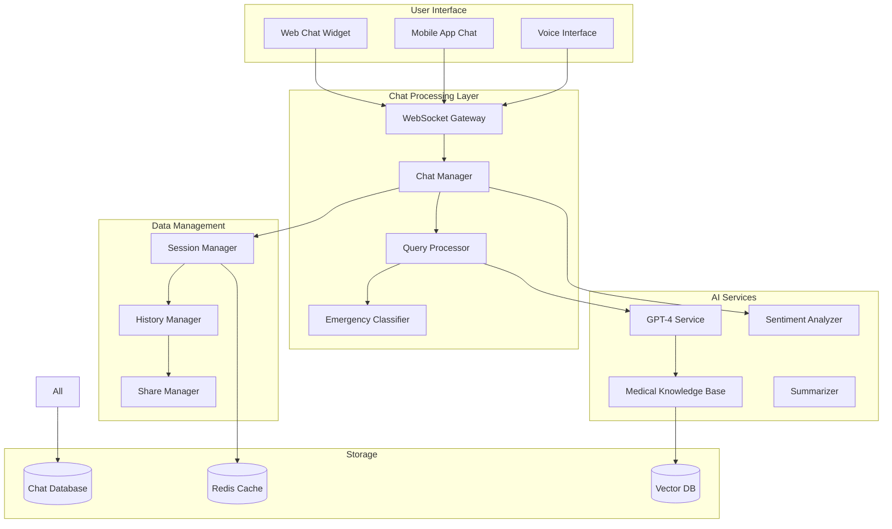

# 🤖 چت‌بات پزشکی HELSSA

## 📋 فهرست مطالب

- [معرفی چت‌بات پزشکی](## 🎯 معرفی چت‌بات پزشکی)
- [معماری سیستم چت](## 🏗️ معماری سیستم چت)
- [مدل‌های داده](## 📊 مدل‌های داده)
- [پردازش پیام‌ها](## 📝 پردازش پیام‌ها)
- [مدیریت مکالمات](## 📝 مدیریت مکالمات)
- [خلاصه‌سازی و تحلیل](## 📝 خلاصه‌سازی و تحلیل)
- [اشتراک‌گذاری با پزشک](## 📝 اشتراک‌گذاری با پزشک)
- [رابط کاربری چت](## 📝 رابط کاربری چت)

---

## 🎯 معرفی چت‌بات پزشکی

چت‌بات پزشکی HELSSA یک دستیار هوشمند 24/7 است که با استفاده از GPT-4 و دانش پزشکی تخصصی، به سوالات بیماران پاسخ می‌دهد و راهنمایی‌های اولیه ارائه می‌کند.

### ویژگی‌های کلیدی

- 💬 **پاسخ‌گویی 24/7** به سوالات پزشکی
- 🧠 **هوش مصنوعی پیشرفته** با GPT-4
- 🌐 **پشتیبانی چندزبانه** (فارسی، انگلیسی، عربی)
- 📊 **تحلیل علائم** و ارائه توصیه‌ها
- 🚨 **تشخیص موارد اورژانسی** و ارجاع فوری
- 📝 **خلاصه‌سازی مکالمات** برای پزشک
- 🔗 **اشتراک‌گذاری** با پزشک معالج
- 📱 **رابط کاربری** ساده و کاربرپسند

## 🏗️ معماری سیستم چت



### ساختار پروژه

```python
chatbot/
├── models/
│   ├── chat_session.py         # مدل جلسه چت
│   ├── chat_message.py         # مدل پیام
│   ├── chat_summary.py         # مدل خلاصه
│   └── shared_chat.py          # مدل اشتراک
├── services/
│   ├── chat_service.py         # سرویس اصلی چت
│   ├── query_processor.py      # پردازش سوالات
│   ├── medical_advisor.py      # مشاور پزشکی
│   ├── emergency_detector.py   # تشخیص اورژانس
│   ├── summarizer.py           # خلاصه‌ساز
│   └── share_service.py        # اشتراک‌گذاری
├── consumers/
│   ├── chat_consumer.py        # WebSocket consumer
│   └── voice_consumer.py       # Voice chat consumer
├── api/
│   ├── serializers.py
│   ├── views.py
│   └── permissions.py
├── prompts/
│   ├── medical_prompts.py      # پرامپت‌های پزشکی
│   ├── emergency_prompts.py    # پرامپت‌های اورژانس
│   └── summary_prompts.py      # پرامپت‌های خلاصه
├── utils/
│   ├── validators.py           # اعتبارسنجی
│   ├── formatters.py           # فرمت‌کننده‌ها
│   └── analytics.py            # تحلیل‌گر
└── tasks.py                     # Celery tasks
```

## 📊 مدل‌های داده

### Chat Session Model

```python
# chatbot/models/chat_session.py
from django.db import models
import uuid
from datetime import timedelta

class ChatSession(models.Model):
    """مدل جلسه چت با بات"""
    
    SESSION_STATUS = [
        ('active', 'فعال'),
        ('idle', 'غیرفعال'),
        ('closed', 'بسته شده'),
        ('shared', 'اشتراک گذاشته شده'),
    ]
    
    id = models.UUIDField(primary_key=True, default=uuid.uuid4)
    user = models.ForeignKey(
        'unified_auth.UnifiedUser',
        on_delete=models.CASCADE,
        related_name='chat_sessions'
    )
    
    # وضعیت جلسه
    status = models.CharField(
        max_length=20,
        choices=SESSION_STATUS,
        default='active'
    )
    title = models.CharField(
        max_length=200,
        null=True,
        blank=True,
        help_text="عنوان خودکار جلسه"
    )
    
    # زمان‌بندی
    started_at = models.DateTimeField(auto_now_add=True)
    last_activity = models.DateTimeField(auto_now=True)
    closed_at = models.DateTimeField(null=True, blank=True)
    
    # تحلیل جلسه
    message_count = models.IntegerField(default=0)
    ai_tokens_used = models.IntegerField(default=0)
    user_satisfaction = models.IntegerField(
        null=True,
        blank=True,
        help_text="رضایت کاربر 1-5"
    )
    
    # علائم و نگرانی‌ها
    identified_symptoms = models.JSONField(
        default=list,
        help_text="علائم شناسایی شده"
    )
    urgency_level = models.IntegerField(
        default=0,
        help_text="سطح اورژانس 0-10"
    )
    recommended_actions = models.JSONField(
        default=list,
        help_text="اقدامات توصیه شده"
    )
    
    # اشتراک‌گذاری
    is_shared = models.BooleanField(default=False)
    share_token = models.CharField(
        max_length=100,
        null=True,
        blank=True,
        unique=True
    )
    shared_with = models.ManyToManyField(
        'unified_auth.UnifiedUser',
        related_name='shared_chats',
        blank=True
    )
    
    # metadata
    metadata = models.JSONField(default=dict)
    
    class Meta:
        db_table = 'chat_sessions'
        indexes = [
            models.Index(fields=['user', 'status', '-started_at']),
            models.Index(fields=['share_token']),
        ]
        ordering = ['-started_at']
        
    @property
    def duration(self) -> timedelta:
        """مدت زمان جلسه"""
        if self.closed_at:
            return self.closed_at - self.started_at
        return timezone.now() - self.started_at
        
    @property
    def is_idle(self) -> bool:
        """آیا جلسه غیرفعال است"""
        return (timezone.now() - self.last_activity).total_seconds() > 1800  # 30 دقیقه
```

### Chat Message Model

```python
# chatbot/models/chat_message.py

class ChatMessage(models.Model):
    """مدل پیام‌های چت"""
    
    MESSAGE_TYPES = [
        ('text', 'متن'),
        ('voice', 'صوتی'),
        ('image', 'تصویر'),
        ('file', 'فایل'),
        ('system', 'سیستم'),
    ]
    
    SENDER_TYPES = [
        ('user', 'کاربر'),
        ('bot', 'ربات'),
        ('system', 'سیستم'),
    ]
    
    id = models.UUIDField(primary_key=True, default=uuid.uuid4)
    session = models.ForeignKey(
        ChatSession,
        on_delete=models.CASCADE,
        related_name='messages'
    )
    
    # محتوای پیام
    content = models.TextField()
    type = models.CharField(
        max_length=10,
        choices=MESSAGE_TYPES,
        default='text'
    )
    sender = models.CharField(
        max_length=10,
        choices=SENDER_TYPES
    )
    
    # پیام صوتی/تصویری
    media_url = models.URLField(
        null=True,
        blank=True,
        help_text="آدرس فایل media"
    )
    media_duration = models.IntegerField(
        null=True,
        blank=True,
        help_text="مدت زمان صوت به ثانیه"
    )
    
    # تحلیل پیام
    sentiment = models.CharField(
        max_length=20,
        null=True,
        blank=True,
        choices=[
            ('positive', 'مثبت'),
            ('neutral', 'خنثی'),
            ('negative', 'منفی'),
            ('worried', 'نگران'),
            ('emergency', 'اورژانسی'),
        ]
    )
    detected_entities = models.JSONField(
        default=dict,
        help_text="موجودیت‌های شناسایی شده"
    )
    
    # پاسخ AI
    ai_confidence = models.FloatField(
        null=True,
        blank=True,
        help_text="اطمینان AI از پاسخ"
    )
    ai_model = models.CharField(
        max_length=50,
        null=True,
        blank=True,
        default='gpt-4'
    )
    tokens_used = models.IntegerField(
        default=0,
        help_text="تعداد توکن‌های مصرفی"
    )
    
    # ارجاعات
    references = models.JSONField(
        default=list,
        help_text="منابع و ارجاعات"
    )
    suggested_actions = models.JSONField(
        default=list,
        help_text="اقدامات پیشنهادی"
    )
    
    # زمان
    created_at = models.DateTimeField(auto_now_add=True)
    edited_at = models.DateTimeField(null=True, blank=True)
    
    # واکنش‌ها
    is_helpful = models.BooleanField(
        null=True,
        blank=True,
        help_text="آیا پاسخ مفید بود"
    )
    user_feedback = models.TextField(
        null=True,
        blank=True
    )
    
    class Meta:
        db_table = 'chat_messages'
        ordering = ['created_at']
        indexes = [
            models.Index(fields=['session', 'created_at']),
            models.Index(fields=['sender', 'type']),
        ]
```

### Chat Summary Model

```python
# chatbot/models/chat_summary.py

class ChatSummary(models.Model):
    """مدل خلاصه مکالمات"""
    
    id = models.UUIDField(primary_key=True, default=uuid.uuid4)
    session = models.OneToOneField(
        ChatSession,
        on_delete=models.CASCADE,
        related_name='summary'
    )
    
    # خلاصه‌ها
    brief_summary = models.TextField(
        help_text="خلاصه کوتاه (2-3 جمله)"
    )
    detailed_summary = models.TextField(
        help_text="خلاصه تفصیلی"
    )
    medical_summary = models.TextField(
        help_text="خلاصه پزشکی تخصصی"
    )
    
    # نکات کلیدی
    key_symptoms = models.JSONField(
        default=list,
        help_text="علائم کلیدی"
    )
    key_concerns = models.JSONField(
        default=list,
        help_text="نگرانی‌های اصلی"
    )
    medical_history_mentioned = models.JSONField(
        default=dict,
        help_text="سوابق پزشکی ذکر شده"
    )
    
    # توصیه‌ها
    bot_recommendations = models.JSONField(
        default=list,
        help_text="توصیه‌های ارائه شده"
    )
    follow_up_needed = models.BooleanField(
        default=False,
        help_text="نیاز به پیگیری"
    )
    referral_suggested = models.JSONField(
        null=True,
        blank=True,
        help_text="ارجاع پیشنهادی"
    )
    
    # تحلیل
    overall_sentiment = models.CharField(
        max_length=20,
        choices=[
            ('positive', 'مثبت'),
            ('neutral', 'خنثی'),
            ('negative', 'منفی'),
            ('concerned', 'نگران'),
            ('urgent', 'فوری'),
        ]
    )
    urgency_score = models.IntegerField(
        default=0,
        help_text="امتیاز فوریت 0-100"
    )
    
    # تولید
    generated_at = models.DateTimeField(auto_now_add=True)
    generated_by = models.CharField(
        max_length=50,
        default='ai',
        choices=[
            ('ai', 'هوش مصنوعی'),
            ('manual', 'دستی'),
            ('hybrid', 'ترکیبی'),
        ]
    )
    
    class Meta:
        db_table = 'chat_summaries'
```

## 💬 پردازش پیام‌ها

### Chat Service

```python
# chatbot/services/chat_service.py
from typing import Dict, Optional, List
import asyncio

class MedicalChatService:
    """سرویس اصلی چت پزشکی"""
    
    def __init__(self):
        self.query_processor = QueryProcessor()
        self.medical_advisor = MedicalAdvisor()
        self.emergency_detector = EmergencyDetector()
        self.sentiment_analyzer = SentimentAnalyzer()
        self.session_manager = SessionManager()
        
    async def process_message(
        self,
        user_id: str,
        message: str,
        session_id: Optional[str] = None,
        message_type: str = 'text',
        media_url: Optional[str] = None
    ) -> Dict:
        """پردازش پیام کاربر"""
        
        # دریافت یا ایجاد جلسه
        session = await self.session_manager.get_or_create_session(
            user_id, session_id
        )
        
        # ذخیره پیام کاربر
        user_message = await self._save_user_message(
            session, message, message_type, media_url
        )
        
        # تحلیل احساسات
        sentiment = await self.sentiment_analyzer.analyze(message)
        user_message.sentiment = sentiment['sentiment']
        await user_message.save()
        
        # بررسی اورژانس
        emergency_check = await self.emergency_detector.check(message)
        if emergency_check['is_emergency']:
            return await self._handle_emergency(
                session, user_message, emergency_check
            )
            
        # پردازش سوال پزشکی
        query_result = await self.query_processor.process(
            message,
            session_context=await self._get_session_context(session)
        )
        
        # تولید پاسخ
        response = await self.medical_advisor.generate_response(
            query=query_result,
            user_profile=await self._get_user_profile(user_id),
            session_history=await self._get_recent_messages(session, 10)
        )
        
        # ذخیره پاسخ بات
        bot_message = await self._save_bot_message(
            session, response
        )
        
        # به‌روزرسانی جلسه
        await self._update_session_analytics(session, user_message, bot_message)
        
        return {
            'session_id': str(session.id),
            'message_id': str(bot_message.id),
            'response': response['content'],
            'suggestions': response.get('suggestions', []),
            'references': response.get('references', []),
            'urgency_level': session.urgency_level,
            'follow_up_needed': response.get('follow_up_needed', False)
        }
        
    async def _handle_emergency(
        self,
        session: ChatSession,
        user_message: ChatMessage,
        emergency_info: Dict
    ) -> Dict:
        """مدیریت موارد اورژانسی"""
        
        # تولید پاسخ اورژانسی
        emergency_response = self._generate_emergency_response(
            emergency_info['type'],
            emergency_info['severity']
        )
        
        # ذخیره پاسخ
        bot_message = await self._save_bot_message(
            session,
            {
                'content': emergency_response['message'],
                'is_emergency': True,
                'emergency_type': emergency_info['type']
            }
        )
        
        # به‌روزرسانی جلسه
        session.urgency_level = 10
        session.status = 'emergency'
        await session.save()
        
        # ارسال نوتیفیکیشن
        await self._send_emergency_notification(
            session.user,
            emergency_info
        )
        
        return {
            'session_id': str(session.id),
            'message_id': str(bot_message.id),
            'response': emergency_response['message'],
            'emergency': True,
            'emergency_actions': emergency_response['actions'],
            'emergency_contacts': emergency_response['contacts']
        }
        
    async def _get_session_context(self, session: ChatSession) -> Dict:
        """دریافت context جلسه"""
        
        # پیام‌های اخیر
        recent_messages = await ChatMessage.objects.filter(
            session=session
        ).order_by('-created_at')[:20]
        
        # استخراج اطلاعات مهم
        context = {
            'session_id': str(session.id),
            'duration': session.duration.total_seconds() / 60,
            'message_count': session.message_count,
            'identified_symptoms': session.identified_symptoms,
            'conversation_history': [
                {
                    'sender': msg.sender,
                    'content': msg.content,
                    'entities': msg.detected_entities
                }
                for msg in reversed(recent_messages)
            ]
        }
        
        return context
```

### Query Processor

```python
# chatbot/services/query_processor.py

class QueryProcessor:
    """پردازشگر سوالات پزشکی"""
    
    def __init__(self):
        self.nlp_service = MedicalNLPService()
        self.entity_extractor = MedicalEntityExtractor()
        self.intent_classifier = IntentClassifier()
        
    async def process(
        self,
        query: str,
        session_context: Optional[Dict] = None
    ) -> Dict:
        """پردازش جامع سوال"""
        
        # نرمال‌سازی متن
        normalized_query = await self._normalize_text(query)
        
        # استخراج موجودیت‌ها
        entities = await self.entity_extractor.extract(normalized_query)
        
        # تشخیص قصد
        intent = await self.intent_classifier.classify(
            normalized_query,
            entities,
            session_context
        )
        
        # بررسی نیاز به اطلاعات بیشتر
        missing_info = await self._check_missing_information(
            intent, entities
        )
        
        # ساخت query structure
        processed_query = {
            'original': query,
            'normalized': normalized_query,
            'intent': intent,
            'entities': entities,
            'missing_info': missing_info,
            'context': session_context,
            'requires_clarification': len(missing_info) > 0
        }
        
        return processed_query
        
    async def _normalize_text(self, text: str) -> str:
        """نرمال‌سازی متن فارسی"""
        
        # حذف کاراکترهای اضافی
        text = re.sub(r'\s+', ' ', text)
        text = text.strip()
        
        # تصحیح املایی رایج
        corrections = {
            'دوا': 'دارو',
            'درد های': 'دردهای',
            'سر درد': 'سردرد',
            'بیمارستون': 'بیمارستان'
        }
        
        for wrong, correct in corrections.items():
            text = text.replace(wrong, correct)
            
        return text
```

### Medical Advisor

```python
# chatbot/services/medical_advisor.py

class MedicalAdvisor:
    """مشاور پزشکی هوشمند"""
    
    def __init__(self):
        self.ai_service = UnifiedAIService()
        self.knowledge_base = MedicalKnowledgeBase()
        self.response_generator = ResponseGenerator()
        
    async def generate_response(
        self,
        query: Dict,
        user_profile: Dict,
        session_history: List[ChatMessage]
    ) -> Dict:
        """تولید پاسخ پزشکی"""
        
        # آماده‌سازی prompt
        prompt = await self._prepare_prompt(
            query, user_profile, session_history
        )
        
        # جستجو در knowledge base
        relevant_info = await self.knowledge_base.search(
            query['entities'],
            query['intent']
        )
        
        # تولید پاسخ با AI
        ai_response = await self.ai_service.generate_medical_response(
            prompt,
            context=relevant_info,
            model='gpt-4',
            temperature=0.7
        )
        
        # بررسی و اصلاح پاسخ
        validated_response = await self._validate_response(
            ai_response,
            query['intent']
        )
        
        # افزودن منابع و پیشنهادات
        enriched_response = await self.response_generator.enrich(
            validated_response,
            query,
            user_profile
        )
        
        return enriched_response
        
    async def _prepare_prompt(
        self,
        query: Dict,
        user_profile: Dict,
        session_history: List
    ) -> str:
        """آماده‌سازی prompt برای AI"""
        
        # اطلاعات پایه کاربر
        user_info = f"""
اطلاعات بیمار:
- سن: {user_profile.get('age', 'نامشخص')} سال
- جنسیت: {user_profile.get('gender', 'نامشخص')}
- سابقه پزشکی: {', '.join(user_profile.get('medical_history', ['ندارد']))}
- داروهای مصرفی: {', '.join(user_profile.get('medications', ['ندارد']))}
- آلرژی‌ها: {', '.join(user_profile.get('allergies', ['ندارد']))}
"""

        # تاریخچه مکالمه
        history = "\n".join([
            f"{'بیمار' if msg.sender == 'user' else 'پزشک'}: {msg.content}"
            for msg in session_history[-5:]  # 5 پیام اخیر
        ])
        
        # prompt نهایی
        prompt = f"""شما یک دستیار پزشکی هوشمند در پلتفرم HELSSA هستید.

{user_info}

تاریخچه مکالمه:
{history}

سوال فعلی: {query['original']}
قصد تشخیص داده شده: {query['intent']['type']}
موجودیت‌های شناسایی شده: {query['entities']}

لطفاً با رعایت نکات زیر پاسخ دهید:
1. پاسخ باید دقیق، قابل فهم و به زبان ساده باشد
2. از تشخیص قطعی و تجویز دارو پرهیز کنید
3. در موارد جدی، حتماً توصیه به مراجعه حضوری کنید
4. همدلی و دلسوزی را فراموش نکنید
5. اطلاعات علمی معتبر ارائه دهید

پاسخ شما:"""

        return prompt
        
    async def _validate_response(
        self,
        response: str,
        intent: Dict
    ) -> str:
        """اعتبارسنجی و اصلاح پاسخ"""
        
        # حذف ادعاهای نامناسب
        forbidden_phrases = [
            'من می‌توانم تشخیص دهم',
            'قطعاً بیماری',
            'دارو مصرف کنید',
            'نیازی به پزشک نیست'
        ]
        
        for phrase in forbidden_phrases:
            response = response.replace(phrase, '')
            
        # افزودن disclaimer در صورت نیاز
        if intent['type'] in ['diagnosis_request', 'treatment_request']:
            response += "\n\n⚠️ توجه: این اطلاعات جایگزین مشاوره پزشکی حضوری نیست. برای تشخیص و درمان دقیق حتماً به پزشک مراجعه کنید."
            
        return response
```

## 📝 مدیریت مکالمات

### Session Manager

```python
# chatbot/services/session_manager.py

class SessionManager:
    """مدیریت جلسات چت"""
    
    def __init__(self):
        self.redis_client = get_redis_client()
        self.auto_titler = AutoTitler()
        
    async def get_or_create_session(
        self,
        user_id: str,
        session_id: Optional[str] = None
    ) -> ChatSession:
        """دریافت یا ایجاد جلسه"""
        
        if session_id:
            try:
                session = await ChatSession.objects.get(
                    id=session_id,
                    user_id=user_id
                )
                
                # بررسی وضعیت
                if session.status == 'closed':
                    raise SessionClosedError("جلسه بسته شده است")
                    
                # به‌روزرسانی در صورت idle
                if session.is_idle:
                    session.status = 'active'
                    
                return session
                
            except ChatSession.DoesNotExist:
                pass
                
        # ایجاد جلسه جدید
        session = await ChatSession.objects.create(
            user_id=user_id,
            status='active'
        )
        
        # ذخیره در کش
        await self._cache_session(session)
        
        return session
        
    async def close_idle_sessions(self):
        """بستن جلسات غیرفعال"""
        
        idle_threshold = timezone.now() - timedelta(minutes=30)
        
        idle_sessions = await ChatSession.objects.filter(
            status='active',
            last_activity__lt=idle_threshold
        )
        
        for session in idle_sessions:
            await self.close_session(session.id)
            
    async def close_session(
        self,
        session_id: str,
        generate_summary: bool = True
    ) -> ChatSession:
        """بستن جلسه چت"""
        
        session = await ChatSession.objects.get(id=session_id)
        
        # به‌روزرسانی وضعیت
        session.status = 'closed'
        session.closed_at = timezone.now()
        
        # تولید عنوان خودکار
        if not session.title:
            session.title = await self.auto_titler.generate_title(session)
            
        await session.save()
        
        # تولید خلاصه
        if generate_summary and session.message_count > 3:
            await generate_chat_summary.delay(str(session.id))
            
        # حذف از کش
        await self.redis_client.delete(f"session:{session.id}")
        
        return session
        
    async def get_user_sessions(
        self,
        user_id: str,
        status: Optional[str] = None,
        limit: int = 20
    ) -> List[ChatSession]:
        """دریافت جلسات کاربر"""
        
        query = ChatSession.objects.filter(user_id=user_id)
        
        if status:
            query = query.filter(status=status)
            
        sessions = await query.order_by('-started_at')[:limit]
        
        # افزودن اطلاعات خلاصه
        for session in sessions:
            if hasattr(session, 'summary'):
                session.brief_summary = session.summary.brief_summary
            else:
                # خلاصه موقت از آخرین پیام
                last_message = await ChatMessage.objects.filter(
                    session=session,
                    sender='user'
                ).order_by('-created_at').first()
                
                if last_message:
                    session.brief_summary = last_message.content[:100]
                    
        return sessions
```

### Conversation Flow Manager

```python
# chatbot/services/conversation_flow.py

class ConversationFlowManager:
    """مدیریت جریان مکالمه"""
    
    def __init__(self):
        self.state_machine = ConversationStateMachine()
        self.context_tracker = ContextTracker()
        
    async def manage_flow(
        self,
        session: ChatSession,
        current_message: ChatMessage,
        intent: Dict
    ) -> Dict:
        """مدیریت جریان مکالمه"""
        
        # دریافت وضعیت فعلی
        current_state = await self._get_conversation_state(session)
        
        # تعیین وضعیت بعدی
        next_state = await self.state_machine.get_next_state(
            current_state,
            intent['type']
        )
        
        # اقدامات بر اساس وضعیت
        flow_actions = await self._get_flow_actions(
            current_state,
            next_state,
            session
        )
        
        # به‌روزرسانی context
        await self.context_tracker.update(
            session,
            current_message,
            next_state
        )
        
        return {
            'current_state': current_state,
            'next_state': next_state,
            'actions': flow_actions,
            'requires_info': await self._check_required_info(next_state)
        }
        
    async def _get_flow_actions(
        self,
        current_state: str,
        next_state: str,
        session: ChatSession
    ) -> List[Dict]:
        """تعیین اقدامات جریان"""
        
        actions = []
        
        # جمع‌آوری اطلاعات
        if next_state == 'gathering_symptoms':
            actions.append({
                'type': 'ask_questions',
                'questions': await self._get_symptom_questions(session)
            })
            
        # ارائه توصیه
        elif next_state == 'providing_advice':
            actions.append({
                'type': 'give_recommendations',
                'include_references': True
            })
            
        # ارجاع به پزشک
        elif next_state == 'referral_needed':
            actions.append({
                'type': 'suggest_doctor',
                'urgency': 'high' if session.urgency_level > 7 else 'normal'
            })
            
        return actions
```

## 📊 خلاصه‌سازی و تحلیل

### Chat Summarizer

```python
# chatbot/services/summarizer.py

class ChatSummarizer:
    """خلاصه‌ساز مکالمات چت"""
    
    def __init__(self):
        self.ai_service = UnifiedAIService()
        self.medical_analyzer = MedicalAnalyzer()
        
    async def generate_summary(
        self,
        session_id: str
    ) -> ChatSummary:
        """تولید خلاصه جامع مکالمه"""
        
        session = await ChatSession.objects.get(id=session_id)
        messages = await ChatMessage.objects.filter(
            session=session
        ).order_by('created_at')
        
        # استخراج محتوا
        conversation_text = self._format_conversation(messages)
        
        # تولید انواع خلاصه
        summaries = await asyncio.gather(
            self._generate_brief_summary(conversation_text),
            self._generate_detailed_summary(conversation_text),
            self._generate_medical_summary(conversation_text, session)
        )
        
        # تحلیل پزشکی
        medical_analysis = await self.medical_analyzer.analyze(
            messages, session
        )
        
        # ایجاد یا به‌روزرسانی خلاصه
        summary, created = await ChatSummary.objects.update_or_create(
            session=session,
            defaults={
                'brief_summary': summaries[0],
                'detailed_summary': summaries[1],
                'medical_summary': summaries[2],
                'key_symptoms': medical_analysis['symptoms'],
                'key_concerns': medical_analysis['concerns'],
                'medical_history_mentioned': medical_analysis['history'],
                'bot_recommendations': medical_analysis['recommendations'],
                'follow_up_needed': medical_analysis['follow_up_needed'],
                'referral_suggested': medical_analysis['referral'],
                'overall_sentiment': medical_analysis['sentiment'],
                'urgency_score': medical_analysis['urgency_score']
            }
        )
        
        return summary
        
    async def _generate_brief_summary(self, text: str) -> str:
        """تولید خلاصه کوتاه"""
        
        prompt = f"""متن زیر را در 2-3 جمله خلاصه کنید. 
فقط مهم‌ترین نکات را ذکر کنید:

{text[:2000]}

خلاصه:"""

        response = await self.ai_service.generate_text(
            prompt,
            max_tokens=200,
            temperature=0.5
        )
        
        return response['text']
        
    async def _generate_medical_summary(
        self,
        text: str,
        session: ChatSession
    ) -> str:
        """تولید خلاصه پزشکی تخصصی"""
        
        prompt = f"""به عنوان یک پزشک، خلاصه‌ای تخصصی از این مکالمه تهیه کنید.
        
مکالمه:
{text[:3000]}

اطلاعات تکمیلی:
- علائم شناسایی شده: {session.identified_symptoms}
- سطح اورژانس: {session.urgency_level}/10

خلاصه پزشکی باید شامل:
1. شکایت اصلی و علائم
2. سابقه مرتبط
3. ارزیابی اولیه
4. توصیه‌های ارائه شده
5. نیاز به اقدامات بعدی

خلاصه پزشکی:"""

        response = await self.ai_service.generate_text(
            prompt,
            max_tokens=1000,
            temperature=0.3,
            model='gpt-4'
        )
        
        return response['text']
```

### Analytics Service

```python
# chatbot/utils/analytics.py

class ChatAnalyticsService:
    """سرویس تحلیل چت‌ها"""
    
    async def analyze_user_behavior(
        self,
        user_id: str,
        period_days: int = 30
    ) -> Dict:
        """تحلیل رفتار کاربر"""
        
        start_date = timezone.now() - timedelta(days=period_days)
        
        # جلسات کاربر
        sessions = await ChatSession.objects.filter(
            user_id=user_id,
            started_at__gte=start_date
        )
        
        # آمار پایه
        total_sessions = await sessions.count()
        total_messages = await ChatMessage.objects.filter(
            session__in=sessions
        ).count()
        
        # توزیع زمانی
        time_distribution = await self._get_time_distribution(sessions)
        
        # موضوعات مکرر
        frequent_topics = await self._get_frequent_topics(sessions)
        
        # روند احساسات
        sentiment_trend = await self._get_sentiment_trend(sessions)
        
        return {
            'period_days': period_days,
            'total_sessions': total_sessions,
            'total_messages': total_messages,
            'avg_messages_per_session': total_messages / total_sessions if total_sessions > 0 else 0,
            'time_distribution': time_distribution,
            'frequent_topics': frequent_topics,
            'sentiment_trend': sentiment_trend,
            'health_concerns': await self._get_health_concerns(sessions)
        }
```

## 🔗 اشتراک‌گذاری با پزشک

### Share Service

```python
# chatbot/services/share_service.py

class ChatShareService:
    """سرویس اشتراک‌گذاری چت با پزشک"""
    
    def __init__(self):
        self.access_manager = AccessManager()
        self.notification_service = NotificationService()
        
    async def share_with_doctor(
        self,
        session_id: str,
        doctor_id: str,
        patient_id: str,
        duration_hours: int = 72
    ) -> Dict:
        """اشتراک‌گذاری جلسه چت با پزشک"""
        
        session = await ChatSession.objects.get(
            id=session_id,
            user_id=patient_id
        )
        
        # بررسی وجود خلاصه
        if not hasattr(session, 'summary'):
            # تولید خلاصه
            await generate_chat_summary.delay(str(session.id))
            
        # تولید توکن اشتراک
        share_token = self._generate_share_token()
        
        # به‌روزرسانی جلسه
        session.is_shared = True
        session.share_token = share_token
        await session.save()
        
        # افزودن پزشک به لیست
        await session.shared_with.add(doctor_id)
        
        # ایجاد دسترسی موقت
        access_expires = timezone.now() + timedelta(hours=duration_hours)
        
        share_access = await SharedChatAccess.objects.create(
            session=session,
            doctor_id=doctor_id,
            shared_by_id=patient_id,
            expires_at=access_expires,
            access_token=share_token
        )
        
        # ارسال نوتیفیکیشن به پزشک
        await self.notification_service.notify_chat_shared(
            doctor_id,
            patient_id,
            session
        )
        
        return {
            'share_token': share_token,
            'share_url': f"{settings.BASE_URL}/shared-chat/{share_token}",
            'expires_at': access_expires.isoformat(),
            'doctor_notified': True
        }
        
    async def get_shared_chat(
        self,
        share_token: str,
        doctor_id: str
    ) -> Dict:
        """دریافت چت اشتراکی"""
        
        # بررسی دسترسی
        access = await SharedChatAccess.objects.get(
            access_token=share_token,
            doctor_id=doctor_id,
            expires_at__gt=timezone.now()
        )
        
        session = access.session
        
        # بازیابی پیام‌ها
        messages = await ChatMessage.objects.filter(
            session=session
        ).order_by('created_at')
        
        # بازیابی خلاصه
        summary = None
        if hasattr(session, 'summary'):
            summary = {
                'brief': session.summary.brief_summary,
                'medical': session.summary.medical_summary,
                'symptoms': session.summary.key_symptoms,
                'concerns': session.summary.key_concerns,
                'recommendations': session.summary.bot_recommendations,
                'urgency_score': session.summary.urgency_score
            }
            
        return {
            'session': {
                'id': str(session.id),
                'started_at': session.started_at.isoformat(),
                'duration': session.duration.total_seconds() / 60,
                'message_count': session.message_count,
                'urgency_level': session.urgency_level
            },
            'messages': [
                {
                    'sender': msg.sender,
                    'content': msg.content,
                    'timestamp': msg.created_at.isoformat(),
                    'sentiment': msg.sentiment
                }
                for msg in messages
            ],
            'summary': summary,
            'patient': {
                'name': session.user.get_full_name(),
                'age': calculate_age(session.user.birth_date),
                'gender': session.user.get_gender_display()
            }
        }
```

## 🖥️ رابط کاربری چت

### WebSocket Consumer

```python
# chatbot/consumers/chat_consumer.py
from channels.generic.websocket import AsyncWebsocketConsumer
import json

class ChatConsumer(AsyncWebsocketConsumer):
    """WebSocket consumer برای چت real-time"""
    
    async def connect(self):
        """اتصال WebSocket"""
        
        self.user = self.scope['user']
        if not self.user.is_authenticated:
            await self.close()
            return
            
        # دریافت یا ایجاد جلسه
        session_id = self.scope['url_route']['kwargs'].get('session_id')
        self.session_manager = SessionManager()
        self.chat_service = MedicalChatService()
        
        self.session = await self.session_manager.get_or_create_session(
            str(self.user.id),
            session_id
        )
        
        # افزودن به گروه
        self.room_group_name = f'chat_{self.session.id}'
        await self.channel_layer.group_add(
            self.room_group_name,
            self.channel_name
        )
        
        await self.accept()
        
        # ارسال پیام خوش‌آمد
        await self.send_json({
            'type': 'connection_established',
            'session_id': str(self.session.id),
            'message': 'سلام! من دستیار پزشکی شما هستم. چطور می‌توانم کمکتان کنم؟'
        })
        
    async def disconnect(self, close_code):
        """قطع اتصال"""
        
        # حذف از گروه
        await self.channel_layer.group_discard(
            self.room_group_name,
            self.channel_name
        )
        
        # به‌روزرسانی وضعیت جلسه
        if hasattr(self, 'session'):
            self.session.status = 'idle'
            await self.session.save()
            
    async def receive_json(self, content):
        """دریافت پیام از کاربر"""
        
        message_type = content.get('type')
        
        if message_type == 'message':
            await self.handle_message(content)
        elif message_type == 'typing':
            await self.handle_typing(content)
        elif message_type == 'voice':
            await self.handle_voice(content)
        elif message_type == 'feedback':
            await self.handle_feedback(content)
            
    async def handle_message(self, content):
        """پردازش پیام متنی"""
        
        message = content.get('message', '').strip()
        if not message:
            return
            
        # نمایش در حال تایپ
        await self.send_typing_indicator()
        
        # پردازش پیام
        try:
            result = await self.chat_service.process_message(
                user_id=str(self.user.id),
                message=message,
                session_id=str(self.session.id)
            )
            
            # ارسال پاسخ
            await self.send_json({
                'type': 'bot_message',
                'message': result['response'],
                'message_id': result['message_id'],
                'suggestions': result.get('suggestions', []),
                'references': result.get('references', []),
                'urgency_level': result.get('urgency_level', 0)
            })
            
            # بررسی نیاز به follow-up
            if result.get('follow_up_needed'):
                await self.send_follow_up_prompt()
                
        except Exception as e:
            await self.send_json({
                'type': 'error',
                'message': 'متأسفانه در پردازش پیام شما مشکلی پیش آمد. لطفاً دوباره تلاش کنید.'
            })
            
    async def handle_voice(self, content):
        """پردازش پیام صوتی"""
        
        audio_data = content.get('audio_data')
        
        # تبدیل صوت به متن
        stt_service = WhisperSTTService()
        transcription = await stt_service.transcribe_audio(
            base64.b64decode(audio_data),
            'voice_message.webm'
        )
        
        # پردازش متن
        await self.handle_message({
            'message': transcription['text']
        })
        
    async def send_typing_indicator(self):
        """ارسال نشانگر در حال تایپ"""
        
        await self.send_json({
            'type': 'typing',
            'is_typing': True
        })
        
        # توقف بعد از پاسخ
        asyncio.create_task(self._stop_typing_after_delay())
        
    async def _stop_typing_after_delay(self):
        """توقف نشانگر تایپ"""
        
        await asyncio.sleep(2)
        await self.send_json({
            'type': 'typing',
            'is_typing': False
        })
```

### Chat API Views

```python
# chatbot/api/views.py

class ChatViewSet(viewsets.ModelViewSet):
    """API endpoints برای چت"""
    
    serializer_class = ChatSessionSerializer
    permission_classes = [IsAuthenticated]
    
    def get_queryset(self):
        return ChatSession.objects.filter(
            user=self.request.user
        ).order_by('-started_at')
        
    @action(detail=True, methods=['get'])
    async def messages(self, request, pk=None):
        """دریافت پیام‌های یک جلسه"""
        
        session = self.get_object()
        messages = await ChatMessage.objects.filter(
            session=session
        ).order_by('created_at')
        
        serializer = ChatMessageSerializer(messages, many=True)
        return Response(serializer.data)
        
    @action(detail=True, methods=['post'])
    async def share(self, request, pk=None):
        """اشتراک‌گذاری چت با پزشک"""
        
        session = self.get_object()
        doctor_id = request.data.get('doctor_id')
        
        if not doctor_id:
            return Response(
                {'error': 'شناسه پزشک الزامی است'},
                status=status.HTTP_400_BAD_REQUEST
            )
            
        share_service = ChatShareService()
        result = await share_service.share_with_doctor(
            session_id=str(session.id),
            doctor_id=doctor_id,
            patient_id=str(request.user.id)
        )
        
        return Response(result)
        
    @action(detail=True, methods=['get'])
    async def summary(self, request, pk=None):
        """دریافت خلاصه چت"""
        
        session = self.get_object()
        
        try:
            summary = await ChatSummary.objects.get(session=session)
            serializer = ChatSummarySerializer(summary)
            return Response(serializer.data)
        except ChatSummary.DoesNotExist:
            # تولید خلاصه
            summarizer = ChatSummarizer()
            summary = await summarizer.generate_summary(str(session.id))
            serializer = ChatSummarySerializer(summary)
            return Response(serializer.data)
            
    @action(detail=False, methods=['get'])
    async def statistics(self, request):
        """آمار چت‌های کاربر"""
        
        analytics = ChatAnalyticsService()
        stats = await analytics.analyze_user_behavior(
            user_id=str(request.user.id),
            period_days=int(request.query_params.get('days', 30))
        )
        
        return Response(stats)
```

---

[ELEMENT: div align="center"]

[→ قبلی: دسترسی پزشک به بیمار](09-doctor-access.md) | [بعدی: پردازش صوت و STT ←](11-audio-processing.md)

</div>
