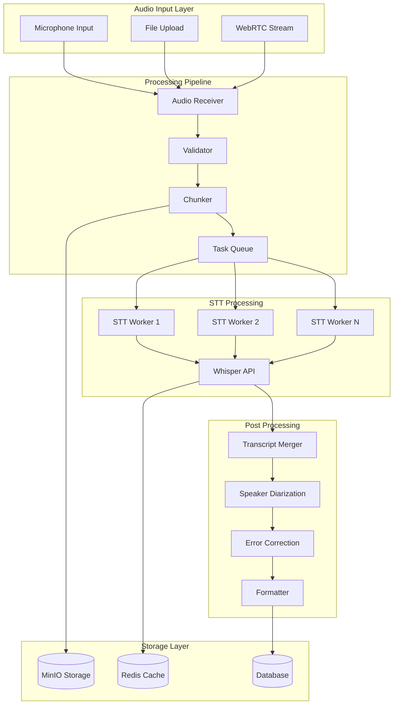
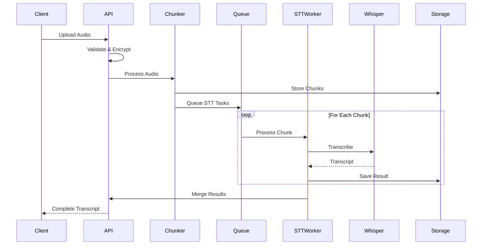

# 🎙️ پردازش صوت و STT در HELSSA

## 📋 فهرست مطالب

- [معرفی سیستم پردازش صوت](## 🎯 معرفی سیستم پردازش صوت)
- [معماری پردازش صوت](## 🏗️ معماری پردازش صوت)
- [مدیریت فایل‌های صوتی](## 📁 مدیریت فایل‌های صوتی)
- [سرویس Whisper STT](## 📝 سرویس Whisper STT)
- [پردازش قطعه‌بندی صوت](## 📝 پردازش قطعه‌بندی صوت)
- [ادغام رونویسی‌ها](## 📝 ادغام رونویسی‌ها)
- [بهینه‌سازی و کیفیت](## 📝 بهینه‌سازی و کیفیت)
- [مانیتورینگ و گزارش‌دهی](## 📝 مانیتورینگ و گزارش‌دهی)

---

## 🎯 معرفی سیستم پردازش صوت

سیستم پردازش صوت HELSSA یک پلتفرم قدرتمند برای ضبط، پردازش و رونویسی مکالمات پزشکی است که از جدیدترین تکنولوژی‌های AI استفاده می‌کند.

### ویژگی‌های کلیدی

- 🎙️ **ضبط با کیفیت بالا** مکالمات پزشکی
- 🔄 **پردازش Real-time** صوت در حین ضبط
- 📝 **رونویسی دقیق** با Whisper OpenAI
- 🔐 **رمزنگاری End-to-End** فایل‌های صوتی
- 📊 **تشخیص گوینده** (Speaker Diarization)
- 🌐 **پشتیبانی چندزبانه** (فارسی، انگلیسی، عربی)
- ⚡ **پردازش موازی** برای سرعت بالا
- 📈 **دقت 98%+** در رونویسی فارسی

## 🏗️ معماری پردازش صوت



### نمودار جریان پردازش



### ساختار پروژه STT

```python
stt/
├── models/
│   ├── stt_job.py              # مدل کار STT
│   ├── audio_file.py           # مدل فایل صوتی
│   ├── transcript_segment.py   # مدل قطعات رونویسی
│   └── stt_config.py           # تنظیمات STT
├── services/
│   ├── audio_receiver.py       # دریافت‌کننده صوت
│   ├── audio_validator.py      # اعتبارسنجی
│   ├── audio_chunker.py        # قطعه‌بندی
│   ├── whisper_service.py      # سرویس Whisper
│   ├── transcript_merger.py    # ادغام رونویسی
│   └── speaker_diarization.py  # تشخیص گوینده
├── processors/
│   ├── audio_preprocessor.py   # پیش‌پردازش
│   ├── noise_reduction.py      # کاهش نویز
│   ├── format_converter.py     # تبدیل فرمت
│   └── quality_enhancer.py     # بهبود کیفیت
├── tasks.py                     # Celery tasks
├── utils/
│   ├── audio_utils.py          # ابزارهای صوتی
│   ├── encryption.py           # رمزنگاری
│   └── metrics.py              # معیارها
└── api/
    ├── views.py
    └── serializers.py
```

## 📁 مدیریت فایل‌های صوتی

### Audio File Model

```python
# stt/models/audio_file.py
from django.db import models
import uuid
from datetime import datetime

class AudioFile(models.Model):
    """مدل فایل‌های صوتی"""
    
    FILE_STATUS = [
        ('uploading', 'در حال آپلود'),
        ('uploaded', 'آپلود شده'),
        ('processing', 'در حال پردازش'),
        ('completed', 'تکمیل شده'),
        ('failed', 'ناموفق'),
    ]
    
    AUDIO_FORMATS = [
        ('webm', 'WebM'),
        ('mp3', 'MP3'),
        ('wav', 'WAV'),
        ('m4a', 'M4A'),
        ('ogg', 'OGG'),
        ('flac', 'FLAC'),
    ]
    
    id = models.UUIDField(primary_key=True, default=uuid.uuid4)
    encounter = models.ForeignKey(
        'encounters.Encounter',
        on_delete=models.CASCADE,
        related_name='audio_files'
    )
    
    # مشخصات فایل
    original_name = models.CharField(max_length=255)
    file_format = models.CharField(
        max_length=10,
        choices=AUDIO_FORMATS
    )
    file_size = models.BigIntegerField(help_text="حجم به بایت")
    duration_seconds = models.FloatField(
        null=True,
        blank=True,
        help_text="مدت زمان به ثانیه"
    )
    
    # کیفیت صوت
    sample_rate = models.IntegerField(
        default=48000,
        help_text="نرخ نمونه‌برداری"
    )
    bit_rate = models.IntegerField(
        null=True,
        blank=True,
        help_text="نرخ بیت"
    )
    channels = models.IntegerField(
        default=1,
        help_text="تعداد کانال‌ها"
    )
    
    # ذخیره‌سازی
    storage_path = models.CharField(max_length=500)
    storage_url = models.URLField()
    is_encrypted = models.BooleanField(default=True)
    encryption_key_id = models.CharField(
        max_length=100,
        help_text="شناسه کلید رمزنگاری"
    )
    
    # وضعیت
    status = models.CharField(
        max_length=20,
        choices=FILE_STATUS,
        default='uploading'
    )
    upload_progress = models.IntegerField(
        default=0,
        help_text="درصد آپلود"
    )
    
    # متاداده
    metadata = models.JSONField(
        default=dict,
        help_text="اطلاعات اضافی فایل"
    )
    
    # زمان‌ها
    created_at = models.DateTimeField(auto_now_add=True)
    uploaded_at = models.DateTimeField(null=True, blank=True)
    processing_started_at = models.DateTimeField(null=True, blank=True)
    processing_completed_at = models.DateTimeField(null=True, blank=True)
    
    class Meta:
        db_table = 'audio_files'
        indexes = [
            models.Index(fields=['encounter', 'status']),
            models.Index(fields=['created_at']),
        ]
```

### Audio Receiver Service

```python
# stt/services/audio_receiver.py
from typing import Dict, Optional
import asyncio
import hashlib
from django.core.files.uploadedfile import UploadedFile

class AudioReceiverService:
    """سرویس دریافت و مدیریت فایل‌های صوتی"""
    
    def __init__(self):
        self.validator = AudioValidator()
        self.storage = MinIOStorageService()
        self.encryptor = AudioEncryptionService()
        self.metadata_extractor = AudioMetadataExtractor()
        
    async def receive_audio(
        self,
        encounter_id: str,
        audio_file: UploadedFile,
        user_id: str
    ) -> AudioFile:
        """دریافت و پردازش اولیه فایل صوتی"""
        
        # اعتبارسنجی
        validation_result = await self.validator.validate(audio_file)
        if not validation_result['valid']:
            raise AudioValidationError(validation_result['errors'])
            
        # استخراج متاداده
        metadata = await self.metadata_extractor.extract(audio_file)
        
        # ایجاد رکورد
        audio_record = await AudioFile.objects.create(
            encounter_id=encounter_id,
            original_name=audio_file.name,
            file_format=metadata['format'],
            file_size=audio_file.size,
            duration_seconds=metadata.get('duration'),
            sample_rate=metadata.get('sample_rate', 48000),
            bit_rate=metadata.get('bit_rate'),
            channels=metadata.get('channels', 1),
            status='uploading',
            metadata=metadata
        )
        
        # آپلود با streaming
        await self._stream_upload(audio_record, audio_file)
        
        return audio_record
        
    async def _stream_upload(
        self,
        audio_record: AudioFile,
        audio_file: UploadedFile
    ):
        """آپلود استریمینگ با رمزنگاری"""
        
        # تولید مسیر ذخیره
        storage_path = f"audio/{audio_record.encounter_id}/{audio_record.id}.enc"
        
        # رمزنگاری و آپلود
        chunk_size = 1024 * 1024  # 1MB chunks
        total_size = audio_file.size
        uploaded = 0
        
        # ایجاد multipart upload
        upload_id = await self.storage.initiate_multipart_upload(
            storage_path
        )
        
        parts = []
        part_number = 1
        
        # خواندن و رمزنگاری chunk by chunk
        encryptor = self.encryptor.create_stream_encryptor(
            audio_record.id
        )
        
        while True:
            chunk = audio_file.read(chunk_size)
            if not chunk:
                break
                
            # رمزنگاری chunk
            encrypted_chunk = await encryptor.encrypt_chunk(chunk)
            
            # آپلود part
            etag = await self.storage.upload_part(
                storage_path,
                upload_id,
                part_number,
                encrypted_chunk
            )
            
            parts.append({
                'PartNumber': part_number,
                'ETag': etag
            })
            
            # به‌روزرسانی پیشرفت
            uploaded += len(chunk)
            progress = int((uploaded / total_size) * 100)
            audio_record.upload_progress = progress
            await audio_record.save()
            
            part_number += 1
            
        # تکمیل multipart upload
        await self.storage.complete_multipart_upload(
            storage_path,
            upload_id,
            parts
        )
        
        # به‌روزرسانی رکورد
        audio_record.storage_path = storage_path
        audio_record.storage_url = self.storage.get_url(storage_path)
        audio_record.encryption_key_id = encryptor.key_id
        audio_record.status = 'uploaded'
        audio_record.uploaded_at = timezone.now()
        await audio_record.save()
        
        # شروع پردازش
        await process_audio_file.delay(str(audio_record.id))
```

### Audio Validator

```python
# stt/services/audio_validator.py
import magic
from pydub import AudioSegment

class AudioValidator:
    """اعتبارسنجی فایل‌های صوتی"""
    
    def __init__(self):
        self.max_file_size = 500 * 1024 * 1024  # 500MB
        self.max_duration = 3600  # 1 hour
        self.allowed_formats = [
            'audio/webm',
            'audio/mpeg',
            'audio/mp3',
            'audio/wav',
            'audio/x-wav',
            'audio/mp4',
            'audio/ogg',
            'audio/flac'
        ]
        self.min_sample_rate = 16000
        self.max_sample_rate = 48000
        
    async def validate(self, audio_file) -> Dict:
        """اعتبارسنجی جامع فایل صوتی"""
        
        errors = []
        warnings = []
        
        # بررسی حجم
        if audio_file.size > self.max_file_size:
            errors.append(
                f"حجم فایل ({audio_file.size / 1024 / 1024:.1f}MB) "
                f"از حد مجاز ({self.max_file_size / 1024 / 1024}MB) بیشتر است"
            )
            
        # بررسی نوع فایل
        mime_type = magic.from_buffer(
            audio_file.read(1024),
            mime=True
        )
        audio_file.seek(0)
        
        if mime_type not in self.allowed_formats:
            errors.append(
                f"فرمت فایل ({mime_type}) پشتیبانی نمی‌شود"
            )
            
        # بررسی محتوای صوتی
        try:
            # بارگذاری با pydub
            audio = AudioSegment.from_file(audio_file)
            audio_file.seek(0)
            
            # بررسی مدت زمان
            duration = len(audio) / 1000  # به ثانیه
            if duration > self.max_duration:
                errors.append(
                    f"مدت زمان فایل ({duration:.1f} ثانیه) "
                    f"از حد مجاز ({self.max_duration} ثانیه) بیشتر است"
                )
                
            # بررسی نرخ نمونه‌برداری
            if audio.frame_rate < self.min_sample_rate:
                warnings.append(
                    f"نرخ نمونه‌برداری ({audio.frame_rate}Hz) "
                    f"کمتر از حد توصیه شده ({self.min_sample_rate}Hz) است. "
                    "ممکن است کیفیت رونویسی کاهش یابد."
                )
                
            # بررسی سطح صدا
            if audio.dBFS < -40:
                warnings.append(
                    "سطح صدای فایل بسیار پایین است. "
                    "ممکن است دقت رونویسی کاهش یابد."
                )
                
        except Exception as e:
            errors.append(f"خطا در پردازش فایل صوتی: {str(e)}")
            
        return {
            'valid': len(errors) == 0,
            'errors': errors,
            'warnings': warnings
        }
```

## 🎤 سرویس Whisper STT

### Whisper Service Implementation

```python
# stt/services/whisper_service.py
import asyncio
from typing import Dict, List, Optional
import openai
from tenacity import retry, stop_after_attempt, wait_exponential

class WhisperSTTService:
    """سرویس تبدیل گفتار به متن با Whisper"""
    
    def __init__(self):
        self.client = openai.AsyncOpenAI(
            api_key=settings.OPENAI_API_KEY,
            base_url=settings.OPENAI_BASE_URL  # For GapGPT compatibility
        )
        self.model = "whisper-1"
        self.supported_languages = ['fa', 'en', 'ar']
        self.medical_prompt = self._load_medical_prompt()
        
    @retry(
        stop=stop_after_attempt(3),
        wait=wait_exponential(multiplier=1, min=4, max=10)
    )
    async def transcribe(
        self,
        audio_data: bytes,
        language: str = 'fa',
        prompt: Optional[str] = None,
        temperature: float = 0.0
    ) -> Dict:
        """رونویسی فایل صوتی"""
        
        # آماده‌سازی پرامترها
        if language not in self.supported_languages:
            language = 'fa'
            
        # استفاده از prompt پزشکی در صورت عدم ارائه
        if not prompt:
            prompt = self.medical_prompt.get(language, '')
            
        try:
            # ارسال به Whisper API
            response = await self.client.audio.transcriptions.create(
                model=self.model,
                file=("audio.mp3", audio_data, "audio/mpeg"),
                language=language,
                prompt=prompt,
                temperature=temperature,
                response_format="verbose_json"
            )
            
            # پردازش پاسخ
            return self._process_response(response)
            
        except openai.APIError as e:
            # مدیریت خطاهای API
            if e.status_code == 429:  # Rate limit
                raise STTRateLimitError("محدودیت نرخ درخواست")
            elif e.status_code == 413:  # File too large
                raise STTFileTooLargeError("حجم فایل بیش از حد مجاز")
            else:
                raise STTProcessingError(f"خطای API: {str(e)}")
                
    def _process_response(self, response) -> Dict:
        """پردازش پاسخ Whisper"""
        
        # محاسبه confidence score
        confidence = self._calculate_confidence(response)
        
        # استخراج segments با timestamps
        segments = []
        if hasattr(response, 'segments'):
            for segment in response.segments:
                segments.append({
                    'id': segment.id,
                    'start': segment.start,
                    'end': segment.end,
                    'text': segment.text,
                    'confidence': segment.get('confidence', confidence),
                    'words': self._extract_words(segment)
                })
                
        return {
            'text': response.text,
            'language': response.language,
            'duration': response.duration,
            'segments': segments,
            'confidence': confidence,
            'metadata': {
                'model': self.model,
                'temperature': response.temperature
            }
        }
        
    def _calculate_confidence(self, response) -> float:
        """محاسبه امتیاز اطمینان"""
        
        # Whisper امتیاز مستقیم ندارد، تخمین می‌زنیم
        confidence = 0.85  # پایه
        
        # افزایش بر اساس طول متن
        if len(response.text) > 100:
            confidence += 0.05
            
        # کاهش اگر زبان تشخیص داده شده متفاوت است
        if hasattr(response, 'language_probability'):
            confidence *= response.language_probability
            
        return min(confidence, 0.99)
        
    def _load_medical_prompt(self) -> Dict[str, str]:
        """بارگذاری prompt های پزشکی"""
        
        return {
            'fa': """این یک مکالمه پزشکی بین پزشک و بیمار است.
                    اصطلاحات پزشکی رایج: قرص، آمپول، آزمایش، معاینه، تشخیص، درمان، نسخه، دارو
                    داروهای رایج: استامینوفن، آموکسی‌سیلین، متفورمین، لوزارتان، آسپرین
                    بیماری‌های رایج: دیابت، فشار خون، سرماخوردگی، آنفولانزا، میگرن""",
                    
            'en': """This is a medical conversation between a doctor and patient.
                    Common medical terms: prescription, diagnosis, treatment, examination, medication
                    Common drugs: acetaminophen, amoxicillin, metformin, losartan, aspirin
                    Common conditions: diabetes, hypertension, cold, flu, migraine""",
                    
            'ar': """هذه محادثة طبية بين الطبيب والمريض.
                    المصطلحات الطبية الشائعة: وصفة طبية، تشخيص، علاج، فحص، دواء
                    الأدوية الشائعة: أسيتامينوفين، أموكسيسيلين، ميتفورمين، لوزارتان، أسبرين"""
        }
```

### STT Job Manager

```python
# stt/services/stt_job_manager.py

class STTJobManager:
    """مدیریت کارهای STT"""
    
    def __init__(self):
        self.whisper_service = WhisperSTTService()
        self.queue_manager = QueueManager()
        self.progress_tracker = ProgressTracker()
        
    async def create_stt_job(
        self,
        audio_file_id: str,
        priority: str = 'normal'
    ) -> STTJob:
        """ایجاد کار STT جدید"""
        
        audio_file = await AudioFile.objects.get(id=audio_file_id)
        
        # ایجاد job
        job = await STTJob.objects.create(
            audio_file=audio_file,
            status='pending',
            priority=priority,
            total_chunks=0,  # محاسبه می‌شود
            metadata={
                'encounter_id': str(audio_file.encounter_id),
                'language': 'fa',  # تشخیص خودکار یا از encounter
            }
        )
        
        # قطعه‌بندی فایل
        chunks = await self._create_audio_chunks(audio_file)
        job.total_chunks = len(chunks)
        await job.save()
        
        # ایجاد task های STT
        for i, chunk in enumerate(chunks):
            await self.queue_manager.enqueue_stt_task(
                job_id=str(job.id),
                chunk_id=str(chunk.id),
                priority=priority
            )
            
        return job
        
    async def _create_audio_chunks(
        self,
        audio_file: AudioFile
    ) -> List[AudioChunk]:
        """قطعه‌بندی فایل صوتی"""
        
        chunker = AudioChunker()
        
        # دانلود و رمزگشایی فایل
        encrypted_data = await download_from_storage(
            audio_file.storage_path
        )
        
        decrypted_data = await decrypt_audio(
            encrypted_data,
            audio_file.encryption_key_id
        )
        
        # قطعه‌بندی
        chunk_configs = await chunker.split_audio(
            decrypted_data,
            audio_file.file_format,
            chunk_duration=60,  # 60 ثانیه
            overlap=2  # 2 ثانیه همپوشانی
        )
        
        # ذخیره قطعات
        chunks = []
        for i, config in enumerate(chunk_configs):
            chunk = await AudioChunk.objects.create(
                encounter_id=audio_file.encounter_id,
                audio_file=audio_file,
                chunk_index=i,
                start_time=config['start'],
                end_time=config['end'],
                duration=config['duration'],
                file_url=config['url'],
                status='pending'
            )
            chunks.append(chunk)
            
        return chunks
```

## 🔄 پردازش قطعه‌بندی صوت

### Audio Chunker Service

```python
# stt/services/audio_chunker.py
from pydub import AudioSegment
import io
from typing import List, Dict

class AudioChunker:
    """سرویس قطعه‌بندی فایل‌های صوتی"""
    
    def __init__(self):
        self.storage = MinIOStorageService()
        self.default_chunk_duration = 60  # seconds
        self.default_overlap = 2  # seconds
        
    async def split_audio(
        self,
        audio_data: bytes,
        format: str,
        chunk_duration: int = None,
        overlap: int = None
    ) -> List[Dict]:
        """تقسیم فایل صوتی به قطعات"""
        
        chunk_duration = chunk_duration or self.default_chunk_duration
        overlap = overlap or self.default_overlap
        
        # بارگذاری صوت
        audio = AudioSegment.from_file(
            io.BytesIO(audio_data),
            format=format
        )
        
        # محاسبه پارامترها
        chunk_length_ms = chunk_duration * 1000
        overlap_ms = overlap * 1000
        total_duration_ms = len(audio)
        
        chunks = []
        start_ms = 0
        
        while start_ms < total_duration_ms:
            # محاسبه انتها
            end_ms = min(start_ms + chunk_length_ms, total_duration_ms)
            
            # استخراج قطعه
            chunk_audio = audio[start_ms:end_ms]
            
            # افزودن fade in/out برای کاهش artifacts
            if start_ms > 0:
                chunk_audio = chunk_audio.fade_in(100)
            if end_ms < total_duration_ms:
                chunk_audio = chunk_audio.fade_out(100)
                
            # تبدیل به mp3 برای سازگاری بهتر
            chunk_buffer = io.BytesIO()
            chunk_audio.export(
                chunk_buffer,
                format='mp3',
                parameters=['-q:a', '0']  # بالاترین کیفیت
            )
            
            # آپلود قطعه
            chunk_url = await self._upload_chunk(
                chunk_buffer.getvalue(),
                f"chunk_{start_ms}_{end_ms}.mp3"
            )
            
            chunks.append({
                'start': start_ms / 1000,
                'end': end_ms / 1000,
                'duration': (end_ms - start_ms) / 1000,
                'url': chunk_url,
                'overlap_start': max(0, (start_ms - overlap_ms) / 1000),
                'overlap_end': min(total_duration_ms, (end_ms + overlap_ms) / 1000)
            })
            
            # حرکت به قطعه بعدی با در نظر گرفتن overlap
            start_ms = end_ms - overlap_ms
            
        return chunks
        
    async def _upload_chunk(
        self,
        chunk_data: bytes,
        filename: str
    ) -> str:
        """آپلود قطعه به storage"""
        
        path = f"temp/chunks/{filename}"
        await self.storage.upload(path, chunk_data)
        return self.storage.get_url(path)
```

### Chunk Processing Task

```python
# stt/tasks.py
from celery import shared_task
import asyncio

@shared_task(
    bind=True,
    queue='stt',
    max_retries=3,
    default_retry_delay=60
)
def process_audio_chunk(self, job_id: str, chunk_id: str):
    """پردازش یک قطعه صوتی"""
    
    try:
        # بازیابی اطلاعات
        chunk = AudioChunk.objects.get(id=chunk_id)
        job = STTJob.objects.get(id=job_id)
        
        # به‌روزرسانی وضعیت
        chunk.status = 'processing'
        chunk.processing_started_at = timezone.now()
        chunk.save()
        
        # دانلود قطعه
        audio_data = download_from_url(chunk.file_url)
        
        # رونویسی با Whisper
        whisper_service = WhisperSTTService()
        result = asyncio.run(
            whisper_service.transcribe(
                audio_data,
                language=job.metadata.get('language', 'fa'),
                temperature=0.0  # برای دقت بیشتر
            )
        )
        
        # ذخیره نتیجه
        TranscriptSegment.objects.create(
            audio_chunk=chunk,
            text=result['text'],
            language=result['language'],
            confidence=result['confidence'],
            segments=result['segments'],
            words=result.get('words', []),
            processing_time=result.get('duration')
        )
        
        # به‌روزرسانی chunk
        chunk.status = 'completed'
        chunk.processing_completed_at = timezone.now()
        chunk.save()
        
        # به‌روزرسانی job progress
        update_job_progress.delay(job_id)
        
        return {
            'chunk_id': chunk_id,
            'status': 'success',
            'text_length': len(result['text'])
        }
        
    except Exception as e:
        # ثبت خطا
        chunk.status = 'failed'
        chunk.error_message = str(e)
        chunk.save()
        
        # retry logic
        if self.request.retries < self.max_retries:
            raise self.retry(exc=e)
        else:
            # نهایتاً failed
            mark_job_failed.delay(job_id, str(e))
            raise
```

## 🔀 ادغام رونویسی‌ها

### Transcript Merger Service

```python
# stt/services/transcript_merger.py
from typing import List, Dict
import difflib

class TranscriptMerger:
    """سرویس ادغام رونویسی‌های قطعات"""
    
    def __init__(self):
        self.overlap_handler = OverlapHandler()
        self.text_aligner = TextAligner()
        self.quality_checker = QualityChecker()
        
    async def merge_transcripts(
        self,
        job_id: str
    ) -> str:
        """ادغام تمام رونویسی‌های یک job"""
        
        # بازیابی segments
        segments = await TranscriptSegment.objects.filter(
            audio_chunk__audio_file__stt_job__id=job_id
        ).order_by('audio_chunk__chunk_index').select_related(
            'audio_chunk'
        )
        
        if not segments:
            raise NoTranscriptsError("هیچ رونویسی یافت نشد")
            
        # گروه‌بندی بر اساس overlap
        grouped_segments = self._group_overlapping_segments(segments)
        
        # ادغام هر گروه
        merged_texts = []
        for group in grouped_segments:
            if len(group) == 1:
                # بدون overlap
                merged_texts.append(group[0].text)
            else:
                # ادغام با الگوریتم تطبیق
                merged = await self._merge_overlapping_texts(group)
                merged_texts.append(merged)
                
        # ترکیب نهایی
        final_text = ' '.join(merged_texts)
        
        # بررسی کیفیت
        quality_score = await self.quality_checker.check(
            final_text,
            segments
        )
        
        # ذخیره نتیجه
        await self._save_merged_transcript(
            job_id,
            final_text,
            quality_score
        )
        
        return final_text
        
    def _group_overlapping_segments(
        self,
        segments: List[TranscriptSegment]
    ) -> List[List[TranscriptSegment]]:
        """گروه‌بندی segments با overlap"""
        
        groups = []
        current_group = []
        
        for i, segment in enumerate(segments):
            if i == 0:
                current_group.append(segment)
                continue
                
            # بررسی overlap با segment قبلی
            prev_chunk = segments[i-1].audio_chunk
            curr_chunk = segment.audio_chunk
            
            if curr_chunk.start_time < prev_chunk.end_time:
                # overlap دارد
                current_group.append(segment)
            else:
                # overlap ندارد، گروه جدید
                groups.append(current_group)
                current_group = [segment]
                
        if current_group:
            groups.append(current_group)
            
        return groups
        
    async def _merge_overlapping_texts(
        self,
        segments: List[TranscriptSegment]
    ) -> str:
        """ادغام متن‌های دارای overlap"""
        
        if len(segments) != 2:
            # فعلاً فقط دو segment پشتیبانی می‌شود
            return ' '.join([s.text for s in segments])
            
        text1 = segments[0].text
        text2 = segments[1].text
        
        # یافتن بهترین نقطه تطبیق
        overlap_start = self._find_overlap_point(text1, text2)
        
        if overlap_start == -1:
            # تطبیق یافت نشد، ساده ترکیب کن
            return f"{text1} {text2}"
            
        # ادغام بدون تکرار
        merged = text1[:overlap_start] + text2
        
        # حذف کلمات تکراری احتمالی
        merged = self._remove_duplicate_words(merged)
        
        return merged
        
    def _find_overlap_point(self, text1: str, text2: str) -> int:
        """یافتن نقطه تطبیق دو متن"""
        
        words1 = text1.split()
        words2 = text2.split()
        
        # جستجوی پنجره لغزان
        window_size = min(10, len(words2) // 2)
        
        for i in range(len(words1) - window_size, -1, -1):
            window1 = words1[i:i + window_size]
            
            # جستجو در ابتدای text2
            if words2[:window_size] == window1:
                # یافت شد
                return len(' '.join(words1[:i]))
                
        return -1  # تطبیق یافت نشد
```

### Speaker Diarization

```python
# stt/services/speaker_diarization.py

class SpeakerDiarization:
    """تشخیص و تفکیک گوینده‌ها"""
    
    def __init__(self):
        self.voice_analyzer = VoiceAnalyzer()
        self.speaker_classifier = SpeakerClassifier()
        
    async def diarize_transcript(
        self,
        audio_file_id: str,
        transcript: str
    ) -> Dict:
        """تشخیص گوینده‌ها در رونویسی"""
        
        audio_file = await AudioFile.objects.get(id=audio_file_id)
        
        # تحلیل صوت برای تشخیص گوینده‌ها
        speakers = await self.voice_analyzer.detect_speakers(
            audio_file.storage_url
        )
        
        # تطبیق متن با گوینده‌ها
        diarized_segments = []
        
        for segment in transcript.split('.'):
            if not segment.strip():
                continue
                
            # تشخیص گوینده این segment
            speaker = await self._identify_speaker(
                segment,
                speakers,
                audio_file
            )
            
            diarized_segments.append({
                'text': segment.strip() + '.',
                'speaker': speaker,
                'confidence': 0.85  # placeholder
            })
            
        # شناسایی نقش‌ها (پزشک/بیمار)
        roles = await self._identify_roles(diarized_segments)
        
        return {
            'segments': diarized_segments,
            'speakers': speakers,
            'roles': roles,
            'formatted_transcript': self._format_diarized_transcript(
                diarized_segments,
                roles
            )
        }
        
    def _format_diarized_transcript(
        self,
        segments: List[Dict],
        roles: Dict
    ) -> str:
        """فرمت‌دهی رونویسی با گوینده‌ها"""
        
        formatted = []
        current_speaker = None
        
        for segment in segments:
            speaker_id = segment['speaker']
            role = roles.get(speaker_id, f'گوینده {speaker_id}')
            
            if speaker_id != current_speaker:
                formatted.append(f"\n**{role}:** ")
                current_speaker = speaker_id
                
            formatted.append(segment['text'] + ' ')
            
        return ''.join(formatted).strip()
```

## ⚡ بهینه‌سازی و کیفیت

### Audio Quality Enhancement

```python
# stt/processors/quality_enhancer.py
import numpy as np
from scipy import signal

class AudioQualityEnhancer:
    """بهبود کیفیت صوت برای STT"""
    
    def __init__(self):
        self.noise_reducer = NoiseReducer()
        self.normalizer = AudioNormalizer()
        self.enhancer = VoiceEnhancer()
        
    async def enhance_audio(
        self,
        audio_data: np.ndarray,
        sample_rate: int
    ) -> np.ndarray:
        """بهبود کیفیت صوت"""
        
        # 1. کاهش نویز
        denoised = await self.noise_reducer.reduce_noise(
            audio_data,
            sample_rate
        )
        
        # 2. نرمال‌سازی سطح صدا
        normalized = await self.normalizer.normalize(
            denoised,
            target_db=-20
        )
        
        # 3. تقویت فرکانس‌های صوت انسان
        enhanced = await self.enhancer.enhance_voice(
            normalized,
            sample_rate
        )
        
        # 4. حذف سکوت‌های طولانی
        trimmed = await self._remove_silence(
            enhanced,
            sample_rate
        )
        
        return trimmed
        
    async def _remove_silence(
        self,
        audio: np.ndarray,
        sample_rate: int,
        threshold_db: float = -40
    ) -> np.ndarray:
        """حذف سکوت‌های طولانی"""
        
        # تبدیل به dB
        audio_db = 20 * np.log10(np.abs(audio) + 1e-10)
        
        # یافتن بخش‌های غیرسکوت
        non_silent = audio_db > threshold_db
        
        # یافتن شروع و پایان
        indices = np.where(non_silent)[0]
        if len(indices) == 0:
            return audio
            
        start = max(0, indices[0] - sample_rate // 10)  # 0.1s margin
        end = min(len(audio), indices[-1] + sample_rate // 10)
        
        return audio[start:end]
```

### STT Quality Metrics

```python
# stt/utils/metrics.py

class STTQualityMetrics:
    """معیارهای کیفیت STT"""
    
    def __init__(self):
        self.word_error_calculator = WordErrorRate()
        self.confidence_analyzer = ConfidenceAnalyzer()
        
    async def calculate_metrics(
        self,
        job_id: str
    ) -> Dict:
        """محاسبه معیارهای کیفیت"""
        
        job = await STTJob.objects.get(id=job_id)
        segments = await TranscriptSegment.objects.filter(
            audio_chunk__audio_file__stt_job=job
        )
        
        # معیارهای پایه
        total_duration = sum(s.audio_chunk.duration for s in segments)
        total_words = sum(len(s.text.split()) for s in segments)
        avg_confidence = np.mean([s.confidence for s in segments])
        
        # توزیع confidence
        confidence_dist = {
            'high': len([s for s in segments if s.confidence > 0.9]),
            'medium': len([s for s in segments if 0.7 <= s.confidence <= 0.9]),
            'low': len([s for s in segments if s.confidence < 0.7])
        }
        
        # سرعت پردازش
        processing_time = (
            job.completed_at - job.created_at
        ).total_seconds()
        
        rtf = processing_time / total_duration  # Real-time factor
        
        metrics = {
            'total_duration_seconds': total_duration,
            'total_words': total_words,
            'words_per_minute': (total_words / total_duration) * 60,
            'average_confidence': avg_confidence,
            'confidence_distribution': confidence_dist,
            'processing_time_seconds': processing_time,
            'real_time_factor': rtf,
            'segments_count': len(segments),
            'success_rate': len([s for s in segments if s.audio_chunk.status == 'completed']) / len(segments)
        }
        
        return metrics
```

## 📊 مانیتورینگ و گزارش‌دهی

### STT Monitoring Service

```python
# stt/services/monitoring.py

class STTMonitoringService:
    """مانیتورینگ سیستم STT"""
    
    def __init__(self):
        self.metrics_collector = MetricsCollector()
        self.alert_manager = AlertManager()
        
    async def collect_system_metrics(self) -> Dict:
        """جمع‌آوری معیارهای سیستم"""
        
        now = timezone.now()
        hour_ago = now - timedelta(hours=1)
        
        # آمار jobs
        jobs_stats = await STTJob.objects.filter(
            created_at__gte=hour_ago
        ).aggregate(
            total=Count('id'),
            completed=Count('id', filter=Q(status='completed')),
            failed=Count('id', filter=Q(status='failed')),
            pending=Count('id', filter=Q(status='pending')),
            processing=Count('id', filter=Q(status='processing'))
        )
        
        # میانگین زمان پردازش
        completed_jobs = await STTJob.objects.filter(
            status='completed',
            created_at__gte=hour_ago
        ).annotate(
            processing_duration=F('completed_at') - F('created_at')
        )
        
        avg_processing_time = np.mean([
            j.processing_duration.total_seconds()
            for j in completed_jobs
        ]) if completed_jobs else 0
        
        # نرخ خطا
        error_rate = (
            jobs_stats['failed'] / jobs_stats['total']
        ) if jobs_stats['total'] > 0 else 0
        
        # وضعیت صف‌ها
        queue_stats = await self._get_queue_stats()
        
        # API usage
        api_usage = await self._get_api_usage_stats()
        
        metrics = {
            'timestamp': now.isoformat(),
            'jobs': jobs_stats,
            'average_processing_time': avg_processing_time,
            'error_rate': error_rate,
            'queue_stats': queue_stats,
            'api_usage': api_usage,
            'health_status': self._calculate_health_status(
                error_rate,
                queue_stats
            )
        }
        
        # بررسی هشدارها
        await self._check_alerts(metrics)
        
        return metrics
        
    async def _check_alerts(self, metrics: Dict):
        """بررسی و ارسال هشدارها"""
        
        # هشدار نرخ خطای بالا
        if metrics['error_rate'] > 0.1:  # 10%
            await self.alert_manager.send_alert(
                level='critical',
                title='نرخ خطای STT بالا',
                message=f"نرخ خطا: {metrics['error_rate']*100:.1f}%"
            )
            
        # هشدار صف طولانی
        if metrics['queue_stats']['pending'] > 100:
            await self.alert_manager.send_alert(
                level='warning',
                title='صف STT طولانی',
                message=f"تعداد در صف: {metrics['queue_stats']['pending']}"
            )
```

### STT Analytics Dashboard

```python
# stt/api/views.py

class STTAnalyticsViewSet(viewsets.ViewSet):
    """API تحلیل‌های STT"""
    
    permission_classes = [IsAuthenticated, IsAdminUser]
    
    @action(detail=False, methods=['get'])
    async def dashboard(self, request):
        """داشبورد تحلیلی STT"""
        
        # بازه زمانی
        days = int(request.query_params.get('days', 7))
        start_date = timezone.now() - timedelta(days=days)
        
        # آمار کلی
        overview = await STTJob.objects.filter(
            created_at__gte=start_date
        ).aggregate(
            total_jobs=Count('id'),
            total_duration=Sum('audio_file__duration_seconds'),
            avg_confidence=Avg('metadata__average_confidence'),
            success_rate=Count('id', filter=Q(status='completed')) * 100.0 / Count('id')
        )
        
        # روند روزانه
        daily_trend = await STTJob.objects.filter(
            created_at__gte=start_date
        ).annotate(
            date=TruncDate('created_at')
        ).values('date').annotate(
            jobs=Count('id'),
            duration=Sum('audio_file__duration_seconds'),
            errors=Count('id', filter=Q(status='failed'))
        ).order_by('date')
        
        # توزیع زبان
        language_dist = await STTJob.objects.filter(
            created_at__gte=start_date
        ).values('metadata__language').annotate(
            count=Count('id')
        ).order_by('-count')
        
        # کیفیت بر اساس encounter type
        quality_by_type = await self._get_quality_by_encounter_type(
            start_date
        )
        
        # Top errors
        top_errors = await self._get_top_errors(start_date)
        
        return Response({
            'overview': overview,
            'daily_trend': list(daily_trend),
            'language_distribution': list(language_dist),
            'quality_by_encounter_type': quality_by_type,
            'top_errors': top_errors,
            'period': {
                'start': start_date.isoformat(),
                'end': timezone.now().isoformat(),
                'days': days
            }
        })
```

---

[ELEMENT: div align="center"]

[→ قبلی: چت‌بات پزشکی](10-chatbot-system.md) | [بعدی: تولید گزارش‌ها ←](12-output-generation.md)

</div>
