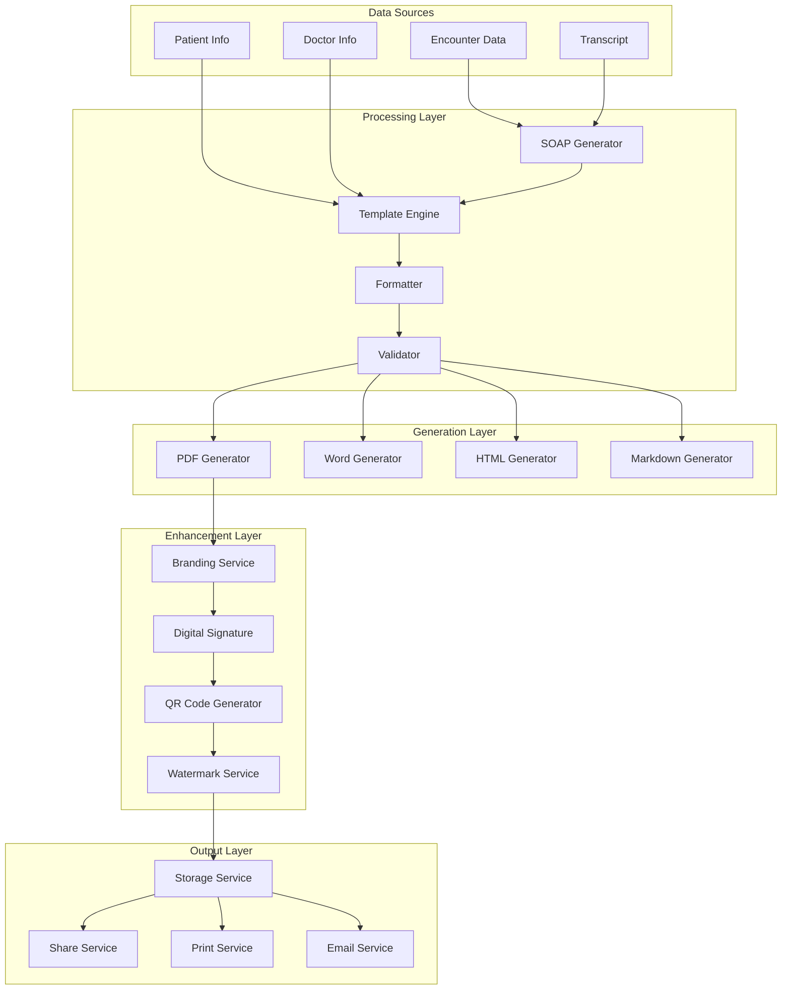

# 📄 تولید گزارش‌ها و خروجی‌ها در HELSSA

## 📋 فهرست مطالب

- [معرفی سیستم تولید گزارش](## 🎯 معرفی سیستم تولید گزارش)
- [معماری تولید خروجی](## 🏗️ معماری تولید خروجی)
- [تولید گزارش SOAP](## 📝 تولید گزارش SOAP)
- [قالب‌ها و فرمت‌ها](## 📝 قالب‌ها و فرمت‌ها)
- [تولید PDF حرفه‌ای](## 📝 تولید PDF حرفه‌ای)
- [تولید نسخه الکترونیک](## 📝 تولید نسخه الکترونیک)
- [امضای دیجیتال](## 📝 امضای دیجیتال)
- [سفارشی‌سازی گزارش‌ها](## 📝 سفارشی‌سازی گزارش‌ها)

---

## 🎯 معرفی سیستم تولید گزارش

سیستم تولید گزارش HELSSA یک پلتفرم جامع برای ایجاد انواع گزارش‌های پزشکی، نسخه‌ها و مستندات با کیفیت بالا و قابلیت سفارشی‌سازی است.

### ویژگی‌های کلیدی

- 📝 **تولید خودکار SOAP** از رونویسی ملاقات
- 🎨 **قالب‌های حرفه‌ای** قابل سفارشی‌سازی
- 📑 **خروجی چندفرمته** (PDF, Word, HTML, Markdown)
- ✍️ **امضای دیجیتال** معتبر
- 💊 **نسخه‌نویسی الکترونیک** استاندارد
- 🏥 **برندینگ** برای کلینیک‌ها
- 🌐 **چندزبانه** (فارسی، انگلیسی، عربی)
- 📱 **Responsive** برای موبایل

## 🏗️ معماری تولید خروجی



### ساختار پروژه

```python
outputs/
├── models/
│   ├── report_template.py      # مدل قالب گزارش
│   ├── generated_report.py     # مدل گزارش تولید شده
│   ├── prescription.py         # مدل نسخه
│   └── report_settings.py      # تنظیمات گزارش
├── services/
│   ├── soap_generator.py       # تولید SOAP
│   ├── template_engine.py      # موتور قالب
│   ├── pdf_generator.py        # تولید PDF
│   ├── word_generator.py       # تولید Word
│   ├── prescription_generator.py # تولید نسخه
│   └── signature_service.py    # امضای دیجیتال
├── templates/
│   ├── soap/                   # قالب‌های SOAP
│   ├── prescription/           # قالب‌های نسخه
│   ├── reports/               # سایر گزارش‌ها
│   └── emails/                # قالب‌های ایمیل
├── static/
│   ├── fonts/                 # فونت‌ها
│   ├── images/               # تصاویر و لوگوها
│   └── styles/               # استایل‌ها
├── utils/
│   ├── formatters.py         # فرمت‌کننده‌ها
│   ├── validators.py         # اعتبارسنجی
│   └── converters.py         # تبدیل‌کننده‌ها
└── api/
    ├── views.py
    └── serializers.py
```

## 📝 تولید گزارش SOAP

### SOAP Generator Service

```python
# outputs/services/soap_generator.py
from typing import Dict, List, Optional
import asyncio
from datetime import datetime

class SOAPGenerator:
    """تولیدکننده گزارش SOAP"""
    
    def __init__(self):
        self.ai_service = UnifiedAIService()
        self.medical_analyzer = MedicalAnalyzer()
        self.template_engine = TemplateEngine()
        self.validator = SOAPValidator()
        
    async def generate_soap_report(
        self,
        encounter_id: str,
        regenerate: bool = False
    ) -> GeneratedReport:
        """تولید گزارش SOAP از ملاقات"""
        
        # بازیابی داده‌ها
        encounter = await self._get_encounter_data(encounter_id)
        transcript = await self._get_transcript(encounter_id)
        patient = await self._get_patient_info(encounter.patient_id)
        doctor = await self._get_doctor_info(encounter.doctor_id)
        
        # آماده‌سازی context
        context = {
            'encounter': encounter,
            'transcript': transcript,
            'patient': patient,
            'doctor': doctor,
            'chief_complaint': encounter.chief_complaint,
            'visit_date': encounter.scheduled_at,
            'duration': encounter.actual_duration
        }
        
        # تولید بخش‌های SOAP
        soap_sections = await self._generate_soap_sections(context)
        
        # اعتبارسنجی
        validation_result = await self.validator.validate_soap(soap_sections)
        if not validation_result['valid']:
            soap_sections = await self._fix_validation_issues(
                soap_sections,
                validation_result['issues']
            )
            
        # استخراج داده‌های ساختاریافته
        structured_data = await self._extract_structured_data(soap_sections)
        
        # ایجاد گزارش
        report = await GeneratedReport.objects.create(
            encounter_id=encounter_id,
            report_type='soap',
            content=soap_sections,
            structured_data=structured_data,
            metadata={
                'generator_version': '2.0',
                'ai_model': 'gpt-4',
                'confidence_score': validation_result.get('confidence', 0.85)
            }
        )
        
        # تولید فرمت‌های مختلف
        await self._generate_output_formats(report)
        
        return report
        
    async def _generate_soap_sections(self, context: Dict) -> Dict:
        """تولید بخش‌های SOAP"""
        
        # تولید موازی بخش‌ها
        sections = await asyncio.gather(
            self._generate_subjective(context),
            self._generate_objective(context),
            self._generate_assessment(context),
            self._generate_plan(context)
        )
        
        return {
            'subjective': sections[0],
            'objective': sections[1],
            'assessment': sections[2],
            'plan': sections[3]
        }
        
    async def _generate_subjective(self, context: Dict) -> Dict:
        """تولید بخش Subjective"""
        
        prompt = f"""بر اساس رونویسی ملاقات پزشکی، بخش Subjective گزارش SOAP را تولید کنید.

اطلاعات بیمار:
- نام: {context['patient']['name']}
- سن: {context['patient']['age']} سال
- جنسیت: {context['patient']['gender']}

شکایت اصلی: {context['chief_complaint']}

رونویسی مکالمه:
{context['transcript'][:2000]}

بخش Subjective باید شامل:
1. Chief Complaint (CC) - شکایت اصلی
2. History of Present Illness (HPI) با جزئیات OLDCARTS:
   - Onset (شروع)
   - Location (محل)
   - Duration (مدت)
   - Character (ویژگی)
   - Aggravating factors (عوامل تشدیدکننده)
   - Relieving factors (عوامل تسکین‌دهنده)
   - Timing (زمان‌بندی)
   - Severity (شدت 1-10)
3. Review of Systems (ROS) - مرور سیستم‌ها
4. Past Medical History (PMH) - سابقه پزشکی
5. Medications - داروهای مصرفی
6. Allergies - آلرژی‌ها
7. Social History - سابقه اجتماعی (در صورت ارتباط)
8. Family History - سابقه خانوادگی (در صورت ذکر)

خروجی را به صورت JSON با ساختار دقیق ارائه دهید."""

        response = await self.ai_service.generate_structured_response(
            prompt,
            response_format={
                "type": "json_object",
                "schema": {
                    "chief_complaint": "string",
                    "hpi": {
                        "onset": "string",
                        "location": "string",
                        "duration": "string",
                        "character": "string",
                        "aggravating_factors": ["string"],
                        "relieving_factors": ["string"],
                        "timing": "string",
                        "severity": "number"
                    },
                    "ros": ["string"],
                    "pmh": ["string"],
                    "medications": ["string"],
                    "allergies": ["string"],
                    "social_history": "string",
                    "family_history": "string"
                }
            }
        )
        
        return response['data']
        
    async def _generate_objective(self, context: Dict) -> Dict:
        """تولید بخش Objective"""
        
        # استخراج داده‌های عینی از رونویسی
        vital_signs = await self._extract_vital_signs(context['transcript'])
        physical_exam = await self._extract_physical_exam(context['transcript'])
        lab_results = await self._get_recent_lab_results(context['patient']['id'])
        
        return {
            'vital_signs': vital_signs,
            'physical_examination': physical_exam,
            'laboratory_results': lab_results,
            'imaging_results': [],
            'other_findings': []
        }
        
    async def _generate_assessment(self, context: Dict) -> Dict:
        """تولید بخش Assessment"""
        
        prompt = f"""بر اساس اطلاعات Subjective و Objective، بخش Assessment را تولید کنید.

این بخش باید شامل:
1. خلاصه‌ای از وضعیت بیمار
2. تشخیص‌های احتمالی (Differential Diagnoses) با کد ICD-10
3. تشخیص اصلی (Primary Diagnosis)
4. ارزیابی ریسک و پیش‌آگهی

اطلاعات موجود:
{json.dumps(context, ensure_ascii=False, indent=2)[:1500]}

خروجی JSON:"""

        response = await self.ai_service.generate_structured_response(prompt)
        
        return response['data']
        
    async def _generate_plan(self, context: Dict) -> Dict:
        """تولید بخش Plan"""
        
        return {
            'medications': await self._generate_prescriptions(context),
            'laboratory_orders': await self._generate_lab_orders(context),
            'imaging_orders': [],
            'procedures': [],
            'referrals': await self._generate_referrals(context),
            'patient_education': await self._generate_education(context),
            'follow_up': await self._generate_follow_up(context),
            'precautions': []
        }
```

### SOAP Formatter

```python
# outputs/services/soap_formatter.py

class SOAPFormatter:
    """فرمت‌کننده گزارش SOAP"""
    
    def __init__(self):
        self.text_formatter = TextFormatter()
        self.medical_formatter = MedicalTermFormatter()
        
    async def format_soap_report(
        self,
        soap_data: Dict,
        format_type: str = 'structured'
    ) -> str:
        """فرمت‌دهی گزارش SOAP"""
        
        if format_type == 'structured':
            return await self._format_structured(soap_data)
        elif format_type == 'narrative':
            return await self._format_narrative(soap_data)
        elif format_type == 'clinical':
            return await self._format_clinical(soap_data)
        else:
            raise ValueError(f"Unknown format type: {format_type}")
            
    async def _format_structured(self, soap_data: Dict) -> str:
        """فرمت ساختاریافته"""
        
        formatted = []
        
        # Subjective
        formatted.append("## SUBJECTIVE\n")
        formatted.append(f"**Chief Complaint:** {soap_data['subjective']['chief_complaint']}\n")
        
        formatted.append("\n**History of Present Illness:**")
        hpi = soap_data['subjective']['hpi']
        formatted.append(f"- Onset: {hpi['onset']}")
        formatted.append(f"- Location: {hpi['location']}")
        formatted.append(f"- Duration: {hpi['duration']}")
        formatted.append(f"- Character: {hpi['character']}")
        formatted.append(f"- Severity: {hpi['severity']}/10")
        
        if soap_data['subjective']['pmh']:
            formatted.append("\n**Past Medical History:**")
            for item in soap_data['subjective']['pmh']:
                formatted.append(f"- {item}")
                
        # Objective
        formatted.append("\n## OBJECTIVE\n")
        if soap_data['objective']['vital_signs']:
            formatted.append("**Vital Signs:**")
            vs = soap_data['objective']['vital_signs']
            formatted.append(f"- BP: {vs.get('blood_pressure', 'N/A')}")
            formatted.append(f"- HR: {vs.get('heart_rate', 'N/A')}")
            formatted.append(f"- RR: {vs.get('respiratory_rate', 'N/A')}")
            formatted.append(f"- Temp: {vs.get('temperature', 'N/A')}")
            formatted.append(f"- SpO2: {vs.get('oxygen_saturation', 'N/A')}")
            
        # Assessment
        formatted.append("\n## ASSESSMENT\n")
        for i, dx in enumerate(soap_data['assessment']['diagnoses'], 1):
            formatted.append(f"{i}. {dx['description']} (ICD-10: {dx['icd_code']})")
            
        # Plan
        formatted.append("\n## PLAN\n")
        
        if soap_data['plan']['medications']:
            formatted.append("\n**Medications:**")
            for med in soap_data['plan']['medications']:
                formatted.append(
                    f"- {med['name']} {med['dosage']} - "
                    f"{med['route']} {med['frequency']} x {med['duration']}"
                )
                
        if soap_data['plan']['follow_up']:
            formatted.append(f"\n**Follow-up:** {soap_data['plan']['follow_up']}")
            
        return '\n'.join(formatted)
```

## 🎨 قالب‌ها و فرمت‌ها

### Template Engine

```python
# outputs/services/template_engine.py
from jinja2 import Environment, FileSystemLoader, select_autoescape
import os

class TemplateEngine:
    """موتور قالب برای تولید گزارش‌ها"""
    
    def __init__(self):
        self.env = Environment(
            loader=FileSystemLoader('outputs/templates'),
            autoescape=select_autoescape(['html', 'xml']),
            enable_async=True
        )
        self._register_filters()
        self._register_functions()
        
    def _register_filters(self):
        """ثبت فیلترهای سفارشی"""
        
        # فیلتر تاریخ شمسی
        self.env.filters['jalali'] = self._jalali_date
        
        # فیلتر اعداد فارسی
        self.env.filters['persian_number'] = self._persian_number
        
        # فیلتر واحد دارویی
        self.env.filters['drug_unit'] = self._format_drug_unit
        
    async def render_template(
        self,
        template_name: str,
        context: Dict,
        locale: str = 'fa'
    ) -> str:
        """رندر قالب"""
        
        # افزودن متغیرهای عمومی
        context.update({
            'locale': locale,
            'current_date': datetime.now(),
            'platform_name': 'HELSSA',
            'support_phone': settings.SUPPORT_PHONE,
            'support_email': settings.SUPPORT_EMAIL
        })
        
        # انتخاب قالب بر اساس locale
        if locale != 'fa':
            template_name = f"{locale}/{template_name}"
            
        template = self.env.get_template(template_name)
        return await template.render_async(**context)
        
    def _jalali_date(self, date, format='%Y/%m/%d'):
        """تبدیل به تاریخ شمسی"""
        
        if not date:
            return ''
            
        # استفاده از jdatetime
        import jdatetime
        
        if isinstance(date, str):
            date = datetime.fromisoformat(date)
            
        jalali = jdatetime.date.fromgregorian(
            day=date.day,
            month=date.month,
            year=date.year
        )
        
        return jalali.strftime(format)
        
    def _persian_number(self, number):
        """تبدیل اعداد به فارسی"""
        
        persian_digits = '۰۱۲۳۴۵۶۷۸۹'
        english_digits = '0123456789'
        
        translation_table = str.maketrans(english_digits, persian_digits)
        return str(number).translate(translation_table)
```

### Report Templates

```html
<!-- outputs/templates/soap/report.html -->
<!DOCTYPE html>
<html lang="{{ locale }}" dir="rtl">
<head>
    <meta charset="UTF-8">
    <meta name="viewport" content="width=device-width, initial-scale=1.0">
    <title>گزارش پزشکی - {{ patient.name }}</title>
    <style>
        @font-face {
            font-family: 'Vazir';
            src: url('/static/fonts/Vazir.ttf');
        }
        
        body {
            font-family: 'Vazir', sans-serif;
            line-height: 1.8;
            color: #333;
            margin: 0;
            padding: 20px;
        }
        
        .header {
            display: flex;
            justify-content: space-between;
            align-items: center;
            border-bottom: 2px solid #0066cc;
            padding-bottom: 20px;
            margin-bottom: 30px;
        }
        
        .logo {
            height: 60px;
        }
        
        .clinic-info {
            text-align: left;
            font-size: 12px;
            color: #666;
        }
        
        .patient-info {
            background: #f5f5f5;
            padding: 15px;
            border-radius: 8px;
            margin-bottom: 20px;
        }
        
        .patient-info table {
            width: 100%;
            border-collapse: collapse;
        }
        
        .patient-info td {
            padding: 5px 10px;
        }
        
        .section {
            margin-bottom: 30px;
        }
        
        .section h2 {
            color: #0066cc;
            border-bottom: 1px solid #ddd;
            padding-bottom: 10px;
            font-size: 18px;
        }
        
        .medications {
            background: #f9f9f9;
            padding: 15px;
            border-radius: 8px;
        }
        
        .medication-item {
            margin-bottom: 15px;
            padding: 10px;
            background: white;
            border-right: 3px solid #0066cc;
        }
        
        .signature-section {
            margin-top: 50px;
            display: flex;
            justify-content: space-between;
            align-items: flex-end;
        }
        
        .doctor-signature {
            text-align: center;
            width: 200px;
        }
        
        .signature-line {
            border-top: 1px solid #333;
            margin-top: 50px;
            padding-top: 10px;
        }
        
        .qr-code {
            width: 100px;
            height: 100px;
        }
        
        @media print {
            body {
                margin: 0;
                padding: 10px;
            }
            
            .section {
                page-break-inside: avoid;
            }
        }
    </style>
</head>
<body>
    <!-- Header -->
    <div class="header">
        
        <div class="clinic-info">
            <strong>{{ clinic.name }}</strong><br>
            {{ clinic.address }}<br>
            تلفن: {{ clinic.phone }}<br>
            {{ current_date|jalali }}
        </div>
    </div>
    
    <!-- Patient Information -->
    <div class="patient-info">
        <table>
            <tr>
                <td><strong>نام بیمار:</strong> {{ patient.name }}</td>
                <td><strong>کد ملی:</strong> {{ patient.national_id }}</td>
                <td><strong>سن:</strong> {{ patient.age }} سال</td>
            </tr>
            <tr>
                <td><strong>جنسیت:</strong> {{ patient.gender }}</td>
                <td><strong>تلفن:</strong> {{ patient.phone }}</td>
                <td><strong>تاریخ ویزیت:</strong> {{ encounter.date|jalali }}</td>
            </tr>
        </table>
    </div>
    
    <!-- SOAP Sections -->
    <div class="section">
        <h2>شرح حال (Subjective)</h2>
        <p><strong>شکایت اصلی:</strong> {{ soap.subjective.chief_complaint }}</p>
        
        <p><strong>تاریخچه بیماری فعلی:</strong></p>
        <div class="hpi">
            {{ soap.subjective.hpi|format_hpi }}
        </div>
        
        
        <p><strong>سابقه پزشکی:</strong></p>
        <ul>
            
            <li>{{ item }}</li>
            
        </ul>
        
    </div>
    
    <div class="section">
        <h2>معاینه (Objective)</h2>
        
        
        <p><strong>علائم حیاتی:</strong></p>
        <table class="vital-signs">
            <tr>
                <td>فشار خون: {{ soap.objective.vital_signs.blood_pressure }}</td>
                <td>ضربان قلب: {{ soap.objective.vital_signs.heart_rate }}</td>
                <td>تنفس: {{ soap.objective.vital_signs.respiratory_rate }}</td>
            </tr>
            <tr>
                <td>دما: {{ soap.objective.vital_signs.temperature }}</td>
                <td>اشباع اکسیژن: {{ soap.objective.vital_signs.oxygen_saturation }}</td>
                <td>وزن: {{ soap.objective.vital_signs.weight }}</td>
            </tr>
        </table>
        
        
        
        <p><strong>معاینه فیزیکی:</strong></p>
        {{ soap.objective.physical_examination|safe }}
        
    </div>
    
    <div class="section">
        <h2>ارزیابی (Assessment)</h2>
        <ol>
            
            <li>
                {{ diagnosis.description }}
                
                <span class="icd-code">(ICD-10: {{ diagnosis.icd_code }})</span>
                
            </li>
            
        </ol>
    </div>
    
    <div class="section">
        <h2>برنامه درمان (Plan)</h2>
        
        
        <div class="medications">
            <h3>داروها:</h3>
            
            <div class="medication-item">
                <strong>{{ loop.index|persian_number }}. {{ med.name }}</strong><br>
                دوز: {{ med.dosage }}<br>
                روش مصرف: {{ med.route }}<br>
                تعداد/مدت: {{ med.frequency }} - {{ med.duration }}<br>
                
                توضیحات: {{ med.instructions }}
                
            </div>
            
        </div>
        
        
        
        <p><strong>آزمایشات درخواستی:</strong></p>
        <ul>
            
            <li>{{ lab }}</li>
            
        </ul>
        
        
        
        <p><strong>پیگیری:</strong> {{ soap.plan.follow_up }}</p>
        
    </div>
    
    <!-- Signature Section -->
    <div class="signature-section">
        <div class="qr-code">
            
        </div>
        
        <div class="doctor-signature">
            <div class="signature-line">
                دکتر {{ doctor.name }}<br>
                تخصص: {{ doctor.specialty }}<br>
                شماره نظام پزشکی: {{ doctor.medical_id }}
            </div>
        </div>
    </div>
</body>
</html>
```

## 📑 تولید PDF حرفه‌ای

### PDF Generator Service

```python
# outputs/services/pdf_generator.py
from reportlab.lib import colors
from reportlab.lib.pagesizes import A4
from reportlab.platypus import SimpleDocTemplate, Table, TableStyle
from reportlab.lib.styles import getSampleStyleSheet, ParagraphStyle
from reportlab.lib.units import cm
from reportlab.pdfbase import pdfmetrics
from reportlab.pdfbase.ttfonts import TTFont
import arabic_reshaper
from bidi.algorithm import get_display

class PDFGenerator:
    """تولیدکننده PDF حرفه‌ای"""
    
    def __init__(self):
        self._register_fonts()
        self.styles = self._create_styles()
        
    def _register_fonts(self):
        """ثبت فونت‌های فارسی"""
        
        # ثبت فونت Vazir
        pdfmetrics.registerFont(
            TTFont('Vazir', 'outputs/static/fonts/Vazir.ttf')
        )
        pdfmetrics.registerFont(
            TTFont('Vazir-Bold', 'outputs/static/fonts/Vazir-Bold.ttf')
        )
        
    def _create_styles(self):
        """ایجاد استایل‌های سفارشی"""
        
        styles = getSampleStyleSheet()
        
        # استایل عنوان
        styles.add(ParagraphStyle(
            name='PersianTitle',
            fontName='Vazir-Bold',
            fontSize=16,
            leading=20,
            alignment=1,  # Center
            textColor=colors.HexColor('#0066cc')
        ))
        
        # استایل متن فارسی
        styles.add(ParagraphStyle(
            name='PersianNormal',
            fontName='Vazir',
            fontSize=12,
            leading=18,
            alignment=2,  # Right
            wordWrap='RTL'
        ))
        
        # استایل نسخه
        styles.add(ParagraphStyle(
            name='Prescription',
            fontName='Vazir',
            fontSize=11,
            leading=16,
            alignment=2,
            leftIndent=20,
            backColor=colors.HexColor('#f5f5f5')
        ))
        
        return styles
        
    async def generate_pdf(
        self,
        report: GeneratedReport,
        output_path: str
    ) -> str:
        """تولید فایل PDF"""
        
        # ایجاد document
        doc = SimpleDocTemplate(
            output_path,
            pagesize=A4,
            rightMargin=2*cm,
            leftMargin=2*cm,
            topMargin=2*cm,
            bottomMargin=2*cm,
            title=f"گزارش پزشکی - {report.encounter.patient.name}",
            author="HELSSA Platform"
        )
        
        # ساخت محتوا
        story = []
        
        # افزودن header
        story.extend(await self._create_header(report))
        
        # افزودن اطلاعات بیمار
        story.extend(await self._create_patient_info(report))
        
        # افزودن بخش‌های SOAP
        story.extend(await self._create_soap_sections(report))
        
        # افزودن نسخه
        if report.content.get('plan', {}).get('medications'):
            story.extend(await self._create_prescription(report))
            
        # افزودن امضا
        story.extend(await self._create_signature(report))
        
        # ساخت PDF
        doc.build(story, onFirstPage=self._add_page_elements)
        
        return output_path
        
    async def _create_header(self, report: GeneratedReport) -> List:
        """ایجاد header"""
        
        story = []
        
        # جدول header
        header_data = [
            [
                self._format_persian("کلینیک " + report.encounter.doctor.clinic.name),
                Image(report.encounter.doctor.clinic.logo_path, width=3*cm, height=3*cm)
            ]
        ]
        
        header_table = Table(header_data, colWidths=[12*cm, 5*cm])
        header_table.setStyle(TableStyle([
            ('ALIGN', (0, 0), (0, 0), 'RIGHT'),
            ('ALIGN', (1, 0), (1, 0), 'LEFT'),
            ('VALIGN', (0, 0), (-1, -1), 'MIDDLE'),
            ('FONTNAME', (0, 0), (0, 0), 'Vazir-Bold'),
            ('FONTSIZE', (0, 0), (0, 0), 14),
        ]))
        
        story.append(header_table)
        story.append(Spacer(1, 0.5*cm))
        
        # خط جدا کننده
        story.append(HRFlowable(
            width="100%",
            thickness=2,
            color=colors.HexColor('#0066cc')
        ))
        
        story.append(Spacer(1, 0.5*cm))
        
        return story
        
    def _format_persian(self, text: str) -> str:
        """فرمت متن فارسی برای PDF"""
        
        if not text:
            return ''
            
        # Reshape Arabic/Persian text
        reshaped_text = arabic_reshaper.reshape(text)
        
        # Apply RTL algorithm
        bidi_text = get_display(reshaped_text)
        
        return bidi_text
        
    async def _create_prescription(self, report: GeneratedReport) -> List:
        """ایجاد بخش نسخه"""
        
        story = []
        
        # عنوان
        story.append(Paragraph(
            self._format_persian("نسخه پزشکی"),
            self.styles['PersianTitle']
        ))
        
        story.append(Spacer(1, 0.5*cm))
        
        # جدول داروها
        medications = report.content['plan']['medications']
        
        # Header جدول
        table_data = [[
            self._format_persian("ردیف"),
            self._format_persian("نام دارو"),
            self._format_persian("دوز"),
            self._format_persian("روش مصرف"),
            self._format_persian("تعداد/مدت")
        ]]
        
        # داروها
        for i, med in enumerate(medications, 1):
            table_data.append([
                self._format_persian(str(i)),
                self._format_persian(med['name']),
                self._format_persian(med['dosage']),
                self._format_persian(med['route']),
                self._format_persian(f"{med['frequency']} - {med['duration']}")
            ])
            
        # ایجاد جدول
        med_table = Table(table_data, colWidths=[1.5*cm, 6*cm, 3*cm, 3*cm, 4*cm])
        med_table.setStyle(TableStyle([
            # Header style
            ('BACKGROUND', (0, 0), (-1, 0), colors.HexColor('#0066cc')),
            ('TEXTCOLOR', (0, 0), (-1, 0), colors.whitesmoke),
            ('FONTNAME', (0, 0), (-1, 0), 'Vazir-Bold'),
            ('FONTSIZE', (0, 0), (-1, 0), 12),
            ('ALIGN', (0, 0), (-1, 0), 'CENTER'),
            
            # Body style
            ('FONTNAME', (0, 1), (-1, -1), 'Vazir'),
            ('FONTSIZE', (0, 1), (-1, -1), 10),
            ('ALIGN', (0, 1), (-1, -1), 'RIGHT'),
            ('GRID', (0, 0), (-1, -1), 0.5, colors.grey),
            ('ROWBACKGROUNDS', (0, 1), (-1, -1), [colors.white, colors.HexColor('#f5f5f5')]),
            ('VALIGN', (0, 0), (-1, -1), 'MIDDLE'),
        ]))
        
        story.append(med_table)
        
        return story
```

### Advanced PDF Features

```python
# outputs/services/pdf_advanced.py

class AdvancedPDFGenerator(PDFGenerator):
    """تولیدکننده PDF پیشرفته با ویژگی‌های اضافی"""
    
    async def add_watermark(
        self,
        pdf_path: str,
        watermark_text: str = "HELSSA"
    ) -> str:
        """افزودن واترمارک"""
        
        # خواندن PDF
        reader = PdfReader(pdf_path)
        writer = PdfWriter()
        
        # ایجاد واترمارک
        watermark = await self._create_watermark(watermark_text)
        
        # افزودن به همه صفحات
        for page in reader.pages:
            page.merge_page(watermark)
            writer.add_page(page)
            
        # ذخیره
        output_path = pdf_path.replace('.pdf', '_watermarked.pdf')
        with open(output_path, 'wb') as output_file:
            writer.write(output_file)
            
        return output_path
        
    async def add_digital_signature(
        self,
        pdf_path: str,
        doctor_id: str,
        signature_image_path: Optional[str] = None
    ) -> str:
        """افزودن امضای دیجیتال"""
        
        # بازیابی اطلاعات امضا
        doctor = await Doctor.objects.get(id=doctor_id)
        
        # ایجاد امضای دیجیتال
        signature = await self._create_digital_signature(doctor)
        
        # افزودن به PDF
        signed_pdf = await self._apply_signature(
            pdf_path,
            signature,
            signature_image_path
        )
        
        return signed_pdf
        
    async def add_qr_code(
        self,
        pdf_path: str,
        verification_url: str
    ) -> str:
        """افزودن QR Code برای تایید اصالت"""
        
        import qrcode
        
        # تولید QR Code
        qr = qrcode.QRCode(
            version=1,
            error_correction=qrcode.constants.ERROR_CORRECT_H,
            box_size=10,
            border=4,
        )
        
        qr.add_data(verification_url)
        qr.make(fit=True)
        
        qr_image = qr.make_image(fill_color="black", back_color="white")
        
        # افزودن به PDF
        # ... کد افزودن QR به PDF
        
        return pdf_path
```

## 💊 تولید نسخه الکترونیک

### Prescription Generator

```python
# outputs/services/prescription_generator.py

class PrescriptionGenerator:
    """تولیدکننده نسخه الکترونیک"""
    
    def __init__(self):
        self.drug_database = DrugDatabase()
        self.interaction_checker = DrugInteractionChecker()
        self.insurance_validator = InsuranceValidator()
        
    async def generate_prescription(
        self,
        encounter_id: str,
        medications: List[Dict],
        doctor_id: str
    ) -> Prescription:
        """تولید نسخه الکترونیک"""
        
        # اعتبارسنجی داروها
        validated_meds = []
        for med in medications:
            # بررسی در دیتابیس دارویی
            drug_info = await self.drug_database.lookup(med['name'])
            if not drug_info:
                raise DrugNotFoundError(f"دارو یافت نشد: {med['name']}")
                
            # بررسی دوز
            if not await self._validate_dosage(drug_info, med['dosage']):
                raise InvalidDosageError(
                    f"دوز نامعتبر برای {med['name']}: {med['dosage']}"
                )
                
            validated_meds.append({
                **med,
                'drug_code': drug_info['code'],
                'generic_name': drug_info['generic_name'],
                'brand_name': drug_info['brand_name']
            })
            
        # بررسی تداخلات دارویی
        interactions = await self.interaction_checker.check_interactions(
            validated_meds
        )
        
        if interactions['severe']:
            raise SevereInteractionError(
                f"تداخل شدید: {interactions['severe']}"
            )
            
        # بررسی بیمه
        insurance_coverage = await self.insurance_validator.check_coverage(
            encounter_id,
            validated_meds
        )
        
        # ایجاد نسخه
        prescription = await Prescription.objects.create(
            encounter_id=encounter_id,
            doctor_id=doctor_id,
            medications=validated_meds,
            interactions=interactions,
            insurance_coverage=insurance_coverage,
            status='draft',
            metadata={
                'created_by': 'system',
                'version': '2.0'
            }
        )
        
        # تولید بارکد
        prescription.barcode = await self._generate_prescription_barcode(
            prescription
        )
        await prescription.save()
        
        return prescription
        
    async def _generate_prescription_barcode(
        self,
        prescription: Prescription
    ) -> str:
        """تولید بارکد نسخه"""
        
        from barcode import Code128
        from barcode.writer import ImageWriter
        
        # تولید کد یکتا
        code = f"RX{prescription.id.hex[:8].upper()}"
        
        # تولید بارکد
        barcode = Code128(code, writer=ImageWriter())
        
        # ذخیره
        buffer = io.BytesIO()
        barcode.write(buffer)
        
        # آپلود به storage
        path = f"prescriptions/{prescription.id}/barcode.png"
        url = await upload_to_storage(path, buffer.getvalue())
        
        return url
```

### E-Prescription Format

```python
# outputs/models/prescription.py

class Prescription(models.Model):
    """مدل نسخه الکترونیک"""
    
    PRESCRIPTION_STATUS = [
        ('draft', 'پیش‌نویس'),
        ('signed', 'امضا شده'),
        ('submitted', 'ارسال شده'),
        ('dispensed', 'تحویل شده'),
        ('cancelled', 'لغو شده'),
    ]
    
    id = models.UUIDField(primary_key=True, default=uuid.uuid4)
    encounter = models.OneToOneField(
        'encounters.Encounter',
        on_delete=models.CASCADE,
        related_name='prescription'
    )
    doctor = models.ForeignKey(
        'unified_auth.UnifiedUser',
        on_delete=models.PROTECT,
        related_name='prescriptions_written'
    )
    
    # داروها
    medications = models.JSONField(
        help_text="لیست داروهای تجویز شده"
    )
    """
    [
        {
            "name": "نام دارو",
            "generic_name": "نام ژنریک",
            "drug_code": "کد دارو",
            "dosage": "دوز",
            "route": "روش مصرف",
            "frequency": "دفعات مصرف",
            "duration": "مدت مصرف",
            "quantity": "تعداد",
            "instructions": "دستورالعمل",
            "insurance_covered": true
        }
    ]
    """
    
    # تداخلات
    drug_interactions = models.JSONField(
        default=dict,
        help_text="تداخلات دارویی"
    )
    
    # بیمه
    insurance_coverage = models.JSONField(
        default=dict,
        help_text="پوشش بیمه"
    )
    total_cost = models.DecimalField(
        max_digits=10,
        decimal_places=0,
        null=True,
        blank=True
    )
    insurance_share = models.DecimalField(
        max_digits=10,
        decimal_places=0,
        null=True,
        blank=True
    )
    patient_share = models.DecimalField(
        max_digits=10,
        decimal_places=0,
        null=True,
        blank=True
    )
    
    # شناسه‌ها
    prescription_code = models.CharField(
        max_length=20,
        unique=True,
        help_text="کد یکتای نسخه"
    )
    barcode = models.URLField(
        null=True,
        blank=True,
        help_text="آدرس تصویر بارکد"
    )
    
    # وضعیت
    status = models.CharField(
        max_length=20,
        choices=PRESCRIPTION_STATUS,
        default='draft'
    )
    
    # امضا
    is_signed = models.BooleanField(default=False)
    signed_at = models.DateTimeField(null=True, blank=True)
    signature_data = models.JSONField(
        null=True,
        blank=True,
        help_text="داده‌های امضای دیجیتال"
    )
    
    # تحویل
    pharmacy = models.ForeignKey(
        'pharmacies.Pharmacy',
        on_delete=models.SET_NULL,
        null=True,
        blank=True
    )
    dispensed_at = models.DateTimeField(null=True, blank=True)
    dispensed_by = models.CharField(
        max_length=100,
        null=True,
        blank=True
    )
    
    # زمان‌ها
    created_at = models.DateTimeField(auto_now_add=True)
    updated_at = models.DateTimeField(auto_now=True)
    expires_at = models.DateTimeField(
        help_text="تاریخ انقضای نسخه"
    )
    
    class Meta:
        db_table = 'prescriptions'
        indexes = [
            models.Index(fields=['prescription_code']),
            models.Index(fields=['doctor', 'status']),
            models.Index(fields=['created_at']),
        ]
```

## ✍️ امضای دیجیتال

### Digital Signature Service

```python
# outputs/services/signature_service.py
from cryptography.hazmat.primitives import hashes
from cryptography.hazmat.primitives.asymmetric import rsa, padding
from cryptography.hazmat.primitives import serialization
import base64

class DigitalSignatureService:
    """سرویس امضای دیجیتال"""
    
    def __init__(self):
        self.key_manager = KeyManager()
        
    async def sign_document(
        self,
        document_id: str,
        doctor_id: str,
        document_hash: str
    ) -> Dict:
        """امضای دیجیتال سند"""
        
        # بازیابی کلید خصوصی پزشک
        private_key = await self.key_manager.get_doctor_private_key(
            doctor_id
        )
        
        # ایجاد امضا
        signature = private_key.sign(
            document_hash.encode(),
            padding.PSS(
                mgf=padding.MGF1(hashes.SHA256()),
                salt_length=padding.PSS.MAX_LENGTH
            ),
            hashes.SHA256()
        )
        
        # ایجاد timestamp
        timestamp = await self._create_timestamp()
        
        # ساخت signature object
        signature_data = {
            'signature': base64.b64encode(signature).decode(),
            'algorithm': 'RSA-PSS-SHA256',
            'doctor_id': doctor_id,
            'document_id': document_id,
            'document_hash': document_hash,
            'timestamp': timestamp,
            'certificate': await self._get_doctor_certificate(doctor_id)
        }
        
        # ذخیره در blockchain (اختیاری)
        if settings.BLOCKCHAIN_ENABLED:
            blockchain_hash = await self._store_in_blockchain(
                signature_data
            )
            signature_data['blockchain_hash'] = blockchain_hash
            
        return signature_data
        
    async def verify_signature(
        self,
        signature_data: Dict,
        document_hash: str
    ) -> bool:
        """تایید امضای دیجیتال"""
        
        # بازیابی کلید عمومی
        public_key = await self.key_manager.get_doctor_public_key(
            signature_data['doctor_id']
        )
        
        # تایید امضا
        try:
            public_key.verify(
                base64.b64decode(signature_data['signature']),
                document_hash.encode(),
                padding.PSS(
                    mgf=padding.MGF1(hashes.SHA256()),
                    salt_length=padding.PSS.MAX_LENGTH
                ),
                hashes.SHA256()
            )
            
            # تایید timestamp
            if not await self._verify_timestamp(signature_data['timestamp']):
                return False
                
            # تایید certificate
            if not await self._verify_certificate(
                signature_data['certificate']
            ):
                return False
                
            return True
            
        except Exception:
            return False
            
    async def _create_timestamp(self) -> Dict:
        """ایجاد timestamp امن"""
        
        # استفاده از timestamp server
        if settings.TIMESTAMP_SERVER:
            return await self._get_trusted_timestamp()
            
        # timestamp محلی
        return {
            'time': datetime.utcnow().isoformat(),
            'timezone': 'UTC',
            'source': 'local'
        }
```

## 🎨 سفارشی‌سازی گزارش‌ها

### Report Customization Service

```python
# outputs/services/customization_service.py

class ReportCustomizationService:
    """سرویس سفارشی‌سازی گزارش‌ها"""
    
    def __init__(self):
        self.template_manager = TemplateManager()
        self.style_manager = StyleManager()
        
    async def customize_report(
        self,
        report_id: str,
        customization_options: Dict
    ) -> GeneratedReport:
        """سفارشی‌سازی گزارش"""
        
        report = await GeneratedReport.objects.get(id=report_id)
        
        # اعمال تنظیمات برند
        if customization_options.get('branding'):
            report = await self._apply_branding(
                report,
                customization_options['branding']
            )
            
        # تغییر قالب
        if customization_options.get('template'):
            report = await self._change_template(
                report,
                customization_options['template']
            )
            
        # سفارشی‌سازی استایل
        if customization_options.get('styles'):
            report = await self._customize_styles(
                report,
                customization_options['styles']
            )
            
        # افزودن/حذف بخش‌ها
        if customization_options.get('sections'):
            report = await self._modify_sections(
                report,
                customization_options['sections']
            )
            
        # تولید مجدد خروجی‌ها
        await self._regenerate_outputs(report)
        
        return report
        
    async def _apply_branding(
        self,
        report: GeneratedReport,
        branding: Dict
    ) -> GeneratedReport:
        """اعمال برندینگ"""
        
        # لوگو
        if branding.get('logo'):
            report.metadata['branding']['logo_url'] = branding['logo']
            
        # رنگ‌ها
        if branding.get('colors'):
            report.metadata['branding']['primary_color'] = branding['colors']['primary']
            report.metadata['branding']['secondary_color'] = branding['colors']['secondary']
            
        # فونت
        if branding.get('font'):
            report.metadata['branding']['font_family'] = branding['font']
            
        # اطلاعات تماس
        if branding.get('contact'):
            report.metadata['branding']['contact'] = branding['contact']
            
        await report.save()
        return report
```

### Custom Report Templates

```python
# outputs/services/template_manager.py

class TemplateManager:
    """مدیریت قالب‌های گزارش"""
    
    async def create_custom_template(
        self,
        name: str,
        template_type: str,
        content: str,
        clinic_id: Optional[str] = None
    ) -> ReportTemplate:
        """ایجاد قالب سفارشی"""
        
        # اعتبارسنجی قالب
        validation = await self._validate_template(content)
        if not validation['valid']:
            raise InvalidTemplateError(validation['errors'])
            
        # ایجاد قالب
        template = await ReportTemplate.objects.create(
            name=name,
            type=template_type,
            content=content,
            clinic_id=clinic_id,
            is_active=True,
            variables=self._extract_variables(content),
            metadata={
                'created_by': 'user',
                'version': '1.0'
            }
        )
        
        # کامپایل قالب
        await self._compile_template(template)
        
        return template
        
    def _extract_variables(self, content: str) -> List[str]:
        """استخراج متغیرهای قالب"""
        
        import re
        
        # یافت متغیرهای Jinja2
        pattern = r'\{\{\s*(\w+(?:\.\w+)*)\s*\}\}'
        variables = re.findall(pattern, content)
        
        # حذف تکراری‌ها
        return list(set(variables))
```

---

[ELEMENT: div align="center"]

[→ قبلی: پردازش صوت و STT](11-audio-processing.md) | [بعدی: زیرساخت و Docker ←](13-infrastructure.md)

</div>
