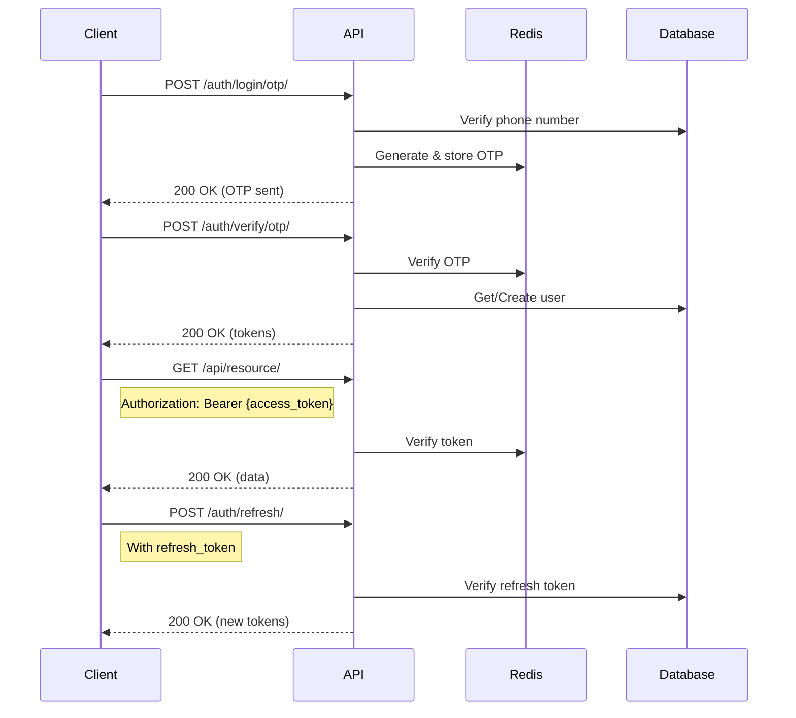

# 🔌 مرجع API در HELSSA

## 📋 فهرست مطالب

- [معرفی API](## 🎯 معرفی API)
- [احراز هویت](## 🔐 احراز هویت)
- [نقاط پایانی احراز هویت](## 🔐 نقاط پایانی احراز هویت)
- [نقاط پایانی بیمار](## 🔐 نقاط پایانی بیمار)
- [نقاط پایانی پزشک](## 🔐 نقاط پایانی پزشک)
- [نقاط پایانی AI و چت‌بات](## 🔐 نقاط پایانی AI و چت‌بات)
- [نقاط پایانی مالی](## 🔐 نقاط پایانی مالی)
- [WebSocket APIs](## 🔐 WebSocket APIs)
- [کدهای خطا](## 🔐 کدهای خطا)

---

## 🎯 معرفی API

HELSSA API یک RESTful API قدرتمند است که با Django REST Framework ساخته شده و تمام عملکردهای پلتفرم را در اختیار توسعه‌دهندگان قرار می‌دهد.

### مشخصات کلی

- **Base URL**: `https://api.helssa.ir/v1/`
- **Format**: JSON
- **Authentication**: JWT Bearer Token
- **Rate Limiting**:
  - Anonymous: 100 requests/hour
  - Authenticated: 1000 requests/hour
  - Premium: 10000 requests/hour
- **Versioning**: URL path versioning (v1, v2)

### Headers مورد نیاز

```http
Content-Type: application/json
Accept: application/json
Authorization: Bearer {access_token}
X-Client-Version: 1.0.0
Accept-Language: fa
```

## 🔐 احراز هویت

### JWT Token Flow



### Token Structure

```json
{
  "access": "eyJ0eXAiOiJKV1QiLCJhbGciOiJIUzI1NiJ9...",
  "refresh": "eyJ0eXAiOiJKV1QiLCJhbGciOiJIUzI1NiJ9...",
  "access_expires_in": 3600,
  "refresh_expires_in": 604800,
  "user": {
    "id": "uuid",
    "phone_number": "+989121234567",
    "first_name": "علی",
    "last_name": "محمدی",
    "role": "patient"
  }
}
```

## 📱 نقاط پایانی احراز هویت

### 1. درخواست OTP

```http
POST /api/v1/auth/login/otp/
```

**Request Body:**

```json
{
  "phone_number": "+989121234567",
  "channel": "sms"  // sms, whatsapp, call
}
```

```json
{
  "phone_number": "+989121234567",
  "channel": "sms"  // sms, whatsapp, call
}
```

**Response (200 OK):**

```json
{
  "message": "کد تایید ارسال شد",
  "expires_in": 120,
  "resend_available_in": 60,
  "masked_phone": "0912***4567"
}
```

**Response (429 Too Many Requests):**

```json
{
  "error": "too_many_requests",
  "message": "تعداد درخواست‌ها بیش از حد مجاز است",
  "retry_after": 300
}
```

### 2. تایید OTP

```http
POST /api/v1/auth/verify/otp/
```

**Request Body:**

```json
{
  "phone_number": "+989121234567",
  "otp_code": "123456"
}
```

**Response (200 OK):**

```json
{
  "access": "eyJ0eXAiOiJKV1QiLCJhbGciOiJIUzI1NiJ9...",
  "refresh": "eyJ0eXAiOiJKV1QiLCJhbGciOiJIUzI1NiJ9...",
  "user": {
    "id": "550e8400-e29b-41d4-a716-446655440000",
    "phone_number": "+989121234567",
    "first_name": "علی",
    "last_name": "محمدی",
    "email": "ali@example.com",
    "role": "patient",
    "is_profile_complete": true,
    "created_at": "2024-01-15T10:30:00Z"
  },
  "is_new_user": false
}
```

### 3. Refresh Token

```http
POST /api/v1/auth/refresh/
```

**Request Body:**

```json
{
  "refresh": "eyJ0eXAiOiJKV1QiLCJhbGciOiJIUzI1NiJ9..."
}
```

**Response (200 OK):**

```json
{
  "access": "new_access_token",
  "access_expires_in": 3600
}
```

### 4. Logout

```http
POST /api/v1/auth/logout/
```

**Request Headers:**

```http
Authorization: Bearer {access_token}
```

**Request Body:**

```json
{
  "refresh": "refresh_token_to_blacklist"
}
```

**Response (204 No Content):**

```json
{
  "message": "Logged out successfully"
}
```

## 👤 نقاط پایانی بیمار

### 1. پروفایل بیمار

```http
GET /api/v1/patients/profile/
```

**Response (200 OK):**

```json
{
  "id": "550e8400-e29b-41d4-a716-446655440000",
  "phone_number": "+989121234567",
  "first_name": "علی",
  "last_name": "محمدی",
  "national_id": "0012345678",
  "date_of_birth": "1370-01-01",
  "gender": "male",
  "email": "ali@example.com",
  "address": {
    "province": "تهران",
    "city": "تهران",
    "postal_code": "1234567890",
    "address": "خیابان ولیعصر، پلاک 123"
  },
  "emergency_contact": {
    "name": "محمد محمدی",
    "relationship": "برادر",
    "phone_number": "+989123456789"
  },
  "medical_info": {
    "blood_type": "A+",
    "height": 175,
    "weight": 70,
    "allergies": ["پنی‌سیلین"],
    "chronic_diseases": ["دیابت نوع 2"],
    "current_medications": ["متفورمین"]
  },
  "insurance": {
    "provider": "تامین اجتماعی",
    "number": "1234567890",
    "expiry_date": "1403-12-29"
  }
}
```

### 2. لیست ویزیت‌ها

```http
GET /api/v1/patients/encounters/
```

**Query Parameters:**

- `status`: pending, completed, cancelled
- `from_date`: 2024-01-01
- `to_date`: 2024-12-31
- `doctor_id`: UUID
- `page`: 1
- `page_size`: 20

**Response (200 OK):**

```json
{
  "count": 15,
  "next": "https://api.helssa.ir/v1/patients/encounters/?page=2",
  "previous": null,
  "results": [
    {
      "id": "encounter_id",
      "doctor": {
        "id": "doctor_id",
        "name": "دکتر سارا احمدی",
        "specialty": "پزشک عمومی",
        "profile_image": "https://..."
      },
      "scheduled_at": "2024-01-20T14:30:00Z",
      "chief_complaint": "سردرد مداوم",
      "status": "completed",
      "duration_minutes": 15,
      "visit_type": "online",
      "prescription": {
        "id": "prescription_id",
        "medications_count": 3
      },
      "soap_report": {
        "id": "report_id",
        "created_at": "2024-01-20T14:45:00Z"
      },
      "total_cost": 500000,
      "insurance_share": 300000,
      "patient_share": 200000
    }
  ]
}
```

### 3. جستجوی پزشک

```http
GET /api/v1/patients/doctors/search/
```

**Query Parameters:**

- `q`: search query
- `specialty`: specialty code
- `city`: city name
- `gender`: male, female
- `online_available`: true/false
- `insurance_accepted`: insurance provider
- `min_rating`: 1-5
- `sort_by`: rating, experience, price
- `page`: 1

**Response (200 OK):**

```json
{
  "count": 50,
  "results": [
    {
      "id": "doctor_id",
      "name": "دکتر مریم رضایی",
      "specialty": {
        "id": "cardiology",
        "title": "متخصص قلب و عروق"
      },
      "medical_council_number": "12345",
      "experience_years": 15,
      "rating": {
        "average": 4.8,
        "count": 234
      },
      "consultation_fee": 800000,
      "online_consultation_fee": 600000,
      "profile_image": "https://...",
      "location": {
        "province": "تهران",
        "city": "تهران",
        "address": "میدان ونک"
      },
      "availability": {
        "online": true,
        "in_person": true,
        "next_available": "2024-01-21T10:00:00Z"
      },
      "languages": ["فارسی", "انگلیسی"],
      "accepted_insurances": ["تامین اجتماعی", "ایران"]
    }
  ]
}
```

### 4. رزرو ویزیت

```http
POST /api/v1/patients/encounters/book/
```

**Request Body:**

```json
{
  "doctor_id": "doctor_uuid",
  "scheduled_at": "2024-01-25T15:00:00Z",
  "visit_type": "online",
  "chief_complaint": "درد قفسه سینه",
  "description": "از دو روز پیش درد خفیفی در قفسه سینه دارم",
  "insurance_info": {
    "use_insurance": true,
    "provider": "تامین اجتماعی",
    "number": "1234567890"
  }
}
```

**Response (201 Created):**

```json
{
  "id": "encounter_id",
  "booking_reference": "HLS-2024-0125-1500",
  "doctor": {
    "id": "doctor_id",
    "name": "دکتر مریم رضایی",
    "specialty": "متخصص قلب"
  },
  "scheduled_at": "2024-01-25T15:00:00Z",
  "estimated_duration": 20,
  "visit_type": "online",
  "meeting_link": null,  // Will be available 15 minutes before
  "status": "pending",
  "payment": {
    "total_amount": 800000,
    "insurance_discount": 480000,
    "payable_amount": 320000,
    "payment_status": "pending",
    "payment_url": "https://pay.helssa.ir/..."
  },
  "cancellation_policy": {
    "free_cancellation_before": "2024-01-24T15:00:00Z",
    "cancellation_fee_percentage": 50
  }
}
```

### 5. آپلود فایل پزشکی

```http
POST /api/v1/patients/medical-files/upload/
```

**Request (multipart/form-data):**

- `file`: binary file data
- `file_type`: lab_result, imaging, prescription, other
- `title`: عنوان فایل
- `description`: توضیحات (اختیاری)
- `encounter_id`: مرتبط با ویزیت (اختیاری)

**Response (201 Created):**

```json
{
  "id": "file_id",
  "title": "آزمایش خون",
  "file_type": "lab_result",
  "file_url": "https://storage.helssa.ir/medical/...",
  "file_size": 1048576,
  "mime_type": "application/pdf",
  "uploaded_at": "2024-01-20T10:30:00Z",
  "is_analyzed": false,
  "ai_analysis": null
}
```

## 👨‍⚕️ نقاط پایانی پزشک

### 1. داشبورد پزشک

```http
GET /api/v1/doctors/dashboard/
```

**Response (200 OK):**

```json
{
  "today_stats": {
    "total_appointments": 12,
    "completed": 8,
    "pending": 3,
    "cancelled": 1,
    "revenue": 6400000
  },
  "week_stats": {
    "total_appointments": 45,
    "average_rating": 4.7,
    "total_revenue": 27000000
  },
  "upcoming_appointments": [
    {
      "id": "appointment_id",
      "patient": {
        "id": "patient_id",
        "name": "علی محمدی",
        "age": 35,
        "gender": "male",
        "medical_record_number": "MRN123456"
      },
      "scheduled_at": "2024-01-20T16:00:00Z",
      "chief_complaint": "سرفه مداوم",
      "visit_type": "online",
      "status": "confirmed"
    }
  ],
  "notifications": [
    {
      "id": "notif_id",
      "type": "appointment_reminder",
      "message": "ویزیت بعدی شما 30 دقیقه دیگر شروع می‌شود",
      "created_at": "2024-01-20T15:30:00Z",
      "is_read": false
    }
  ]
}
```

### 2. مدیریت دسترسی موقت

```http
POST /api/v1/doctors/patient-access/grant/
```

**Request Body:**

```json
{
  "patient_phone": "+989121234567",
  "access_duration_hours": 72,
  "permissions": ["view_history", "view_reports", "add_notes"],
  "reason": "پیگیری درمان"
}
```

**Response (201 Created):**

```json
{
  "access_code": "ABC123",
  "patient": {
    "id": "patient_id",
    "name": "علی محمدی",
    "phone_number": "+9891****4567"
  },
  "permissions": ["view_history", "view_reports", "add_notes"],
  "expires_at": "2024-01-23T15:30:00Z",
  "qr_code_url": "https://api.helssa.ir/qr/access/ABC123"
}
```

### 3. ثبت یادداشت برای بیمار

```http
POST /api/v1/doctors/patients/{patient_id}/notes/
```

**Request Body:**

```json
{
  "encounter_id": "encounter_id",
  "note_type": "clinical",
  "content": "بیمار به درمان پاسخ مناسبی داده است. ادامه مصرف دارو توصیه می‌شود.",
  "is_private": false,
  "tags": ["followup", "medication"]
}
```

**Response (201 Created):**

```json
{
  "id": "note_id",
  "note_type": "clinical",
  "content": "بیمار به درمان پاسخ مناسبی داده است...",
  "created_at": "2024-01-20T16:45:00Z",
  "created_by": {
    "id": "doctor_id",
    "name": "دکتر سارا احمدی"
  },
  "encounter": {
    "id": "encounter_id",
    "date": "2024-01-20"
  },
  "is_private": false,
  "tags": ["followup", "medication"]
}
```

### 4. تنظیمات پزشک

```http
PUT /api/v1/doctors/settings/
```

**Request Body:**

```json
{
  "consultation_settings": {
    "online_consultation_enabled": true,
    "online_consultation_fee": 600000,
    "in_person_consultation_fee": 800000,
    "consultation_duration": 20,
    "buffer_time": 10
  },
  "availability": {
    "working_days": ["saturday", "sunday", "monday", "tuesday", "wednesday"],
    "working_hours": {
      "start": "09:00",
      "end": "17:00"
    },
    "break_times": [
      {
        "start": "12:00",
        "end": "13:00"
      }
    ]
  },
  "notification_preferences": {
    "appointment_reminders": true,
    "new_appointments": true,
    "cancellations": true,
    "payment_notifications": true
  },
  "accepted_insurances": [
    "تامین اجتماعی",
    "ایران",
    "آسیا"
  ]
}
```

## 🤖 نقاط پایانی AI و چت‌بات

### 1. شروع چت جدید

```http
POST /api/v1/ai/chat/sessions/
```

**Request Body:**

```json
{
  "title": "مشاوره دارویی",
  "initial_message": "سلام، در مورد عوارض قرص متفورمین سوال داشتم"
}
```

**Response (201 Created):**

```json
{
  "id": "session_id",
  "title": "مشاوره دارویی",
  "created_at": "2024-01-20T10:00:00Z",
  "messages": [
    {
      "id": "msg_1",
      "role": "user",
      "content": "سلام، در مورد عوارض قرص متفورمین سوال داشتم",
      "timestamp": "2024-01-20T10:00:00Z"
    },
    {
      "id": "msg_2",
      "role": "assistant",
      "content": "سلام! متفورمین یکی از داروهای رایج برای کنترل دیابت نوع 2 است. عوارض جانبی شایع آن شامل:\n\n1. مشکلات گوارشی (تهوع، اسهال)\n2. طعم فلزی در دهان\n3. کاهش اشتها\n\nآیا عارضه خاصی را تجربه کرده‌اید؟",
      "timestamp": "2024-01-20T10:00:02Z",
      "metadata": {
        "confidence": 0.95,
        "sources": ["medical_knowledge_base"]
      }
    }
  ]
}
```

### 2. ارسال پیام در چت

```http
POST /api/v1/ai/chat/sessions/{session_id}/messages/
```

**Request Body:**

```json
{
  "content": "بله، از دیروز دچار تهوع شدیدی شده‌ام",
  "attachments": [
    {
      "type": "image",
      "url": "https://storage.helssa.ir/..."
    }
  ]
}
```

**Response (200 OK):**

```json
{
  "id": "msg_3",
  "role": "user",
  "content": "بله، از دیروز دچار تهوع شدیدی شده‌ام",
  "timestamp": "2024-01-20T10:01:00Z",
  "ai_response": {
    "id": "msg_4",
    "role": "assistant",
    "content": "متوجه شدم. تهوع از عوارض شایع متفورمین است، به‌ویژه در ابتدای مصرف. توصیه‌های زیر می‌تواند کمک‌کننده باشد:\n\n1. **دارو را همراه با غذا مصرف کنید**\n2. **دوز را به تدریج افزایش دهید** (با مشورت پزشک)\n3. **از فرم کند-رهش (Extended Release) استفاده کنید**\n\n⚠️ **توجه**: اگر تهوع شدید است یا بیش از یک هفته ادامه داشت، حتماً با پزشک خود مشورت کنید.\n\nآیا این اولین بار است که متفورمین مصرف می‌کنید؟",
    "timestamp": "2024-01-20T10:01:03Z",
    "metadata": {
      "confidence": 0.92,
      "medical_disclaimer": true,
      "suggested_actions": ["consult_doctor"]
    }
  }
}
```

### 3. تحلیل تصویر پزشکی

```http
POST /api/v1/ai/vision/analyze/
```

**Request (multipart/form-data):**

- `image`: binary image data
- `analysis_type`: skin_condition, wound, rash, other
- `description`: توضیحات تکمیلی

**Response (200 OK):**

```json
{
  "analysis_id": "analysis_id",
  "status": "completed",
  "results": {
    "primary_findings": [
      {
        "condition": "احتمال اگزما",
        "confidence": 0.78,
        "description": "ناحیه قرمز و ملتهب با علائم خارش مشاهده می‌شود"
      }
    ],
    "recommendations": [
      "مراجعه به متخصص پوست",
      "اجتناب از خاراندن ناحیه",
      "استفاده از کرم‌های مرطوب‌کننده"
    ],
    "severity": "moderate",
    "urgent_care_needed": false
  },
  "disclaimer": "این تحلیل صرفاً جنبه آموزشی دارد و جایگزین معاینه پزشک نیست",
  "processed_at": "2024-01-20T10:30:00Z"
}
```

### 4. تولید گزارش SOAP

```http
POST /api/v1/ai/soap/generate/
```

**Request Body:**

```json
{
  "encounter_id": "encounter_id",
  "transcript_id": "transcript_id",
  "additional_notes": "بیمار سابقه آلرژی به پنی‌سیلین دارد"
}
```

**Response (202 Accepted):**

```json
{
  "task_id": "task_id",
  "status": "processing",
  "estimated_completion": "2024-01-20T10:35:00Z",
  "progress_url": "https://api.helssa.ir/v1/ai/soap/tasks/task_id"
}
```

**Progress Check (GET /api/v1/ai/soap/tasks/{task_id}):**

```json
{
  "task_id": "task_id",
  "status": "completed",
  "result": {
    "soap_report": {
      "subjective": {
        "chief_complaint": "سرفه خشک مداوم",
        "hpi": "بیمار از 5 روز پیش دچار سرفه خشک...",
        "pmh": ["آسم", "آلرژی فصلی"],
        "medications": ["سالبوتامول اسپری"],
        "allergies": ["پنی‌سیلین"]
      },
      "objective": {
        "vital_signs": {
          "bp": "120/80",
          "hr": "78",
          "rr": "16",
          "temp": "37.2",
          "spo2": "97%"
        },
        "physical_exam": "ریه‌ها: صاف، بدون رال..."
      },
      "assessment": {
        "diagnoses": [
          {
            "description": "برونشیت حاد",
            "icd_code": "J20.9",
            "probability": 0.85
          }
        ]
      },
      "plan": {
        "medications": [
          {
            "name": "دکسترومتورفان",
            "dosage": "15mg",
            "frequency": "هر 6 ساعت",
            "duration": "5 روز"
          }
        ],
        "follow_up": "در صورت عدم بهبود تا 1 هفته مراجعه نمایید"
      }
    },
    "confidence_score": 0.88,
    "generated_at": "2024-01-20T10:34:30Z"
  }
}
```

## 💳 نقاط پایانی مالی

### 1. کیف پول کاربر

```http
GET /api/v1/billing/wallet/
```

**Response (200 OK):**

```json
{
  "wallet_id": "wallet_id",
  "balance": 2500000,
  "currency": "IRR",
  "blocked_amount": 0,
  "last_updated": "2024-01-20T10:00:00Z",
  "recent_transactions": [
    {
      "id": "tx_id",
      "type": "credit",
      "amount": 1000000,
      "description": "شارژ کیف پول",
      "created_at": "2024-01-19T15:30:00Z",
      "status": "completed"
    }
  ]
}
```

### 2. شارژ کیف پول

```http
POST /api/v1/billing/wallet/charge/
```

**Request Body:**

```json
{
  "amount": 1000000,
  "payment_method": "online",
  "gateway": "zarinpal",
  "return_url": "https://app.helssa.ir/wallet/callback"
}
```

**Response (200 OK):**

```json
{
  "transaction_id": "tx_id",
  "payment_url": "https://www.zarinpal.com/pg/StartPay/...",
  "amount": 1000000,
  "expires_at": "2024-01-20T10:30:00Z"
}
```

### 3. لیست اشتراک‌ها

```http
GET /api/v1/billing/subscriptions/plans/
```

**Response (200 OK):**

```json
{
  "plans": [
    {
      "id": "basic",
      "name": "پلن پایه",
      "price": 99000,
      "duration_days": 30,
      "features": [
        "5 ویزیت آنلاین در ماه",
        "دسترسی به چت‌بات پزشکی",
        "ذخیره‌سازی 100MB"
      ],
      "limitations": {
        "monthly_consultations": 5,
        "storage_mb": 100,
        "ai_queries": 50
      }
    },
    {
      "id": "premium",
      "name": "پلن طلایی",
      "price": 299000,
      "duration_days": 30,
      "features": [
        "ویزیت آنلاین نامحدود",
        "اولویت در رزرو",
        "دسترسی کامل به AI",
        "ذخیره‌سازی 1GB"
      ],
      "limitations": {
        "monthly_consultations": -1,
        "storage_mb": 1024,
        "ai_queries": -1
      },
      "discount": {
        "percentage": 20,
        "valid_until": "2024-02-01"
      }
    }
  ]
}
```

### 4. خرید اشتراک

```http
POST /api/v1/billing/subscriptions/purchase/
```

**Request Body:**

```json
{
  "plan_id": "premium",
  "duration_months": 3,
  "payment_method": "wallet",
  "discount_code": "WINTER2024"
}
```

**Response (200 OK):**

```json
{
  "subscription": {
    "id": "sub_id",
    "plan": {
      "id": "premium",
      "name": "پلن طلایی"
    },
    "start_date": "2024-01-20",
    "end_date": "2024-04-20",
    "status": "active",
    "auto_renew": true
  },
  "payment": {
    "amount": 717600,
    "discount_applied": 179400,
    "total_paid": 538200,
    "payment_method": "wallet",
    "transaction_id": "tx_id"
  }
}
```

## 🔌 WebSocket APIs

### 1. چت Real-time

```javascript
// Connection
const ws = new WebSocket('wss://api.helssa.ir/ws/chat/');

// Authentication
ws.onopen = () => {
  ws.send(JSON.stringify({
    type: 'auth',
    token: 'jwt_access_token'
  }));
};

// Join chat session
ws.send(JSON.stringify({
  type: 'join_session',
  session_id: 'chat_session_id'
}));

// Send message
ws.send(JSON.stringify({
  type: 'message',
  content: 'سلام، سوالی داشتم',
  session_id: 'chat_session_id'
}));

// Receive messages
ws.onmessage = (event) => {
  const data = JSON.parse(event.data);
  
  switch(data.type) {
    case 'auth_success':
      console.log('Authenticated');
      break;
      
    case 'message':
      console.log('New message:', data.content);
      break;
      
    case 'typing':
      console.log('Assistant is typing...');
      break;
      
    case 'error':
      console.error('Error:', data.message);
      break;
  }
};
```

### 2. ویزیت آنلاین (WebRTC Signaling)

```javascript
// Connection for video call
const ws = new WebSocket('wss://api.helssa.ir/ws/video/');

// Join encounter room
ws.send(JSON.stringify({
  type: 'join_room',
  encounter_id: 'encounter_id',
  role: 'patient'  // or 'doctor'
}));

// Send WebRTC offer
ws.send(JSON.stringify({
  type: 'offer',
  sdp: rtcSessionDescription,
  to: 'doctor_id'
}));

// Handle signaling
ws.onmessage = (event) => {
  const data = JSON.parse(event.data);
  
  switch(data.type) {
    case 'offer':
      // Handle incoming offer
      handleOffer(data.sdp);
      break;
      
    case 'answer':
      // Handle answer
      handleAnswer(data.sdp);
      break;
      
    case 'ice_candidate':
      // Add ICE candidate
      handleIceCandidate(data.candidate);
      break;
      
    case 'user_joined':
      console.log('User joined:', data.user_id);
      break;
      
    case 'user_left':
      console.log('User left:', data.user_id);
      break;
  }
};
```

## ❌ کدهای خطا

### کدهای استاندارد HTTP

- `200 OK`: درخواست موفق
- `201 Created`: منبع جدید ایجاد شد
- `204 No Content`: موفق، بدون محتوا
- `400 Bad Request`: درخواست نامعتبر
- `401 Unauthorized`: احراز هویت نشده
- `403 Forbidden`: دسترسی ممنوع
- `404 Not Found`: منبع یافت نشد
- `409 Conflict`: تضاد با وضعیت فعلی
- `422 Unprocessable Entity`: اعتبارسنجی ناموفق
- `429 Too Many Requests`: محدودیت نرخ
- `500 Internal Server Error`: خطای سرور

### فرمت خطای استاندارد

```json
{
  "error": {
    "code": "VALIDATION_ERROR",
    "message": "اطلاعات ارسالی معتبر نیست",
    "details": {
      "field_errors": {
        "phone_number": [
          "شماره تلفن باید با 09 شروع شود"
        ],
        "otp_code": [
          "کد تایید باید 6 رقم باشد"
        ]
      }
    },
    "request_id": "req_abc123",
    "timestamp": "2024-01-20T10:30:00Z"
  }
}
```

### کدهای خطای سفارشی

```json
{
  "OTP_EXPIRED": "کد تایید منقضی شده است",
  "OTP_INVALID": "کد تایید نامعتبر است",
  "PHONE_BLOCKED": "شماره تلفن مسدود شده است",
  "INSUFFICIENT_BALANCE": "موجودی کیف پول کافی نیست",
  "SUBSCRIPTION_EXPIRED": "اشتراک شما منقضی شده است",
  "DOCTOR_UNAVAILABLE": "پزشک در دسترس نیست",
  "APPOINTMENT_CONFLICT": "تداخل زمانی با ویزیت دیگر",
  "FILE_TOO_LARGE": "حجم فایل بیش از حد مجاز",
  "UNSUPPORTED_FORMAT": "فرمت فایل پشتیبانی نمی‌شود",
  "AI_SERVICE_UNAVAILABLE": "سرویس هوش مصنوعی در دسترس نیست"
}
```

### Rate Limiting Headers

```http
X-RateLimit-Limit: 1000
X-RateLimit-Remaining: 950
X-RateLimit-Reset: 1705749600
Retry-After: 3600
```

---

[ELEMENT: div align="center"]

[→ قبلی: زیرساخت و Docker](13-infrastructure.md) | [بعدی: امنیت و Compliance ←](15-security-compliance.md)

</div>
