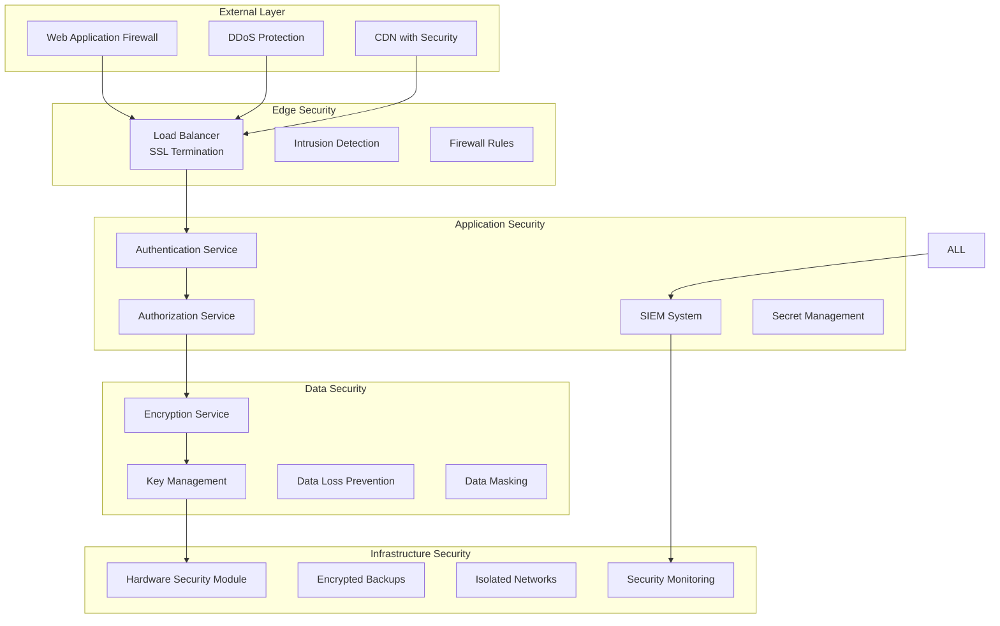

# 🔒 امنیت و Compliance در HELSSA

## 📋 فهرست مطالب

- [معرفی امنیت HELSSA](## 🎯 معرفی امنیت HELSSA)
- [معماری امنیتی](## 🏗️ معماری امنیتی)
- [احراز هویت و مجوزدهی](## 🔐 احراز هویت و مجوزدهی)
- [رمزنگاری داده‌ها](## 🔐 رمزنگاری داده‌ها)
- [HIPAA Compliance](## 🔐 HIPAA Compliance)
- [حفاظت از داده‌های پزشکی](## 🔐 حفاظت از داده‌های پزشکی)
- [Audit و Logging](## 🔐 Audit و Logging)
- [مدیریت حوادث امنیتی](## 🔐 مدیریت حوادث امنیتی)

---

## 🎯 معرفی امنیت HELSSA

امنیت در HELSSA با رویکرد Defense in Depth و Zero Trust طراحی شده و تمام جنبه‌های حفاظت از داده‌های حساس پزشکی را پوشش می‌دهد.

### اصول امنیتی

- 🛡️ **Zero Trust Architecture**: هیچ کاربر یا سرویسی به طور پیش‌فرض قابل اعتماد نیست
- 🔐 **End-to-End Encryption**: رمزنگاری کامل از کلاینت تا دیتابیس
- 📋 **Principle of Least Privilege**: حداقل دسترسی لازم
- 🔍 **Complete Audit Trail**: ثبت کامل تمام فعالیت‌ها
- 🏥 **HIPAA Compliant**: رعایت استانداردهای بین‌المللی
- 🚨 **Real-time Monitoring**: پایش لحظه‌ای تهدیدات
- 🔄 **Regular Security Updates**: به‌روزرسانی منظم
- 📱 **Multi-factor Authentication**: احراز هویت چندعامله

## 🏗️ معماری امنیتی



### Security Layers Implementation

```python
# core/security/layers.py
from typing import Dict, List, Optional
import hashlib
import hmac
from cryptography.fernet import Fernet
from django.conf import settings

class SecurityLayerManager:
    """مدیریت لایه‌های امنیتی"""
    
    def __init__(self):
        self.layers = [
            NetworkSecurityLayer(),
            ApplicationSecurityLayer(),
            DataSecurityLayer(),
            AuditSecurityLayer()
        ]
        
    async def process_request(self, request) -> Dict:
        """پردازش درخواست از تمام لایه‌های امنیتی"""
        
        context = {
            'request': request,
            'security_checks': [],
            'risk_score': 0
        }
        
        for layer in self.layers:
            try:
                result = await layer.check(context)
                context['security_checks'].append({
                    'layer': layer.name,
                    'status': result['status'],
                    'risk_contribution': result.get('risk', 0)
                })
                
                context['risk_score'] += result.get('risk', 0)
                
                if result['status'] == 'blocked':
                    await self._handle_security_violation(
                        layer.name,
                        result['reason'],
                        context
                    )
                    raise SecurityViolationException(result['reason'])
                    
            except Exception as e:
                await self._log_security_error(layer.name, e, context)
                
        return context
        
    async def _handle_security_violation(
        self,
        layer: str,
        reason: str,
        context: Dict
    ):
        """مدیریت نقض امنیتی"""
        
        # ثبت در لاگ امنیتی
        await SecurityLog.objects.create(
            event_type='security_violation',
            layer=layer,
            reason=reason,
            ip_address=context['request'].META.get('REMOTE_ADDR'),
            user_agent=context['request'].META.get('HTTP_USER_AGENT'),
            risk_score=context['risk_score'],
            metadata=context
        )
        
        # ارسال هشدار
        if context['risk_score'] > 50:
            await self._send_security_alert(layer, reason, context)
```

## 🔐 احراز هویت و مجوزدهی

### Multi-Factor Authentication

```python
# unified_auth/services/mfa.py
import pyotp
import qrcode
from io import BytesIO
from typing import Optional, Tuple

class MFAService:
    """سرویس احراز هویت چندعامله"""
    
    def __init__(self):
        self.issuer_name = "HELSSA Medical Platform"
        
    async def enable_mfa(self, user_id: str) -> Tuple[str, str]:
        """فعال‌سازی MFA برای کاربر"""
        
        user = await UnifiedUser.objects.get(id=user_id)
        
        # تولید secret key
        secret = pyotp.random_base32()
        
        # ذخیره encrypted secret
        encrypted_secret = await self._encrypt_secret(secret)
        
        await MFAConfig.objects.create(
            user=user,
            secret=encrypted_secret,
            backup_codes=await self._generate_backup_codes(),
            is_active=False  # تا تایید اولیه
        )
        
        # تولید QR Code
        provisioning_uri = pyotp.totp.TOTP(secret).provisioning_uri(
            name=user.phone_number,
            issuer_name=self.issuer_name
        )
        
        qr_code_url = await self._generate_qr_code(provisioning_uri)
        
        return secret, qr_code_url
        
    async def verify_mfa_token(
        self,
        user_id: str,
        token: str
    ) -> bool:
        """تایید توکن MFA"""
        
        mfa_config = await MFAConfig.objects.get(user_id=user_id)
        
        if not mfa_config.is_active:
            return False
            
        # بررسی backup codes
        if token in mfa_config.backup_codes:
            # حذف backup code استفاده شده
            mfa_config.backup_codes.remove(token)
            await mfa_config.save()
            
            await self._log_backup_code_usage(user_id)
            return True
            
        # بررسی TOTP
        secret = await self._decrypt_secret(mfa_config.secret)
        totp = pyotp.TOTP(secret)
        
        # بررسی با window برای جبران اختلاف زمانی
        is_valid = totp.verify(token, valid_window=1)
        
        if is_valid:
            await self._log_successful_mfa(user_id)
        else:
            await self._log_failed_mfa(user_id)
            
        return is_valid
        
    async def _generate_backup_codes(self, count: int = 10) -> List[str]:
        """تولید کدهای پشتیبان"""
        
        codes = []
        for _ in range(count):
            code = ''.join(random.choices(string.digits, k=8))
            codes.append(code)
            
        return codes
```

### Role-Based Access Control (RBAC)

```python
# unified_auth/services/rbac.py
from enum import Enum
from typing import List, Dict, Optional

class Permission(Enum):
    """مجوزهای سیستم"""
    
    # Patient permissions
    VIEW_OWN_RECORDS = "view_own_records"
    BOOK_APPOINTMENT = "book_appointment"
    CHAT_WITH_AI = "chat_with_ai"
    
    # Doctor permissions
    VIEW_PATIENT_RECORDS = "view_patient_records"
    WRITE_PRESCRIPTION = "write_prescription"
    CREATE_SOAP_REPORT = "create_soap_report"
    
    # Admin permissions
    MANAGE_USERS = "manage_users"
    VIEW_ALL_RECORDS = "view_all_records"
    SYSTEM_SETTINGS = "system_settings"

class RBACService:
    """سرویس کنترل دسترسی بر اساس نقش"""
    
    def __init__(self):
        self.role_permissions = {
            'patient': [
                Permission.VIEW_OWN_RECORDS,
                Permission.BOOK_APPOINTMENT,
                Permission.CHAT_WITH_AI
            ],
            'doctor': [
                Permission.VIEW_PATIENT_RECORDS,
                Permission.WRITE_PRESCRIPTION,
                Permission.CREATE_SOAP_REPORT
            ],
            'admin': [
                Permission.MANAGE_USERS,
                Permission.VIEW_ALL_RECORDS,
                Permission.SYSTEM_SETTINGS
            ]
        }
        
    async def check_permission(
        self,
        user_id: str,
        permission: Permission,
        resource: Optional[Dict] = None
    ) -> bool:
        """بررسی مجوز کاربر"""
        
        user = await UnifiedUser.objects.get(id=user_id)
        
        # بررسی نقش‌های کاربر
        user_permissions = set()
        for role in user.roles.all():
            role_perms = self.role_permissions.get(role.name, [])
            user_permissions.update(role_perms)
            
        # بررسی مجوز پایه
        if permission not in user_permissions:
            await self._log_permission_denied(user_id, permission)
            return False
            
        # بررسی دسترسی به منبع خاص
        if resource:
            has_resource_access = await self._check_resource_access(
                user,
                permission,
                resource
            )
            if not has_resource_access:
                await self._log_resource_access_denied(
                    user_id,
                    permission,
                    resource
                )
                return False
                
        await self._log_permission_granted(user_id, permission)
        return True
        
    async def _check_resource_access(
        self,
        user: UnifiedUser,
        permission: Permission,
        resource: Dict
    ) -> bool:
        """بررسی دسترسی به منبع خاص"""
        
        # دسترسی بیمار به رکوردهای خودش
        if permission == Permission.VIEW_OWN_RECORDS:
            return resource.get('patient_id') == str(user.id)
            
        # دسترسی پزشک به بیمار
        if permission == Permission.VIEW_PATIENT_RECORDS:
            # بررسی دسترسی موقت
            temp_access = await TemporaryAccess.objects.filter(
                doctor=user,
                patient_id=resource.get('patient_id'),
                is_active=True,
                expires_at__gt=timezone.now()
            ).exists()
            
            if temp_access:
                return True
                
            # بررسی ویزیت فعال
            active_encounter = await Encounter.objects.filter(
                doctor=user,
                patient_id=resource.get('patient_id'),
                status__in=['scheduled', 'in_progress']
            ).exists()
            
            return active_encounter
            
        return True
```

### API Security Middleware

```python
# core/middleware/security.py
import jwt
from django.utils.deprecation import MiddlewareMixin
from django.http import JsonResponse

class SecurityMiddleware(MiddlewareMixin):
    """Middleware امنیتی API"""
    
    def process_request(self, request):
        # بررسی HTTPS
        if not request.is_secure() and not settings.DEBUG:
            return JsonResponse({
                'error': 'HTTPS_REQUIRED',
                'message': 'ارتباط امن (HTTPS) الزامی است'
            }, status=403)
            
        # بررسی API Version
        if request.path.startswith('/api/'):
            version = self._extract_api_version(request.path)
            if version not in settings.SUPPORTED_API_VERSIONS:
                return JsonResponse({
                    'error': 'UNSUPPORTED_VERSION',
                    'message': f'نسخه API {version} پشتیبانی نمی‌شود'
                }, status=400)
                
        # Rate Limiting
        if not self._check_rate_limit(request):
            return JsonResponse({
                'error': 'RATE_LIMIT_EXCEEDED',
                'message': 'تعداد درخواست‌ها بیش از حد مجاز',
                'retry_after': 3600
            }, status=429)
            
        # HMAC Signature برای درخواست‌های حساس
        if self._requires_hmac(request):
            if not self._verify_hmac(request):
                return JsonResponse({
                    'error': 'INVALID_SIGNATURE',
                    'message': 'امضای درخواست معتبر نیست'
                }, status=401)
                
        return None
        
    def process_response(self, request, response):
        # Security Headers
        response['X-Content-Type-Options'] = 'nosniff'
        response['X-Frame-Options'] = 'DENY'
        response['X-XSS-Protection'] = '1; mode=block'
        response['Referrer-Policy'] = 'strict-origin-when-cross-origin'
        response['Feature-Policy'] = "geolocation 'none'; microphone 'none'; camera 'self'"
        
        # HSTS
        if request.is_secure():
            response['Strict-Transport-Security'] = 'max-age=31536000; includeSubDomains'
            
        # Remove sensitive headers
        response.pop('Server', None)
        response.pop('X-Powered-By', None)
        
        return response
```

## 🔐 رمزنگاری داده‌ها

### Field-Level Encryption

```python
# core/security/encryption.py
from cryptography.fernet import Fernet
from cryptography.hazmat.primitives import hashes
from cryptography.hazmat.primitives.kdf.pbkdf2 import PBKDF2HMAC
import base64

class FieldEncryption:
    """رمزنگاری در سطح فیلد"""
    
    def __init__(self):
        self.kms = KeyManagementService()
        
    def encrypt_field(self, value: str, context: Dict) -> str:
        """رمزنگاری فیلد"""
        
        if not value:
            return value
            
        # دریافت کلید از KMS
        encryption_key = self.kms.get_data_key(context)
        
        # رمزنگاری
        fernet = Fernet(encryption_key)
        encrypted_value = fernet.encrypt(value.encode())
        
        # افزودن metadata
        return self._add_encryption_metadata(
            encrypted_value,
            context
        )
        
    def decrypt_field(self, encrypted_value: str, context: Dict) -> str:
        """رمزگشایی فیلد"""
        
        if not encrypted_value:
            return encrypted_value
            
        # استخراج metadata
        value, metadata = self._extract_encryption_metadata(encrypted_value)
        
        # دریافت کلید
        decryption_key = self.kms.get_data_key(metadata)
        
        # رمزگشایی
        fernet = Fernet(decryption_key)
        decrypted_value = fernet.decrypt(value)
        
        return decrypted_value.decode()

# مدل با فیلدهای رمزنگاری شده
class EncryptedModel(models.Model):
    """مدل پایه با قابلیت رمزنگاری"""
    
    class Meta:
        abstract = True
        
    def save(self, *args, **kwargs):
        # رمزنگاری فیلدهای حساس
        for field in self._get_encrypted_fields():
            value = getattr(self, field)
            if value:
                encrypted_value = FieldEncryption().encrypt_field(
                    value,
                    {'model': self.__class__.__name__, 'field': field}
                )
                setattr(self, field, encrypted_value)
                
        super().save(*args, **kwargs)
        
    def _get_encrypted_fields(self):
        """لیست فیلدهای نیازمند رمزنگاری"""
        return getattr(self.Meta, 'encrypted_fields', [])
```

### Database Encryption

```python
# core/security/database_encryption.py

class DatabaseEncryption:
    """رمزنگاری دیتابیس"""
    
    def __init__(self):
        self.cipher_suite = self._initialize_cipher()
        
    def encrypt_backup(self, backup_file: str) -> str:
        """رمزنگاری فایل پشتیبان"""
        
        # خواندن فایل
        with open(backup_file, 'rb') as f:
            data = f.read()
            
        # فشرده‌سازی
        compressed_data = gzip.compress(data)
        
        # رمزنگاری
        encrypted_data = self.cipher_suite.encrypt(compressed_data)
        
        # ذخیره فایل رمزنگاری شده
        encrypted_file = f"{backup_file}.enc"
        with open(encrypted_file, 'wb') as f:
            f.write(encrypted_data)
            
        # حذف فایل اصلی
        os.remove(backup_file)
        
        return encrypted_file
        
    def setup_transparent_encryption(self):
        """راه‌اندازی رمزنگاری شفاف MySQL"""
        
        sql_commands = """
        -- Enable keyring plugin
        INSTALL PLUGIN keyring_file SONAME 'keyring_file.so';
        
        -- Set keyring file location
        SET GLOBAL keyring_file_data='/var/lib/mysql-keyring/keyring';
        
        -- Create encrypted tablespace
        CREATE TABLESPACE encrypted_ts
        ADD DATAFILE 'encrypted_ts.ibd'
        ENCRYPTION='Y';
        
        -- Alter tables to use encryption
        ALTER TABLE patient_records ENCRYPTION='Y';
        ALTER TABLE medical_files ENCRYPTION='Y';
        ALTER TABLE chat_messages ENCRYPTION='Y';
        """
        
        return sql_commands
```

## 🏥 HIPAA Compliance

### HIPAA Security Rule Implementation

```python
# core/compliance/hipaa.py

class HIPAACompliance:
    """پیاده‌سازی الزامات HIPAA"""
    
    def __init__(self):
        self.safeguards = {
            'administrative': AdministrativeSafeguards(),
            'physical': PhysicalSafeguards(),
            'technical': TechnicalSafeguards()
        }
        
    async def audit_compliance(self) -> Dict:
        """ممیزی رعایت HIPAA"""
        
        results = {
            'compliant': True,
            'score': 100,
            'findings': [],
            'recommendations': []
        }
        
        # بررسی هر safeguard
        for category, safeguard in self.safeguards.items():
            audit_result = await safeguard.audit()
            
            results['findings'].extend(audit_result['findings'])
            results['score'] = min(results['score'], audit_result['score'])
            
            if audit_result['score'] < 100:
                results['compliant'] = False
                results['recommendations'].extend(
                    audit_result['recommendations']
                )
                
        # تولید گزارش
        report = await self._generate_compliance_report(results)
        
        return report

class TechnicalSafeguards:
    """Safeguards فنی HIPAA"""
    
    async def audit(self) -> Dict:
        findings = []
        score = 100
        
        # Access Control
        if not await self._check_access_control():
            findings.append("کنترل دسترسی کامل پیاده‌سازی نشده")
            score -= 10
            
        # Audit Controls
        if not await self._check_audit_controls():
            findings.append("سیستم audit log کامل نیست")
            score -= 15
            
        # Integrity Controls
        if not await self._check_integrity_controls():
            findings.append("کنترل یکپارچگی داده‌ها ناقص است")
            score -= 10
            
        # Transmission Security
        if not await self._check_transmission_security():
            findings.append("امنیت انتقال داده‌ها کامل نیست")
            score -= 20
            
        return {
            'category': 'technical',
            'score': score,
            'findings': findings,
            'recommendations': self._get_recommendations(findings)
        }
```

### Protected Health Information (PHI) Handler

```python
# core/compliance/phi_handler.py

class PHIHandler:
    """مدیریت اطلاعات سلامت محافظت شده"""
    
    # فیلدهای PHI
    PHI_FIELDS = [
        'first_name', 'last_name', 'national_id',
        'date_of_birth', 'address', 'phone_number',
        'email', 'medical_record_number', 'insurance_number',
        'diagnosis', 'treatment', 'prescription'
    ]
    
    def __init__(self):
        self.encryptor = FieldEncryption()
        self.masker = DataMasking()
        self.logger = PHIAccessLogger()
        
    async def handle_phi_access(
        self,
        user_id: str,
        patient_id: str,
        fields_requested: List[str],
        purpose: str
    ) -> Dict:
        """مدیریت دسترسی به PHI"""
        
        # بررسی مجوز
        if not await self._verify_phi_access(
            user_id,
            patient_id,
            purpose
        ):
            await self.logger.log_unauthorized_access(
                user_id,
                patient_id,
                fields_requested
            )
            raise UnauthorizedPHIAccess()
            
        # بازیابی داده‌ها
        phi_data = await self._retrieve_phi(patient_id, fields_requested)
        
        # اعمال محدودیت‌ها
        filtered_data = await self._apply_minimum_necessary(
            phi_data,
            purpose
        )
        
        # ثبت دسترسی
        await self.logger.log_phi_access(
            user_id,
            patient_id,
            fields_requested,
            purpose
        )
        
        return filtered_data
        
    async def _apply_minimum_necessary(
        self,
        data: Dict,
        purpose: str
    ) -> Dict:
        """اعمال اصل Minimum Necessary"""
        
        necessary_fields = {
            'treatment': self.PHI_FIELDS,  # دسترسی کامل برای درمان
            'billing': ['name', 'insurance_number', 'address'],
            'research': [],  # داده‌های de-identified
            'quality_improvement': ['diagnosis', 'treatment']
        }
        
        allowed_fields = necessary_fields.get(purpose, [])
        
        return {
            k: v for k, v in data.items()
            if k in allowed_fields
        }
```

## 🛡️ حفاظت از داده‌های پزشکی

### Data Masking Service

```python
# core/security/data_masking.py

class DataMaskingService:
    """سرویس ماسک کردن داده‌های حساس"""
    
    def __init__(self):
        self.patterns = {
            'national_id': r'\d{10}',
            'phone_number': r'(\+98|0)?9\d{9}',
            'credit_card': r'\d{4}[\s-]?\d{4}[\s-]?\d{4}[\s-]?\d{4}',
            'email': r'[a-zA-Z0-9._%+-]+@[a-zA-Z0-9.-]+\.[a-zA-Z]{2,}'
        }
        
    def mask_sensitive_data(
        self,
        text: str,
        mask_type: str = 'partial'
    ) -> str:
        """ماسک کردن داده‌های حساس در متن"""
        
        for data_type, pattern in self.patterns.items():
            text = re.sub(
                pattern,
                lambda m: self._mask_value(m.group(), data_type, mask_type),
                text
            )
            
        return text
        
    def _mask_value(
        self,
        value: str,
        data_type: str,
        mask_type: str
    ) -> str:
        """ماسک کردن یک مقدار"""
        
        if mask_type == 'full':
            return '*' * len(value)
            
        elif mask_type == 'partial':
            if data_type == 'national_id':
                # نمایش 3 رقم آخر
                return '*' * 7 + value[-3:]
                
            elif data_type == 'phone_number':
                # نمایش 4 رقم آخر
                return value[:4] + '*' * 5 + value[-4:]
                
            elif data_type == 'email':
                # نمایش حرف اول و دامنه
                parts = value.split('@')
                return parts[0][0] + '*' * (len(parts[0])-1) + '@' + parts[1]
                
        return value
        
    def mask_json_data(
        self,
        data: Dict,
        sensitive_fields: List[str]
    ) -> Dict:
        """ماسک کردن فیلدهای حساس در JSON"""
        
        masked_data = data.copy()
        
        for field in sensitive_fields:
            if field in masked_data:
                masked_data[field] = self._mask_by_type(
                    field,
                    masked_data[field]
                )
                
        return masked_data
```

### Secure File Storage

```python
# core/security/secure_storage.py

class SecureFileStorage:
    """ذخیره‌سازی امن فایل‌ها"""
    
    def __init__(self):
        self.encryptor = FileEncryption()
        self.scanner = MalwareScanner()
        self.storage = MinIOStorageService()
        
    async def store_medical_file(
        self,
        file_data: bytes,
        file_metadata: Dict,
        patient_id: str
    ) -> str:
        """ذخیره امن فایل پزشکی"""
        
        # اسکن برای malware
        scan_result = await self.scanner.scan(file_data)
        if not scan_result['clean']:
            raise MalwareDetectedException(scan_result['threat'])
            
        # بررسی نوع فایل
        if not self._validate_file_type(file_data, file_metadata):
            raise InvalidFileTypeException()
            
        # رمزنگاری
        encrypted_data, encryption_key = await self.encryptor.encrypt_file(
            file_data,
            patient_id
        )
        
        # تولید نام یکتا
        file_id = self._generate_secure_filename(patient_id)
        
        # ذخیره در storage
        storage_path = f"medical-files/{patient_id}/{file_id}"
        
        await self.storage.upload_file(
            bucket='encrypted-medical',
            object_name=storage_path,
            file_data=encrypted_data,
            metadata={
                **file_metadata,
                'encryption_key_id': encryption_key['id'],
                'original_hash': hashlib.sha256(file_data).hexdigest()
            }
        )
        
        # ثبت در دیتابیس
        await MedicalFile.objects.create(
            patient_id=patient_id,
            file_id=file_id,
            storage_path=storage_path,
            file_type=file_metadata['type'],
            file_size=len(file_data),
            encryption_key_id=encryption_key['id'],
            upload_metadata=file_metadata
        )
        
        return file_id
```

## 📝 Audit و Logging

### Comprehensive Audit System

```python
# core/audit/audit_system.py

class AuditSystem:
    """سیستم جامع Audit"""
    
    def __init__(self):
        self.storage = AuditLogStorage()
        self.analyzer = AuditAnalyzer()
        
    async def log_event(
        self,
        event_type: str,
        user_id: Optional[str],
        resource: Optional[str],
        action: str,
        result: str,
        metadata: Optional[Dict] = None
    ):
        """ثبت رویداد در audit log"""
        
        # جمع‌آوری اطلاعات context
        context = await self._gather_context()
        
        # ایجاد audit entry
        audit_entry = AuditLog(
            timestamp=timezone.now(),
            event_type=event_type,
            user_id=user_id,
            resource=resource,
            action=action,
            result=result,
            ip_address=context.get('ip_address'),
            user_agent=context.get('user_agent'),
            session_id=context.get('session_id'),
            metadata={
                **metadata,
                'context': context
            }
        )
        
        # ذخیره در چند محل
        await self._store_audit_log(audit_entry)
        
        # تحلیل real-time برای تشخیص anomaly
        anomaly = await self.analyzer.check_anomaly(audit_entry)
        if anomaly:
            await self._handle_anomaly(anomaly)
            
    async def _store_audit_log(self, entry: AuditLog):
        """ذخیره audit log در چند محل"""
        
        # ذخیره در دیتابیس
        await entry.save()
        
        # ذخیره در cold storage
        await self.storage.archive(entry)
        
        # ارسال به SIEM
        await self._send_to_siem(entry)
        
    async def generate_audit_report(
        self,
        start_date: datetime,
        end_date: datetime,
        filters: Optional[Dict] = None
    ) -> Dict:
        """تولید گزارش audit"""
        
        # بازیابی logs
        logs = await AuditLog.objects.filter(
            timestamp__gte=start_date,
            timestamp__lte=end_date
        )
        
        if filters:
            logs = self._apply_filters(logs, filters)
            
        # تحلیل
        analysis = await self.analyzer.analyze_logs(logs)
        
        return {
            'period': {
                'start': start_date,
                'end': end_date
            },
            'summary': {
                'total_events': len(logs),
                'unique_users': analysis['unique_users'],
                'event_types': analysis['event_types'],
                'success_rate': analysis['success_rate']
            },
            'security_events': analysis['security_events'],
            'anomalies': analysis['anomalies'],
            'recommendations': analysis['recommendations']
        }
```

### Security Event Logger

```python
# core/audit/security_logger.py

class SecurityEventLogger:
    """ثبت رویدادهای امنیتی"""
    
    CRITICAL_EVENTS = [
        'authentication_failed',
        'authorization_denied',
        'data_breach_attempt',
        'malware_detected',
        'invalid_access_pattern'
    ]
    
    async def log_security_event(
        self,
        event: SecurityEvent
    ):
        """ثبت رویداد امنیتی"""
        
        # افزودن اطلاعات تکمیلی
        event.severity = self._calculate_severity(event)
        event.risk_score = self._calculate_risk_score(event)
        
        # ذخیره
        await event.save()
        
        # بررسی برای هشدار فوری
        if event.severity == 'critical' or event.event_type in self.CRITICAL_EVENTS:
            await self._send_immediate_alert(event)
            
        # بررسی الگوهای مشکوک
        if await self._check_suspicious_pattern(event):
            await self._handle_suspicious_activity(event)
            
    async def _check_suspicious_pattern(
        self,
        event: SecurityEvent
    ) -> bool:
        """بررسی الگوهای مشکوک"""
        
        # چندین تلاش ناموفق از یک IP
        recent_failures = await SecurityEvent.objects.filter(
            ip_address=event.ip_address,
            result='failed',
            timestamp__gte=timezone.now() - timedelta(minutes=10)
        ).count()
        
        if recent_failures > 5:
            return True
            
        # دسترسی از مکان‌های غیرعادی
        if await self._is_unusual_location(event):
            return True
            
        # الگوی دسترسی غیرعادی
        if await self._is_unusual_access_pattern(event):
            return True
            
        return False
```

## 🚨 مدیریت حوادث امنیتی

### Incident Response System

```python
# core/security/incident_response.py

class IncidentResponseSystem:
    """سیستم پاسخ به حوادث امنیتی"""
    
    def __init__(self):
        self.detector = ThreatDetector()
        self.responder = AutomatedResponder()
        self.notifier = IncidentNotifier()
        
    async def handle_security_incident(
        self,
        incident_type: str,
        severity: str,
        details: Dict
    ):
        """مدیریت حادثه امنیتی"""
        
        # ایجاد incident record
        incident = await SecurityIncident.objects.create(
            incident_type=incident_type,
            severity=severity,
            status='detected',
            details=details,
            detected_at=timezone.now()
        )
        
        # اقدامات فوری
        immediate_actions = await self._take_immediate_actions(incident)
        
        # تحلیل تاثیر
        impact_analysis = await self._analyze_impact(incident)
        
        # طرح پاسخ
        response_plan = await self._create_response_plan(
            incident,
            impact_analysis
        )
        
        # اجرای پاسخ
        await self._execute_response_plan(response_plan)
        
        # نوتیفیکیشن
        await self._notify_stakeholders(incident, response_plan)
        
        # مستندسازی
        await self._document_incident(incident, response_plan)
        
    async def _take_immediate_actions(
        self,
        incident: SecurityIncident
    ) -> List[Dict]:
        """اقدامات فوری"""
        
        actions = []
        
        if incident.incident_type == 'data_breach':
            # قطع دسترسی
            action = await self._isolate_affected_systems(incident)
            actions.append(action)
            
            # فعال‌سازی حالت read-only
            action = await self._enable_readonly_mode()
            actions.append(action)
            
        elif incident.incident_type == 'ddos_attack':
            # فعال‌سازی DDoS protection
            action = await self._enable_ddos_protection()
            actions.append(action)
            
            # Rate limiting شدید
            action = await self._increase_rate_limiting()
            actions.append(action)
            
        elif incident.incident_type == 'unauthorized_access':
            # مسدود کردن IP/User
            action = await self._block_suspicious_access(incident)
            actions.append(action)
            
            # Force logout
            action = await self._force_logout_sessions(incident)
            actions.append(action)
            
        return actions
        
    async def _create_response_plan(
        self,
        incident: SecurityIncident,
        impact: Dict
    ) -> ResponsePlan:
        """ایجاد طرح پاسخ به حادثه"""
        
        plan = ResponsePlan()
        
        # Containment
        plan.containment_steps = [
            "ایزوله کردن سیستم‌های آسیب‌دیده",
            "قطع دسترسی‌های مشکوک",
            "ایجاد snapshot از وضعیت فعلی"
        ]
        
        # Eradication
        plan.eradication_steps = [
            "حذف malware یا کد مخرب",
            "patch کردن آسیب‌پذیری‌ها",
            "تغییر credentials"
        ]
        
        # Recovery
        plan.recovery_steps = [
            "بازیابی از backup",
            "تست سیستم‌ها",
            "بازگرداندن سرویس‌ها به حالت عادی"
        ]
        
        # Lessons Learned
        plan.post_incident_review = [
            "تحلیل root cause",
            "به‌روزرسانی security policies",
            "آموزش تیم"
        ]
        
        return plan
```

### Real-time Threat Detection

```python
# core/security/threat_detection.py

class ThreatDetectionSystem:
    """سیستم تشخیص تهدید real-time"""
    
    def __init__(self):
        self.ml_model = self._load_anomaly_model()
        self.rules_engine = SecurityRulesEngine()
        self.threat_intel = ThreatIntelligenceService()
        
    async def analyze_request(self, request_data: Dict) -> ThreatAnalysis:
        """تحلیل درخواست برای تشخیص تهدید"""
        
        analysis = ThreatAnalysis()
        
        # بررسی با ML model
        ml_score = await self._ml_analysis(request_data)
        analysis.ml_threat_score = ml_score
        
        # بررسی قوانین
        rules_violations = await self.rules_engine.check(request_data)
        analysis.rule_violations = rules_violations
        
        # بررسی threat intelligence
        threat_intel = await self.threat_intel.check_indicators(request_data)
        analysis.known_threats = threat_intel
        
        # محاسبه risk score نهایی
        analysis.overall_risk_score = self._calculate_risk_score(
            ml_score,
            rules_violations,
            threat_intel
        )
        
        # تصمیم‌گیری
        if analysis.overall_risk_score > 0.8:
            analysis.action = 'block'
            analysis.reason = 'High risk detected'
        elif analysis.overall_risk_score > 0.5:
            analysis.action = 'challenge'
            analysis.reason = 'Medium risk - additional verification required'
        else:
            analysis.action = 'allow'
            
        return analysis
```

---

[ELEMENT: div align="center"]

[→ قبلی: مرجع API](14-api-reference.md) | [بعدی: راهنمای Deployment ←](16-deployment-guide.md)

</div>
